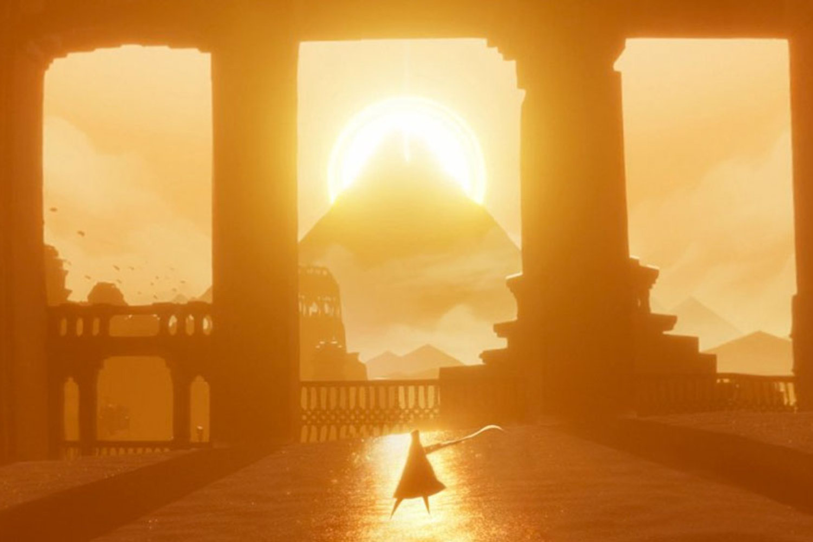

# Introduction

<canvas id="custom" class="canvas" data-fragment-url="cmyk-halftone.frag" data-textures="vangogh.jpg" width="700px" height="320px"></canvas>

The images above were made in different ways. The first one was made by Van Gogh's hand applying layer over layer of paint. It took him hours. The second was produced in seconds by the combination of four matrices of pixels: one for cyan, one for magenta, one for yellow and one for black. The key difference is that the second image is produced in a non-serial way (that means not step-by-step, but all at the same time).

This book is about the revolutionary computational technique, *fragment shaders*, that is taking digitally generated images to the next level. You can think of it as the equivalent of Gutenberg's press for graphics.

Fragment shaders give you total control over the pixels rendered on the screen at a super fast speed. This is why they're used in all sort of cases, from video filters on cellphones to incredible 3D video games.

In the following chapters you will discover how incredibly fast and powerful this technique is and how to apply it to your professional and personal work.

## Who is this book for?

This book is written for creative coders, game developers and engineers who have coding experience, a basic knowledge of linear algebra and trigonometry, and who want to take their work to an exciting new level of graphical quality. (If you want to learn how to code, I highly recommend you start with [Processing](https://processing.org/) and come back later when you are comfortable with it.)

This book will teach you how to use and integrate shaders into your projects, improving their performance and graphical quality. Because GLSL (OpenGL Shading Language) shaders compile and run on a variety of platforms, you will be able to apply what you learn here to any environment that uses OpenGL, OpenGL ES or WebGL. In other words, you will be able to apply and use your knowledge with [Processing](https://processing.org/) sketches, [openFrameworks](http://openframeworks.cc/) applications, [Cinder](http://libcinder.org/) interactive installations, [Three.js](http://threejs.org/) websites or iOS/Android games.

## What does this book cover?

This book will focus on the use of GLSL pixel shaders. First we'll define what shaders are; then we'll learn how to make procedural shapes, patterns, textures and animations with them. You'll learn the foundations of shading language and apply it to more useful scenarios such as: image processing (image operations, matrix convolutions, blurs, color filters, lookup tables and other effects) and simulations (Conway's game of life, Gray-Scott's reaction-diffusion, water ripples, watercolor effects, Voronoi cells, etc.). Towards the end of the book we'll see a set of advanced techniques based on Ray Marching.

*There are interactive examples for you to play with in every chapter.* When you change the code, you will see the changes immediately. The concepts can be abstract and confusing, so the interactive examples are essential to helping you learn the material. The faster you put the concepts into motion the easier the learning process will be.

What this book doesn't cover:

* This *is not* an openGL or webGL book. OpenGL/webGL is a bigger subject than GLSL or fragment shaders. To learn more about openGL/webGL I recommend taking a look at:  [OpenGL Introduction](https://open.gl/introduction), [the 8th edition of the OpenGL Programming Guide](http://www.amazon.com/OpenGL-Programming-Guide-Official-Learning/dp/0321773039/ref=sr_1_1?s=books&ie=UTF8&qid=1424007417&sr=1-1&keywords=open+gl+programming+guide) (also known as the red book) or [WebGL: Up and Running](http://www.amazon.com/WebGL-Up-Running-Tony-Parisi/dp/144932357X/ref=sr_1_4?s=books&ie=UTF8&qid=1425147254&sr=1-4&keywords=webgl)

* This *is not* a math book. Although we will cover a number of algorithms and techniques that rely on an understanding of algebra and trigonometry, we will not explain them in detail. For questions regarding the math I recommend keeping one of the following books nearby: [3rd Edition of Mathematics for 3D Game Programming and computer Graphics](http://www.amazon.com/Mathematics-Programming-Computer-Graphics-Third/dp/1435458869/ref=sr_1_1?ie=UTF8&qid=1424007839&sr=8-1&keywords=mathematics+for+games) or [2nd Edition of Essential Mathematics for Games and Interactive Applications](http://www.amazon.com/Essential-Mathematics-Games-Interactive-Applications/dp/0123742978/ref=sr_1_1?ie=UTF8&qid=1424007889&sr=8-1&keywords=essentials+mathematics+for+developers).

## What do you need to start?

Not much! If you have a modern browser that can do WebGL (like Chrome, Firefox or Safari) and a internet connection, click the “Next” Chapter button at the end of this page to get started.

Alternatively, based on what you have or what you need from this book you can:

- [Make an off-line version of this book](https://thebookofshaders.com/appendix/00/)

- [Run the examples on a Raspberry Pi without a browser](https://thebookofshaders.com/appendix/01/)

- [Make a PDF of the book to print](https://thebookofshaders.com/appendix/02/)

- Check the [GitHub repository](https://github.com/patriciogonzalezvivo/thebookofshaders) of this book to help resolve issues and share code.
