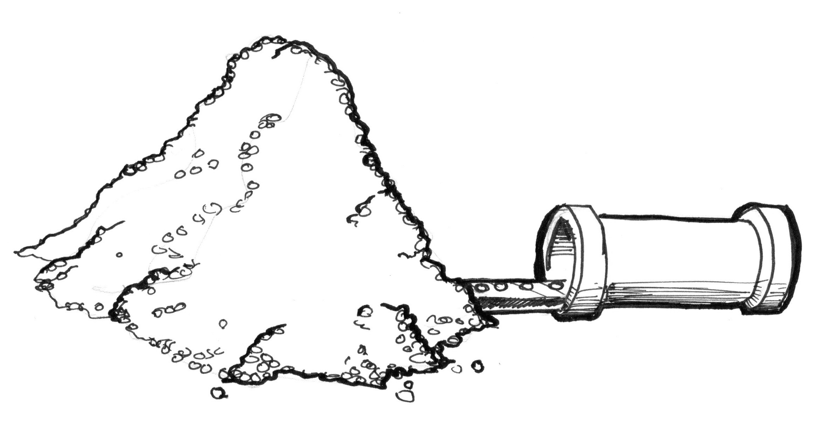

# Memulai
## Apa itu fragment shader?

Di bab sebelumnya kita menggambarkan shader sebagai persamaan dari mesin cetak Gutenberg untuk grafis. Mengapa? dan yang paling penting: apa itu shader?

Jika anda sudah memiliki pengalaman membuat gambar dengan komputer, anda tau bahwa dalam proses itu anda menggambar suatu lingkaran, lalu segi empat, garis, beberapa segitiga sampai anda menyusun gambar yang anda inginkan. Proses tersebut sangatlah sama dengan menulis sebuah huruf atau buku oleh tangan - itu adalah sekumpulan instruksi yang melakukan satu tugas demi tugas lainnya.

Shader juga merupakan sekumpulan instruksi, tetapi instruksi tersebut dijalankan sekaligus untuk setiap piksel di layar. Artinya, kode yang Anda tulis harus berperilaku berbeda bergantung pada posisi piksel di layar. Seperti jenis pres, program Anda akan berfungsi sebagai fungsi yang menerima posisi dan mengembalikan warna, dan saat dikompilasi, program akan berjalan sangat cepat.

## Mengapa shader cepat?

Untuk menjawab ini, saya mempersembahkan keajaiban *proses paralel (parallel processing)*

Bayangkan CPU di komputermu sebagai pipa industri besar, dan setiap tugas sebagai sesuatu yang melewatinya - seperti jalur pabrik. Beberapa tugas lebih besar dari yang lain, yang berarti mereka membutuhkan lebih banyak waktu dan energi untuk menyelesaikannya. Kami mengatakan mereka membutuhkan lebih banyak daya pemrosesan. Karena arsitektur komputer, pekerjaan terpaksa dijalankan secara seri; setiap pekerjaan harus diselesaikan satu per satu. Komputer modern biasanya memiliki kelompok empat prosesor yang bekerja seperti pipa ini, menyelesaikan tugas satu demi satu agar semuanya berjalan lancar. Setiap pipa juga dikenal sebagai *thread*.

Permainan video dan aplikasi grafis lainnya membuathkan banyak kekuatan pemrosesan dibandingkan program lain. Karena konten grafis mereka harus melakukan operasi piksel demi piksel yang sangat banyak. Setiap piksel pada layar harus dihitung, dan dalam permainan 3D geometri dan perspektif harus dihitung dengan baik. 

Mari kembali ke metafora pipa dan tugas kita. Setiap piksel pada layar mempresentasikan sebuah tugas kecil. Secara individual setiap tugas piksel bukanlah sebuah isu untuk CPI, tapi (dan disinilah masalahnya) tugas kecil harus selesai untuk setiap piksel pada layar! Yang artinya dalam layar 800x600 jadul, 480,000 pixel harus diproses per frame yang artinya 14,400,000 perhitungan per detik! Ya! Itu masalah yang cukup besar untuk membebani mikroprosesor secara berlebihan. Dalam layar retina 2880x1800 modern yang berjalam 60 frame per detik perhitungan tersebut menjadi 311,040,000 perhitungan per detik. Bagaimanakah insinyur grafis memecahkan masalah ini?

Inilah saat proses paralel menjadi solusi terbaik, alih-alih memiliki beberapa mikroprosesor yang besar dan kuat, atau *pipa*, akan lebih cerdas jika memiliki banyak mikroprosesor kecil yang berjalan secara paralel pada waktu yang sama. Itulah yang dimaksud dengan Graphic Processor Unit (GPU).

Bayangkan mikroprosesor kecil sebagai tabel pipa, dan data setiap piksel sebagai bola pingpong. 14.400.000 bola pingpong per detik dapat menghalangi hampir semua pipa. Tetapi tabel pipa kecil berukuran 800x600 yang menerima 30 gelombang 480.000 piksel per detik dapat ditangani dengan mulus. Ini berfungsi sama pada resolusi yang lebih tinggi - semakin banyak perangkat keras paralel yang Anda miliki, semakin besar aliran yang dapat dikelola.

"Kekuatan super" lain dari GPU adalah fungsi matematika khusus yang dipercepat melalui perangkat keras, sehingga operasi matematika yang rumit diselesaikan secara langsung oleh microchip dan bukan oleh perangkat lunak. Itu berarti operasi trigonometri dan matriks ekstra cepat - secepat listrik bisa berjalan.

## Apa itu GLSL?

GLSL kependekan dari OpenGL Shading Language, yang mana adalah spesifik standar dari program shader yang akan anda lihat dalam bab-bab berikutnya. Ada jenis shader lainnya bergantung pada perangkat keras dan sistem operasi. Di sini kita akan bekerja dengan spesifikasi openGL yang diatur oleh [Khronos Group](https://www.khronos.org/opengl/). Memahami sejarah OpenGL dapat membantu untuk memahami sebagian besar konvensi anehnya, untuk itu saya sarankan untuk melihat: [openglbook.com/chapter-0-preface-what-is-opengl.html](http://openglbook.com/chapter-0-preface-what-is-opengl.html)

## Mengapa Shader terkenal menyakitkan?

Seperti kata paman Ben "dengan kekuatan yang besar, muncul tanggung jawab yang besar" dan perhitungan paralel mengikuti aturan ini; desain arsitektur GPU yang kuat hadir dengan batasan dan batasannya sendiri.

Agar dapat berjalan secara paralel, setiap pipa, atau thread, harus independen dari setiap thread lainnya. Kami mengatakan bahwa thread *buta* terhadap apa yang dilakukan thread lainnya. Batasan ini menyiratkan bahwa semua data harus mengalir ke arah yang sama. Jadi, tidak mungkin untuk memeriksa hasil thread lain, mengubah data masukan, atau meneruskan hasil thread ke thread lain. Mengizinkan komunikasi thread-to-thread membuat integritas data berisiko.

Juga GPU membuat mikro-prosesor paralel (pipa) terus-menerus sibuk; segera setelah mendapatkan bebas, mereka menerima informasi baru untuk diproses. Tidak mungkin untaian mengetahui apa yang dilakukannya di momen sebelumnya. Itu bisa berupa menggambar tombol dari UI sistem operasi, lalu merender sebagian langit dalam game, lalu menampilkan teks email. Setiap utas tidak hanya **buta** tetapi juga **tanpa memori**. Selain abstraksi yang diperlukan untuk mengkodekan fungsi umum yang mengubah hasil piksel demi piksel tergantung pada posisinya, batasan buta dan tanpa memori membuat shader tidak terlalu populer di kalangan programmer pemula.

Jangan khawatir! Pada bab-bab berikut, kita akan mempelajari langkah demi langkah bagaimana beralih dari komputasi bayangan sederhana ke lanjutan. Jika Anda membaca ini dengan browser modern, Anda akan senang bermain dengan contoh interaktif. Jadi jangan tunda lagi keseruannya dan tekan *Next >>* untuk beralih ke kode!

