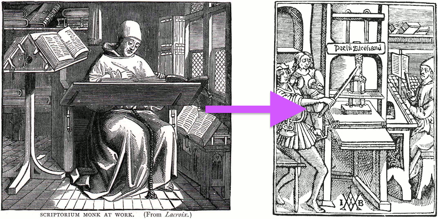

# Introduzione
## Che cosa è un fragment shader?

Nel capitolo precedente abbiamo descritto lo shader come l'equivalente della stampa di Gutenberg per la grafica. Perché? O meglio ancora: che cosa è uno shader?

Se hai già fatto disegni al computer, saprai che si inizia disegnando un cerchio, poi un rettangolo, una linea, alcuni triangoli fino a comporre l'immagine desiderata. Questo processo è molto simile a scrivere una lettera o un libro a mano - in altre parole è un insieme di istruzioni, che eseguono un compito uno dopo l'altro.

Gli shaders si possono considerare allo stesso modo un insieme di istruzioni, che sono eseguite tutte nello stesso momento per ogni singolo pixel sullo schermo. Ciò significa che il codice scritto deve comportarsi in modo diverso a seconda della posizione del pixel sullo schermo. Come nel processo della pressa tipografica, il tuo programma riceverà una posizione e restituirà un colore. Quando il codice è compilato, verrà eseguito a velocità straordinaria.

## Perché gli shaders sono così veloci?

Per rispondere a questa domanda, vi presento le meraviglie del *calcolo parallelo*.

Immaginate la CPU del computer come un grande tubo industriale, e ogni compito come qualcosa che passa attraverso di esso - come in una linea di produzione. Alcuni compiti sono più grandi di altri, il che significa che richiedono più tempo ed energia. Diciamo che necessitano una maggiore potenza di elaborazione. A causa dell'architettura dei computer alcuni compiti sono costretti ad essere eseguiti in serie; ogni compito deve essere completato, uno dopo l'altro. I computer moderni hanno solitamente gruppi di quattro processori che funzionano come questi tubi, eseguendo i compiti uno dopo l'altro per avere le cose funzionanti senza intoppi. Ogni tubo è anche conosciuto come *thread*.

I videogiochi e le altre applicazioni grafiche richiedono molta più potenza di elaborazione rispetto ad altri programmi. A causa del loro contenuto grafico devono fare un gran numero di operazioni per pixel. Ogni singolo pixel sullo schermo deve essere calcolato, e nei giochi 3D le geometrie e le prospettive devono essere calcolate allo stesso tempo.

Torniamo alla nostra metafora dei tubi e dei compiti. Ogni pixel sullo schermo rappresenta un piccolo compito da realizzare. Individualmente ogni compito non è un problema per la CPU, ma (e qui sta il problema) il piccolo compito deve essere fatto per ogni pixel sullo schermo! Ciò significa che in un vecchio schermo 800x600, 480000 pixel devono elaborati per frame cioè 14400000 calcoli al secondo! Si! Questo è un problema abbastanza grande capace di sovraccaricare un microprocessore. In un moderno schermo retina 2880x1800 in esecuzione a 60 fotogrammi al secondo si possono raggiungere fino a 311040000 calcoli al secondo. Come fanno gli ingegneri grafici a risolvere questo problema?

E' in questo caso che il calcolo parallelo diventa una buona soluzione. Invece di avere un paio di grandi e potenti microprocessori, o *tubi*, è più intelligente avere parecchi minuscoli microprocessori che funzionano in parallelo allo stesso tempo. Questo è la Graphic Processor Unit (GPU).

Immaginate i minuscoli microprocessori come un tavolo di tubi, ed i dati di ciascun pixel come una pallina da ping pong. 14400000 palline da ping pong in un secondo possono ostacolare qualsiasi tubo. Ma un tavolo di 800x600 piccoli tubi che riceve 30 ondate di 480000 pixel al secondo si può gestire senza problemi. Tutto ciò funziona anche a risoluzioni più elevate - più si possiede hardware in parallelo, più grande è il flusso che si può gestire.

Un altro "super potere" della GPU è che alcune speciali funzioni matematiche sono accelerate via hardware, in modo tale che le operazioni matematiche complesse sono risolte direttamente dai microchip invece che da un software. Ciò significa che avremo una velocità extra nel calcolo trigonometrico e nelle operazioni fra matrici, una velocità pari a quella dell'elettricità.

## Che cosa è GLSL?

GLSL è l'acronimo di openGL Shading Language, che è lo standard specifico dei programmi shaders che vedrete nei prossimi capitoli. Ci sono altri tipi di shaders a seconda del hardware e dei sistemi operativi. Qui lavoreremo con le specifiche openGL regolate dal [Khronos Group](https://www.khronos.org/opengl/). Comprendere la storia di OpenGL può essere utile per capire la maggior parte delle sue strane convenzioni, per questo vi consiglio di dare un'occhiata a: [openglbook.com/chapter-0-preface-what-is-opengl.html](http://openglbook.com/chapter-0-preface-what-is-opengl.html)

## Perché gli Shaders hanno notoriamente una brutta fama?

Come disse lo zio Ben "con un grande potere derivano grandi responsabilità", e il calcolo parallelo segue questa regola; la potente progettazione architettonica della GPU comporta specifici vincoli e restrizioni.

Affinché ogni tubo, o thread, venga eseguito in parallelo, è necessario che sia indipendente l'uno dall'altro. Diciamo i thread sono *ciechi* e non vedono ciò che gli altri thread stanno facendo. Questa restrizione implica che tutti i dati debbano affluire nella stessa direzione. Quindi è impossibile controllare il risultato di un altro thread, modificare i dati di input, o passare il risultato di un thread a un altro thread. Permettere la comunicazione fra thread metterebbe a rischio l'integrità dei dati.

Anche la GPU mantiene costantemente occupati i micro-processore paralleli (i tubi); non appena sono liberi ricevono nuove informazioni da elaborare. E' quindi impossibile per un thread sapere che cosa stava facendo nel momento precedente. Potrebbe disegnare un bottone dell'UI del sistema operativo, subito dopo rendere una porzione di cielo in un videogioco e poi visualizzare il testo di una e-mail. Ogni thread non è solo **cieco ** ma anche **senza memoria**. Oltre all'astrazione necessaria per programmare una funzione generica che cambia il risultato pixel per pixel, a seconda della sua posizione, i vincoli ciechi e senza memoria non rendono gli shaders molto popolari tra i programmatori debuttanti.

Non preoccuparti! Nei capitoli seguenti, impareremo passo-passo a partire dai semplici shaders fino a quelli avanzati. Se stai leggendo questo libro con un navigatore moderno, potrai giocare con gli esempi interattivi. Quindi non aspettare altro tempo e clicca su *Next >>* per iniziare il divertimento!
