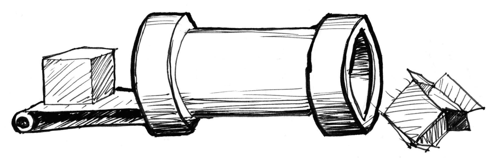

# Введение
## Что такое фрагментный шейдер?

В предыдущем параграфе мы описали шейдеры как эквивалент печатного станка Гутенберга для графики. Почему? И вообще, что такое шейдер?

Если у вас уже есть опыт рисования с помощью компьютера, вы скорее всего сначала рисовали круг, затем прямоугольник, линию, несколько треугольников, получая в итоге желаемую композицию. Процесс похож на написание письма или книги вручную - это набор инструкций, которые последовательно решают задачи одну за другой.

Шейдеры так же являются наборами инструкций, и эти инструкции исполняются одновременно для каждого пикселя на экране. Это означает, что код должен работать по разному в зависимости от положения пикселя на экране. Подобно печатному станку, ваша программа будет работать как функция, принимающая на вход координаты пикселя, и возвращающая цвет. После компиляции она будет работать невероятно быстро.

## Почему шейдеры работают быстро?

Ответить на этот вопрос помогут *параллельные вычисления*.

Представьте процессор компьютера в виде трубы, а каждую задачу как что-то проходящее через неё, как на фабричной производственной линии. Некоторые задачи больше остальных, то есть требуют больше времени и энергии на выполнение. В наших терминах, они требуют больше вычислительной мощности. Из-за особенностей архитектуры компьютера задачи запускаются последовательно, и каждая задача должна быть завершена вовремя. Современные компьютеры обычно содержат несколько процессоров, каждый из которых можно представить в виде трубы, обрабатывающей задания одно за другим, создавая иллюзию плавности и непрерывности работы. Каждая такая труба называется *потоком*.

Видеоигры и другие графические приложения требуют намного больше вычислительной мощности, чем другие программы. Они вынуждены совершать огромное количество попиксельных операций над графическим контентом. Каждый пиксель на экране должен быть обсчитан, а в 3D-играх нужно рассчитать ещё и геометрию с перспективой.

Давайте вернёмся к нашей метафоре с трубами и задачами. Каждый пиксель на экране является небольшой простой задачей. По отдельности такие задачи не представляют трудности для CPU, но проблема в том, что эти небольшие задания должны быть выполнены для каждого пикселя на экране. Таким образом, даже для старого экрана с разрешением 800х600 нужно обработать 480 000 пикселей, то есть произвести 14 400 000 вычислений в секунду! И это становится непосильной задачей для центрального процессора. На современном ретина-дисплее с разрешением 2880х1800 вывод видео с частотой 60 кадров в секунду увеличит количество вычислений до 311 040 000 в секунду. Как же инженеры графических систем решают эту проблему?

На помощь приходят параллельные вычисления. Вместо нескольких больших и мощных процессоров разумнее использовать большое количество небольших процессоров, работающих параллельно. Именно так и устроен графический процессор (GPU).

Представьте небольшие процессоры в виде стола из труб, а данные для каждого пикселя - в виде теннисного шарика. 14 400 000 шариков в секунду могут засорить какую угодно трубу, в то время как стол из 800х600 небольших труб сможет спокойно пропустить в секунду 30 волн по 480 000 пикселей. Это верно и на более высоких разрешениях - чем больше у вас параллельно работающего оборудования, тем больший поток оно сможет принять.

Другая «суперспособность» GPU заключается в аппаратном ускорении математических функций. Таким образом, сложные математические операции обрабатываются оборудованием, а не программами. Это позволяет совершать тригонометрические и векторно-матричные операции сверхбыстро, практически со скоростью света.

## Что такое GLSL?

GLSL расшифровывается как OpenGL Shading Language (язык шейдеров OpenGL) и является стандартизированным языком для написания шейдерных программ, которые будут рассмотрены далее. Существуют различные типы шейдеров, зависящие от аппаратуры и операционной системы. Эта книга опирается на спецификацию OpenGL, издаваемую [Khronos Group](https://www.khronos.org/opengl/). Понимание истории OpenGL может быть полезным для понимания многих странных соглашений, принятых в ней. Для этого вы можете пройти по следующей ссылке: [openglbook.com/chapter-0-preface-what-is-opengl.html](http://openglbook.com/chapter-0-preface-what-is-opengl.html)

## Почему программирование шейдеров - это боль?

К параллельным вычислениям применим известный афоризм: «большая власть влечёт большую ответственность». Мощь архитектуры графических процессоров накладывает некоторые ограничения.

Для параллельной работы каждый поток не должен зависеть от остальных потоков. Потоки «слепы» по отношению к тому, чем занимаются другие потоки. Из этого ограничения следует, что все данные должны перемещаться в одном направлении. Поэтому невозможно использовать результат соседнего потока, изменить входные данные или направить выход одного потока на вход другого. Попытка организации межпотокового взаимодействия несёт риск нарушения целостности данных.

Кроме того, GPU постоянно поддерживает свои процессоры в занятом состоянии. Как только процессор освобождается, он сразу же получает новую порцию данных для обработки. Поток не может узнать что он делал в предыдущий момент времени. Он мог рисовать кнопку для графического интерфейса операционной системы, затем рисовать кусок неба в игре, а потом отображать текст почтового сообщения. Каждый поток не только **слеп**, но ещё и **лишён памяти**. Наряду с представлением в виде абстрактной функции, изменяющей свой результат в зависимости от положения пикселя, слепота и беспамятство потоков не добавляют шейдерам популярности среди начинающих программистов.

Не волнуйтесь! В следующих главах мы пошагово рассмотрим шейдерные вычисления, начиная с самых простых. Если вы читаете книгу в современном браузере, вы оцените возможность поиграться с интерактивными примерами. Так давайте же не откладывать веселье в долгий ящик! Нажмите *Next >>* чтобы перейти к программированию!
