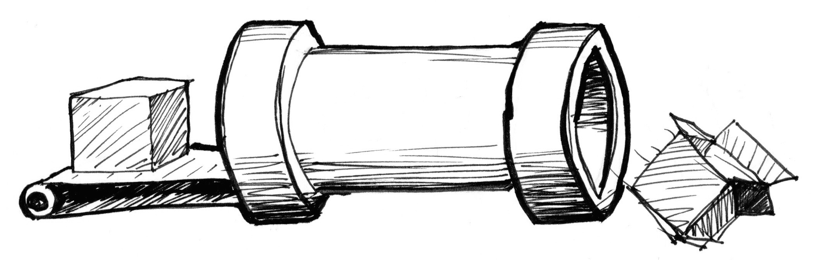
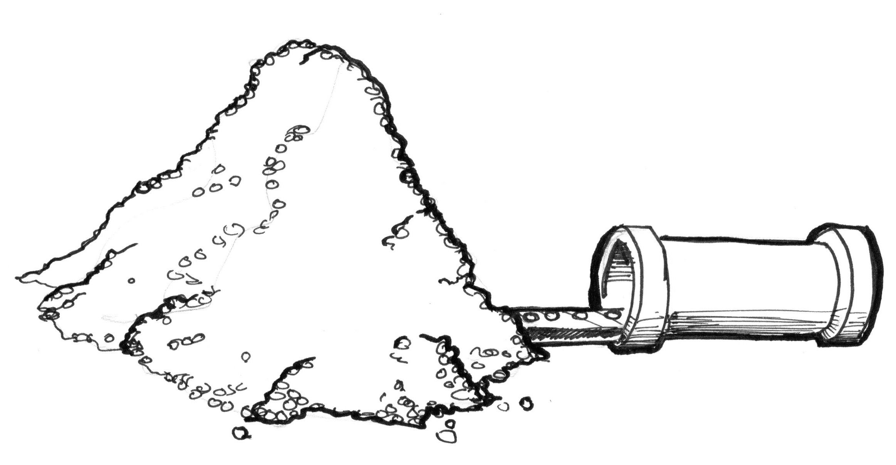
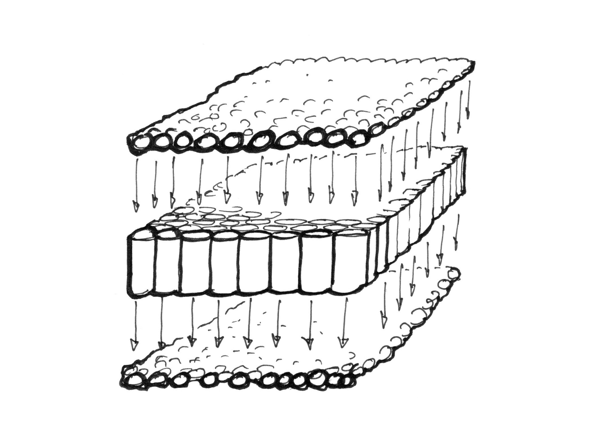

# Getting started
## What is a fragment shader?

In the previous chapter we described shaders as the equivalent of the Gutenberg press for graphics. Why? And more importantly: what's a shader?

If you already have experience making drawings with computers, you know that in that process you draw a circle, then a rectangle, a line, some triangles until you compose the image you want. That process is very similar to writing a letter or a book by hand - it is a set of instructions that do one task after another.

Shaders are also a set of instructions, but the instructions are executed all at once for every single pixel on the screen. That means the code you write has to behave differently depending on the position of the pixel on the screen. Like a type press, your program will work as a function that receives a position and returns a color, and when it's compiled it will run extraordinarily fast.

## Why are shaders fast?

To answer this, I present the wonders of *parallel processing*.

Imagine the CPU of your computer as a big industrial pipe, and every task as something that passes through it - like a factory line. Some tasks are bigger than others, which means they require more time and energy to deal with. We say they require more processing power. Because of the architecture of computers the jobs are forced to run in a series; each job has to be finished one at a time. Modern computers usually have groups of four processors that work like these pipes, completing tasks one after another to keep things running smoothly. Each pipe is also known as a *thread*.

Video games and other graphic applications require a lot more processing power than other programs. Because of their graphic content they have to do huge numbers of pixel-by-pixel operations. Every single pixel on the screen needs to be computed, and in 3D games geometries and perspectives need to be calculated as well.

Let's go back to our metaphor of the pipes and tasks. Each pixel on the screen represents a simple small task. Individually each pixel task isn't an issue for the CPU, but (and here is the problem) the tiny task has to be done to each pixel on the screen! That means in an old 800x600 screen, 480,000 pixels have to processed per frame which means 14,400,000 calculations per second! Yes! That’s a problem big enough to overload a microprocessor. In a modern 2880x1800 retina display running at 60 frames per second that calculation adds up to 311,040,000 calculations per second. How do graphics engineers solve this problem?

This is when parallel processing becomes a good solution. Instead of having a couple of big and powerful microprocessors, or *pipes*, it is smarter to have lots of tiny microprocessors running in parallel at the same time. That’s what a Graphic Processor Unit (GPU) is.

Picture the tiny microprocessors as a table of pipes, and the data of each pixel as a ping pong ball. 14,400,000 ping pong balls a second can obstruct almost any pipe. But a table of 800x600 tiny pipes receiving 30 waves of 480,000 pixels a second can be handled smoothly. This works the same at higher resolutions - the more parallel hardware you have, the bigger the stream it can manage.

Another “super power” of the GPU is special math functions accelerated via hardware, so complicated math operations are resolved directly by the microchips instead of by software. That means extra fast trigonometrical and matrix operations - as fast as electricity can go.

## What is GLSL?

GLSL stands for openGL Shading Language, which is the specific standard of shader programs you'll see in the following chapters. There are other types of shaders depending on hardware and Operating Systems. Here we will work with the openGL specs regulated by [Khronos Group](https://www.khronos.org/opengl/). Understanding the history of OpenGL can be helpful for understanding most of its weird conventions, for that I recommend taking a look at: [openglbook.com/chapter-0-preface-what-is-opengl.html](http://openglbook.com/chapter-0-preface-what-is-opengl.html)

## Why are Shaders famously painful?

As Uncle Ben said “with great power comes great responsibility,” and parallel computation follows this rule; the powerful architectural design of the GPU comes with its own constraints and restrictions.

In order to run in parallel every pipe, or thread, has to be independent from every other thread. We say the threads are *blind* to what the rest of the threads are doing. This restriction implies that all data must flow in the same direction. So it’s impossible to check the result of another thread, modify the input data, or pass the outcome of a thread into another thread. Allowing thread-to-thread communications puts the integrity of the data at risk.

Also the GPU keeps the parallel micro-processor (the pipes) constantly busy; as soon as they get free they receive new information to process. It's impossible for a thread to know what it was doing in the previous moment. It could be drawing a button from the UI of the operating system, then rendering a portion of sky in a game, then displaying the text of an email. Each thread is not just **blind** but also **memoryless**. Besides the abstraction required to code a general function that changes the result pixel by pixel depending on its position, the blind and memoryless constraints make shaders not very popular among beginning programmers.

Don't worry! In the following chapters, we will learn step-by-step how to go from simple to advanced shading computations. If you are reading this with a modern browser, you will appreciate playing with the interactive examples. So let's not delay the fun any longer and press *Next >>* to jump into the code!
