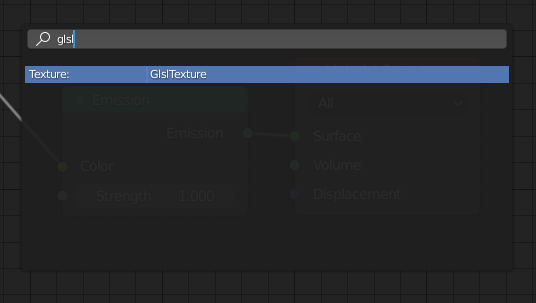
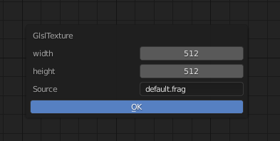
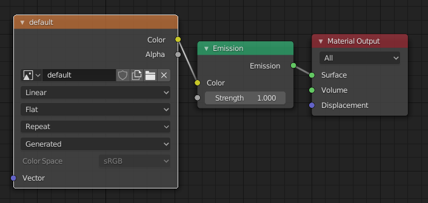
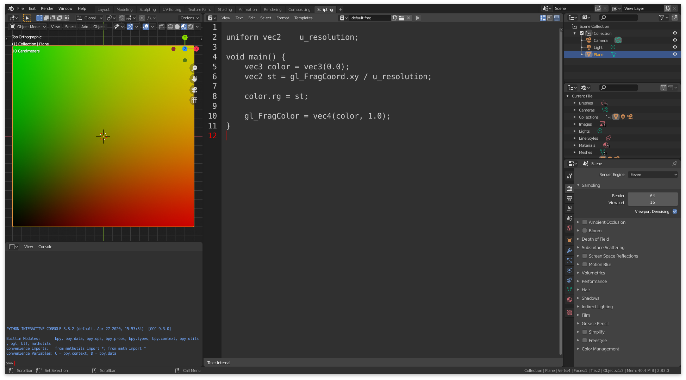

## Chạy thử shader

Trong quá trình hình thành nên quyển sách này tôi đã tạo ra hàng loạt các công cụ có thể viết, hiển thị, chia sẻ và tìm duyệt các shader. Các công cụ này hoạt động giống nhau trên cả Linux, MacOS, Windows, [Raspberry Pi](https://www.raspberrypi.org/) và cả trình duyệt nữa, mà không cần phải chỉnh sửa gì thêm.

## Chạy thử shader trên trình duyệt

**Hiển thị**: Toàn bộ ví dụ tương tác được trong quyển sách này đều được hiển thị bằng [glslCanvas](https://github.com/patriciogonzalezvivo/glslCanvas) để preview shader theo cách vô cùng đơn giản.

```html
<canvas class="glslCanvas" data-fragment-url=“yourShader.frag" data-textures=“yourInputImage.png” width="500" height="500"></canvas>
```

Như bạn thấy, chỉ cần một thẻ `canvas` với `class="glslCanvas"` và URL tới shader ở thuộc tính `data-fragment-url` là đủ. Tìm hiểu thêm tại [đây](https://github.com/patriciogonzalezvivo/glslCanvas).

Nếu bạn giống tôi, bạn có thể sẽ muốn preview shader ngay trong console, và trong trường hợp thì bạn nên ngó qua [glslViewer](https://github.com/patriciogonzalezvivo/glslViewer). Ứng dụng này cho phép bạn kết hợp shader với script `bash` hay bất kỳ công cụ dòng lệnh nào của Unix giống như cách mà [ImageMagick](http://www.imagemagick.org/script/index.php) hoạt động. Ngoài ra [glslViewer](https://github.com/patriciogonzalezvivo/glslViewer) cũng là một cách hay để biên dịch shader trên [Raspberry Pi](https://www.raspberrypi.org/), cũng chính là lí do mà [openFrame.io](http://openframe.io/) dùng nó để preview shader. Tìm hiểu thêm về công cụ này tại [đây](https://github.com/patriciogonzalezvivo/glslViewer).

```bash
glslViewer yourShader.frag yourInputImage.png —w 500 -h 500 -s 1 -o yourOutputImage.png
```

**Viết shader**: để chia sẻ kinh nghiệm code shader, tôi đã tạo một editor online gọi là [glslEditor](https://github.com/patriciogonzalezvivo/glslEditor). Editor này được nhúng vào các ví dụ trong quyển sách này, nó bổ sung các widget rất tiện cho việc viết code GLSL. Bạn cũng có thể chạy riêng nó như một ứng dụng web ở  [editor.thebookofshaders.com/](http://editor.thebookofshaders.com/). Tìm hiểu thêm tại [đây](https://github.com/patriciogonzalezvivo/glslEditor).


Nếu bạn thích làm việc offline bằng [SublimeText](https://www.sublimetext.com/) bạn có thể cài đặt [package glslViewer](https://packagecontrol.io/packages/glslViewer). Tìm hiểu thêm tại [đây](https://github.com/patriciogonzalezvivo/sublime-glslViewer).


**Chia sẻ**: Bạn có thể chia sẻ shader bằng editor online ([editor.thebookofshaders.com/](http://editor.thebookofshaders.com/)) Cả phiên bản nhúng và chạy độc lập đều có nút bấm export cho bạn URL tới shader của mình. Nó còn có khả năng export trực tiếp tới [openFrame.io](http://openframe.io/).


**Thư viện**: Bên cạnh việc export sang [openFrame.io](http://openframe.io/) Tôi còn tạo ra công cụ để bạn có thể khoe shader của mình trên bất kỳ site nào, tên nó là [glslGallery](https://github.com/patriciogonzalezvivo/glslGallery). Tìm hiểu thêm tại [đây](https://github.com/patriciogonzalezvivo/glslGallery).


## Chạy shader trên framework yêu thích

Trong trường hợp bạn đã có kinh nghiệm lập trình với các framework như: [Processing](https://processing.org/), [Three.js](http://threejs.org/) hay [OpenFrameworks](http://openframeworks.cc/), you có thể sẽ muốn thử shader trên các nền tảng đó. Dưới đây là hướng dẫn sử dụng shader trên các framework phổ biến với các uniform giống như shader được viết trong quyển sách này. (Trong [repository GitHub cho chương này](https://github.com/patriciogonzalezvivo/thebookofshaders/tree/master/04), bạn có thể tìm thấy mã nguồn hoàn chỉnh của cả 3 framework này).

### Với **Three.js**

Ricardo Cabello (hay còn gọi là [MrDoob](https://twitter.com/mrdoob) ), một anh chàng thông minh và khiêm tốn đã phát triển một trong những framework nổi tiếng nhất cho WebGL cùng với các [cộng sự](https://github.com/mrdoob/three.js/graphs/contributors), đó là [Three.js](http://threejs.org/). Bạn sẽ tìm thấy rất nhiều ví dụ, hướng dẫn và sách dạy bạn cách dùng thư viện Javascript này để tạo nên các tác phẩm đồ hoạ 3D rất ngầu.

Dưới đây là một ví dụ về code HTML và JS mà bạn cần để bắt đầu viết shader với three.js. Hãy chú ý tới đoạn `id="fragmentShader"`, đây là nơi mà bạn có thể copy-paste shader từ quyển sách này thay vào đó để thử.

```html
<body>
    <div id="container"></div>
    <script src="js/three.min.js"></script>
    <script id="vertexShader" type="x-shader/x-vertex">
        void main() {
            gl_Position = vec4( position, 1.0 );
        }
    </script>
    <script id="fragmentShader" type="x-shader/x-fragment">
        uniform vec2 u_resolution;
        uniform float u_time;

        void main() {
            vec2 st = gl_FragCoord.xy/u_resolution.xy;
            gl_FragColor=vec4(st.x,st.y,0.0,1.0);
        }
    </script>
    <script>
        var container;
        var camera, scene, renderer;
        var uniforms;

        init();
        animate();

        function init() {
            container = document.getElementById( 'container' );

            camera = new THREE.Camera();
            camera.position.z = 1;

            scene = new THREE.Scene();

            var geometry = new THREE.PlaneBufferGeometry( 2, 2 );

            uniforms = {
                u_time: { type: "f", value: 1.0 },
                u_resolution: { type: "v2", value: new THREE.Vector2() },
                u_mouse: { type: "v2", value: new THREE.Vector2() }
            };

            var material = new THREE.ShaderMaterial( {
                uniforms: uniforms,
                vertexShader: document.getElementById( 'vertexShader' ).textContent,
                fragmentShader: document.getElementById( 'fragmentShader' ).textContent
            } );

            var mesh = new THREE.Mesh( geometry, material );
            scene.add( mesh );

            renderer = new THREE.WebGLRenderer();
            renderer.setPixelRatio( window.devicePixelRatio );

            container.appendChild( renderer.domElement );

            onWindowResize();
            window.addEventListener( 'resize', onWindowResize, false );

            document.onmousemove = function(e){
              uniforms.u_mouse.value.x = e.pageX
              uniforms.u_mouse.value.y = e.pageY
            }
        }

        function onWindowResize( event ) {
            renderer.setSize( window.innerWidth, window.innerHeight );
            uniforms.u_resolution.value.x = renderer.domElement.width;
            uniforms.u_resolution.value.y = renderer.domElement.height;
        }

        function animate() {
            requestAnimationFrame( animate );
            render();
        }

        function render() {
            uniforms.u_time.value += 0.05;
            renderer.render( scene, camera );
        }
    </script>
</body>
```

### Với **Processing**

Bắt đầu bởi [Ben Fry](http://benfry.com/) và [Casey Reas](http://reas.com/) năm 2001, [Processing](https://processing.org/) là môi trường siêu đơn giản mà mạnh mẽ để bắt đầu code shader (ít nhất là với tôi). [Andres Colubri](https://codeanticode.wordpress.com/) đã cải tiến OpenGL và Video trong Processing để khiến cho việc sử dụng GLSL trở nên dễ hơn bao giờ hết. Processing sẽ thực thi file shader có tên `"shader.frag"` trong thư mục `data`. Nếu bạn copy ví dụ ở đây, hãy nhớ đổi tên file cho khớp.

```cpp
PShader shader;

void setup() {
  size(640, 360, P2D);
  noStroke();

  shader = loadShader("shader.frag");
}

void draw() {
  shader.set("u_resolution", float(width), float(height));
  shader.set("u_mouse", float(mouseX), float(mouseY));
  shader.set("u_time", millis() / 1000.0);
  shader(shader);
  rect(0,0,width,height);
}
```

Để shader hoạt động với các phiên bản trước 2.1, bạn cần thêm dòng sau vào phần đầu của shader: `#define PROCESSING_COLOR_SHADER`. Nó sẽ trông như thế này:

```glsl
#ifdef GL_ES
precision mediump float;
#endif

#define PROCESSING_COLOR_SHADER

uniform vec2 u_resolution;
uniform vec3 u_mouse;
uniform float u_time;

void main() {
    vec2 st = gl_FragCoord.st/u_resolution;
    gl_FragColor = vec4(st.x,st.y,0.0,1.0);
}
```

Để biết thêm về shader trong Processing, hãy xem [hướng dẫn](https://processing.org/tutorials/pshader/).

### Với **openFrameworks**

Ai cũng có công cụ mà họ cảm thấy thoải mái nhất, trong trường hợp của tôi thì đó là [openFrameworks](http://openframeworks.cc/). Framework viết bằng C++ này dựa trên OpenGL và một vài thư viện mã nguồn mở khác. Nó rất giống Processing ở nhiều điểm, chỉ khác ở phần biên dịch C++ phức tạp. Giống như Processing, openFrameworks sẽ tìm file shader của bạn để thực thi, nên nếu copy file `.frag` nào ở đây thì đừng quên đổi tên file trong code cho khớp.

```cpp
void ofApp::draw(){
    ofShader shader;
    shader.load("","shader.frag");

    shader.begin();
    shader.setUniform1f("u_time", ofGetElapsedTimef());
    shader.setUniform2f("u_resolution", ofGetWidth(), ofGetHeight());
    ofRect(0,0,ofGetWidth(), ofGetHeight());
    shader.end();
}
```

Nếu bạn muốn sử dụng bộ đầy đủ các uniform trong GlslViewer và GlslCanvas trong openFrameworks một cách đơn giản, tôi xin giới thiệu addon [ofxShader](https://github.com/patriciogonzalezvivo/ofxshader) để hỗ trợ nhiều buffer, vật liệu, hot-reload và tự động chuyển đổi sang OpenGL ES trên Raspberry Pi. Code đơn giản như sau:

```cpp
//--------------------------------------------------------------
void ofApp::setup(){
    ofDisableArbTex();
    
    sandbox.allocate(ofGetWidth(), ofGetHeight());
    sandbox.load("grayscott.frag");
}

//--------------------------------------------------------------
void ofApp::draw(){
    sandbox.render();
    sandbox.draw(0, 0);
}
```


Để tìm hiểu thêm về shader trong openFrameworks hãy đọc [bài hướng dẫn tuyệt vời này](http://openframeworks.cc/ofBook/chapters/shaders.html) của [Joshua Noble](http://thefactoryfactory.com/).


### Với **Blender**

[GlslTexture](https://github.com/patriciogonzalezvivo/glslTexture) là một addon giúp bạn tạo ra các texture theo công thức của GLSL và hoàn toàn tương thích với các sandbox khác trong chương này. Cách mà nó hoạt động:

1. Operator Search: `F3` (hoặc gõ phím `Space` tuỳ theo chỉnh sửa của bạn). Gõ `GlslTexture`



2. Đổi kích thước `width` và `height` và tên file shader ở `Source` (có thể là đường dẫn tới 1 file khác)



3. Sử dụng ảnh trong vật liệu. Tên của ảnh sẽ dựa trên tên của file shader.



4. Mở phần Text Editor và viết shader (hoặc sửa từ bên ngoài). Nó sẽ được cập nhật ngay lập tức.


