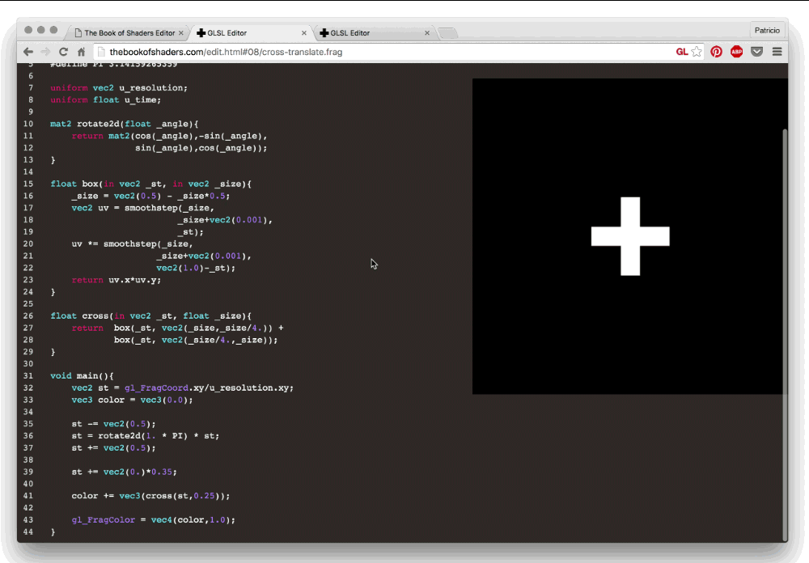
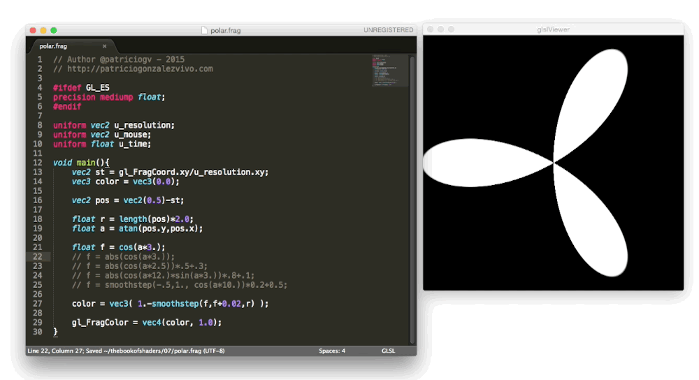
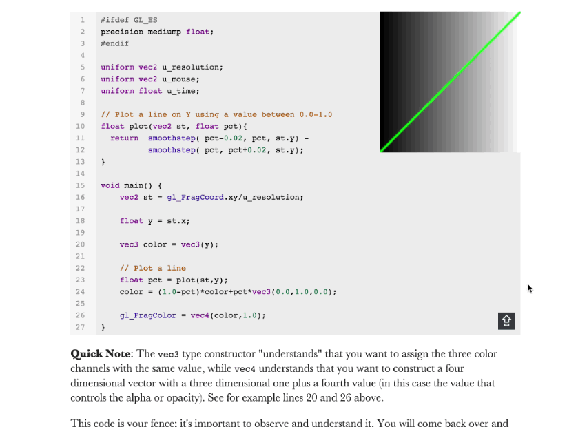
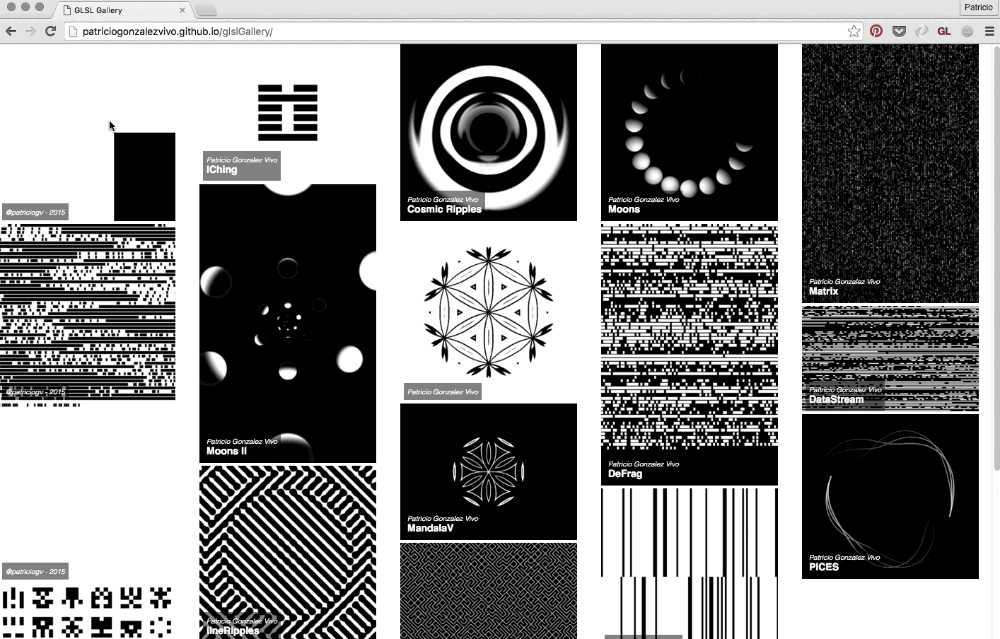

## Running your shader

As part of the construction of this book and my art practice I made an ecosystem of tools to create, display, share and curate shaders. These tools work consistently across Linux, MacOS, Windows and [Raspberry Pi](https://www.raspberrypi.org/) and browsers without the need of changing your code.

## Running your shaders on the browser

**Display**: all live examples in this book are displayed using [glslCanvas](https://github.com/patriciogonzalezvivo/glslCanvas) which makes the process of running standalone shader incredibly easy.

```html
<canvas class="glslCanvas" data-fragment-url=“yourShader.frag" data-textures=“yourInputImage.png” width="500" height="500"></canvas>
```

As you can see, it just needs a `canvas` element with `class="glslCanvas"` and the url to your shader in the `data-fragment-url`. Learn more about it [here](https://github.com/patriciogonzalezvivo/glslCanvas).

If you are like me, you will probably want to run shaders directly from the console, in that case you should check out [glslViewer](https://github.com/patriciogonzalezvivo/glslViewer). This application allows you to incorporate shaders into your `bash` scripts or unix pipelines and use it in a similar way to [ImageMagick](http://www.imagemagick.org/script/index.php). Also [glslViewer](https://github.com/patriciogonzalezvivo/glslViewer) is a great way to compile shaders on your [Raspberry Pi](https://www.raspberrypi.org/), which is the reason [openFrame.io](http://openframe.io/) uses it to display shader artwork. Learn more about this application [here](https://github.com/patriciogonzalezvivo/glslViewer).

```bash
glslViewer yourShader.frag yourInputImage.png —w 500 -h 500 -E screenshot,yourOutputImage.png
```

**Create**: in order to illuminate the experience of coding shaders I made an online editor called [glslEditor](https://github.com/patriciogonzalezvivo/glslEditor). This editor is embedded on the book's live examples, it brings a series of handy widgets to make more tangible the abstract experience of working with glsl code. You can also run it as a standalone web application from [editor.thebookofshaders.com/](http://editor.thebookofshaders.com/). Learn more about it [here](https://github.com/patriciogonzalezvivo/glslEditor).



If you prefer to work offline using [SublimeText](https://www.sublimetext.com/) you can install this [package for glslViewer](https://packagecontrol.io/packages/glslViewer). Learn more about it [here](https://github.com/patriciogonzalezvivo/sublime-glslViewer).



**Share**: the online editor ([editor.thebookofshaders.com/](http://editor.thebookofshaders.com/)) can share your shaders! Both the embedded and standalone version have an export button where you can get an unique URL's to your shader. Also it has the ability to export directly to an [openFrame.io](http://openframe.io/).



**Curate**: Sharing your code is the beginning of you sharing your shader as artwork! Beside the option to export to [openFrame.io](http://openframe.io/) I made a tool to curate your shaders into a gallery that can be embedded on any site, it’s name is [glslGallery](https://github.com/patriciogonzalezvivo/glslGallery). Learn more [here](https://github.com/patriciogonzalezvivo/glslGallery).



## Running your shaders on your favorite framework

In case you already have experience programming in a framework like: [Processing](https://processing.org/), [Three.js](http://threejs.org/), [OpenFrameworks](http://openframeworks.cc/) or [SFML](https://www.sfml-dev.org/), you're probably excited to try shaders on these platforms you feel comfortable with. The following are examples of how to set shaders in some popular frameworks with the same uniforms that we are going to use throughout this book. (In the [GitHub repository for this chapter](https://github.com/patriciogonzalezvivo/thebookofshaders/tree/master/04), you'll find the full source code for these three frameworks.)

### In **Three.js**

The brilliant and very humble Ricardo Cabello (aka [MrDoob](https://twitter.com/mrdoob) ) has been developing along with other [contributors](https://github.com/mrdoob/three.js/graphs/contributors) probably one of the most famous frameworks for WebGL, called [Three.js](http://threejs.org/). You will find a lot of examples, tutorials and books that teach you how to use this JavaScript library to make cool 3D graphics.

Below is an example of the HTML and JS you need to get started with shaders in three.js. Pay attention to the `id="fragmentShader"` script, here is where you can copy the shaders you find in this book.

```html
<body>
    <div id="container"></div>
    <script src="js/three.min.js"></script>
    <script id="vertexShader" type="x-shader/x-vertex">
        void main() {
            gl_Position = vec4( position, 1.0 );
        }
    </script>
    <script id="fragmentShader" type="x-shader/x-fragment">
        uniform vec2 u_resolution;
        uniform float u_time;

        void main() {
            vec2 st = gl_FragCoord.xy/u_resolution.xy;
            gl_FragColor=vec4(st.x,st.y,0.0,1.0);
        }
    </script>
    <script>
        var container;
        var camera, scene, renderer, clock;
        var uniforms;

        init();
        animate();

        function init() {
            container = document.getElementById( 'container' );

            camera = new THREE.Camera();
            camera.position.z = 1;

            scene = new THREE.Scene();
            clock = new THREE.Clock();

            var geometry = new THREE.PlaneBufferGeometry( 2, 2 );

            uniforms = {
                u_time: { type: "f", value: 1.0 },
                u_resolution: { type: "v2", value: new THREE.Vector2() },
                u_mouse: { type: "v2", value: new THREE.Vector2() }
            };

            var material = new THREE.ShaderMaterial( {
                uniforms: uniforms,
                vertexShader: document.getElementById( 'vertexShader' ).textContent,
                fragmentShader: document.getElementById( 'fragmentShader' ).textContent
            } );

            var mesh = new THREE.Mesh( geometry, material );
            scene.add( mesh );

            renderer = new THREE.WebGLRenderer();
            renderer.setPixelRatio( window.devicePixelRatio );

            container.appendChild( renderer.domElement );

            onWindowResize();
            window.addEventListener( 'resize', onWindowResize, false );

            document.onmousemove = function(e){
              uniforms.u_mouse.value.x = e.pageX
              uniforms.u_mouse.value.y = e.pageY
            }
        }

        function onWindowResize( event ) {
            renderer.setSize( window.innerWidth, window.innerHeight );
            uniforms.u_resolution.value.x = renderer.domElement.width;
            uniforms.u_resolution.value.y = renderer.domElement.height;
        }

        function animate() {
            requestAnimationFrame( animate );
            render();
        }

        function render() {
            uniforms.u_time.value += clock.getDelta();
            renderer.render( scene, camera );
        }
    </script>
</body>
```

### In **Processing**

Started by [Ben Fry](http://benfry.com/) and [Casey Reas](http://reas.com/) in 2001, [Processing](https://processing.org/) is an extraordinarily simple and powerful environment in which to take your first steps in code (it was for me at least). [Andres Colubri](https://codeanticode.wordpress.com/) has made important updates to the openGL and video in Processing, making it easier than ever to use and play with GLSL shaders in this friendly environment. Processing will search for the shader named `"shader.frag"` in the `data` folder of the sketch. Be sure to copy the examples you find here into that folder and rename the file.

```cpp
PShader shader;

void setup() {
  size(640, 360, P2D);
  noStroke();

  shader = loadShader("shader.frag");
}

void draw() {
  shader.set("u_resolution", float(width), float(height));
  shader.set("u_mouse", float(mouseX), float(mouseY));
  shader.set("u_time", millis() / 1000.0);
  shader(shader);
  rect(0,0,width,height);
}
```

In order for the shader to work on versions previous to 2.1, you need to add the following line at the beginning of your shader: `#define PROCESSING_COLOR_SHADER`. So that it looks like this:

```glsl
#ifdef GL_ES
precision mediump float;
#endif

#define PROCESSING_COLOR_SHADER

uniform vec2 u_resolution;
uniform vec3 u_mouse;
uniform float u_time;

void main() {
    vec2 st = gl_FragCoord.st/u_resolution;
    gl_FragColor = vec4(st.x,st.y,0.0,1.0);
}
```

For more information about shaders in Processing check out this [tutorial](https://processing.org/tutorials/pshader/).

### In **openFrameworks**

Everybody has a place where they feel comfortable, in my case, that’s still the [openFrameworks community](http://openframeworks.cc/). This C++ framework wraps around OpenGL and other open source C++ libraries. In many ways it's very similar to Processing, but with the obvious complications of dealing with C++ compilers. In the same way as Processing, openFrameworks will search for your shader files in the data folder, so don’t forget to copy the `.frag` files you want to use and change the name when you load them.

```cpp
void ofApp::draw(){
    ofShader shader;
    shader.load("","shader.frag");

    shader.begin();
    shader.setUniform1f("u_time", ofGetElapsedTimef());
    shader.setUniform2f("u_resolution", ofGetWidth(), ofGetHeight());
    ofRect(0,0,ofGetWidth(), ofGetHeight());
    shader.end();
}
```

If you want to use the full set of uniforms contain on the specs of GlslViewer and GlslCanvas in a more simple way on OpenFrameworks I recommend using the [ofxShader](https://github.com/patriciogonzalezvivo/ofxshader) addon which will also have support for multiple buffers, material shaders, hotreload and automatic conversion for OpenGL ES in the Raspberry Pi. And your code will be as simple as doing

```cpp
//--------------------------------------------------------------
void ofApp::setup(){
    ofDisableArbTex();
    
    sandbox.allocate(ofGetWidth(), ofGetHeight());
    sandbox.load("grayscott.frag");
}

//--------------------------------------------------------------
void ofApp::draw(){
    sandbox.render();
    sandbox.draw(0, 0);
}
```


For more information about shaders in openFrameworks go to this [excellent tutorial](http://openframeworks.cc/ofBook/chapters/shaders.html) made by [Joshua Noble](http://thefactoryfactory.com/).
