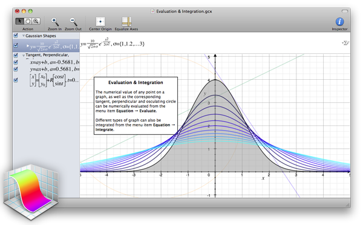

# Menggambar Secara Algoritmik
## Shaping functions

Bab ini harusnya dinamakan "Pelajaran pagar Pak Miyagi". Sebelumnya, kita memetakan posisi dari *x* dan *y* yang dinormaliasasikan ke saluran *merah* dan *hijau*. Intinya kita membuat sebuah fungsi yang mengambil vektor dua dimensi (x dan y) dan mengembalikan vektor empat dimensi (r, g, b dan a). Tapi sebelum kita melangkah lebih jauh mentransformasikan data antar dimensi, kita harus mulai dari yang sederhana... jauh lebih sederhana. Maksudnya memahami bagaiman membuat fungsi satu dimensi. Semakin banyak energi dan waktu yang anda habiskan untuk mempelajari dan menguasainya, semakin kuat karate shader Anda.


Struktur kode berikut ini akan menjadi pagar kita. Di dalamnya, kami memvisualisasikan nilai yang dinormalisasi dari koordinat *x* (`st.x`) dalam dua cara: satu dengan kecerahan (amati gradien yang bagus dari hitam ke putih) dan yang lainnya dengan memplot garis hijau di atas (dalam dalam hal ini nilai * * diberikan langsung ke *y*). Jangan terlalu fokus pada fungsi plot, kita akan membahasnya lebih detail sebentar lagi.

<div class="codeAndCanvas" data="linear.frag"></div>

**Catatan Singkat**: Konstruktor jenis `vec3`" memahami "bahwa Anda ingin menetapkan tiga saluran warna dengan nilai yang sama, sementara` vec4` memahami bahwa Anda ingin membuat vektor empat dimensi dengan satu plus tiga dimensi nilai keempat (dalam hal ini nilai yang mengontrol alpha atau opacity). Lihat misalnya baris 19 dan 25 di atas.

Kode ini adalah pagar Anda; penting untuk mengamati dan memahaminya. Anda akan kembali lagi dan lagi ke ruang ini antara *0,0* dan *1,0*. Anda akan menguasai seni memadukan dan membentuk garis ini.

Hubungan satu-ke-satu antara *x* dan *y* (atau kecerahan) dikenal sebagai *interpolasi linier*. Dari sini kita dapat menggunakan beberapa fungsi matematika untuk *bentuk (shape)* garis. Misalnya kita dapat menaikkan *x* menjadi pangkat 5 untuk membuat garis * melengkung *.

<div class="codeAndCanvas" data="expo.frag"></div>

Menarik bukan? Pada baris 22 coba eksponen berbeda: 20.0, 2.0, 1.0, 0.0, 0.2 dan 0.02 misalnya. Memahami hubungan antara nilai dan eksponen ini akan sangat membantu. Menggunakan jenis fungsi matematika ini di sana-sini akan memberi Anda kontrol ekspresif atas kode Anda, semacam akupunktur data yang memungkinkan Anda mengontrol aliran nilai.

[`pow()`](../glossary/?search=pow) adalah fungsi asli di GLSL dan masih banyak lagi lainnya. Kebanyakan dari mereka diakselerasi pada tingkat perangkat keras, yang berarti jika mereka digunakan dengan cara yang benar dan dengan kebijaksanaan mereka akan membuat kode Anda lebih cepat.

Ganti fungsi power pada baris 22. Coba yang lain seperti: [`exp()`](../glossary/?search=exp), [`log()`](../ glossary/?search=log) dan [`sqrt()`](../glossary/?search=sqrt). Beberapa dari fungsi ini lebih menarik saat Anda bermain dengannya menggunakan PI. Anda dapat melihat pada baris 8 bahwa saya telah menetapkan makro yang akan menggantikan penggunaan `PI` dengan nilai` 3.14159265359`.

### Step dan Smoothstep

GLSL juga memiliki beberapa fungsi interpolasi asli unik yang diakselerasi dengan perangkat keras.

Interpolasi [`step()`](../glossary/?search=step) menerima dua parameter. Yang pertama adalah batas atau ambang, sedangkan yang kedua adalah nilai yang ingin kita periksa atau lewati. Setiap nilai di bawah batas akan mengembalikan `0.0` sementara semua yang di atas batas akan mengembalikan` 1.0`.

Coba ubah nilai ambang batas ini pada baris 20 kode berikut.

<div class="codeAndCanvas" data="step.frag"></div>

Fungsi unik lainnya dikenal sebagai [`smoothstep()`](../glossary/?search=smoothstep). Diberikan rentang dua angka dan nilai, fungsi ini akan menginterpolasi nilai antara rentang yang ditentukan. Dua parameter pertama adalah untuk awal dan akhir transisi, sedangkan yang ketiga adalah untuk nilai yang akan diinterpolasi.

<div class="codeAndCanvas" data="smoothstep.frag"></div>

Pada contoh sebelumnya, pada baris 12, perhatikan bahwa kita telah menggunakan smoothstep untuk menggambar garis hijau pada fungsi `plot()`. Untuk setiap posisi sepanjang sumbu *x* fungsi ini membuat *lonjakan* pada nilai *y* tertentu. Bagaimana? Dengan menghubungkan dua [`smoothstep()`](../glossary/?search=smoothstep) bersama-sama. Perhatikan fungsi berikut, ganti untuk baris 20 di atas dan anggap sebagai potongan vertikal. Latar belakangnya terlihat seperti garis, bukan?

```glsl
float y = smoothstep(0.2,0.5,st.x) - smoothstep(0.5,0.8,st.x);
```

### Sinus dan Kosinus

Saat Anda ingin menggunakan beberapa matematika untuk menganimasikan, membentuk, atau mencampurkan nilai, tidak ada yang lebih baik daripada berkawan dengan sinus dan cosinus.

Kedua fungsi trigonometri dasar ini bekerja sama untuk membuat lingkaran yang berguna seperti pisau tentara Swiss milik MacGyver. Penting untuk mengetahui bagaimana mereka berperilaku dan dengan cara apa mereka dapat digabungkan. Singkatnya, diberi sudut (dalam radian) mereka akan mengembalikan posisi yang benar dari * x * ([cosinus](../glossary/?search=cos)) dan *y* ([sinus](../glosarium/?search=sin)) dari sebuah titik di tepi lingkaran dengan jari-jari yang sama dengan 1. Tapi, fakta bahwa mereka kembali atau


Meskipun sulit untuk mendeskripsikan semua hubungan antara fungsi trigonometri dan lingkaran, animasi di atas melakukan pekerjaan yang bagus dalam merangkum hubungan ini secara visual.

<div class="simpleFunction" data="y = sin(x);"></div>

Perhatikan baik-baik gelombang sinus ini. Perhatikan bagaimana nilai *y* mengalir dengan mulus antara +1 dan -1. Seperti yang kita lihat pada contoh waktu di bab sebelumnya, Anda dapat menggunakan perilaku ritmis [`sin()`](../ glossary/?search=sin) untuk menghidupkan properti. Jika Anda membaca contoh ini di browser, Anda akan melihat bahwa Anda dapat mengubah kode dalam rumus di atas untuk melihat bagaimana wave berubah. (Catatan: jangan lupa titik koma di akhir baris.)

Cobalah latihan berikut dan perhatikan apa yang terjadi:

* Tambahkan waktu (`u_time`) ke *x* sebelum menghitung `sin`. Internalisasikan **gerakan** di sepanjang *x*.

* Kalikan *x* dengan `PI` sebelum menghitung `sin`. Perhatikan bagaimana kedua fase **menyusut** sehingga setiap siklus berulang setiap 2 bilangan bulat.

* Kalikan waktu (`u_time`) dengan *x* sebelum menghitung `sin`. Lihat bagaimana **frekuensi** antar fase menjadi semakin terkompresi. Perhatikan bahwa u_time mungkin sudah menjadi sangat besar, membuat grafik sulit dibaca.

* Tambahkan 1,0 ke [`sin(x)`](../ glossary /?search=sin). Lihat bagaimana semua gelombang **dipindahkan** ke atas dan sekarang semua nilai berada di antara 0,0 dan 2,0.

* Kalikan [`sin (x)`](../ glossary/?search=sin) dengan 2.0. Lihat bagaimana **amplitudo** berlipat ganda.

* Hitung nilai absolut ([`abs()`](../glossary/?search=abs)) dari `sin(x)`. Ini terlihat seperti jejak bola **yang memantul**.

* Ekstrak hanya bagian pecahan ([`fract()`](../glossary/?search=fract)) dari resultan [`sin(x)`](../glossary/?search=sin).

* Tambahkan bilangan bulat yang lebih tinggi ([`ceil()`](../glossary/?search=ceil)) dan bilangan bulat yang lebih kecil ([`floor()`](../glossary/?search=floor)) dari resultan dari [`sin (x)`](../glossary/?search=sin) untuk mendapatkan gelombang digital nilai 1 dan -1.

### Beberapa fungsi yang berguna ekstra

Di akhir latihan terakhir kami memperkenalkan beberapa fungsi baru. Sekarang saatnya untuk bereksperimen dengan masing-masing dengan menghapus komentar baris di bawah satu per satu. Kenali fungsi-fungsi ini dan pelajari bagaimana perilakunya. Saya tahu, Anda bertanya-tanya ... mengapa? Pencarian Google cepat tentang "seni generatif" akan memberi tahu Anda. Ingatlah bahwa fungsi-fungsi ini adalah pagar kami. Kami menguasai gerakan dalam satu dimensi, naik turun. Sebentar lagi, waktunya untuk dua, tiga, dan empat dimensi!


<div class="simpleFunction" data="y = mod(x,0.5); // return x modulo of 0.5
//y = fract(x); // return only the fraction part of a number
//y = ceil(x);  // nearest integer that is greater than or equal to x
//y = floor(x); // nearest integer less than or equal to x
//y = sign(x);  // extract the sign of x
//y = abs(x);   // return the absolute value of x
//y = clamp(x,0.0,1.0); // constrain x to lie between 0.0 and 1.0
//y = min(0.0,x);   // return the lesser of x and 0.0
//y = max(0.0,x);   // return the greater of x and 0.0 "></div>

### Fungsi membentuk lanjutan


[Golan Levin](http://www.flong.com/) memiliki dokumentasi hebat tentang fungsi pembentukan yang lebih kompleks yang sangat membantu. Mem-portingnya ke GLSL adalah langkah yang sangat cerdas, untuk mulai membangun resource cuplikan kode Anda sendiri.

* Funsi Pembentukan polinomial: [www.flong.com/archive/texts/code/shapers_poly](http://www.flong.com/archive/texts/code/shapers_poly/)

* Fungsi Pembentuan eksponensial: [www.flong.com/archive/texts/code/shapers_exp](http://www.flong.com/archive/texts/code/shapers_exp/)

* Fungsi Pembentukan Lingkaran & Elips: [www.flong.com/archive/texts/code/shapers_circ](http://www.flong.com/archive/texts/code/shapers_circ/)

* Bezier dan Fungsi Pembentukan Parametrik lainnya: [www.flong.com/archive/texts/code/shapers_bez](http://www.flong.com/archive/texts/code/shapers_bez/)

<div class="glslGallery" data="160414041542,160414041933,160414041756" data-properties="clickRun:editor,hoverPreview:false"></div>

Seperti koki yang mengumpulkan rempah-rempah dan bahan-bahan eksotis, seniman digital dan pembuat kode kreatif sangat menyukai mengerjakan fungsi pembentukan mereka sendiri.

[Iñigo Quiles] (http://www.iquilezles.org/) memiliki banyak koleksi [fungsi yang berguna](http://www.iquilezles.org/www/articles/functions/functions.htm). Setelah membaca [artikel ini (http://www.iquilezles.org/www/articles/functions/functions.htm) lihat terjemahan berikut dari fungsi-fungsi ini ke GLSL. Perhatikan perubahan kecil yang diperlukan, seperti meletakkan "." (titik) pada bilangan floating point dan menggunakan nama GLSL untuk fungsi *C*; misalnya alih-alih `powf()` gunakan `pow()`:

<div class="glslGallery" data="05/impulse,05/cubicpulse,05/expo,05/expstep,05/parabola,05/pcurve" data-properties="clickRun:editor,hoverPreview:false"></div>

Untuk menjaga motivasi Anda tetap tinggi, berikut adalah contoh elegan (dibuat oleh [Danguafer](https://www.shadertoy.com/user/Danguafer)) dalam menguasai karate fungsi-pembentukan.

<iframe width="800" height="450" frameborder="0" src="https://www.shadertoy.com/embed/XsXXDn?gui=true&t=10&paused=true" allowfullscreen></iframe>

Di bab berikutnya kami akan mulai menggunakan gerakan baru kami. Pertama dengan mencampurkan warna dan kemudian menggambar bentuk.

#### Latihan

Lihatlah tabel persamaan yang dibuat oleh [Kynd](http://www.kynd.info/log/). Lihat bagaimana dia menggabungkan fungsi dan propertinya untuk mengontrol nilai antara 0,0 dan 1,0. Sekarang saatnya Anda berlatih dengan mereplikasi fungsi-fungsi ini. Ingat, semakin banyak Anda berlatih semakin baik karate Anda nantinya.


#### Untuk kotak peralatan Anda

Berikut beberapa alat yang akan memudahkan Anda untuk memvisualisasikan jenis fungsi tersebut.

* Grapher: jika Anda memiliki komputer MacOS, ketik `grapher` di sorotan Anda dan Anda akan dapat menggunakan alat yang sangat berguna ini.



* [GraphToy](http://www.iquilezles.org/apps/graphtoy/): sekali lagi[Iñigo Quilez](http://www.iquilezles.org) membuat alat untuk memvisualisasikan funsi GLSL dalam WebGL.


* [Shadershop](http://tobyschachman.com/Shadershop/): alat menakjubkan ini dibuat oleh [Toby Schachman](http://tobyschachman.com/) akan mengajarkan anda cara untuk membentuk funsi komplek dalam visual yang luar biasa dan jalan yang intuitif.


