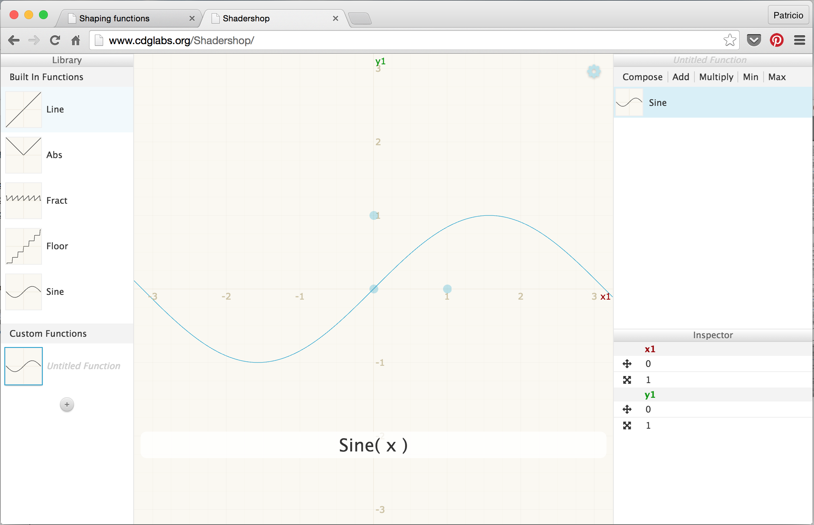

# Disegno Algoritmico
## Funzioni di forma

Questo capitolo potrebbe essere chiamato "la lezione del recinto di Mr. Miyagi". In precedenza abbiamo associato la posizione normalizzata di *x* e *y* ai canali *rosso* e *verde*. Fondamentalmente abbiamo creato una funzione che prende un vettore bidimensionale (x e y) e restituisce un vettore quadridimensionale (r, g, b e a). Ma prima di andare avanti nella trasformazione dei dati tra dimensioni, dobbiamo iniziare da qualcosa di più semplice…molto più semplice. Questo significa comprendere come creare funzioni unidimensionali. Maggiori sono l’energia e il tempo che impieghi nel comprendere e nel padroneggiarle, migliore sarà il tuo karate shader.


La seguente struttura di codice sarà la nostra recinzione. In questa visualizziamo il valore normalizzato della coordinata *x* (```st.x```) in due modi: uno con la luminosità (osserva il bel gradiente dal nero al bianco) e l’altro tracciando sopra una linea verde (in questo caso il valore di *x* è assegnato direttamente al valore di *y*). Non ti concentrare troppo sulla funzione plot, la vedremo nel dettaglio tra poco.

<div class="codeAndCanvas" data="linear.frag"></div>

**Nota veloce**: il costruttore di tipo ```vec3``` "capisce" che vuoi assegnare i tre canali di colori allo stesso valore, mentre ```vec4``` capisce che vuoi costruire un vettore a quattro dimensioni con tre unidimensionali più un quarto valore (in questo caso il valore che controlla l’alfa o l’opacità). Guarda, ad esempio, le righe 19 e 25 qui sopra.

Questo codice è il tuo recinto; è importante osservarlo e capirlo. Tornerai spesso in questo spazio tra *0.0* e *1.0*. Imparerai l’arte di combinare e modellare questa linea.

Questa relazione uno a uno tra *x* e *y* (o la luminosità) è conosciuta come *interpolazione lineare*. A partire da qui, possiamo usare alcune funzioni matematiche per *modellare* la linea. Per esempio, possiamo elevare *x* alla quinta potenza e creare una linea *curva*.

<div class="codeAndCanvas" data="expo.frag"></div>

Interessante, vero? Alla riga 22 prova esponenti diversi, per esempio: 20.0, 2.0, 1.0, 0.0, 0.2 e 0.02. comprendere questa relazione tra il valore e l’esponente sarà molto utile. Questo genere di funzioni matematiche ci darà un controllo espressivo sul codice, come una specie di agopuntura che permette di controllare il flusso dei valori.

[```pow()```](../glossary/?search=pow) è una funzione nativa il GLSL e ce ne sono molte altre. La maggior parte di queste sono accelerate al livello dell’hardware; ciò significa che se esse sono usate in modo appropriato e con discrezione, renderanno il tuo codice molto più veloce.

Sostituisci la funzione alla riga 22. Provane altre, come: [```exp()```](../glossary/?search=exp), [```log()```](../glossary/?search=log) e [```sqrt()```](../glossary/?search=sqrt). Alcune di queste funzioni sono più interessanti quando le si utilizza con PI.  Puoi vedere alla riga 8, che ho definito un macro che sostituisce qualsiasi chiamata a ```PI``` con valore ```3.14159265359```.

### Step e Smoothstep

GLSL ha anche alcune funzioni interpolanti native uniche che sono accelerate dall’hardware.

L’interpolazione [```step()```](../glossary/?search=step) riceve due parametri. Il primo è il limite o la soglia, mentre il secondo è il valore che volgiamo controllare. Qualsiasi valore al di sotto del limite tornerà a ```0.0```, mentre tutto ciò al di sopra del limite tornerà a ```1.0```.  

Prova a cambiare il valore della soglia alla riga 20 del seguente codice.

<div class="codeAndCanvas" data="step.frag"></div>

L’altra funzione unica è conosciuta come [```smoothstep()```](../glossary/?search=smoothstep). Data una serie di due numeri e un valore, questa funzione interpolerà il valore tra la serie definita. I primi due parametri sono per l’inizio e la fine della transizione, mentre il terzo è per il valore d’interpolazione.

<div class="codeAndCanvas" data="smoothstep.frag"></div>

Nell’esempio precedente, alla riga 12, nota che abbiamo usato smoothstep ( ) per disegnare la linea verde sulla funzione ```plot()```. Per ciascuna posizione lungo l’asse *x*, questa funzione crea un *salto* ad un particolare valore di *y*. Come? Collegando tra di loro due [```smoothstep()```](../glossary/?search=smoothstep). Guarda la funzione qui di seguito, sostituiscila alla riga 20 di sopra e pensa ad esso come ad un taglio verticale. Lo sfondo assomiglia ad una linea, vero?

```glsl
    float y = smoothstep(0.2,0.5,st.x) - smoothstep(0.5,0.8,st.x);
```

### Seno e coseno.

Quando si vuole usare la matematica per animare, modellare o combinare, non c’è nulla di meglio che essere amici del seno e del coseno.

Queste due basiche funzioni trigonometriche lavorano congiuntamente per costruire cerchi che sono utili come il coltellino svizzero di MacGyver. È importante sapere come si comportano e in che modo possono essere combinate. In breve: dato un angolo (in radianti), essi ritorneranno alla corretta posizione di *x* ([cosine](../glossary/?search=cos)) e di *y* ([sine](../glossary/?search=sin)) di un punto sul margine del cerchio con raggio uguale a 1. Il fatto che queste funzioni ritornano ai valori normalizzati ( tra -1 e 1) in modo così armonioso e fluido le rende uno strumento incredibile.  


Mentre è difficile descrivere tutte le relazioni tra le funzioni trigonometriche e i cerchi, le animazioni soprastanti le riassumono molto bene visivamente.

<div class="simpleFunction" data="y = sin(x);"></div>

Guarda attentamente questa curva sinusoidale. Nota come i valori di *y* ondeggiano dolcemente tra +1 e -1. Come abbiamo visto nell’esempio del tempo nel capitolo precedente, si può usare questo comportamento ritmico di [```sin()```](../glossary/?search=sin) per animare le proprietà. Se stai leggendo questo esempio su un browser, vedrai che puoi cambiare il codice nella formula soprastante per osservare come cambia l’onda. (Nota: non dimenticare il punto e virgola alla fine delle righe).

Prova questi esercizi e osserva cosa succede:

* Aggiungi tempo (```u_time```) a *x* prima di calcolare ```sin```. Osserva attentamente questo **movimento** lungo *x*.

* Moltiplica *x* per ```PI``` prima di calcolare ```sin```. Nota come le due fasi si **restringano** e ciascun ciclo si ripeta tra due valori interi.

* Moltiplica tempo (```u_time```) per *x* prima di calcolare ```sin```. Osserva come la **frequenza** tra le fasi diventi sempre più compressa. Nota che u_time può avere già assunto un valore molto grande, rendendo il grafico difficile da leggere.

* Aggiungi 1.0 a [```sin(x)```](../glossary/?search=sin). Osserva come tutte le onde siano **dislocate** verso l’alto e adesso tutti i valori siano tra 0.0 e 2.0.

* Moltiplica [```sin(x)```](../glossary/?search=sin) per 2.0. Osserva come l’**ampiezza** raddoppi di misura.

* Calcola il valore assoluto ([```abs()```](../glossary/?search=abs)) di ```sin(x)```. Sembra la traccia di una palla che **rimbalza**.

* Estrai solo la parte frazionaria ([```fract()```](../glossary/?search=fract)) della risultante di [```sin(x)```](../glossary/?search=sin).

* Aggiungi il numero intero più elevato ([```ceil()```](../glossary/?search=ceil)) e il più basso ([```floor()```](../glossary/?search=floor)) della risultante di [```sin(x)```](../glossary/?search=sin) per ottenere un’onda digitale dei valori 1 e -1.

### Altre funzioni utili

AAl termine dell’ultimo esercizio abbiamo presentato alcune nuove funzioni. È arrivato il momento di provare con ciascuna, decommentando le righe sottostanti, una alla volta. Impara quete funzioni e studia il loro comportamento. Lo so, ti stai chiedendo perché e se cerchi velocemente su Google "arte generativa" capirai subito. Ricorda che queste funzioni sono il nostro recinto. Stiamo controllando il movimento in una dimensione, su e giù. Presto arriverà il momento per due, tre e quattro dimensioni!


<div class="simpleFunction" data="y = mod(x,0.5); // restituisce il modulo di 0.5
//y = fract(x); // restituisce solo la parte frazionale di un numero
//y = ceil(x);  // il numero intero più vicino che sia più grande o uguale a x
//y = floor(x); // il numero intero più vicino che sia più piccolo o uguale a x
//y = sign(x);  // estrae il segno di x
//y = abs(x);   // restituisce il valore assoluto di x
//y = clamp(x,0.0,1.0); // costringe x a restare fra 0.0 e 1.0
//y = min(0.0,x);   // restituisce il valore più piccolo fra x e 0.0
//y = max(0.0,x);   // restituisce il valore più grande fra x e 0.0"></div>

### Funzioni di forma avanzate

[Golan Levin](http://www.flong.com/) possiede un’ampia documentazione molto utile sulle funzioni di forma complesse. Trasportare queste funzioni in GLSL è un ottimo modo per incominciare a costruire la propria cassetta degli attrezzi per creare codici.

* [Polynomial Shaping Functions: www.flong.com/archive/texts/code/shapers_poly](http://www.flong.com/archive/texts/code/shapers_poly/)

* [Exponential Shaping Functions: www.flong.com/archive/texts/code/shapers_exp](http://www.flong.com/archive/texts/code/shapers_exp/)

* [Circular & Elliptical Shaping Functions: www.flong.com/archive/texts/code/shapers_circ](http://www.flong.com/archive/texts/code/shapers_circ/)

* [Bezier and Other Parametric Shaping Functions: www.flong.com/archive/texts/code/shapers_bez](http://www.flong.com/archive/texts/code/shapers_bez/)

<div class="glslGallery" data="160414041542,160414041933,160414041756" data-properties="clickRun:editor,hoverPreview:false"></div>

Come i cuochi collezionano con passione spezie e ingredienti esotici, così gli artisti digitali e i creative coders  adorano lavorare sulle proprie funzioni di forma.

[Iñigo Quiles](http://www.iquilezles.org/) possiede una grande raccolta di [funzioni molto utili](http://www.iquilezles.org/www/articles/functions/functions.htm). Dopo aver letto [quest'articolo](http://www.iquilezles.org/www/articles/functions/functions.htm), leggi le seguenti traduzioni di queste funzioni in GLSL. Fai attenzione ai piccoli cambiamenti necessari, come mettere "."" (punto) sui valori flessibili, e usare il nome GLSL per le *funzioni in C*; per esempio, invece di ```powf()```, usa ```pow()```:


<div class="glslGallery" data="05/impulse,05/cubicpulse,05/expo,05/expstep,05/parabola,05/pcurve" data-properties="clickRun:editor,hoverPreview:false"></div>

Per mantenere alta la tua motivazione, qui trovi un esempio elegante dell’essere esperti nel karate delle funzioni di forma (creato da [Danguafer](https://www.shadertoy.com/user/Danguafer)).

<iframe width="800" height="450" frameborder="0" src="https://www.shadertoy.com/embed/XsXXDn?gui=true&t=10&paused=true" allowfullscreen></iframe>

Nel *Prossimo >>* capitolo inizieremo ad usare nuove mosse. Prima mescolando i colori e poi disegnando forme.

#### Esercizio

Guarda la seguente tabella di equazioni fatta da [Kynd](http://www.kynd.info/log/). Osserva come combini le funzioni e le loro proprietà per controllare i valori tra 0.0 e 1.0. Ora è il tuo momento di fare pratica replicando queste funzioni. Ricordati: più ti eserciti, migliore sarà il tuo karate.


#### Per la tua cassetta degli attrezzi

Qui trovi alcuni strumenti che ti faciliteranno la visualizzazione di questi tipi di funzione.

* Grapher: se hai un computer MacOS, digita ```grapher``` nel tuo spotlight e riuscirai ad usare questo magnifico attrezzo.


* [GraphToy](http://www.iquilezles.org/apps/graphtoy/): ancora una volta [Iñigo Quilez](http://www.iquilezles.org) ha creato un mezzo per visualizzare le funzioni GLSL in WebGL.


* [Shadershop](http://tobyschachman.com/Shadershop/): questo favoloso mezzo creato da [Toby Schachman](http://tobyschachman.com/) ti insegnerà a costruire funzioni complesse in un modo visivo ed incredibilmente intuitivo.


