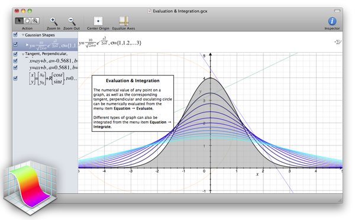
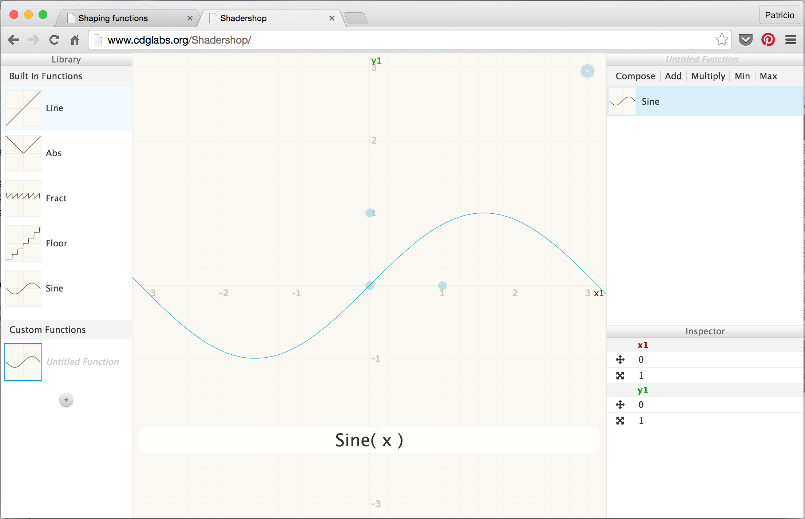

# アルゴリズムで絵を描く

## シェイピング関数

この章は[「ミヤギさんの壁塗りレッスン」](https://ja.wikipedia.org/wiki/%E3%83%99%E3%82%B9%E3%83%88%E3%83%BB%E3%82%AD%E3%83%83%E3%83%89)とでもすれば良かったかもしれません。以前の章では正規化したx座標とy座標の値をr（赤）とg（緑）のチャンネルに割り当てました。つまり私たちは既に、2次元のベクトル（x, y）を受け取って4次元のベクトル（r, g, b, a）を返す関数を作ったのです。
しかし、次元をまたいでのデータの変形にさらに深く踏み込む前に、ずっとシンプルなことから修行を始めなければなりません。まずは1次元の関数を理解します。より多くの時間と労力を割いて鍛錬すれば、その分だけあなたのシェーダーカラテは強くなるでしょう。


私たちにとってミヤギさんの壁に当たるものは、下記に示すコードの枠組みです。この枠組みを使って、正規化されたx座標の値を2種類の方法で目に見えるようにしてみます。1つめの方法では色の明るさを使い（黒から白への綺麗なグラデーションを見てください）、2つめでは緑色の線を描画します（ここではx座標の値をそのままy座標に割り当てています）。```plot``` 関数のことは今はあまり気にしないでください。すぐ後で詳しく説明します。

<div class="codeAndCanvas" data="linear.frag"></div>

上記のサンプルの20行目と26行目を見てください。
```vec3``` 型のコンストラクタに値を1つだけ渡すと、コンストラクタは3つの色のチャンネルに同じ値を割りてようとしているのだと解釈します。一方で ```vec4``` は三次元のベクトルともう1つの値（ここではalpha、つまり透明度）で初期化されています。

このコードがミヤギさんの壁です。よく観察して理解しておくことが大切です。この 0.0 から 1.0 の空間には何度も立ち帰ることになるでしょう。そしてあなたはいずれ、色と形を操る技をマスターするのです。

このサンプルのx座標とy座標（または明るさ）の1対1の対応は線形補間と呼ばれています。
ここから私たちは数学的な関数を使って線を形作っていくことになります。例えばxを5乗すれば曲線を作ることができます。

（訳注：ここでは x=0.0 から x=1.0 の間のグラフが一次方程式で書ける、つまりグラフが直線になることを指して線形補完 * Liniear Interpolation*という言葉が使われています。参考：[Wikipedia: 線形補間](https://ja.wikipedia.org/wiki/%E7%B7%9A%E5%BD%A2%E8%A3%9C%E9%96%93)。この章の原文ではInterpolateという単語が複数回登場しますが、厳密な使い方ではない箇所もあるため以下では「補完」という訳語はあてませんでした。興味がある方はコンピュータグラフィックスやアニメーションの世界で補完関数 *Interpolator* がどのように使われているか調べてみましょう。）

<div class="codeAndCanvas" data="expo.frag"></div>

面白いでしょう？ 19行目の指数（```5.0```）を他の数に変えてみましょう。例えば値を ```20.0```, ```2.0```, ```1.0```, ```0.0```, ```0.2```, ```0.02``` に変えてみます。この値と指数の関係を理解しておくととても役立ちます。この例のように数学的な関数を様々な場面で用いると、コードを表現豊かに操ることができます。鍼で気の流れを操るようにデータの流れを操るのです。

GLSLには多くのネイティブ関数が用意されており、[```pow()```](../glossary/?search=pow) はその中の1つです。ほとんどのネイティブ関数はハードウェアのレベルで高速に処理されるので、適切に使えばより速いコードを書くことができます。

22行目のべき関数を [```exp(st.x) - 1.0```](../glossary/?search=exp), [```log(st.x - 1.0)```](../glossary/?search=log), [```sqrt(st.x)```](../glossary/?search=sqrt) など他の関数で置き換えてみましょう。

### StepとSmoothstep

GLSLには他にも、値を変化させるのに使うことができるネイティブ関数があります。これらもまたハードウェアで高速に処理されます。

[```step()```](../glossary/?search=step) 関数は2つのパラメーターを受け取ります。1つめは境界または閾値で、2つめはこの関数によってチェックされる値です。境界より小さい値には全て ```0.0``` を返し、境界以上の値には ```1.0``` を返します。

下記のコードの20行目の閾値を変えて試してみてください。

<div class="codeAndCanvas" data="step.frag"></div>

もう1つ、[```smoothstep()```](../glossary/?search=smoothstep)と呼ばれる関数があります。2つの数値からなる範囲ともう1つの値を受け取ると、この関数はその範囲の間で0.0から1.0まで滑らかに変化する数値を返します。最初の2つのパラメータは値の変化の起こる範囲の始まりと終わりで、3つめのパラメータはチェックの対象になる値です。

<div class="codeAndCanvas" data="smoothstep.frag"></div>

上記の例の12行目では、[```smoothstep()```](../glossary/?search=smoothstep) が ```plot()``` 関数の中で緑色の線を描画するために使われていますね。この関数をx軸に沿って見ていくと、それぞれの点で特定のyの値に対して急激に高い値を返しています。どうなっているのでしょう。```plot``` 関数は2つの [```smoothstep()```](../glossary/?search=smoothstep) を組み合わせてこれを実現しています。下記の関数を見てください。上の20行目をこの関数で置き換えて、結果を ```plot``` 関数のグラフを垂直に切った断面だと考えてみましょう。背景が線のように見えるでしょう？

```glsl
    float y = smoothstep(0.2,0.5,st.x) - smoothstep(0.5,0.8,st.x);
```

（訳注：おまけ。```plot``` 関数を理解するには引き算の片側を消して ```smoothstep(0.2,0.5,st.x)``` もしくは ```smoothstep(0.5,0.8,st.x)``` だけにしてみるのも良いと思います。2つのグラフの位置が少しずれていて、引き算をすると真ん中だけが残されるのが分かりますね。20行目の ```smoothstep( pct-0.02, pct, st.y) -
          smoothstep( pct, pct+0.02, st.y)``` でも同じことを試してみましょう。）


### サインとコサイン

数学を使ってアニメーションや形を作ったり、値を組み合わせたりしたいのであれば、サインとコサインに親しんでおくに越したことはありません。

この２つの基本的な三角関数を一緒に使うと円を作ることができます。これは[冒険野郎マクガイバー](https://ja.wikipedia.org/wiki/%E5%86%92%E9%99%BA%E9%87%8E%E9%83%8E%E3%83%9E%E3%82%AF%E3%82%AC%E3%82%A4%E3%83%90%E3%83%BC)のスイスアーミーナイフ並みに便利です。サインとコサインがどのように振る舞い、どのような組み合わせで使えるのかを知っておくことが大事です。かいつまんで言うと、これらの関数は（ラジアンを単位とする）角度を受け取り、半径を1とする円周上の点のx座標 ([cosine](../glossary/?search=cos)) とy座標([sine](../glossary/?search=sin)) を返します。滑らかに変化する正規化された値（-1から1の間の値）を返す性質のおかげでサインとコサインは非常に便利な道具になります。


三角関数と円の関係について全てを言葉で説明するのは難しいのですが、上のアニメーションはそれを見事に示してくれています。

<div class="simpleFunction" data="y = sin(x);"></div>

このサイン波をよく見てください。y座標の値が+1から-1の間をスムーズに上下しているのがわかるでしょう。時間を使った以前のサンプルでも見たとおり、このサインの周期的な動きはアニメーションに使えます。ブラウザ上で読んでいる方は、上のサンプルの数式を書き換えて波の動きを変えてみることができます（行の最後のセミコロンを忘れないようにしてください）。

下記を試して何が起きるか見てみましょう。

* ```sin``` を計算する前に時間の値（```u_time```）をxに足してみましょう。x座標に沿った動きを身につけましょう。

* ```sin``` を計算する前に、xに ```PI``` を掛けてみましょう。波の幅が縮まり、xが 2 進むごとにyが1サイクル上下するのを確認しましょう。

* ```sin```を計算する前に時間の値（```u_time```）をxに掛けてみましょう。周波数が次第に増えて波の幅が狭くなっていく様子を見てください。u_timeが既に大きくなりすぎていてグラフが読めないほどになってしまっているかもしれないので注意してください。（訳注：もしグラフが線ではなく黒い靄のようなノイズになってしまう場合は、一度ページをリロードしてからもう一度試してください。u_timeはページを読み込んでからの累積時間なので、ここまで読み進める間にかなり大きな値になっている可能性があります）。

* ```sin(x)``` に 1.0 を足してみましょう。値が 0.0 から 2.0 の間に収まるように波の位置が上にずれる様子を見てください。

* ```sin(x)``` に 2.0 を掛けてみましょう。振幅が倍になります。

* ```sin(x)``` の絶対値（[```abs()```](../glossary/?search=abs)）を計算してください。弾むボールの軌跡のように見えるでしょう。

* ```sin(x)``` の値から少数部分だけを取り出してみましょう（[```fract()```](../glossary/?search=fract)）。

* [```sin(x)```](../glossary/?search=sin) の値を超える最小の整数（[```ceil()```](../glossary/?search=ceil)）と、それより小さい最大の整数（[```floor()```](../glossary/?search=floor)）を足して、1 と -1 だけからなるデジタル波を作ってみましょう。

### 便利な関数あれこれ

上の課題の中ではいくつかの新しい関数を紹介しました。今度は下記のサンプルのコメントを1つ1つ外して実験してみましょう。それぞれの関数がどのような振る舞いをするか調べて理解しておいてください。どうしてこんなことが必要なのかと思っていますね？ Googleで「generative art」を検索してみれば答えがわかります。この関数たちは私たちにとってのミヤギさんの壁なのです。今は1次元、上下の動きをマスターしつつあります。すぐに2次元、3次元、そして4次元についても学んでいきます。


<div class="simpleFunction" data="y = mod(x,0.5); // return x modulo of 0.5
//y = fract(x); // return only the fraction part of a number
//y = ceil(x);  // nearest integer that is greater than or equal to x
//y = floor(x); // nearest integer less than or equal to x
//y = sign(x);  // extract the sign of x
//y = abs(x);   // return the absolute value of x
//y = clamp(x,0.0,1.0); // constrain x to lie between 0.0 and 1.0
//y = min(0.0,x);   // return the lesser of x and 0.0
//y = max(0.0,x);   // return the greater of x and 0.0 "></div>

### より高度なシェイピング関数

[Golan Levin](http://www.flong.com/)（Golan Levin）が書いた、より複雑で非常に便利なシェイピング関数についての素晴らしいドキュメントがあります。自分のスニペット集を作るために、これらの関数をGLSLに移植してみると良いでしょう。

* [Polynomial Shaping Functions: www.flong.com/texts/code/shapers_poly](http://www.flong.com/texts/code/shapers_poly/)

* [Exponential Shaping Functions: www.flong.com/texts/code/shapers_exp](http://www.flong.com/texts/code/shapers_exp/)

* [Circular & Elliptical Shaping Functions: www.flong.com/texts/code/shapers_circ](http://www.flong.com/texts/code/shapers_circ/)

* [Bezier and Other Parametric Shaping Functions: www.flong.com/texts/code/shapers_bez](http://www.flong.com/texts/code/shapers_bez/)

スパイスや珍しい食材を集めるシェフのように、デジタルアーティストやクリエィティブコーダーは自らシェイピング関数に取り組むのが大好きです。

[Iñigo Quiles](http://www.iquilezles.org/)は便利な関数の[素晴らしいコレクション](http://www.iquilezles.org/www/articles/functions/functions.htm)を持っています。 [この記事](http://www.iquilezles.org/www/articles/functions/functions.htm)をまず読んでから、下記にあるGLSLへ翻訳したバージョンを見てみましょう。浮動小数点の数値に「.（小数点）」を追加したり、Cの関数をGLSL特有の関数名で置き換える、例えば ```powf()``` の代わりに ```pow()``` を使うなどの細かな変更点に注意してください。

* [Impulse](../edit.php#05/impulse.frag)
* [Cubic Pulse](../edit.php#05/cubicpulse.frag)
* [Exponential Step](../edit.php#05/expstep.frag)
* [Parabola](../edit.php#05/parabola.frag)
* [Power Curve](../edit.php#05/pcurve.frag)

匠の技を見てモチベーションを上げましょう。[Danguafer](https://www.shadertoy.com/user/Danguafer)の作品です。

<iframe width="800" height="450" frameborder="0" src="https://www.shadertoy.com/embed/XsXXDn?gui=true&t=10&paused=true" allowfullscreen></iframe>

次の章では新しい技を使います。まず色の調合から始めて、次に形を描いていきます。

#### 演習

[Kynd](http://www.kynd.info/log/)が作った[数式の表](www.flickr.com/photos/kynd/9546075099/)を見てください。数値と関数をどのように組み合わせて、0.0 から 1.0 の間で値をコントロールしているかを読み取りましょう。実際に関数を置き換えて練習してください。鍛える程にあなたのカラテは強くなります。


#### 便利なツール

この種の関数を簡単に視覚化するためのツールをいくつか紹介します。

* Grapher: MacOSを持っているならSpotlightで「grapher」とタイプするだけで、この素晴らしく便利なツールを使うことができます。



* [GraphToy](http://www.iquilezles.org/apps/graphtoy/): 先ほども紹介した[Iñigo Quilez](http://www.iquilezles.org)が作った、GLSLの関数をWebGLで視覚化するためのツールです。


* [Shadershop](http://tobyschachman.com/Shadershop/): [Toby Schachman](http://tobyschachman.com/)が作ったこの素晴らしいツールを使うと、複雑な関数を組み立てる方法を驚くほど直感的に、目に見える形で学ぶことができます。


