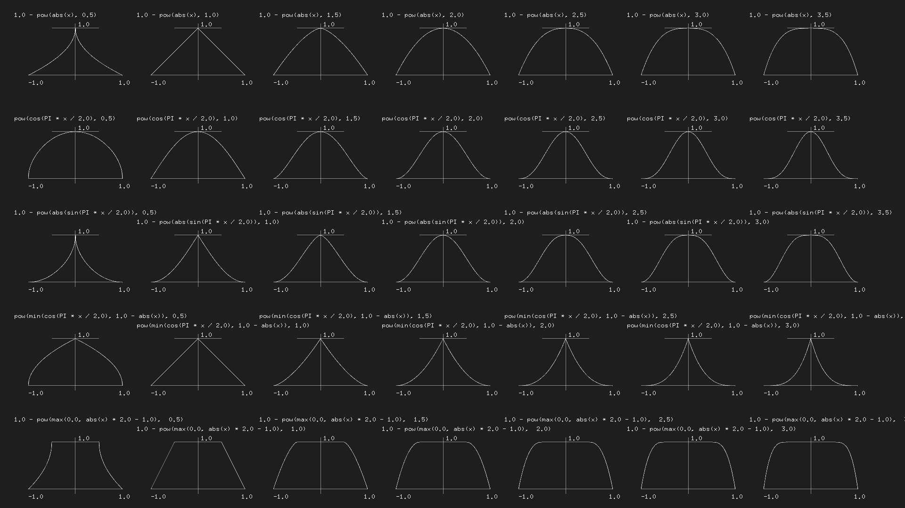

# Rysowanie algorytmiczne
## Shaping functions

Rozdział ten mógłby się nazywać "lekcja płota Pana Miyagiego". Poprzednio, mapowaliśmy znormalizowane pozycje *x* i *y* do *czerwonego* i *zielonego* kanału. W skróćie, stworzyliśmy fumkcję, która przyjmuje dwuwymiarowy wektor (x i y) i zwraca czterowymiarowy wektor (r, g, b i a). Jednak zanim zagłębimy się w takie transformacje między wymiarami, wypada najpierw opanować tworzenie jednowymiarowych funkcji w pełni. Im więcej czasu spędzisz na szlifowaniu tej umiejętności, tym lepsze będzie twoje "shader karate".

<!-- This chapter could be named "Mr. Miyagi's fence lesson." Previously, we mapped the normalized position of *x* and *y* to the *red* and *green* channels. Essentially we made a function that takes a two dimensional vector (x and y) and returns a four dimensional vector (r, g, b and a). But before we go further transforming data between dimensions we need to start simpler... much simpler. That means understanding how to make one dimensional functions. The more energy and time you spend learning and mastering this, the stronger your shader karate will be. -->


Poniższy kod będzie naszym płotem. Wizualizujemy w nim znormalizowaną wartość współrzędnej *x* (`st.x`) w dwojaki sposób: poprzez jasność (zauważ płynny gradient od czerni do bieli) oraz przez rysowanie zielonego wykresu funkcji (w poniższym przykładzie funkcji *x* = *y*). Nie przejmuj się za bardzo funkcją `plot` - wrócimy do niej później. 

<!-- The following code structure is going to be our fence. In it, we visualize the normalized value of the *x* coordinate (`st.x`) in two ways: one with brightness (observe the nice gradient from black to white) and the other by plotting a green line on top (in that case the *x* value is assigned directly to *y*). Don't focus too much on the plot function, we will go through it in more detail in a moment. -->

<div class="codeAndCanvas" data="linear.frag"></div>

**Krótka uwaga**: Konstruktor typu `vec3` "rozumie", że chcesz przypisać tę samą wartość do każdego z trzech kanałów koloru, natomaist typu `vec4` rozumie, że chcesz stworzyć czterowymiarowy wektor z wektora trójwymiarowego i czwartej wartości (w tym wypadku wartość ta kontroluje alphę, czyli przezroczystość). Spójrz na linjki 19 i 25 powyżej.

<!-- **Quick Note**: The `vec3` type constructor "understands" that you want to assign the three color channels with the same value, while `vec4` understands that you want to construct a four dimensional vector with a three dimensional one plus a fourth value (in this case the value that controls the alpha or opacity). See for example lines 19 and 25 above. -->

Kod jest twoim płotem - ważne, żebyś umiał na niego spojrzeć i go zrozumieć. Zakres od *0.0* do *1.0* będzie ci stale towarzyszył. Opanujesz sztukę blendowania (pol. "mieszania", "łączenia") i kształtowania tej linii

<!-- This code is your fence; it's important to observe and understand it. You will come back over and over to this space between *0.0* and *1.0*. You will master the art of blending and shaping this line. -->

Tę wzajmnie jednoznaczną (ang. "one-to-one") funkcję między *x* i *y* (lub jasnością) nazywamy *interpolacją liniową*. Możemy użyć funkcji matematycznych by *uformować* tę linię. Przykładowo, możemy podnieść *x* do potęgi 5, aby utworzyć *krzywą* linię.

<!-- This one-to-one relationship between  *x* and *y* (or the brightness) is known as *linear interpolation*. From here we can use some mathematical functions to *shape* the line. For example we can raise *x* to the power of 5 to make a *curved* line. -->

<div class="codeAndCanvas" data="expo.frag"></div>

Ciekawe, prawda? W linijce 22 spróbuj użyć następujących wykładników: 20.0, 2.0, 1.0, 0.0, 0.2 lub 0.02. Zrozumienie związków między końcową wartością a wykładnikiem będzie bardzo przydatne. Używanie tego typu funkcji matematycznych tu i tam da ci pełnię kontroli nad twoim kodem.

<!-- Interesting, right? On line 22 try different exponents: 20.0, 2.0, 1.0, 0.0, 0.2 and 0.02 for example. Understanding this relationship between the value and the exponent will be very helpful. Using these types of mathematical functions here and there will give you expressive control over your code, a sort of data acupuncture that let you control the flow of values. -->

[`pow()`](../glossary/?search=pow) to natywna funkcja w GLSL, więc zaimplementowana jest na poziomie hardware'u, co oznacza większą wydajność.

<!-- [`pow()`](../glossary/?search=pow) is a native function in GLSL and there are many others. Most of them are accelerated at the level of the hardware, which means if they are used in the right way and with discretion they will make your code faster. -->

Zastąp funkcję potęgową w linijce 22 inną natywną funkcją. Spróbuj [`exp()`](../glossary/?search=exp), [`log()`](../glossary/?search=log) i [`sqrt()`](../glossary/?search=sqrt). W wypadku funkcji trygonometrycznych warto użyć liczby PI. Jest ona zdefiniowana w 8 linijce za pomocą makra, który zastąpi każde użycie `PI` wartością `3.14159265359`.

<!-- Replace the power function on line 22. Try other ones like: [`exp()`](../glossary/?search=exp), [`log()`](../glossary/?search=log) and [`sqrt()`](../glossary/?search=sqrt). Some of these functions are more interesting when you play with them using PI. You can see on line 8 that I have defined a macro that will replace any use of `PI` with the value `3.14159265359`. -->

### Step i Smoothstep

GLSL posiada też unikalne natywne funckje interpolacyjne wykorzystujące akcelerację sprzętową.
<!-- GLSL also has some unique native interpolation functions that are hardware accelerated. -->

Funkcja [`step()`](../glossary/?search=step) otrzymuje dwa argumenty. Pierwszy z nich to limit lub próg, natomiast drugi to wartość, którą chcemy porównać z tym progiem. Każda wartość poniżej limitu zwróci `0.0`, natomiast wszystko powyżej limitu zwróci `1.0`.

<!-- The [`step()`](../glossary/?search=step) interpolation receives two parameters. The first one is the limit or threshold, while the second one is the value we want to check or pass. Any value under the limit will return `0.0` while everything above the limit will return `1.0`. -->

Spróbuj zmienić tę wartość progową w linijce 20 poniższego kodu.

<div class="codeAndCanvas" data="step.frag"></div>

Druga unikalna funkcja znana jest jako [`smoothstep()`](../glossary/?search=smoothstep) i otrzymuje trzy argumenty Dwa pierwsze argumenty służą do określenia początku i końca interpolacji (tranzycji/przejścia), natomiast trzeci jest wartością interpolowaną.

<!-- The other unique function is known as [`smoothstep()`](../glossary/?search=smoothstep). Given a range of two numbers and a value, this function will interpolate the value between the defined range. The two first parameters are for the beginning and end of the transition, while the third is for the value to interpolate. -->

<div class="codeAndCanvas" data="smoothstep.frag"></div>

W poprzednim przykładzie, w linii 12, zauważ, że użyliśmy smoothstep wewnątrz funkcji `plot()` do narysowania zielonej linii. Dla każdej pozycji wzdłuż osi x funkcja ta zwraca odpowiednią wartość y. Jak? Poprzez połączenie ze sobą dwóch [`smoothstep()`](../glossary/?search=smoothstep). Spójrz na poniżśzy fragment kodu (zauważ, że jest analogiczny do kodu w funkcji `plot()`) i wstaw go w linijce 20 powyższego przykładu. Wyobraź sobie, że widoczny wykres o kształcie dzwona (o kształcie rozkładu normalnego) "wędruje" wzdłuż funkcji przekazanej do argumentu `pct` funkcji `plot()`.

<!-- In the previous example, on line 12, notice that we’ve been using smoothstep to draw the green line on the `plot()` function. For each position along the *x* axis this function makes a *bump* at a particular value of *y*. How? By connecting two [`smoothstep()`](../glossary/?search=smoothstep) together. Take a look at the following function, replace it for line 20 above and think of it as a vertical cut. The background does look like a line, right? -->

```glsl
float y = smoothstep(0.2,0.5,st.x) - smoothstep(0.5,0.8,st.x);
```

### Sinus i Cosinus

Kiedy chcesz użyć matematyki do animacji, kształtowania lub blendowania wartości, nie ma nic lepszego niż zaprzyjaźnienie się z sinusem i cosinusem.

<!-- When you want to use some math to animate, shape or blend values, there is nothing better than being friends with sine and cosine. -->

Te dwie podstawowe funkcje trygonometryczne współpracują ze sobą, aby skonstruować okręgi, które są tak poręczne jak szwajcarski scyzoryk MacGyvera. Warto wiedzieć, jak się zachowują i na jakie sposoby można je łączyć. W skrócie, otrzymawszy kąt (w radianach), zwrócą one współrzędne *x* ([cosinus](../glossary/?search=cos)) i *y* ([sinus](../glossary/?search=sin)) punktu na brzegu okręgu o promieniu równym 1. Jednak fakt, że zwracają one znormalizowane wartości (wartości pomiędzy -1 a 1) w tak płynny sposób, czyni z nich niesamowite narzędzie.

<!-- These two basic trigonometric functions work together to construct circles that are as handy as MacGyver’s Swiss army knife. It’s important to know how they behave and in what ways they can be combined. In a nutshell, given an angle (in radians) they will return the correct position of *x* ([cosine](../glossary/?search=cos)) and *y* ([sine](../glossary/?search=sin)) of a point on the edge of a circle with a radius equal to 1. But, the fact that they return normalized values (values between -1 and 1) in such a smooth way makes them an incredible tool. -->


Choć trudno opisać wszystkie związki między funkcjami trygonometrycznymi i okręgami, powyższa animacja pięknie je wizualizuje.

<!-- While it's difficult to describe all the relationships between trigonometric functions and circles, the above animation does a beautiful job of visually summarizing these relationships. -->

<div class="simpleFunction" data="y = sin(x);"></div>

Przyjrzyj się uważnie powyższej fali sinusoidalnej. Zauważ, jak wartości *y* oscylują płynnie między +1 a -1. Jak widzieliśmy w przykładzie z czasem w poprzednim rozdziale, możesz wykorzystać to rytmiczne zachowanie [`sin()`](../glossary/?search=sin) do animowania dowolnych wartości. Jeśli czytasz ten przykład w przeglądarce, spróbuj zmienić kod w powyższym jedno-linjkowym przykładzie i zaobserwuj, jak zmienia się fala. (Uwaga: nie zapomnij o średniku na końcu linii).


<!-- Take a careful look at this sine wave. Note how the *y* values flow smoothly between +1 and -1. As we saw in the time example in the previous chapter, you can use this rhythmic behavior of [`sin()`](../glossary/?search=sin) to animate properties. If you are reading this example in a browser you will see that you can change the code in the formula above to watch how the wave changes. (Note: don't forget the semicolon at the end of the lines.) -->

Spróbuj następnujących ćwiczeń i zobacz, co się stanie

* Dodaj czas (`u_time`) do *x* wewnątrz funkcji `sin`. Zapamiętaj ten **ruch** wzdłuż *x*.

* Pomnóż *x* przez `PI` wewnątrz funkcji `sin`. Zauważ, jak okres sinusa **zmniejsza się** do 2. Zwiększyliśmy w ten sposób częstotliwość. 

* Pomnóż czas (`u_time`) przez *x* wewnątrz funkcji `sin`. Zobacz jak **częstotliwość**  zwiększa się, a okres maleje. Możliwe że u_time może być już bardzo duży, co czyni wykres trudnym do odczytania - odśwież stronę i spróbuj ponownie.

* Dodaj 1.0 do [`sin(x)`](../glossary/?search=sin). Zobacz jak cała fala jest **przesunięta** w górę i wszystkie wartości są pomiędzy 0.0 a 2.0.

* Pomnóż [`sin(x)`](../glossary/?search=sin) przez 2.0. Zobacz jak **amplituda** podwaja się.

* Oblicz wartość bezwzględną ([`abs()`](../glossary/?search=abs)) funkcji `sin(x)`. Wygląda to jak ślad **odbijającej się** piłki.

* Wyciągnij tylko część ułamkową ([`fract()`](../glossary/?search=fract)) z funkcji [`sin(x)`](../glossary/?search=sin).

* Dodaj sufit ([`ceil()`](../glossary/?search=ceil)) oraz podłogę ([`floor()`](../glossary/?search=floor)) z [`sin(x)`](../glossary/?search=sin), aby otrzymać falę cyfrową o wartościach 1 i -1.


<!-- Try the following exercises and notice what happens:

* Add time (`u_time`) to *x* before computing the `sin`. Internalize that **motion** along *x*.

* Multiply *x* by `PI` before computing the `sin`. Note how the two phases **shrink** so each cycle repeats every 2 integers.

* Multiply time (`u_time`) by *x* before computing the `sin`. See how the **frequency** between phases becomes more and more compressed. Note that u_time may have already become very large, making the graph hard to read.

* Add 1.0 to [`sin(x)`](../glossary/?search=sin). See how all the wave is **displaced** up and now all values are between 0.0 and 2.0.

* Multiply [`sin(x)`](../glossary/?search=sin) by 2.0. See how the **amplitude** doubles in size.

* Compute the absolute value ([`abs()`](../glossary/?search=abs)) of `sin(x)`. It looks like the trace of a **bouncing** ball.

* Extract just the fraction part ([`fract()`](../glossary/?search=fract)) of the resultant of [`sin(x)`](../glossary/?search=sin).

* Add the higher integer ([`ceil()`](../glossary/?search=ceil)) and the smaller integer ([`floor()`](../glossary/?search=floor)) of the resultant of [`sin(x)`](../glossary/?search=sin) to get a digital wave of 1 and -1 values. -->

### Kilka dodatkowych przydatnych funkcji

Pod koniec ostatniego ćwiczenia wprowadziliśmy kilka nowych funkcji. Teraz czas na eksperymentowanie z każdą z nich poprzez odkomentowanie poniższych linii po kolei. Poznaj te funkcje i zbadaj jak się zachowują. Wiem, zastanawiasz się... dlaczego? Szybkie wyszukiwanie w google "generative art" powie Ci to. Pamiętaj, że te funkcje to nasz płot. Opanowujemy ruch w jednym wymiarze, w górę i w dół. Już niedługo przyjdzie czas na dwa, trzy i cztery wymiary!

<!-- At the end of the last exercise we introduced some new functions. Now it’s time to experiment with each one by uncommenting the lines below one at a time. Get to know these functions and study how they behave. I know, you are wondering... why? A quick google search on "generative art" will tell you. Keep in mind that these functions are our fence. We are mastering the movement in one dimension, up and down. Soon, it will be time for two, three and four dimensions! -->


<div class="simpleFunction" data="y = mod(x,0.5); // x modulo 0.5
//y = fract(x); // część ułamkowa x
//y = ceil(x);  // sufit z x (najmniejsza liczba całkowita większa lub równa x)
//y = floor(x); // sufit z x (największa liczba całkowita mniejsza lub równa x)
//y = sign(x);  // signum z x (+ lub - w zależności od znaku x)
//y = abs(x);   // wartość bezwzględna z x
//y = clamp(x,0.0,1.0); // ogranicz x do zakresu od 0.0 do 1.0
//y = min(0.0,x);   // minimum z x i 0.0
//y = max(0.0,x);   // maksimum z x i 0.0 "></div>

<!-- <div class="simpleFunction" data="y = mod(x,0.5); // return x modulo of 0.5
//y = fract(x); // return only the fraction part of a number
//y = ceil(x);  // nearest integer that is greater than or equal to x
//y = floor(x); // nearest integer less than or equal to x
//y = sign(x);  // extract the sign of x
//y = abs(x);   // return the absolute value of x
//y = clamp(x,0.0,1.0); // constrain x to lie between 0.0 and 1.0
//y = min(0.0,x);   // return the lesser of x and 0.0
//y = max(0.0,x);   // return the greater of x and 0.0 "></div> -->

### Zaawansowane funkcje kształtujące

[Golan Levin](http://www.flong.com/) ma świetną dokumentację bardziej złożonych shaping functions, które są niezwykle pomocne. Samodzielene przeniesienie ich do GLSL jest dobrym krokiem w stronę budowania własnego zasobu snippetów kodu.

<!-- [Golan Levin](http://www.flong.com/) has great documentation of more complex shaping functions that are extraordinarily helpful. Porting them to GLSL is a really smart move, to start building your own resource of snippets of code. -->

* Wielomianowe shaping fucntions: [www.flong.com/archive/texts/code/shapers_poly](http://www.flong.com/archive/texts/code/shapers_poly/)

* Wykładnicze shaping functions: [www.flong.com/archive/texts/code/shapers_exp](http://www.flong.com/archive/texts/code/shapers_exp/)

* Kołowe i Eliptyczne shaping functions: [www.flong.com/archive/texts/code/shapers_circ](http://www.flong.com/archive/texts/code/shapers_circ/)

* Parametryczne (Beziera) shaping functions: [www.flong.com/archive/texts/code/shapers_bez](http://www.flong.com/archive/texts/code/shapers_bez/)


<!-- * Circular & Elliptical Shaping Functions: [www.flong.com/archive/texts/code/shapers_circ](http://www.flong.com/archive/texts/code/shapers_circ/)

* Bezier and Other Parametric Shaping Functions: [www.flong.com/archive/texts/code/shapers_bez](http://www.flong.com/archive/texts/code/shapers_bez/) -->

<div class="glslGallery" data="160414041542,160414041933,160414041756" data-properties="clickRun:editor,hoverPreview:false"></div>

Podobnie jak szefowie kuchni, którzy zbierają przyprawy i egzotyczne składniki, artyści cyfrowi mają szczególne zamiłowanie do pracy nad własnymi shaping functions.

<!-- Like chefs that collect spices and exotic ingredients, digital artists and creative coders have a particular love of working on their own shaping functions. -->

[Iñigo Quiles](http://www.iquilezles.org/) ma wspaniałą kolekcję [użytecznych funkcji](http://www.iquilezles.org/www/articles/functions/functions.htm). Po przeczytaniu [tego artykułu](http://www.iquilezles.org/www/articles/functions/functions.htm) spójrz na poniższe tłumaczenie tych funkcji na GLSL. Zwróć uwagę na małe zmiany, jak stawianie "." (kropki) przy liczbach zmiennoprzecinkowych i używanie nazw GLSL dla funkcji z *C* (na przykład zamiast `powf()` użyj `pow()`):   

<!-- [Iñigo Quiles](http://www.iquilezles.org/) has a great collection of [useful functions](http://www.iquilezles.org/www/articles/functions/functions.htm). After reading [this article](http://www.iquilezles.org/www/articles/functions/functions.htm) take a look at the following translation of these functions to GLSL. Pay attention to the small changes required, like putting the "." (dot) on floating point numbers and using the GLSL name for *C functions*; for example instead of `powf()` use `pow()`:    -->

<div class="glslGallery" data="05/impulse,05/cubicpulse,05/expo,05/expstep,05/parabola,05/pcurve" data-properties="clickRun:editor,hoverPreview:false"></div>

Aby podtrzymać twoją motywację, oto elegancki przykład (wykonany przez [Danguafer](https://www.shadertoy.com/user/Danguafer)) ilustrujący opanowanie karate shaping functions.

<!-- To keep your motivation up, here is an elegant example (made by [Danguafer](https://www.shadertoy.com/user/Danguafer)) of mastering the shaping-functions karate. -->

<iframe width="800" height="450" frameborder="0" src="https://www.shadertoy.com/embed/XsXXDn?gui=true&t=10&paused=true" allowfullscreen></iframe>

W następnym rozdziale zaczniemy używać naszych nowych sztuczek. Najpierw z mieszaniem kolorów, a potem z rysowaniem kształtów.

<!-- In the *Next >>* chapter we will start using our new moves. First with mixing colors and then drawing shapes. -->

#### Ćwiczenia

<!-- #### Exercise -->

Przyjrzyj się poniższej tabeli wzorów wykonanej przez [Kynd](http://www.kynd.info/log/). Zobacz jak łączy on funkcje i ich właściwości, aby kontrolować wartości pomiędzy 0.0 a 1.0. Teraz nadszedł czas, abyś poćwiczył, odtwarzając te funkcje. Pamiętaj im więcej będziesz ćwiczył tym lepsze będzie twoje karate.

<!-- Take a look at the following table of equations made by [Kynd](http://www.kynd.info/log/). See how he is combining functions and their properties to control the values between 0.0 and 1.0. Now it's time for you to practice by replicating these functions. Remember the more you practice the better your karate will be. -->



#### Pomocne narzędzia

Oto kilka narzędzi, które ułatwią ci wizualizację tego typu funkcji.

* Grapher: jeśli masz komputer z systemem MacOS, wpisz `grapher` w swoim Spotlight, a będziesz mógł użyć tego super poręcznego narzędzia.


* [GraphToy](http://www.iquilezles.org/apps/graphtoy/): po raz kolejny [Iñigo Quilez](http://www.iquilezles.org) stworzył narzędzie do wizualizacji funkcji GLSL w WebGL.


* [Shadershop](http://tobyschachman.com/Shadershop/): to niesamowite narzędzie stworzone przez [Toby Schachman](http://tobyschachman.com/) nauczy cię jak konstruować złożone funkcje w niesamowicie wizualny i intuicyjny sposób.

<!-- Here are some tools that will make it easier for you to visualize these types of functions.

* Grapher: if you have a MacOS computer, type `grapher` in your spotlight and you'll be able to use this super handy tool.


* [GraphToy](http://www.iquilezles.org/apps/graphtoy/): once again [Iñigo Quilez](http://www.iquilezles.org) made a tool to visualize GLSL functions in WebGL.


* [Shadershop](http://tobyschachman.com/Shadershop/): this amazing tool created by [Toby Schachman](http://tobyschachman.com/) will teach you how to construct complex functions in an incredible visual and intuitive way. -->


