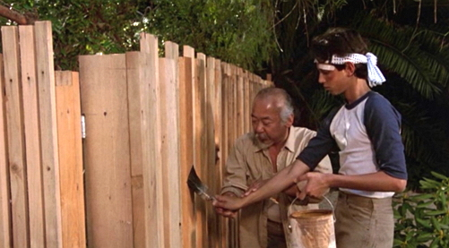
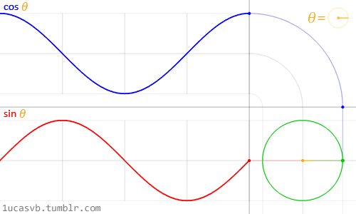
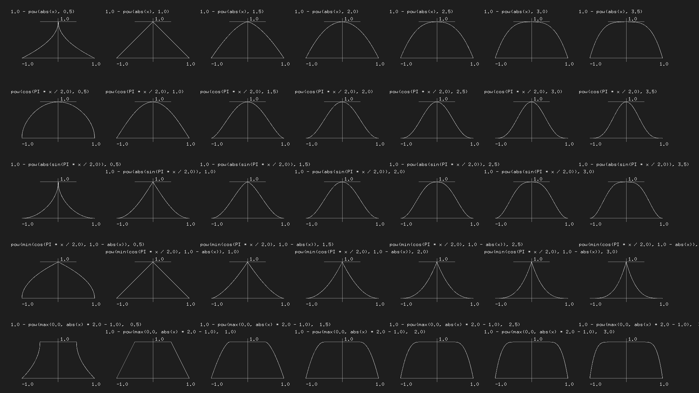
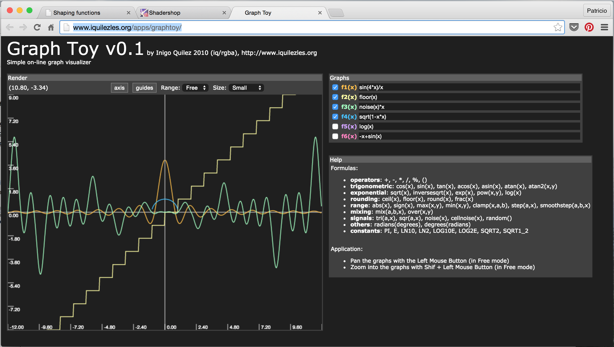

# Algorithmic drawing
## Shaping functions

This chapter could be named "Mr. Miyagi's fence lesson." Previously, we mapped the normalized position of *x* and *y* to the *red* and *green* channels. Essentially we made a function that takes a two dimensional vector (x and y) and returns a four dimensional vector (r, g, b and a). But before we go further transforming data between dimensions we need to start simpler... much simpler. That means understanding how to make one dimensional functions. The more energy and time you spend learning and mastering this, the stronger your shader karate will be.



The following code structure is going to be our fence. In it, we visualize the normalized value of the *x* coordinate (`st.x`) in two ways: one with brightness (observe the nice gradient from black to white) and the other by plotting a green line on top (in that case the *x* value is assigned directly to *y*). Don't focus too much on the plot function, we will go through it in more detail in a moment.

<div class="codeAndCanvas" data="linear.frag"></div>

**Quick Note**: The `vec3` type constructor "understands" that you want to assign the three color channels with the same value, while `vec4` understands that you want to construct a four dimensional vector with a three dimensional one plus a fourth value (in this case the value that controls the alpha or opacity). See for example lines 19 and 25 above.

This code is your fence; it's important to observe and understand it. You will come back over and over to this space between *0.0* and *1.0*. You will master the art of blending and shaping this line.

This one-to-one relationship between  *x* and *y* (or the brightness) is known as *linear interpolation*. From here we can use some mathematical functions to *shape* the line. For example we can raise *x* to the power of 5 to make a *curved* line.

<div class="codeAndCanvas" data="expo.frag"></div>

Interesting, right? On line 22 try different exponents: 20.0, 2.0, 1.0, 0.0, 0.2 and 0.02 for example. Understanding this relationship between the value and the exponent will be very helpful. Using these types of mathematical functions here and there will give you expressive control over your code, a sort of data acupuncture that let you control the flow of values.

[`pow()`](../glossary/?search=pow) is a native function in GLSL and there are many others. Most of them are accelerated at the level of the hardware, which means if they are used in the right way and with discretion they will make your code faster.

Replace the power function on line 22. Try other ones like: [`exp()`](../glossary/?search=exp), [`log()`](../glossary/?search=log) and [`sqrt()`](../glossary/?search=sqrt). Some of these functions are more interesting when you play with them using PI. You can see on line 8 that I have defined a macro that will replace any use of `PI` with the value `3.14159265359`.

### Step and Smoothstep

GLSL also has some unique native interpolation functions that are hardware accelerated.

The [`step()`](../glossary/?search=step) interpolation receives two parameters. The first one is the limit or threshold, while the second one is the value we want to check or pass. Any value under the limit will return `0.0` while everything above the limit will return `1.0`.

Try changing this threshold value on line 20 of the following code.

<div class="codeAndCanvas" data="step.frag"></div>

The other unique function is known as [`smoothstep()`](../glossary/?search=smoothstep). Given a range of two numbers and a value, this function will interpolate the value between the defined range. The two first parameters are for the beginning and end of the transition, while the third is for the value to interpolate.

<div class="codeAndCanvas" data="smoothstep.frag"></div>

In the previous example, on line 12, notice that we’ve been using smoothstep to draw the green line on the `plot()` function. For each position along the *x* axis this function makes a *bump* at a particular value of *y*. How? By connecting two [`smoothstep()`](../glossary/?search=smoothstep) together. Take a look at the following function, replace it for line 20 above and think of it as a vertical cut. The background does look like a line, right?

```glsl
float y = smoothstep(0.2,0.5,st.x) - smoothstep(0.5,0.8,st.x);
```

### Sine and Cosine

When you want to use some math to animate, shape or blend values, there is nothing better than being friends with sine and cosine.

These two basic trigonometric functions work together to construct circles that are as handy as MacGyver’s Swiss army knife. It’s important to know how they behave and in what ways they can be combined. In a nutshell, given an angle (in radians) they will return the correct position of *x* ([cosine](../glossary/?search=cos)) and *y* ([sine](../glossary/?search=sin)) of a point on the edge of a circle with a radius equal to 1. But, the fact that they return normalized values (values between -1 and 1) in such a smooth way makes them an incredible tool.



While it's difficult to describe all the relationships between trigonometric functions and circles, the above animation does a beautiful job of visually summarizing these relationships.

<div class="simpleFunction" data="y = sin(x);"></div>

Take a careful look at this sine wave. Note how the *y* values flow smoothly between +1 and -1. As we saw in the time example in the previous chapter, you can use this rhythmic behavior of [`sin()`](../glossary/?search=sin) to animate properties. If you are reading this example in a browser you will see that you can change the code in the formula above to watch how the wave changes. (Note: don't forget the semicolon at the end of the lines.)

Try the following exercises and notice what happens:

* Add time (`u_time`) to *x* before computing the `sin`. Internalize that **motion** along *x*.

* Multiply *x* by `PI` before computing the `sin`. Note how the two phases **shrink** so each cycle repeats every 2 integers.

* Multiply time (`u_time`) by *x* before computing the `sin`. See how the **frequency** between phases becomes more and more compressed. Note that u_time may have already become very large, making the graph hard to read.

* Add 1.0 to [`sin(x)`](../glossary/?search=sin). See how all the wave is **displaced** up and now all values are between 0.0 and 2.0.

* Multiply [`sin(x)`](../glossary/?search=sin) by 2.0. See how the **amplitude** doubles in size.

* Compute the absolute value ([`abs()`](../glossary/?search=abs)) of `sin(x)`. It looks like the trace of a **bouncing** ball.

* Extract just the fraction part ([`fract()`](../glossary/?search=fract)) of the resultant of [`sin(x)`](../glossary/?search=sin).

* Add the higher integer ([`ceil()`](../glossary/?search=ceil)) and the smaller integer ([`floor()`](../glossary/?search=floor)) of the resultant of [`sin(x)`](../glossary/?search=sin) to get a digital wave of 1 and -1 values.

### Some extra useful functions

At the end of the last exercise we introduced some new functions. Now it’s time to experiment with each one by uncommenting the lines below one at a time. Get to know these functions and study how they behave. I know, you are wondering... why? A quick google search on "generative art" will tell you. Keep in mind that these functions are our fence. We are mastering the movement in one dimension, up and down. Soon, it will be time for two, three and four dimensions!


<div class="simpleFunction" data="y = mod(x,0.5); // return x modulo of 0.5
//y = fract(x); // return only the fraction part of a number
//y = ceil(x);  // nearest integer that is greater than or equal to x
//y = floor(x); // nearest integer less than or equal to x
//y = sign(x);  // extract the sign of x
//y = abs(x);   // return the absolute value of x
//y = clamp(x,0.0,1.0); // constrain x to lie between 0.0 and 1.0
//y = min(0.0,x);   // return the lesser of x and 0.0
//y = max(0.0,x);   // return the greater of x and 0.0 "></div>

### Advance shaping functions

[Golan Levin](http://www.flong.com/) has great documentation of more complex shaping functions that are extraordinarily helpful. Porting them to GLSL is a really smart move, to start building your own resource of snippets of code.

* Polynomial Shaping Functions: [www.flong.com/archive/texts/code/shapers_poly](http://www.flong.com/archive/texts/code/shapers_poly/)

* Exponential Shaping Functions: [www.flong.com/archive/texts/code/shapers_exp](http://www.flong.com/archive/texts/code/shapers_exp/)

* Circular & Elliptical Shaping Functions: [www.flong.com/archive/texts/code/shapers_circ](http://www.flong.com/archive/texts/code/shapers_circ/)

* Bezier and Other Parametric Shaping Functions: [www.flong.com/archive/texts/code/shapers_bez](http://www.flong.com/archive/texts/code/shapers_bez/)

<div class="glslGallery" data="160414041542,160414041933,160414041756" data-properties="clickRun:editor,hoverPreview:false"></div>

Like chefs that collect spices and exotic ingredients, digital artists and creative coders have a particular love of working on their own shaping functions.

[Iñigo Quiles](http://www.iquilezles.org/) has a great collection of [useful functions](http://www.iquilezles.org/www/articles/functions/functions.htm). After reading [this article](http://www.iquilezles.org/www/articles/functions/functions.htm) take a look at the following translation of these functions to GLSL. Pay attention to the small changes required, like putting the "." (dot) on floating point numbers and using the GLSL name for *C functions*; for example instead of `powf()` use `pow()`:   

<div class="glslGallery" data="05/impulse,05/cubicpulse,05/expo,05/expstep,05/parabola,05/pcurve" data-properties="clickRun:editor,hoverPreview:false"></div>

To keep your motivation up, here is an elegant example (made by [Danguafer](https://www.shadertoy.com/user/Danguafer)) of mastering the shaping-functions karate.

<iframe width="800" height="450" frameborder="0" src="https://www.shadertoy.com/embed/XsXXDn?gui=true&t=10&paused=true" allowfullscreen></iframe>

In the *Next >>* chapter we will start using our new moves. First with mixing colors and then drawing shapes.

#### Exercise

Take a look at the following table of equations made by [Kynd](http://www.kynd.info/log/). See how he is combining functions and their properties to control the values between 0.0 and 1.0. Now it's time for you to practice by replicating these functions. Remember the more you practice the better your karate will be.



#### For your toolbox

* [LYGIA](https://lygia.xyz/) is a shader library of reusable functions that can be include easily on your projects. It's very granular, designed for reusability, performance and flexibility. And can be easily be added to any projects and frameworks. It's divided in different sections and it have an entire one for[math operations](https://lygia.xyz/math)


* [GraphToy](http://www.iquilezles.org/apps/graphtoy/): once again [Iñigo Quilez](http://www.iquilezles.org) made a tool to visualize GLSL functions in WebGL.



