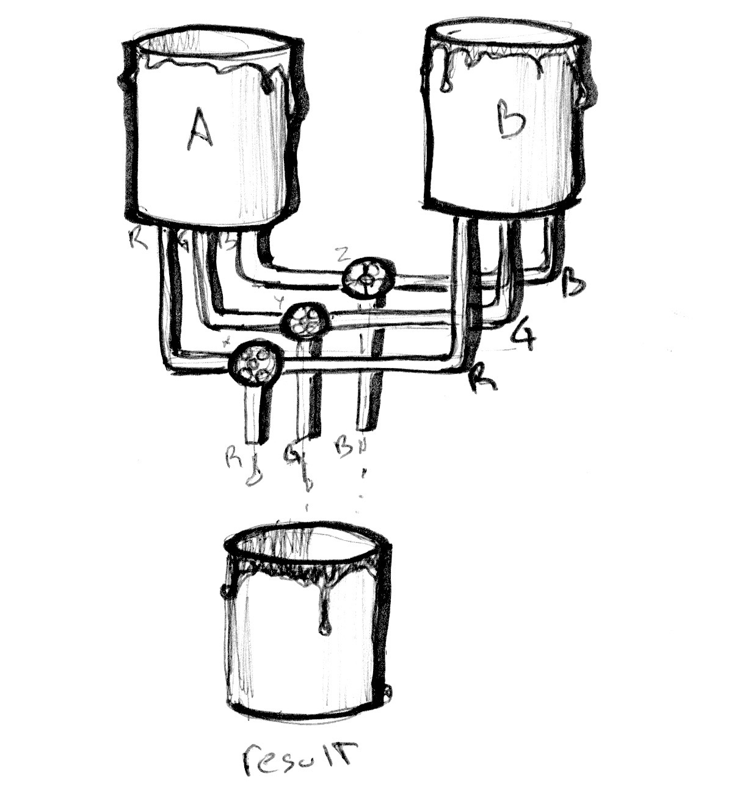

## Kolory


Nie mieliśmy zbytnio okazji porozmawiać o typach wektorowych w GLSL. 
Zanim przejdziemy dalej, ważne jest żebyśmy dowiedzieli się o nich więcej, a temat kolorów może być w tym bardzo pomocny.

<!-- We haven't much of a chance to talk about GLSL vector types. Before going further it's important to learn more about these variables and the subject of colors is a great way to find out more about them. -->

Jeżeli paradgymat programowania obiektowego jest ci bliski, to prawdopodobnie zauważyłeś, że proces wyciągania danych z wektorów wygląda podobnie przy C-podobnych `struct`'ach.

<!-- If you are familiar with object oriented programming paradigms you've probably noticed that we have been accessing the data inside the vectors like any regular C-like `struct`. -->

```glsl
vec3 red = vec3(1.0,0.0,0.0);
red.x = 1.0;
red.y = 0.0;
red.z = 0.0;
```

Definiowanie kolor za pomocą notacji *x*, *y* i *z* jest trochę mylące, prawda? Właśnie dlatego istnieją inne sposoby dostępu do tej samej informacji, ale za pomocą różncyh nazw. Wartości `.x`, `.y` i `.z` mogą być również uzyskane za pomocą `.r`, `.g` i `.b`, jak i `.s`, `.t` i `.p` (`.s`, `.t` i `.p` są zwykle używane przy współrzędnych tekstur, które zobaczymy w następnych rozdziałach). Możesz również uzyskać dane wektora za pomocą indeksów `[0]`, `[1]` i `[2]`.

<!-- Defining color using an *x*, *y* and *z* notation can be confusing and misleading, right? That's why there are other ways to access this same information, but with different names. The values of `.x`, `.y` and `.z` can also be called `.r`, `.g` and `.b`, and `.s`, `.t` and `.p`. (`.s`, `.t` and `.p` are usually used for spatial coordinates of a texture, which we'll see in a later chapter.) You can also access the data in a vector by using the index position, `[0]`, `[1]` and `[2]`. -->

Następujący kod przedstawia wszystkkie sposoby uzysakania tych samych danych:

<!-- The following lines show all the ways to access the same data: -->

```glsl
vec4 vector;
vector[0] = vector.r = vector.x = vector.s;
vector[1] = vector.g = vector.y = vector.t;
vector[2] = vector.b = vector.z = vector.p;
vector[3] = vector.a = vector.w = vector.q;
```

Ta mnogość metod uzyskiwania tych samych danych jest tylko po to, aby ułatwić pisanie zrozumiałego kodu. Ta elastyczność wbudowana w język shadingowy stanowi też okazję, żebyś zaczął myśleć o współrzędnych koloru i przestrzeni jako zamiennych.

<!-- These different ways of pointing to the variables inside a vector are just nomenclatures designed to help you write clear code. This flexibility embedded in shading language is a door for you to start thinking interchangeably about color and space coordinates. -->

Inną świetną własnością typów wektorowych w GLSL jest to, że współrzędne mogą być mieszane w dowolnej kolejności, co ułatwia castowanie i mieszanie wartości. Właśność ta nazywana jest *swizzle*'owaniem.

<!-- Another great feature of vector types in GLSL is that the properties can be combined in any order you want, which makes it easy to cast and mix values. This ability is called *swizzle*. -->

```glsl
vec3 yellow, magenta, green;

// Tworzenie żółtego
yellow.rg = vec2(1.0);  // Przypisanie 1. do kanału czerwonego i zielonego
yellow[2] = 0.0;        // Przypisanie 0. do kanału niebieskiego

// Tworzenie magenty
magenta = yellow.rbg;   // Przypisanie wektora z przestawionym kanałem zielonym i niebieskim

// Tworzenie zielonego
green.rgb = yellow.bgb; // Przypisanie kanału niebieskiego do kanału czerwonego i niebieskiego
```
<!-- 
```glsl
vec3 yellow, magenta, green;

// Making Yellow
yellow.rg = vec2(1.0);  // Assigning 1. to red and green channels
yellow[2] = 0.0;        // Assigning 0. to blue channel

// Making Magenta
magenta = yellow.rbg;   // Assign the channels with green and blue swapped

// Making Green
green.rgb = yellow.bgb; // Assign the blue channel of Yellow (0) to red and blue channels
``` -->

### Mieszanie koloru 

Teraz, gdy już wiesz jak definiuje się kolory, pora na połączenie tego z naszą wcześniejszą wiedzą. W GLSL istnieje bardzo przydatna funkcja [`mix()`](../glossary/?search=mix), która pozwala mieszać dwie wartości wobec określonego stosunku wyrażonego w procentach. Potrafisz zgadnąć jaki jest zakres procentów? Oczywiście, że 0.0 i 1.0! Czas na wykorzystanie naszego shadingowego karate!

<!-- Now that you know how colors are defined, it's time to integrate this with our previous knowledge. In GLSL there is a very useful function, [`mix()`](../glossary/?search=mix), that lets you mix two values in percentages. Can you guess what the percentage range is? Yes, values between 0.0 and 1.0! Which is perfect for you, after those long hours practicing your karate moves with the fence - it is time to use them! -->


Sprawdź linijkę 18 poniższego kodu i zoabcz jak używamy wartości bezwględnej z sinusa od czasu, aby mieszać `colorA` i `colorB`.

<!-- Check the following code at line 18 and see how we are using the absolute values of a sin wave over time to mix `colorA` and `colorB`. -->

<div class="codeAndCanvas" data="mix.frag"></div>

Pokaż na co cie stać:

<!-- Show off your skills by: -->

* Stwórz ekspresywną tranzycje między kolorami. Pomyśl o konkretnej emocji. Jaki kolor najlepiej ją reprezentuje? Jak wygląda? Jak zanika? Pomyśl o innej emocji i pasującym do niej kolorze. Zmień `colorA` i `colorB` w kodzie powyżej, aby pasowały do tych emocji. Następnie zanimuj tę tranzycję za pomocą funkcji kształtujących. Robert Penner stworzył serię popularnych funkcji kształtujących, z zasotoswaniami w animacji komputerowej, zwanych [easing functions](http://easings.net/), skorzystaj z [tego przykładu](../edit.php#06/easing.frag) jako inspiracji, ale najlepsze rezultaty osiągniesz tworząc własne tranzycje.

<!-- * Make an expressive transition between colors. Think of a particular emotion. What color seems most representative of it? How does it appear? How does it fade away? Think of another emotion and the matching color for it. Change the beginning and ending color of the above code to match those emotions. Then animate the transition using shaping functions. Robert Penner developed a series of popular shaping functions for computer animation known as [easing functions](http://easings.net/), you can use [this example](../edit.php#06/easing.frag) as research and inspiration but the best result will come from making your own transitions. -->

### Zabawa z gradientem

Funkcja [`mix()`](../glossary/?search=mix) ma więcej do zaoferowania. Zamiast pojedynczego `float`a, możemy podać zmienną tego samego typu, co dwa pierwsze argumenty; w naszym wypadku jest to `vec3`. W ten sposób zdobywamy kontrolę nad stosunkiem mieszania  każdego indywidualnego kanału koloru, `r`, `g` i `b`.

<!-- The [`mix()`](../glossary/?search=mix) function has more to offer. Instead of a single `float`, we can pass a variable type that matches the two first arguments, in our case a `vec3`. By doing that we gain control over the mixing percentages of each individual color channel, `r`, `g` and `b`. -->



Spójrz na poniższy przykład. Tak jak w przykładach z poprzedniego rozdziału, podłączamy tranzycję do znormalizowanej współrzędnej `x` i wizualizujemy za pomocą linii. Aktualnie, wszystkie kanały leżą na tej samej linii.
<!-- 
Take a look at the following example. Like the examples in the previous chapter, we are hooking the transition to the normalized *x* coordinate and visualizing it with a line. Right now all the channels go along the same line. -->

Odkomentuj linjkę 25 i zobacz, co się stanie. Następnie odkomentuj linijki 26 i 27. Pamiętaj, że linie wizualizują stosunek mieszania każdego z kanałów wektorów `colorA` i `colorB`. 

<!-- Now, uncomment line number 25 and watch what happens. Then try uncommenting lines 26 and 27. Remember that the lines visualize the amount of `colorA` and `colorB` to mix per channel. -->

<div class="codeAndCanvas" data="gradient.frag"></div>

Prawdopodobnie rozpoznajesz trzy funkcje kształtującego, które używamy w linijkach 25 i 27. Baw się nimi! Czas pokazać swoje umiejętności z poprzednich rozdziałów, tworząc interesujące gradienty. Spróbuj następujących ćwiczeń:


* Skomponuj gradient przypominający zachód słońca Williama Turnera.

* Zanimuj tranzycje między wschodem i zachodem za pomocą `u_time`.

* Czy potrafisz stworzyć tęczę korzystając z tego, czego nauczyliśmy się dotychaczas?

* Użyj `step()`, by stworzyć kolorową flagę.

<!-- You probably recognize the three shaping functions we are using on lines 25 to 27. Play with them! It's time for you to explore and show off your skills from the previous chapter and make interesting gradients. Try the following exercises:


* Compose a gradient that resembles a William Turner sunset

* Animate a transition between a sunrise and sunset using `u_time`.

* Can you make a rainbow using what we have learned so far?

* Use the `step()` function to create a colorful flag. -->

### HSB

Nie da się mówić o kolorze bez poruszenia tematu przestrzeni barw. Jak prawdopodobnie wiesz, istnieją też inne sposoby reprezentacji koloru poza RGB (z kanałem czerwonym, zielonym i niebieskim). 

[HSB](http://en.wikipedia.org/wiki/HSL_and_HSV) oznacza Hue (pol. "barwa"), Saturation (pol. "nasycenie") i Brightness (pol. "jasność) i jest o wiele bardziej intuicyjną reprezentacją koloru niż RGB. Czasem zamiast Brightness używa sie Value, stąd zamiast HSB można spotkać się też z HSV. Przyjrzyj się funkcjom `rgb2hsv()` i `hsv2rgb()` w następującym kodzie:

<!-- We can't talk about color without speaking about color space. As you probably know there are different ways to organize color besides by red, green and blue channels. -->

<!-- [HSB](http://en.wikipedia.org/wiki/HSL_and_HSV) stands for Hue, Saturation and Brightness (or Value) and is a more intuitive and useful organization of colors. Take a moment to read the `rgb2hsv()` and `hsv2rgb()` functions in the following code. -->

Mapując pozycję na osi x do barwy i pozycję na osi y do jasności, otrzymujemy spektrum widzialnych kolorów. O wiele bardziej intuicyjnie wybiera się kolor HSB niż RGB.

<!-- By mapping the position on the x axis to the Hue and the position on the y axis to the Brightness, we obtain a nice spectrum of visible colors. This spatial distribution of color can be very handy; it's more intuitive to pick a color with HSB than with RGB. -->

<div class="codeAndCanvas" data="hsb.frag"></div>

### HSB we współrzędnych biegunowych

Oryginalnie, HSB miało być reprezentowane z pomocą współrzędnych biegunowych (opartych na kącie i promieniu), a nie kartezjańskich (opartych na x i y). By zpamować naszą funkcję HSB do współrzędnych biegunowych, musimy otrzymać kąt i dystans wektora od centrum kanwy do współrzędnej piksela. W tym celu użyjemy funkcje [`length()`](../glossary/?search=length) i [`atan(y,x)`](../glossary/?search=atan) (który jest odpowiednikami `atan2(y,x)` w GLSL).

<!-- HSB was originally designed to be represented in polar coordinates (based on the angle and radius) instead of cartesian coordinates (based on x and y). To map our HSB function to polar coordinates we need to obtain the angle and distance from the center of the billboard to the pixel coordinate. For that we will use the [`length()`](../glossary/?search=length) function and [`atan(y,x)`](../glossary/?search=atan) (which is the GLSL version of the commonly used `atan2(y,x)`).   -->

<!-- TODO Używając wektorów i funkcji trygonometrycznych, `vec2`, `vec3` i `vec4` traktowane są jak wektory nawet jeśli reprezentują kolor. Zaczniemy traktować kolory i wektory bardzo podobnie.  -->

<!-- When using vector and trigonometric functions, `vec2`, `vec3` and `vec4` are treated as vectors even when they represent colors. We will start treating colors and vectors similarly, in fact you will come to find this conceptual flexibility very empowering. -->

**Uwaga:** Jest weięcej funkcji geometrycznych poza [`length`](../glossary/?search=length) jak: [`distance()`](../glossary/?search=distance), [`dot()`](../glossary/?search=dot), [`cross`](../glossary/?search=cross), [`normalize()`](../glossary/?search=normalize), [`faceforward()`](../glossary/?search=faceforward), [`reflect()`](../glossary/?search=reflect) i [`refract()`](../glossary/?search=refract). Ponadto, GLSL ma specjalne funkcje do porównywania wektorów: [`lessThan()`](../glossary/?search=lessThan), [`lessThanEqual()`](../glossary/?search=lessThanEqual), [`greaterThan()`](../glossary/?search=greaterThan), [`greaterThanEqual()`](../glossary/?search=greaterThanEqual), [`equal()`](../glossary/?search=equal) i [`notEqual()`](../glossary/?search=notEqual).

<!-- **Note:** If you were wondering, there are more geometric functions besides [`length`](../glossary/?search=length) like: [`distance()`](../glossary/?search=distance), [`dot()`](../glossary/?search=dot), [`cross`](../glossary/?search=cross), [`normalize()`](../glossary/?search=normalize), [`faceforward()`](../glossary/?search=faceforward), [`reflect()`](../glossary/?search=reflect) and [`refract()`](../glossary/?search=refract). Also GLSL has special vector relational functions such as: [`lessThan()`](../glossary/?search=lessThan), [`lessThanEqual()`](../glossary/?search=lessThanEqual), [`greaterThan()`](../glossary/?search=greaterThan), [`greaterThanEqual()`](../glossary/?search=greaterThanEqual), [`equal()`](../glossary/?search=equal) and [`notEqual()`](../glossary/?search=notEqual). -->

Gdy już zdobędziemy kąt i promień, musimy znormalizować ich wartości do zakresu od 0.0 do 1.0. W linijce 27, [`atan(y,x)`](../glossary/?search=atan) zwróci kąt w radianach między -PI a PI (-3.14 a 3.14), więc musimy podzielić tę liczbę przez `TWO_PI` (zdefiniowane na górze kodu), uzyskując wartości między -0.5 i 0.5, które, przez proste dodawanie, mapujemy dalej do zakresu od 0.0 do 1.0. Promień ma długość 0.5 (ponieważ liczymy odległość od środka TODO kanwy), więc musimy podwoić ten zakres (mnożąc przez 2), by uzyskać 1.0.

<!-- Once we obtain the angle and length we need to “normalize” their values to the range between 0.0 to 1.0. On line 27, [`atan(y,x)`](../glossary/?search=atan) will return an angle in radians between -PI and PI (-3.14 to 3.14), so we need to divide this number by `TWO_PI` (defined at the top of the code) to get values between -0.5 to 0.5, which by simple addition we change to the desired range of 0.0 to 1.0. The radius will return a maximum of 0.5 (because we are calculating the distance from the center of the viewport) so we need to double this range (by multiplying by two) to get a maximum of 1.0. -->

Jak widzisz, sedno leży w transformowaniu i mapowaniu zakresów do 0.0 i 1.0.

<!-- As you can see, our game here is all about transforming and mapping ranges to the 0.0 to 1.0 that we like. -->

<div class="codeAndCanvas" data="hsb-colorwheel.frag"></div>

Spróuj poniższych ćwiczeń:

<!-- Try the following exercises: -->

* Zmodyfikuj przykład ze współrzędnymi biegunowymi, aby uzyskać kręcące się (jak w ikonce czekania myszki) koło barw.

* Użyj funkcji kształtującej razem z funkcją konwersji z HSB do RGB, aby rozszerzyć jedną barwę i zwężyć inną.


<!-- * Modify the polar example to get a spinning color wheel, just like the waiting mouse icon.

* Use a shaping function together with the conversion function from HSB to RGB to expand a particular hue value and shrink the rest. -->


* Jeśli przyjrzysz się uważnie kołom barw używanym w narzędziach do wybierania koloru (ang "color picker") (spójrz na obrazek poniżej), zobaczysz, że używają innego sepktrum koloru, zgodnego z przestrzenią barw RYB. Przykładowo, kolorem przeciwnym do czerwonego powienien być zielony, ale w naszym przykładzie jest cyjan. Czy potrafiłbyś zrekonstruować poniższy obrazek? [Wskazówka: to dobry moment, by użyć funkcji kształtujących]

<!-- * If you look closely at the color wheel used on color pickers (see the image below), they use a different spectrum according to RYB color space. For example, the opposite color of red should be green, but in our example it is cyan. Can you find a way to fix that in order to look exactly like the following image? [Hint: this is a great moment to use shaping functions.] -->


* Przeczytaj [książkę Josefa Albersa _Interaction of Color_](http://www.goodreads.com/book/show/111113.Interaction_of_Color) i przestudiuj poniższe przykłady shaderów.

<!-- * Read [Josef Albers' book Interaction of Color](http://www.goodreads.com/book/show/111113.Interaction_of_Color) and use the following shaders examples as practice. -->

<div class="glslGallery" data="160505191155,160505193939,160505200330,160509131554,160509131509,160509131420,160509131240" data-properties="clickRun:editor,openFrameIcon:false,showAuthor:false"></div>

#### Uwaga o funkcjach i ich argumentach

Zanim przeskoczysz do następnego rozdziału, zatrzymajmy się na chwilę. Wróć do funkcji `hsb2rgb` z poprzedniego interaktywnego przykładu. Zauważysz `in` przed typem argumentu. Jest to [*kwalifikator*](http://www.shaderific.com/glsl-qualifiers/#inputqualifier) (ang. "qualifier") i akurat ten oznacza, że zmienna jest tylko do odczytu. W przyszłości zobaczymy, że jest również możliwe, by poprzedzić argumenty kwalifikatorami `out` i `inout`. `out` określa, że argument jest tylko do zapisu, natomiast `inout` działa podobnie jak przekazywanie argumentu przez referencje, co umożliwia modyfikowanie go. 

<!-- Before jumping to the next chapter let’s stop and rewind. Go back and take look at the functions in previous examples. You will notice `in` before the type of the arguments. This is a [*qualifier*](http://www.shaderific.com/glsl-qualifiers/#inputqualifier) and in this case it specifies that the variable is read only. In future examples we will see that it is also possible to define arguments as `out` or `inout`. This last one, `inout`, is conceptually similar to passing an argument by reference which will give us the possibility to modify a passed variable. -->

```glsl
int newFunction(in vec4 aVec4,      // read-only
                out vec3 aVec3,     // write-only
                inout int aInt);    // read-write
```

Może w to nie uwierzysz, ale mamy wszystkie składniki potrzbne do tworzenia fajnych rysunków. W następnym rozdziale nauczymy się jak połączyć wszystkie poznane tricki, by stworzyć geometryczne formy przez *blendowanie* przestrzeni. Dobrze słyszysz... *blendowanie* przestrzeni.

<!-- You may not believe it but now we have all the elements to make cool drawings. In the next chapter we will learn how to combine all our tricks to make geometric forms by *blending* the space. Yep... *blending* the space. -->
