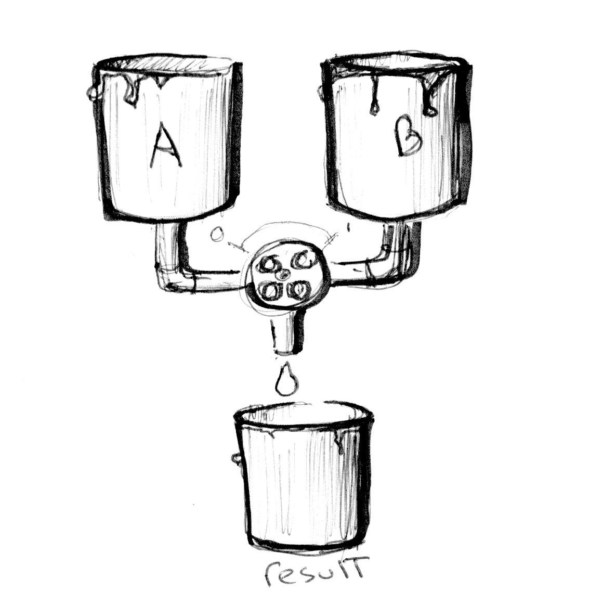

## Cores

Ainda não tivemos a chance de conversar sobre os tipos de vetores em GLSL. Mas antes de seguirmos adiante, é importante aprender mais sobre estas variáveis e o tópico de cores é uma ótima forma de os entendermos melhor.

Se você está familiarizado com os paradigmas de programação orientada a objetos, você provavelmente tenha percebido que estamos acessando dados dentro de vetores como qualquer `struct` em C.

```glsl
vec3 red = vec3(1.0,0.0,0.0);
red.x = 1.0;
red.y = 0.0;
red.z = 0.0;
```

Definir cores usando a notação *x*, *y* e *z* pode ser confuso, certo? Por esta razão, existem outras formas de acessar esta mesma informação mas com nomes diferentes. Os valores de `.x`, `.y` e `.z` podem também ser chamados de `.r`, `.g` e `.b`, e também, .`s`, `.t` e `.p`. (.`s`, `.t` e `.p`. normalmente são usados para coordenadas espaciais de uma textura, na qual veremos mais tarde em outro capítulo). Você pode também acessar os dados de um vetor usando o índice de posição: `[0]`, `[1]` e `[2]`.

As próximas linhas mostram todas as formas de acessar os mesmos dados:

```glsl
vec4 vector;
vector[0] = vector.r = vector.x = vector.s;
vector[1] = vector.g = vector.y = vector.t;
vector[2] = vector.b = vector.z = vector.p;
vector[3] = vector.a = vector.w = vector.q;
```

Essas formas diferentes de apontar para variáveis dentro de vetores são apenas nomenclaturas criadas para ajudar você a criar um código mais limpo. Esta flexibilidade embutida em linguagem de shader é a porta para começar a pensar alternadamente em cores e coordenadas espaciais.

Outra ótima característica dos tipos vetoriais em GLSL é que as propriedades podem ser combinadas em qualquer ordem, o que facilita a manipulação dos valores. Esta habilidade é chamada de *swizzle*.

```glsl
vec3 yellow, magenta, green;

// Making Yellow
yellow.rg = vec2(1.0);  // Assigning 1. to red and green channels
yellow[2] = 0.0;        // Assigning 0. to blue channel

// Making Magenta
magenta = yellow.rbg;   // Assign the channels with green and blue swapped

// Making Green
green.rgb = yellow.bgb; // Assign the blue channel of Yellow (0) to red and blue channels
```

#### Para sua caixa de ferramentas

Você pode não estar acostumado a escolher cores com números - isso pode ser bem não intuitivo. Felizmente, existem inúmeros excelentes programas que facilitarão seu trabalho. Encontre um que atende as suas necessidades e então pratique para conseguir entregar cores em `vec3` ou `vec4`. Por exemplo, aqui está os templates que uso no [Spectrum](http://www.eigenlogik.com/spectrum/mac):

```
vec3({{rn}},{{gn}},{{bn}})
vec4({{rn}},{{gn}},{{bn}},1.0)
```

### Misturando cores

Agora que você sabe como cores são definidas, chegou a hora de integrar isso com nosso conhecimento prévio. Em GLSL, existe uma função muito útil chamada [`mix()`](../glossary/?search=mix), que permite que você misture dois valores em porcentagens. Você consegue adivinhar em qual intervalo esta porcentagem é? Sim, estes valores vão de 0.0 a 1.0! O que é perfeito para você, depois destas longas horas praticando seus movimentos de karatê na cerca - É hora de usá-los!



Dê uma olhada na linha 18 do código a seguir e veja se nós conseguimos usar valores absolutos de uma onda seno pelo tempo para misturar `colorA` e `colorB`.

<div class="codeAndCanvas" data="mix.frag"></div>

Mostre suas habilidades ao:

* Fazer uma transição expressiva entre as cores. Pense em uma emoção em particular, qual cor parece representá-la melhor? Como ela aparece? Como ela se esvai? Pense em outra emoção e determine uma cor para ela. Mude as cores do início de do final no código acima para corresponder aquelas emoções. Então, anime a transição usando funções. Robert Penner desenvolveu uma série sobre funções populares para animação computacional conhecido como [funções de suavização](http://easings.net/). você pode usar [este exemplo](../edit.php#06/easing.frag) como pesquisa e inspiração mas os melhores resultados virão das suas próprias funções.

### Experimentando com degradês

A função [`mix()`](../glossary/?search=mix) tem mais a oferecer. Ao invés de passar um único `float`, nós podemos passar uma variável do tipo que correspondente aos dois primeiros argumentos, neste caso, uma `vec3`. Fazendo isso, nós ganhamos controle sobre a porcentagem de mesclagem para cada canal de cor individualmente, `r`, `g` e `b`.


Dê uma olhada no exemplo a seguir. Como os exemplos no capítulo anterior, nós estamos encaixando a transição na coordenada *x* normalizada e a visualizando com uma linha. Agora todos os canais seguem esta mesma linha.

Agora, descomente a linha de número 25 e veja o que acontece. Então tente descomentar as linhas 26 e 27. Lembre-se que as linhas representam a intensidade de `colorA` e `colorB` a serem misturar por canal.

<div class="codeAndCanvas" data="gradient.frag"></div>

Você provavelmente reconheceu os três modelos de funções que estamos usando nas linhas 25 a 27. Explore com eles! Agora é hora para experimentar e exibir suas habilidades do capítulo anterior e criar gradientes interessantes. Tente os seguintes exercícios:


* Componha um gradiente que se assemelha com entardecer de William Turner

* Anime uma transição entre o nascer do sol e o pôr do sol usando `u_time`.

* Você consegue criar um arco-íris usando o que foi aprendido até agora?

* Use a função `step()` para criar uma bandeira colorida.

### HSB

Nós não podemos falar sobre cores sem mencionar o espaço de cores. Como você provavelmente sabe, existem diferentes formas de organizar cores além de canais de vermelho, verde e azul.

[HSB](http://en.wikipedia.org/wiki/HSL_and_HSV) vem de Hue(Matiz), Saturation(Saturação) e Brightness (Brilho ou Valor) e é uma forma muito mais intuitiva e útil de organizar cores. Pare um momento para ler as funções  `rgb2hsv()` e `hsv2rgb()` no código a seguir.

Mapeando a posição no eixo x para a matiz e a posição no eixo y para brilho, nós obtemos um lindo espectro de cores visíveis. Esta distribuição espacial de cores pode ser muito útil; é muito mais intuitivo para escolher uma cor com HSB do que com RGB

<div class="codeAndCanvas" data="hsb.frag"></div>

### HSB em coordenadas populares

HSB foi originalmente criada para ser representada em coordenadas polares (baseada em ângulo e raio) ao invés de coordenadas cartesianas (baseadas em x e y). Para mapear nossa função de HSB em coordenadas polares, precisamos obter o ângulo e a distância do centro da tela para a coordenada do píxel. Para isso, usaremos a função [`length()`](../glossary/?search=length) e [`atan(y,x)`](../glossary/?search=atan) (que é uma versão GLSL da comumente usada `atan2(y,x)`).  

Ao utilizar vetores e funções trigonométricas, `vec2`, `vec3` e `vec4` são tratados como vetores mesmo quando elas representam cores. Nós começaremos a tratar cores e vetores de forma similar e você verá que esta flexibilidade conceitual é muito poderosa.

**Nota:** Se você estiver se perguntando, existem mais funções geométricas além de [`length`](../glossary/?search=length), como [`distance()`](../glossary/?search=distance), [`dot()`](../glossary/?search=dot), [`cross`](../glossary/?search=cross), [`normalize()`](../glossary/?search=normalize), [`faceforward()`](../glossary/?search=faceforward), [`reflect()`](../glossary/?search=reflect) e [`refract()`](../glossary/?search=refract). Também em GLSL tem funções relacionais especiais para vetorais como: [`lessThan()`](../glossary/?search=lessThan), [`lessThanEqual()`](../glossary/?search=lessThanEqual), [`greaterThan()`](../glossary/?search=greaterThan), [`greaterThanEqual()`](../glossary/?search=greaterThanEqual), [`equal()`](../glossary/?search=equal) e [`notEqual()`](../glossary/?search=notEqual).

Uma vez que obtemos o ângulo e a tamanho, precisamos "normalizar" seus valores para o intervalo entre 0.0 e 1.0. Na linha 27, [`atan(y,x)`](../glossary/?search=atan) retornará um ângulo em radianos entre -PI e PI (-3.14 a 3.14), então precisamos dividir este número por `TWO_PI` (definido no topo do código) para obtermos valores entre -0.5 até 0.5, que, com uma simples adição, nós mudamos para o intervalo desejado de 0.0 a 1.0. O raio retornará um máximo de 0.5 (porque nós estamos calculando a distância a partir do centro da tela), então nós precisamos dobrar este intervalo (multiplicando por dois) para obter um máximo de 1.0.

Como você pode observar, nosso jogo aqui é sobre transformar e mapear intervalos para 0.0 a 1.0 que gostamos.

<div class="codeAndCanvas" data="hsb-colorwheel.frag"></div>

Tente os seguintes exercícios:

* Modifique o exemplo de coordenadas polares para obter uma roda de cores que gira, assim como o ícone de espera do mouse.

* Use a modelagem de função junto com a função de conversão de HSB para RGB para expandir um valor da matiz em particular e comprimir o resto.


* Se você olhar de perto na roda de cores usada em seletores de cor (veja a imagem abaixo), elas usam um diferente espectro de acordo com o espaço de cores em RYB. Por exemplo, a cor oposta ao vermelho deve ser verde, mas no nosso exemplo é ciano. Você consegue encontrar um jeito de consertar isso para parecer exatamente com a imagem a baixo? [Dica: este é um grande momento para usar modelagem de funções.]


* Leia [Josef Albers' book Interaction of Color](http://www.goodreads.com/book/show/111113.Interaction_of_Color) (EM INGLÊS) e use os seguintes exemplos de shader como prática.

<div class="glslGallery" data="160505191155,160505193939,160505200330,160509131554,160509131509,160509131420,160509131240" data-properties="clickRun:editor,openFrameIcon:false,showAuthor:false"></div>

#### Nota sobre funções e argumentos

Antes de irmos para o próximo capítulo, vamos parar e rebobinar. Volte e dê uma olhada nas funções nos exemplos anteriores. Você vai perceber um `in` antes dos tipos de argumentos. Isso é um [*qualificador*](http://www.shaderific.com/glsl-qualifiers/#inputqualifier) e neste caso, especifica que a variável é somente leitura. Em exemplos futuros, veremos que também é possível definir argumentos como `out` ou `inout`. Este último, `inout`, é conceitualmente similar a passar um argumento pela referência na qual nos dará a possibilidade de modificar uma variável passada.

```glsl
int newFunction(in vec4 aVec4,      // read-only
                out vec3 aVec3,     // write-only
                inout int aInt);    // read-write
```

Você pode não acreditar, mas agora nós temos todos os elementos para fazer desenhos legais. No próximo capítulo, aprenderemos como combinar todos os truques para criar formas geométricas *mesclando* o espaço. Isso mesmo... *mesclando* espaço. 
