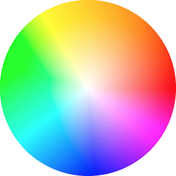

## Цвета

Ранее мы не очень подробно раскрывали тему работы с векторами в GLSL. Прежде чем двинуться дальше, не помешает изучить векторы  поглубже, и работа с цветом как нельзя лучше подходит для этого.

Если вы знакомы с объектно-ориентированной парадигмой программирования, вы скорее всего заметили, что мы обращаемся к данным в векторах на манер структур (`struct`) в языке С.

```glsl
vec3 red = vec3(1.0,0.0,0.0);
red.x = 1.0;
red.y = 0.0;
red.z = 0.0;
```

Работа с цветом через *x*, *y* и *z* может сбить с толку и ввести в заблуждение, не так ли? Поэтому в GLSL можно получить доступ к тем же самым данным через другие имена. Значения `.x`, `.y` и `.z` так же именуются `.r`, `.g` и `.b`, и `.s`, `.t` и `.p`. Последний набор имён обычно используется для пространственных координат текстур, с которыми мы познакомимся в следующих главах. Кроме того, для доступа к элементам вектора можно использовать численные индексы `[0]`, `[1]` и `[2]`.

Следующие строки демонстрируют все способы доступа к одним и тем же данным:

```glsl
vec4 vector;
vector[0] = vector.r = vector.x = vector.s;
vector[1] = vector.g = vector.y = vector.t;
vector[2] = vector.b = vector.z = vector.p;
vector[3] = vector.a = vector.w = vector.q;
```

Все эти способы - всего лишь дополнительные имена для доступа к одним и тем же данным, которые призваны помочь вам в создании более понятного кода. Эта гибкость языка шейдеров станет путеводной нитью, помогающей вам мыслить о значениях цвета и координатах пространства как о взаимозаменяемых сущностях.

Другое замечательное свойство векторных типов GLSL - это возможность доступа к координатам в произвольном порядке, которая упрощает преобразование и смешивание значений.

```glsl
vec3 yellow, magenta, green;

// Задаём жёлтый цвет
yellow.rg = vec2(1.0);  // Записываем 1.0 в красный и зелёный каналы
yellow[2] = 0.0;        // Записываем 0.0 в синий

// Задаём малиновый цвет
magenta = yellow.rbg;   // Меняем местами зелёный и синий

// Задаём зелёный цвет
green.rgb = yellow.bgb; // Записываем значение синего канала жёлтого цвета (0) в красный и синий
```

#### Инструментарий

Возможно, вам ранее не приходилось подбирать цвет с помощью чисел. Это выглядит очень контринтуитивно. К счастью, есть множество умных программ, которые упрощают это занятие. Найдите наиболее подходящую для себя и научите её представлять цвета в форматах `vec3` или `vec4`. Например, вот такие шаблоны я использую в [Spectrum](http://www.eigenlogik.com/spectrum/mac):

```
vec3({{rn}},{{gn}},{{bn}})
vec4({{rn}},{{gn}},{{bn}},1.0)
```

### Смешивание цветов

Теперь, когда вы знаете как задаются цвета, мы можем собрать все новые знания воедино. В GLSL есть очень полезная функция [`mix()`](../glossary/?search=mix), которая смешивает значения в указанной пропорции. Угадайте, как задаются пропорции? Конечно же, числом от 0.0 до 1.0! И это просто отлично, учитывая те долгие часы, что вы практиковали движения карате с забором. Самое время применить их на практике!


В строке 18 в следующем куске кода мы используем абсолютное значение синуса от времени для смешивания цветов `A` и `B`.

<div class="codeAndCanvas" data="mix.frag"></div>

Покажите, что вы можете:

* Создайте экспрессивный переход между цветами. Вообразите какую-нибудь эмоцию. Какой цвет больше всего ассоциируется с ней? Как она появляется? Как она сходит на нет? Придумайте другую эмоцию и подходящий для неё цвет. Поменяйте начальный и конечный цвета в коде выше в соответствии с этими эмоциями. Анимируйте переход с помощью функций формы. Роберт Пеннер разработал набор популярных функций для компьютерной анимации, известный под названием [упрощающих функций](http://easings.net/). Вы можете использовать [этот пример](../edit.php#06/easing.frag) для исследования и поиска вдохновения, но вы сможете достигнуть наилучшего результата только создав собственные функции перехода.

### Играемся с градиентами

Функция [`mix()`](../glossary/?search=mix) способна на большее. Вместо одного числа с плавающей точкой мы можем передать переменную того же типа, что и первые два аргумента (`vec3` в нашем случае). Таким образом мы можем управлять пропорциями каждого канала `r`, `g` и `b` по отдельности.


Рассмотрим следующий пример. Как и в примерах предыдущей главы, мы преобразуем значение перехода к нормализованной координате *x* и визуализируем его с помощью линии. Сейчас все каналы изменяются по одному и тому же закону.

Теперь раскомментируйте строку 25 и посмотрите что произойдёт. Затем попробуйте раскомментировать строки 26 и 27. Помните, что линии показывают пропорции каждого канала при смешивании цветов `A` и `B`.

<div class="codeAndCanvas" data="gradient.frag"></div>

Вы скорее всего узнали три функции, которые мы используем в строках 25-27. Поиграйте с ними! Исследуйте и демонстрируйте ваши находки, используя умения из предыдущей главы для создания интересных градиентов. Попробуйте выполнить следующие упражнения:


* Создайте градиент, повторяющий закат Вильяма Тёрнера.

* Сделайте анимацию перехода от рассвета к закату с помощью `u_time`.

* Можете ли вы сделать радугу, используя изученный материал?

* Используйте функцию `step()` для создания цветного флага.

### HSB

Нельзя рассказать о цветах, не упомянув цветовое пространство. Как вы возможно знаете, есть множество способов задания цвета кроме красного, зелёного и синего каналов.

[HSB](https://ru.wikipedia.org/wiki/HSV_(%D1%86%D0%B2%D0%B5%D1%82%D0%BE%D0%B2%D0%B0%D1%8F_%D0%BC%D0%BE%D0%B4%D0%B5%D0%BB%D1%8C)) расшифровывается как оттенок (Hue), насыщенность (Saturation) и яркость (Brightness или Value), и является более интуитивным способом представления цвета. Прочитайте код функций `rgb2hsv()` и `hsv2rgb()` в примере ниже.

Отображая координату `x` в оттенок, а координату `y` - в яркость, мы получаем красивый спектр видимых цветов. Такое пространственное распределение цветов очень удобно. Выбор цветов в пространстве HSB более интуитивен, чем RGB.

<div class="codeAndCanvas" data="hsb.frag"></div>

### HSB в полярных координатах

Пространство HSB изначально было разработано для представления в полярных координатах (на основе угла и радиуса), вместо декартовых (x и y). Чтобы перевести нашу функцию HSB в полярные координаты, нужно вычислить угол и расстояние, используя центр области рисования и декартовы координаты пикселя. Для этого мы используем функцию вычисления расстояния [`length()`](../glossary/?search=length) и двухаргументный арктангенс ([`atan(y,x)`](../glossary/?search=atan), GLSL-версия известной функции `atan2(y,x)`).

Тригонометрические функции от векторного аргумента вычисляются покомпонетно, даже если вы используете векторы для представления цветов. Мы начинаем использовать цвета и векторы одинаковым способом. Такая концептуальная гибкость является очень мощным инструментом.

**На заметку:** Возможно, вы спросите, какие ещё есть геометрически функции кроме длины ([`length`](../glossary/?search=length))? Их довольно много: [`dot()`](../glossary/?search=dot) (скалярное произведение), [`cross`](../glossary/?search=cross) (векторное произведение), [`normalize()`](../glossary/?search=normalize) (привести вектор к единичной длине), [`faceforward()`](../glossary/?search=faceforward) (вернуть вектор, указывающий в то же полупространство, что и данный), [`reflect()`](../glossary/?search=reflect) (отражение) и [`refract()`](../glossary/?search=refract) (преломление). Так же в GLSL есть векторные функции сравнения: [`lessThan()`](../glossary/?search=lessThan) (меньше), [`lessThanEqual()`](../glossary/?search=lessThanEqual) (меньше либо равно), [`greaterThan()`](../glossary/?search=greaterThan) (больше), [`greaterThanEqual()`](../glossary/?search=greaterThanEqual) (больше либо равно), [`equal()`](../glossary/?search=equal) (равно) и [`notEqual()`](../glossary/?search=notEqual) (не равно).

Получив угол и длину, мы должны нормировать их значения в интервал от 0.0 до 1.0. В строке 27 [`atan(y,x)`](../glossary/?search=atan) возвращает угол в радианах от минус пи до пи, поэтому сначала мы разделим его на удвоенное пи (`TWO_PI`, определено вначале кода), и к полученному числу от -0.5 до 0.5 прибавим 0.5, чтобы перейти в нужный интервал от 0.0 до 1.0. Максимальный радиус будет равен 0.5 (мы вычисляли расстояние от центра окна), поэтому его нужно удвоить.

Как видите, в этом разделе мы в основном играли с преобразованием значений в нужный нам промежуток от 0.0 до 1.0.

<div class="codeAndCanvas" data="hsb-colorwheel.frag"></div>

Попробуйте выполнить следующие упражнения:

* Модифицируйте пример с полярными координатами так, чтобы цветовой круг вращался, как указатель мыши в режиме ожидания.

* Используйте функции формы совместно с функцией преобразования HSB->RGB для расширения области круга с каким-нибудь одним оттенком и урезания других оттенков.


* Присмотревшись к цветовому кругу в программах для подбора цвета (изображён ниже), можно заметить, что он пострен на основе красного, жёлтого и синего цветов. Например, напротив красного должен быть зелёный, но в нашем примере выше там находится голубой. Исправьте пример, так чтобы он выглядел в точности как изображение ниже (подсказка: используйте функции формы).



* Прочитайте книгу [«Взаимодействие цветов» Джозефа Альберса](http://www.goodreads.com/book/show/111113.Interaction_of_Color) и воспользуйтесь следующим примером для практики.

<div class="glslGallery" data="160505191155,160505193939,160505200330,160509131554,160509131509,160509131420,160509131240" data-properties="clickRun:editor,openFrameIcon:false,showAuthor:false"></div>

#### Заметки о функциях и аргументах

Перед тем как нырнуть в следующую главу, давайте остановимся и немного отмотаем назад. Вернитесь и взгляните на функции в предыдущих примерах. Вы заметите слово `in` перед типами аргументов. Это - [*квалификатор*](http://www.shaderific.com/glsl-qualifiers/#inputqualifier), и в данном случае он означает, что переменная предназначена только для чтения. В последующих примерах мы увидим так же аргументы с квалификаторами `out` и `inout`. Последний эквивалентен передаче переменной по ссылке, при которой мы можем изменить переданное значение так, что изменения становятся видны за пределами функции.

```glsl
int newFunction(in vec4 aVec4,      // только для чтения
                out vec3 aVec3,     // только на запись
                inout int aInt);    // чтение и запись
```

Вы не поверите, но мы уже изучили всё необходимое для создания крутой графики. В следующей главе мы научимся комбинировать все эти трюки для создания геометрических фигур с помощью смешивания пространства. Именно, *смешивание* пространства!
