## 形状


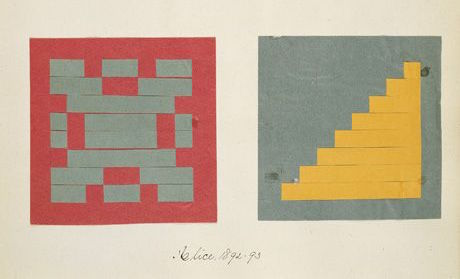

终于！我们一直学习的技能就等着这一刻！你已经学习过GLSL的大部分基础，类型和函数。你一遍又一遍的练习你的造型方程。是时候把他们整合起来了。你就是为了这个挑战而来的！在这一章里，你会学习到如何以一种并行处理方式来画简单的图形。

### 长方形

想象我们有张数学课上使用的方格纸，而我们的作业是画一个正方形。纸的大小是10 x 10而正方形应该是8 x 8。你会怎么做？

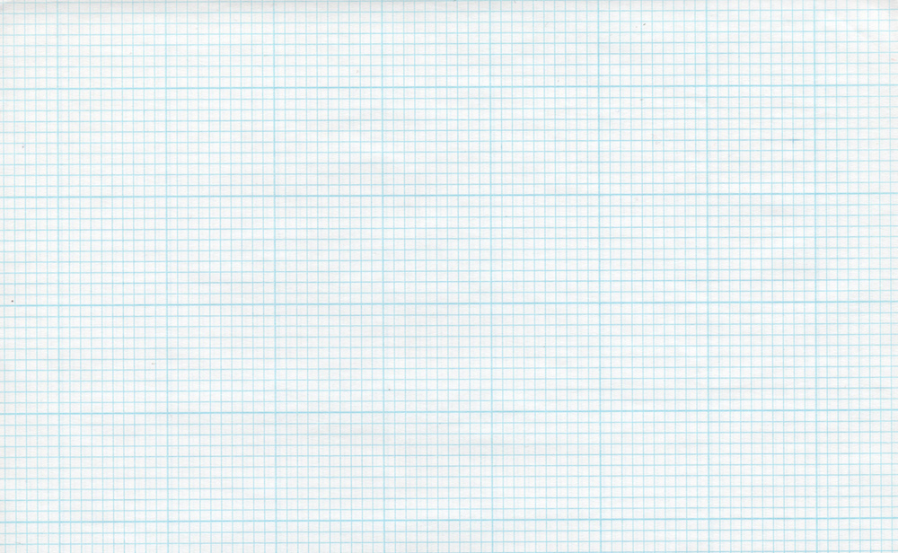

你是不是会涂满除了第一行第一列和最后一行和最后一列的所有格点？

这和着色器有什么关系？方格纸上的每个小方形格点就是一个线程（一个像素）。每个格点有它的位置，就想棋盘上的坐标一样。在之前的章节我们将x和y映射到rgb通道，并且我们学习了如何将二维边界限制在0和1之间。我们如何用这些来画一个中心点位于屏幕中心的正方形？

我们从空间角度来判别的 if 语句伪代码开始。这个原理和我们思考方格纸的策略异曲同工。

```glsl
    if ( (X GREATER THAN 1) AND (Y GREATER THAN 1) )
        paint white
    else
        paint black
```

现在我们有个更好的主意让这个想法实现，来试试把if语句换成step（），并用0到1代替10 x 10的范围。

```glsl
uniform vec2 u_resolution;

void main(){
    vec2 st = gl_FragCoord.xy/u_resolution.xy;
    vec3 color = vec3(0.0);

    // Each result will return 1.0 (white) or 0.0 (black).
    float left = step(0.1,st.x);   // Similar to ( X greater than 0.1 )
    float bottom = step(0.1,st.y); // Similar to ( Y greater than 0.1 )

    // The multiplication of left*bottom will be similar to the logical AND.
    color = vec3( left * bottom );

    gl_FragColor = vec4(color,1.0);
}
```

step（）函数会让每一个小于0.1的像素变成黑色（vec3（0.0））并将其余的变成白色（vec3（1.0））。```left``` 乘 ```bottom``` 效果相当于逻辑 AND —— 当 x y 都为 1.0 时乘积才能是 1.0。这样做的效果就是画了两条黑线，一个在画布的底边另一个在左边。

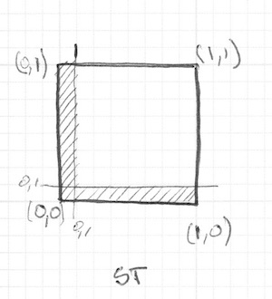

在前一例代码中我们重复每个像素的结构（左边和底边）。我们可以把原来的一个值换成两个值直接给step（）来精减代码。就像这样：

```glsl
    vec2 borders = step(vec2(0.1),st);
    float pct = borders.x * borders.y;
```

目前为止，我们只画了长方形的两条边（左边和底面）。看下下面的例子：

<div class="codeAndCanvas" data="rect-making.frag"></div>

取消 21~22 行的注释来看看如何转置坐标的同时重复使用 ```step()``` 函数。这样二维向量 vec2(0.0,0.0) 会被变换到右上角。这就是转置页面和重复过程的数字等价。

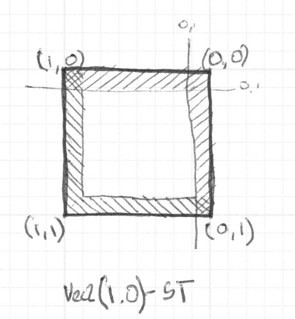

注意在 18 行和 22 行，所有的边（宽）都被放大了。等价于这样写：

```glsl
    vec2 bl = step(vec2(0.1),st);       // bottom-left
    vec2 tr = step(vec2(0.1),1.0-st);   // top-right
    color = vec3(bl.x * bl.y * tr.x * tr.y);
```

是不是很有趣？这种都是关于运用 step() 函数、逻辑运算和转置坐标的结合。

再进行下一个环节之前，挑战下下面的练习：

* 改变长方形的比例和大小。

* 用 smoothstep() 函数代替 step() 函数，试试在相同的代码下会有什么不同。注意通过改变取值，你可以不仅可以得到模糊边界也可以由漂亮的顺滑边界。

* 应用 floor() 做个另外的案例。

* 挑个你最喜欢的做成函数，这样未来你可以调用它。并且让它灵活高效。

* 写一个只画长方形四边的函数。

* 想一下如何在一个画板上移动并放置不同的长方形？如果你做出来了，试着像[Piet Mondrian](http://en.wikipedia.org/wiki/Piet_Mondrian)一样创作以长方形和色彩的图画。

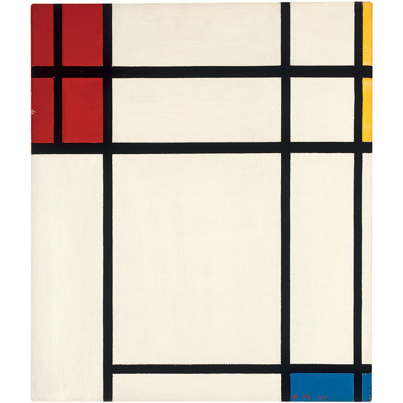

### 圆

在笛卡尔坐标系下，用方格纸来画正方形和长方形是很容易的。但是画圆就需要另一种方式了，尤其我们需要一个对“每个像素”的算法。一种解决办法是用[```step()```](../glossary/?search=step)函数将重新映射的空间坐标来画圆。

如何实现？让我们重新回顾一下数学课上的方格纸：我们把圆规展开到半径的长度，把一个针脚戳在圆圆心上，旋转着把圆的边界留下来。

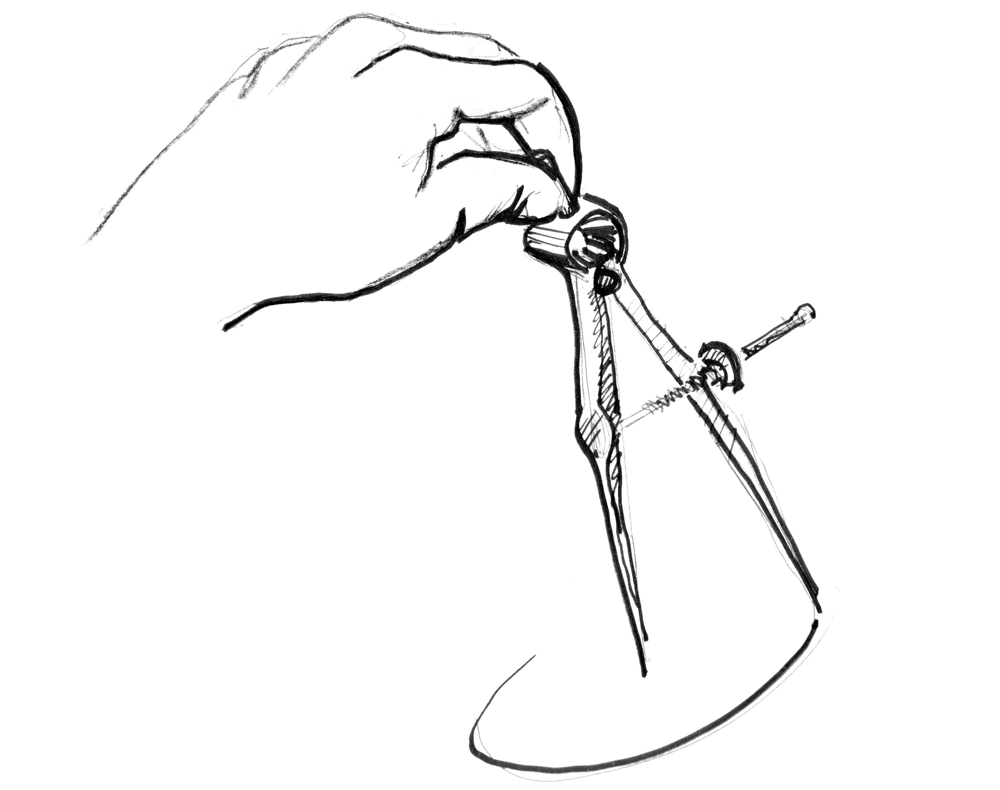

将这个过程翻译给 shader 意味着纸上的每个方形格点都会隐含着问每个像素（线程）是否在圆的区域以内。我们通过计算像素到中心的距离来实现（这个判断）。

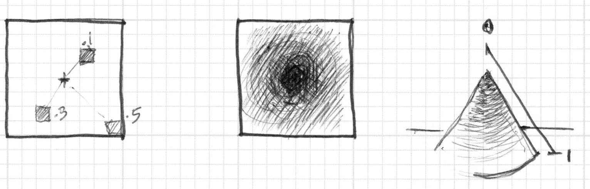

There are several ways to calculate that distance. The easiest one uses the [```distance()```](../glossary/?search=distance) function, which internally computes the [```length()```](../glossary/?search=length) of the difference between two points (in our case the pixel coordinate and the center of the canvas). The ```length()``` function is nothing but a shortcut of the [hypotenuse equation](http://en.wikipedia.org/wiki/Hypotenuse) that uses square root ([```sqrt()```](../glossary/?search=sqrt)) internally.

有几种方法来计算距离。最简单的是用[```distance()```](../glossary/?search=distance)函数，这个函数其实内部调用 [```length()```](../glossary/?search=length)函数，计算不同两点的距离（在此例中是像素坐标和画布中心的距离）。length（）函数内部只不过是用平方根([```sqrt()```](../glossary/?search=sqrt))计算斜边的方程。

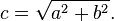

你可以使用[```distance()```](../glossary/?search=distance), [```length()```](../glossary/?search=length) 或 [```sqrt()```](../glossary/?search=sqrt)到计算屏幕的中心的距离。下面的代码包含着三个函数，毫无悬念的他们返回相同的结果。

* 注释和取消某行的注释来试试看用不同方式得到相同的结果。

<div class="codeAndCanvas" data="circle-making.frag"></div>

上回我们把到中心的距离映射为颜色亮度。离中心越近的越暗。注意到映射值不宜过高，因为从中心（vec2(0.5, 0.5)）到最远距离才刚刚超过0.5一点。仔细考察这个映射：

* 你能从中推断出什么？

* 我们怎么用这个方法来画圆？

* 试试有没有其他方法来实现这样画布内圆形渐变的效果。

### 距离场

我们可也可以从另外的角度思考上面的例子：把它当做海拔地图（等高线图）——越黑的地方意味着海拔越高。想象下，你就在圆锥的顶端，那么这里的渐变就和圆锥的等高线图有些相似。到圆锥的水平距离是一个常数0.5。这个距离值在每个方向上都是相等的。通过选择从那里截取这个圆锥，你就会得到或大或小的圆纹面。

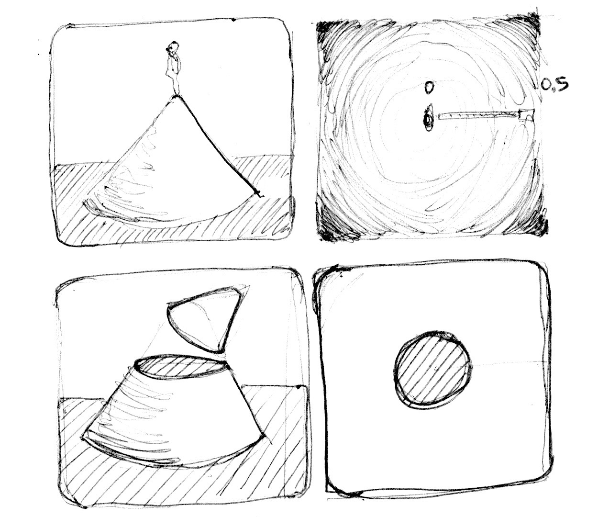


其实我们是通过“空间距离”来重新解释什么是图形。这种技巧被称之为“距离场”，从字体轮廓到3D图形被广泛应用。

来小试下牛刀：

* 用[```step()```](../glossary/?search=step)函数把所有大于0.5的像素点变成白色，并把小于的变成黑色（0.0）。

* 反转前景色和背景色。

* 使用[```smoothstep()```](../glossary/?search=smoothstep)函数，通过修改不同的值来试着做出一个边界顺滑的圆。

* 一旦遇到令你满意的应用，把他写成一个函数，这样将来就可以调用了。

* 给这个圆来些缤纷的颜色吧！

* 再加点动画？一闪一闪亮晶晶？或者是砰砰跳动的心脏？（或许你可以从上一章汲取一些灵感）

* 让它动起来？能不能移动它并且在同一个屏幕上放置多个圆？

* 如果你结合函数来混合不同的距离场，会发生什么呢？

```glsl
pct = distance(st,vec2(0.4)) + distance(st,vec2(0.6));
pct = distance(st,vec2(0.4)) * distance(st,vec2(0.6));
pct = min(distance(st,vec2(0.4)),distance(st,vec2(0.6)));
pct = max(distance(st,vec2(0.4)),distance(st,vec2(0.6)));
pct = pow(distance(st,vec2(0.4)),distance(st,vec2(0.6)));
```

* 用这种技巧制作三个元素，如果它们是运动的，那就再好不过啦！

#### 添加自己的工具箱


就计算效率而言，[```sqrt()```](../glossary/?search=sqrt)函数，以及所有依赖它的运算，都耗时耗力。[```dot()```](../glossary/?search=dot)点乘是另外一种用来高效计算圆形距离场的方式。

<div class="codeAndCanvas" data="circle.frag"></div>

### 距离场的特点

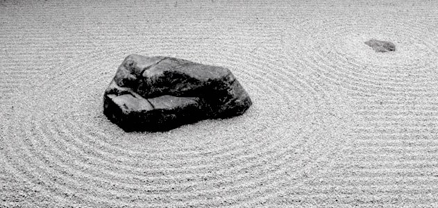

距离场几乎可以用来画任何东西。显然，图形越复杂，方程也越复杂。但是一旦你找到某个特定图形的公式，就很容易添加图形或应用像过渡边界的效果。正因如此，距离场经常用于字体渲染，例如[Mapbox GL Labels](https://blog.mapbox.com/drawing-text-with-signed-distance-fields-in-mapbox-gl-b0933af6f817), [Matt DesLauriers](https://twitter.com/mattdesl) [Material Design Fonts](http://mattdesl.svbtle.com/material-design-on-the-gpu) 和 [as is described in Chapter 7 of iPhone 3D Programming, O’Reilly](https://www.oreilly.com/library/view/iphone-3d-programming/9781449388133/ch07.html#ch07_id36000844).

看看下面的代码：

<div class="codeAndCanvas" data="rect-df.frag"></div>

我们一开始把坐标系移到中心并把它映射到-1到1之间。在 *24行* 这儿，我们用一个[```fract()```](../glossary/?search=fract) 函数来呈现这个距离场产生的图案。这个距离场不断重复，就像在禅花园看到的环一样。

现在我们来看下 *19行* 的距离场方程。这里我们在计算点  ```(.3,.3)``` 或 ```vec3(.3)```到所有四象限的距离（这就是 [```abs()```](../glossary/?search=abs) 在起作用）。

如果你取消第 *20行* 的注释，你会发现我们把到四个点的距离用[```min()```](../glossary/?search=min) 函数合并到0，并产生了一个有趣的图案。

现在再试着取消第 *21行* 的注释，我们做的和之前一样，只不过这次用的是 [```max()```](../glossary/?search=max) 函数。这次的记过是圆角矩形。注意距离场的环形是如何离中心越远越光滑的。

最后从*27 行到 29 行*一行行地取消注释，思考距离场的不同用途。

### 极坐标下的图形

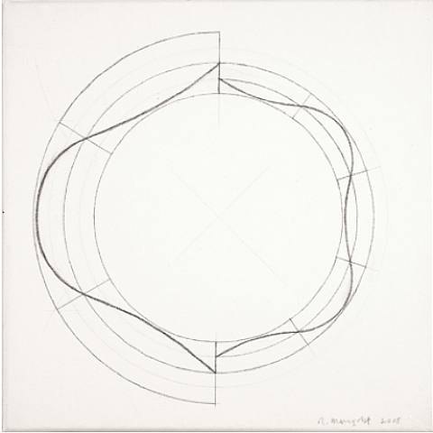

在关于颜色的章节我们通过如下的方程把每个像素的 **半径** 和 **角度** 笛卡尔坐标映射到极坐标。

```glsl
    vec2 pos = vec2(0.5)-st;
    float r = length(pos)*2.0;
    float a = atan(pos.y,pos.x);
```


我们用了部分方程在这章的开头来画圆，即用 [```length()```](../glossary/?search=length) 计算到中心的距离。现在我们可以用极坐标来画圆。

极坐标这种方式虽然有所限制但却十分简单。

下面你会看到在同样在笛卡尔坐标下图形在极坐标下的着色器案例（在 *lines 21 和 25*之间）。对这些函数一个个取消注释，看看两坐标系之间的联系。

<div class="simpleFunction" data="y = cos(x*3.);
//y = abs(cos(x*3.));
//y = abs(cos(x*2.5))*0.5+0.3;
//y = abs(cos(x*12.)*sin(x*3.))*.8+.1;
//y = smoothstep(-.5,1., cos(x*10.))*0.2+0.5;"></div>

<div class="codeAndCanvas" data="polar.frag"></div>


试着：

* 让这些图形动起来。
* 结合不同的造型函数来 **雕刻** 图形，制作诸如花，雪花和齿轮。
* 用我们在 **造型函数** 章节的 ```plot()``` 函数画等高线。

### 整合的魅力

到目前为止，我们知道如何用[```atan()```](../glossary/?search=atan)函数来根据角度调整半径以获得不同的图形，以及如何用```atan()```结合所以和距离场有关的技巧得到可能的效果。

看下下面来自[Andrew Baldwin](https://twitter.com/baldand)的例子。这里的技巧是用极坐标的方式通过定义多边形的边数来构建一个距离场。

<div class="codeAndCanvas" data="shapes.frag"></div>

* 用这个例子，改造一个输入位置，指定图形（形状）的顶点数来返回一个距离场（的值）。

* 结合使用 [```min()```](../glossary/?search=min) 和 [```max()```](../glossary/?search=max) 函数混合距离场。

* 用距离场画个自己感兴趣的logo。

恭喜！你完成了最艰难的部分！休息下让这些概念沉淀一下吧 —— 用Processing 来画简单的形状很容易，但却不到火候。在 shader 的世界里，画形状是很纠结，而且适应这种新的编程范式会有些累人。

在本章的最后，您将找到[PixelSpirit Deck]（https://patriciogonzalezvivo.github.io/PixelSpiritDeck/）的链接，这组卡片将帮助您学习新的SDF功能，将其组合到您的设计和使用中 在您的着色器上。 卡片组具有预先的学习曲线，因此，每天拿一张卡片并进行练习将推动并挑战您几个月的技能。

既然现在你知道了如何画形状，我十分肯定你脑袋里已经充满了新的点子。在接下来的章节里你会学习到怎么移动，旋转以及缩放图形。这将使你的创作如虎添翼！
