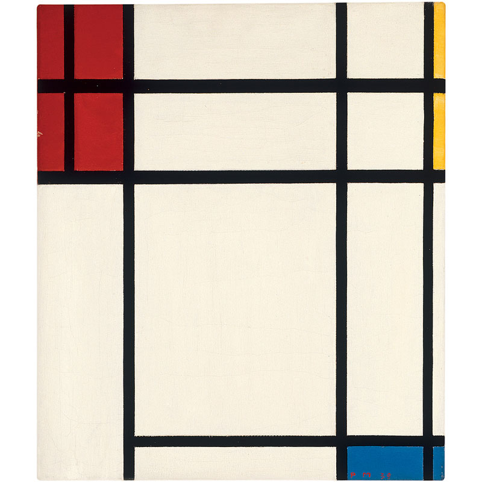

## Figure

Finalmente! Abbiamo costruito e allenato le nostre abilità per questo momento! Avete imparato la maggior parte delle basi, dei tipi e delle funzioni in GLSL. Vi siete esercitati continuamente sulle equazioni di forma. Ora è arrivato il momento di collegare tutti gli elementi. Siete all’altezza di questa sfida! In questo capitolo imparerete a disegnare forme semplici con una procedura in parallelo.

### Rettangolo

Immaginate di avere una carta millimetrata, come quelle che si usano per le lezioni di matematica, e che il nostro compito sia quello di disegnare un quadrato. Le dimensioni del foglio sono 10x10 e il quadrato dovrebbe essere 8x8. Cosa fareste?


Colorereste tutto tranne la prima e l’ultima riga e la prima e l’ultima colonna, giusto?

Come si collega ciò agli shaders? Ogni piccolo quadrato della vostra carta millimetrata è un thread (un pixel). Ogni piccolo quadretto conosce la propria posizione, come per le coordinate di una scacchiera. Nei capitoli precedenti abbiamo associato *x* e *y* ai canali di colore *rosso* e *verde*, e abbiamo imparato come usare il limitato spazio bidimensionale tra 0.0 e 1.0. Come possiamo utilizzare tutto questo per disegnare un quadrato centrato nel mezzo del nostro canvas?

Iniziamo facendo uno pseudocodice che usi la dichiarazione ```if```  sul campo dello spazio. I principi per fare ciò sono straordinariamente simili a come immaginiamo lo scenario della carta millimetrata.

```glsl
    if ( (X più grande di 1) AND (Y più grande di 1) )
        colora di bianco
    else
        colora di nero
```

Ora che abbiamo un’idea più chiara di come funziona, sostituiamo la dichiarazione ```if``` con [```step()```](../glossary/?search=step), e invece di usare 10x10, usiamo i valori normalizzati tra 0.0 e 1.0.

```glsl
uniform vec2 u_resolution;

void main(){
    vec2 st = gl_FragCoord.xy/u_resolution.xy;
    vec3 color = vec3(0.0);

    // per ogni valore restituirà 1.0 (bianco) o 0.0 (nero).
    float left = step(0.1,st.x);   // Simile a ( X più grande di 0.1 )
    float bottom = step(0.1,st.y); // Simile a ( Y più grande di 0.1 )

    // La moltiplicazione di left*bottom sarà simile alla porta logica AND.
    color = vec3( left * bottom );

    gl_FragColor = vec4(color,1.0);
}
```

La funzione [```step()```](../glossary/?search=step) trasformerà ogni pixel al di sotto di 0.1 in nero (```vec3(0.0)```) e il resto in bianco (```vec3(1.0)```). La moltiplicazione tra left e bottom funziona come l’operazione logica AND, dove entrambi devono essere tra 1.0 per tornare a 1.0.  Questo traccia due linee nere, una alla base e l’altra sul lato sinistro del canvas.


Nel codice precedente abbiamo ripetuto la struttura per ciascun asse (sinistra e base). Possiamo risparmiare alcune linee di codice passando due valori, invece di uno, direttamente a [```step()```](../glossary/?search=step) Ecco com’è:

```glsl
    vec2 borders = step(vec2(0.1),st);
    float pct = borders.x * borders.y;
```

Fino ad ora abbiamo disegnato solamente due bordi (base-sinistra) del nostro rettangolo. Facciamo gli altri due (alto-destra). Osserva il seguente codice:

<div class="codeAndCanvas" data="rect-making.frag"></div>

Togliete il commento alle righe 21-22 e osservate come invertiamo le coordinate ```st``` e ripetiamo la stessa funzione [```step()```](../glossary/?search=step). In questo modo il ```vec2(0.0,0.0)``` sarà nell’angolo in alto a destra. Questo è l’equivalente digitale del capovolgimento della pagina e della ripetizione della procedura precedente.


Osservate che alla *riga 18 e alla riga 22* ogni lato è stato moltiplicato insieme. Questo equivale a scrivere:

```glsl
    vec2 bl = step(vec2(0.1),st);       // sotto-sinistra
    vec2 tr = step(vec2(0.1),1.0-st);   // sopra-destra
    color = vec3(bl.x * bl.y * tr.x * tr.y);
```

Interessante, vero? Questa tecnica si basa tutta sull’uso di [```step()```](../glossary/?search=step), della moltiplicazione per le operazioni logiche e il capovolgimento delle coordinate.

Prima di proseguire, provate i seguenti esercizi:

* Cambiate le misure e le proporzioni del rettangolo.

* Provate con lo stesso codice ma usando [```smoothstep()```](../glossary/?search=smoothstep) al posto di [```step()```](../glossary/?search=step). Notate che cambiando valori, potete passare da margini indistinti a lati eleganti e lisci.

* Fate un’altra implementazione che usi [```floor()```](../glossary/?search=floor).

* Scegliete l’implementazione che preferite e create una sua funzione che potrete riusare in futuro. Rendete la vostra funzione flessibile ed efficiente.

* Create un’altra funzione che semplicemente tracci il contorno di un rettangolo.

* Come pensate di poter importare e spostare diversi rettangoli sullo stesso canvas? Se immaginate come, dimostrate le vostre capacità costruendo una composizione di rettangoli e colori che ricordi il dipinto di [Piet Mondrian](https://it.wikipedia.org/wiki/Piet_Mondrian).



### Circonferenze

Disegnare quadrati e rettangoli su carta millimetrata con coordinate cartesiane è semplice, ma le circonferenze richiedono un approccio diverso, specialmente per il fatto che abbiamo bisogno di un algoritmo “per-pixel”. Una soluzione è riassegnare le coordinate spaziali, in modo tale da poter usare la funzione [```step()```](../glossary/?search=step) per disegnare una circonferenza.

Come? Iniziamo tornando indietro alla lezione di matematica e al foglio a quadretti, sul quale abbiamo aperto il compasso con il raggio della circonferenza, abbiamo premuto l’ago del compasso al centro della circonferenza e tracciato il perimetro della circonferenza con una semplice rotazione.


Tradurre ciò in un shader, dove ogni quadrato sul foglio a quadretti è un pixel, implica *chiedere* ad ogni pixel (o thread) se si trova all’interno dell’area della circonferenza. Lo facciamo calcolando la distanza tra il pixel e il centro della circonferenza.


Esistono diversi modi per calcolare questa distanza. Il più semplice utilizza la funzione [```distance()```](../glossary/?search=distance), che al suo interno calcola la funzione [```length()```](../glossary/?search=length) della differenza tra due punti ( nel nostro caso le coordinate del pixel e il centro del canvas). La funzione ```length()``` non è altro che una scorciatoia dell’[equazione dell’ipotenusa](https://it.wikipedia.org/wiki/Ipotenusa), che usa al suo interno la radice quadrata (([```sqrt()```](../glossary/?search=sqrt))).


Potete usare [```distance()```](../glossary/?search=distance), [```length()```](../glossary/?search=length) o [```sqrt()```](../glossary/?search=sqrt) per calcolare la distanza dal centro del canvas. Il codice seguente contiene queste tre funzioni e il fatto non sorprendente è che ciascuna restituisce esattamente lo stesso risultato.

* Commentate e togliete il commento alle righe per provare i diversi modi di ottenere il medesimo risultato.

<div class="codeAndCanvas" data="circle-making.frag"></div>

Nell’esempio precedente abbiamo mappato la distanza dal centro del canvas con la luminosità del colore del pixel. Più un pixel è vicino al centro, minore ( più scuro) è il suo valore. Notate che i valori non diventano troppo alti perché la massima distanza dal centro ( ```vec2(0.5, 0.5)``` ) va a malapena oltre 0.5. Osservate attentamente questa mappa e pensate:

* Cosa potete dedurre da essa?

* Come possiamo usarla per tracciare una circonferenza?

* Modificate il codice qui sopra per far sì che l’intero gradiente circolare sia contenuto nel canvas.

### Campo di distanza

Possiamo anche immaginare l’esempio soprastante come una carta delle altitudini, dove più scuro implica più alto. Il gradiente ci mostra qualcosa di simile al modello creato da un cono. Immaginate di trovarvi sulla cima di un cono. La distanza orizzontale dal bordo del cono è 0.5. Questa sarà costante in ogni direzione. Scegliendo dove “tagliare” il cono, otterrete una superficie circolare più grande o più piccola.


In sostanza, per creare delle forme, stiamo utilizzando una reinterpretazione dello spazio basata sulla distanza dal centro. Questa tecnica è conosciuta come “campo di distanza” (distance field) ed è usata in modi diversi, dai profili dei caratteri (font) alla grafica 3D.

Esercitatevi con i seguenti esercizi:

* Usate [```step()```](../glossary/?search=step) per trasformare in bianco tutto ciò che è al di sopra di 0.5 e al di sotto di 0.0.

* Invertite i colori dello sfondo e del primo piano.

* Usate [```smoothstep()```](../glossary/?search=smoothstep), provate con valori diversi per ottenere dei margini lisci sulla vostra circonferenza.

* Una volta che siete soddisfatti con un’implementazione, createne una funzione, che potrete riutilizzare in futuro.

* Aggiungete il colore alla circonferenza.

* Riuscite a creare animazioni sulla circonferenza per farla crescere e rimpicciolire, simulando il battito del cuore? (Potete trarre ispirazione dalle animazioni nel capitolo precedente).

* Che ne dite di spostare questa circonferenza? Riuscite a spostarla e a mettere altre circonferenze su uno stesso canvas?

* Cosa succede se combinate i campi di distanza con diverse operazioni e funzioni?

```glsl
pct = distance(st,vec2(0.4)) + distance(st,vec2(0.6));
pct = distance(st,vec2(0.4)) * distance(st,vec2(0.6));
pct = min(distance(st,vec2(0.4)),distance(st,vec2(0.6)));
pct = max(distance(st,vec2(0.4)),distance(st,vec2(0.6)));
pct = pow(distance(st,vec2(0.4)),distance(st,vec2(0.6)));
```
* Create tre composizioni usando questa tecnica. Se poi riuscite ad animarle, ancora meglio!

#### Per la vostra cassetta degli attrezzi

In termini di potenza computazionale, la funzione [```sqrt()```](../glossary/?search=sqrt), e le altre funzioni che dipendono da essa, possono essere dispendiose. Ecco un altro modo per creare un campo di distanza circolare, basato sulla funzione [```dot()```](../glossary/?search=dot).

<div class="codeAndCanvas" data="circle.frag"></div>

### Proprietà utili dei campi di distanza


I campi di distanza possono essere usati per disegnare quasi qualsiasi cosa. Ovviamente, più una forma è complessa, più sarà complicata la sua equazione, ma una volta che avete la formula per creare un campo di distanza di una certa forma è molto facile combinare e/o applicare degli effetti ad essa, come lati lisci e profili multipli. Per questo motivo, i campi di distanza hanno molto successo nella rappresentazione dei caratteri (font), come [Mapbox GL Labels](https://blog.mapbox.com/drawing-text-with-signed-distance-fields-in-mapbox-gl-b0933af6f817), [Matt DesLauriers](https://twitter.com/mattdesl) [Material Design Fonts](http://mattdesl.svbtle.com/material-design-on-the-gpu) e come è descritto nel [Capitolo 7 del libro "iPhone 3D Programming", O’Reilly](http://chimera.labs.oreilly.com/books/1234000001814/ch07.html#ch07_id36000921)

Osservate il codice seguente.

<div class="codeAndCanvas" data="rect-df.frag"></div>

Iniziamo spostando il sistema di coordinate al centro e riducendolo a metà per riassegnare i valori di posizione tra -1 e 1. Alla *riga 24* stiamo vedendo i valori del campo di distanza usando una funzione [```fract()```](../glossary/?search=fract), semplificando la visualizzazione dei motivi che essi creano. Il motivo del campo di distanza si continua a ripetere come i cerchi in un giardino zen.

Osserviamo la formula del campo di distanza alla *riga 19*. Lì stiamo calcolando la distanza dalla posizione su ```(.3,.3)``` o ```vec3(.3)``` in tutti e quattro i quadranti ( questo è ciò che fa [```abs()```](../glossary/?search=abs) qui) .

Se togliete il commento alla *riga 20*, noterete che stiamo collegando le distanze a questi quattro punti usando il [```min()```](../glossary/?search=min) a zero. Il risultato produce un nuovo motivo interessante.

Ora provate a togliere il commento alla *riga 21*; stiamo facendo la stessa cosa ma usando la funzione [```max()```](../glossary/?search=max). Il risultato è un rettangolo con gli angoli arrotondati. Notate come gli anelli del campo di distanza diventano più lisci mano a mano che si allontanano dal centro.

Terminate togliendo il commento una ad una alle *righe da 27 a 29*, per capire i diversi usi dei motivi di un campo di distanza.

### Forme polari


Nel capitolo sul colore, abbiamo assegnato alle coordinate cartesiane le coordinate polari, calcolando il *raggio* e gli *angoli* di ciascun pixel con la seguente formula:

```glsl
    vec2 pos = vec2(0.5)-st;
    float r = length(pos)*2.0;
    float a = atan(pos.y,pos.x);
```

Usiamo parte di questa formula all’inizio del capitolo per tracciare una circonferenza. Abbiamo calcolato la distanza dal centro usando [```length()```](../glossary/?search=length). Ora che conosciamo i campi di distanza, possiamo imparare un altro modo per disegnare le forme usando le coordinate polari.

Questa tecnica è un po’ restrittiva ma molto semplice. Consiste nel cambiare il raggio di una circonferenza in funzione dell’angolo per realizzare forme diverse. Come funziona la modulazione? Esatto, usando le funzioni di forma!

Qui sotto troverete le medesime funzioni sul diagramma cartesiano e in un esempio shader nelle coordinate polari ( tra le *righe 21 e 25*). Togliete il commento alle funzioni una alla volta, facendo attenzione alla relazione tra un sistema di coordinate e l’altro.

<div class="simpleFunction" data="y = cos(x*3.);
//y = abs(cos(x*3.));
//y = abs(cos(x*2.5))*0.5+0.3;
//y = abs(cos(x*12.)*sin(x*3.))*.8+.1;
//y = smoothstep(-.5,1., cos(x*10.))*0.2+0.5;"></div>

<div class="codeAndCanvas" data="polar.frag"></div>

Provate a:

* Animare queste forme.
* Combinare diverse funzioni di forma per fare dei *buchi* nella forma e creare fiori, fiocchi di neve e degli ingranaggi.
* Usare la funzione ```plot()``` che abbiamo usato nel capitolo sulle *funzioni di forma*, per disegnare solamente la sagoma.

### Unire i poteri

Ora che abbiamo imparato come modulare il raggio di una circonferenza in relazione all’angolo, usando la funzione [```atan()```](../glossary/?search=atan) per disegnare diverse forme, possiamo imparare come usare ```atan()``` con i campi di distanza e applicare tutti i trucchi e gli effetti possibili con i campi di distanza.

Il nostro trucco userà il numero di lati di un poligono per costruire il campo di distanza, usando le coordinate polari. Controllate [il seguente codice](http://thndl.com/square-shaped-shaders.html) di [Andrew Baldwin](https://twitter.com/baldand).

<div class="codeAndCanvas" data="shapes.frag"></div>

* Usando quest’esempio, create una funzione che inserisca la posizione e il numero degli angoli di una forma desiderata e restituisca il valore di un campo di distanza.

* Mescolate i campi di distanza usando [```min()```](../glossary/?search=min) e [```max()```](../glossary/?search=max).

* Scegliete un logo geometrico da riprodurre usando i campi di distanza.

Congratulazioni! Avete affrontato la parte più complicata! Fate una pausa per poter assimilare questi concetti: disegnare delle semplici forme con Processing è facile, ma qui no. Nella “terra degli Shader”, disegnare le forme è contorto e può essere faticoso adattarsi al nuovo paradigma di codificazione.

Alla fine di questo capitolo troverai un link a [PixelSpirit Deck] (https://patriciogonzalezvivo.github.io/PixelSpiritDeck/) questo mazzo di carte ti aiuterà ad apprendere nuove funzioni SDF, compilarle nei tuoi progetti e utilizzarle sui tuoi shader. Il mazzo ha una curva di apprendimento pregresiva, quindi prendere una carta al giorno e lavorarci su spingerà e metterà alla prova le tue abilità per mesi.

Ora che sapete come disegnare le forme, sono sicuro che vi verranno in mente nuove idee. Nel capitolo successivo imparerete a spostare, ruotare e ridimensionare le forme. Questo vi permetterà di fare delle composizioni!
