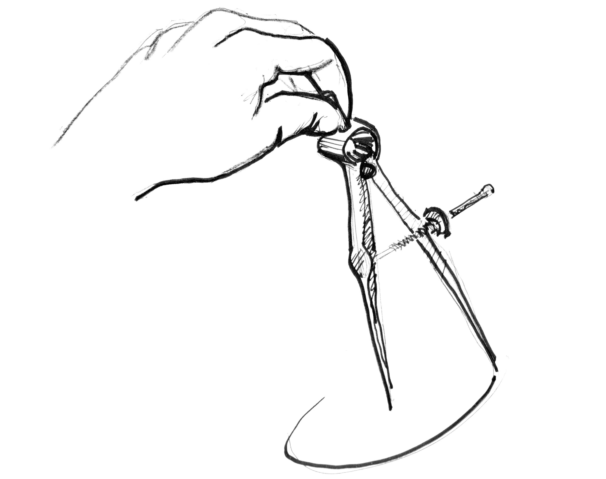
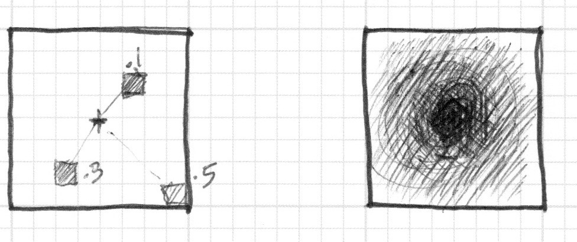

## 形について


ついにこの時が来ました。私たちはこの瞬間のために技を磨いてきたのです。あなたはGLSLの基礎の大部分、値の型と関数について学びました。シェイピング関数も繰り返し練習してきました。今こそ学んだ全てを掛け合わせる時です。この挑戦を受けて立ちましょう。この章では並列処理ならではの方法でシンプルな形を描く方法を学びます。

### 長方形

数学の授業で使ったような方眼紙があって、そこに正方形を描く宿題が出たと想像してください。紙のサイズは10×10で正方形は8×8にする必要があります。あなたならどうしますか。


一番上と下の行、左右両端の列を除いてすべてを塗りつぶせばよいですね。

これがシェーダーになんの関係があるのでしょう。方眼紙の小さな正方形1つ1つはスレッド（ピクセル）です。それぞれの小さな正方形は自分の位置を、チェス盤上の行と列のように把握しています。以前の章で私たちは x と y を赤と緑の色のチャンネルに割り当てました。また 0.0 から 1.0 の間の狭い二次元の領域を使う方法も学んできました。描画領域の中央に正方形を描くのに、これらの知識をどう活かせばよいでしょうか。

描画する範囲についての ```if``` 文を使った疑似コードから始めてみましょう。基本的な考え方は方眼紙の宿題ととてもよく似ています。

```glsl
    if ( (X GREATER THAN 1) AND (Y GREATER THAN 1) )
        paint white
    else
        paint black
```

方針がまとまったところで、 ```if``` 文を [```step()```](../glossary/?search=step) に置き換えて、10×10のマス目の代わりに 0.0 から 1.0 に正規化された値を使ってみましょう。


```glsl
uniform vec2 u_resolution;

void main(){
    vec2 st = gl_FragCoord.xy/u_resolution.xy;
    vec3 color = vec3(0.0);

    // Each result will return 1.0 (white) or 0.0 (black).
    float left = step(0.1,st.x);   // Similar to ( X greater than 0.1 )
    float bottom = step(0.1,st.y); // Similar to ( Y greater than 0.1 )

    // The multiplication of left*bottom will be similar to the logical AND.
    color = vec3( left * bottom );

    gl_FragColor = vec4(color,1.0);
}
```

[```step()```](../glossary/?search=step) 関数は、 x か y が 0.1 より小さくなるピクセルを黒（```vec3(0.0)```）に、他のすべてのピクセルを白（```vec3(1.0)```）に変えてくれます。```left``` と ```bottom``` の掛け算は ```AND``` 演算の役割をして、両方ともの値が 1.0 だった場合にのみ 1.0 を返します。結果として描画領域の下側と左側に2本の黒い線が引かれることになります。


このコードではそれぞれの軸（左側と下側）に対して同じ構造を繰り返しています。[```step()```](../glossary/?search=step)  に1つずつ値を渡す代わりに、2つの値を一度に渡せば数行分のコードを節約することができます。下記を見てください。

```glsl
    vec2 borders = step(vec2(0.1),st);
    float pct = borders.x * borders.y;
```

ここまでではまだ2本の辺（左側と下側）しか描けていません。もう2本にも手をつけましょう。

<div class="codeAndCanvas" data="rect-making.frag"></div>

コメントを外すと、```st``` 座標を反転させてから同じ [```step()```](../glossary/?search=step) 関数を繰り返す様子が見られます。こうすると ```vec2(0.0,0.0)``` が右上の角になります。紙をひっくり返して作業を繰り返すのと同じことをデジタルに行っているわけです。


18行目と22行目で全ての辺の値が掛け合わされていることに注目してください。これは下記のように書くこともできます。

```glsl
    vec2 bl = step(vec2(0.1),st);       // bottom-left
    vec2 tr = step(vec2(0.1),1.0-st);   // top-right
    color = vec3(bl.x * bl.y * tr.x * tr.y);
```

面白いでしょう。[```step()```](../glossary/?search=step) を使いこなし、掛け算を使って論理演算をして、さらに座標をひっくり返すとこんなことができるのです。

さらに先に進む前に下記の課題に挑戦しましょう。

* 長方形の大きさと縦横比を変えてみましょう。

* 同じコードを元に [```step()```](../glossary/?search=step) の代わりに [```smoothstep()```](../glossary/?search=smoothstep) を使ってみましょう。値を調節するとぼやけた境界線からスムーズな枠線まで変化させることができます。

* [```floor()```](../glossary/?search=floor) を使ってみましょう。

* 課題の中から気に入ったコードを選び、それを関数に変えて再利用できるようにしましょう。効率的でフレキシブルな関数を考えましょう。

* 長方形を塗りつぶすのではなく、枠線だけを描く関数を作ってください。

* どうすれば1つの描画領域の異なる位置に、複数の長方形を配置することができると思いますか。良い方法を考え出せたら[モンドリアン](http://en.wikipedia.org/wiki/Piet_Mondrian)の絵のようなパターンを作ってみせてください。


### 円

方眼紙の上やデカルト座標系で長方形を描くのは簡単です。しかし円を描くには別のアプローチが必要です。しかもシェーダーではそれぞれのピクセルごとに処理するアルゴリズムを用いなければなりません。1つの方法は [```step()```](../glossary/?search=step)  関数を使って円が描けるように、空間座標を置き換えることです。

どうすればいいのでしょう。数学の教室に戻って、方眼紙の上にコンパスを半径の長さに開いたところから始めましょう。片方の端を円の中心に置いて1回転させて円の淵をなぞります。



シェーダーでは方眼のマス目の1つ1つがピクセルに対応します。方眼紙とコンパスからシェーダーに置き換えるということは、それぞれのピクセル（スレッド）に対して円の内側にあるかどうかを問い合わせることを意味します。これは円の中心からピクセルまでの距離を計算することで行うことができます。



距離を計算するには幾つかの方法があります。最も簡単なのは [```distance()```](../glossary/?search=distance) 関数を使うことです。この関数は内部的に2つの点の差を取りその [```length()```](../glossary/?search=length) を計算します（今回のケースではピクセルの座標と描画領域の中心対象にします）。```length()``` 関数は[ピタゴラスの定理](https://ja.wikipedia.org/wiki/%E6%96%9C%E8%BE%BA)のショートカットで内部的に平方根（[```sqrt()```](../glossary/?search=sqrt)）を使います。


[```distance()```](../glossary/?search=distance), [```length()```](../glossary/?search=length), [```sqrt()```](../glossary/?search=sqrt) のいずれかを使って中心までの距離を計算することができます。下記のコードにはこれら3つの関数が全て含まれていますが、当然ながら全く同じ結果になります。

* コメントを付け替えて、違う方法を使っても同じ結果が得られることを確かめましょう。

<div class="codeAndCanvas" data="circle-making.frag"></div>

このサンプルでは中心からの距離をピクセルの明るさに割り当てました。中心に近いピクセルほど値が低く（暗く）なります。中心（ ```vec2(0.5, 0.5)``` ）からの距離は最大でルート2の半分にしかならないため一番明るいところでも真っ白にはなりません。このサンプルをよく見て考えてみてください。（訳注：原文では最大の距離は0.5はとなっていますが誤りです。中心から描画領域の角までの距離はルート2の半分です。）

* 何か気づいたことはありますか。

* これをどう使えば円が描けるでしょう。

* コードを書き換えて円形のグラデーションの全体が描画領域に収まるようにしてください。

### ディスタンスフィールド

上のサンプルは、暗い色ほど標高が高いことを示した、高低差を表す地図だと考えることもできます。このグラデーションは円錐のようなものを表しています。円錐の頂上に立ったところを想像してください。円錐の縁までの距離は 1.0 です（訳注：原文では0.5となっていますが、明るさが1.0に
なるところを縁と考えると 1.0 です）。これはどの方角でも同じです。どこで円錐を「輪切りに」するかを決めることで、大きさの違う円を得ることができます。


要するにここでは空間を中心からの距離に基づいて解釈し直すことによって形を作っています。この手法はディスタンスフィールドと呼ばれ、フォントのアウトラインから3Dグラフィクスまで様々な用途に使われています。
(訳注：distance field の適当な訳語が見当たらなかったのでカタカナで「ディスタンスフィールド」とします。おおざっぱに、点や図形からの距離を空間上にマップしたものだと考えてください。)

下記の課題に挑戦しましょう。

* [```step()```](../glossary/?search=step) を使って、0.5 以上を全て白に、それ以外を黒にしてください。
* 背景と図形の色を反転させてください。
* 円の縁を滑らかにしてみましょう。[```smoothstep()```](../glossary/?search=smoothstep) を使って色々な値を試してください。
* うまくできたら後で再利用できるように関数として定義してください。
* 円に色をつけてください。
* 心臓の鼓動のように円を伸縮させるアニメーションを作ることはできますか。（前章のアニメーションを参考にしましょう。）
* 円を移動させることはできますか。円を別の場所に動かして、さらにもう1つの円を別の場所に描くことはできますか。
* 様々な演算や関数を使って、複数のディスタンスフィールドを組み合わせると何が起きるでしょう。

```glsl
pct = distance(st,vec2(0.4)) + distance(st,vec2(0.6));
pct = distance(st,vec2(0.4)) * distance(st,vec2(0.6));
pct = min(distance(st,vec2(0.4)),distance(st,vec2(0.6)));
pct = max(distance(st,vec2(0.4)),distance(st,vec2(0.6)));
pct = pow(distance(st,vec2(0.4)),distance(st,vec2(0.6)));
```

* これらのテクニックを使った作品を3つ作ってください。アニメーションにできればさらに素敵です。

#### 便利な道具箱

平方根（[```sqrt()```](../glossary/?search=sqrt)）や、それに依存した関数はどれもコンピュータの処理能力に負荷をかける可能性があります。下記は円形のディスタンスフィールドを作る別の方法で、平方根の代わりに内積（[```dot()```](../glossary/?search=dot) ）を使います。

<div class="codeAndCanvas" data="circle.frag"></div>

### ディスタンスフィールドの便利な性質


ディスタンスフィールドを使うと、ほぼどんなものでも描くことができます。もちろん形が複雑なほどより計算式がもより複雑になりますが、一旦ある形のディスタンスフィールドを作り出すための式を手に入れれば、複数の形を組み合わせたり、縁をぼかしたり何重にも線を引いたり様々なエフェクトをかけたりすることはとても簡単にできます。そのため下記の例に見られるようにディスタンスフィールドはフォントのレンダリングによく使われています。

* [Mapbox GL Labels](https://blog.mapbox.com/drawing-text-with-signed-distance-fields-in-mapbox-gl-b0933af6f817)
* [Matt DesLauriers](https://twitter.com/mattdesl)
* [Material Design Fonts](http://mattdesl.svbtle.com/material-design-on-the-gpu)
* [Chapter 7 of iPhone 3D Programming, O’Reilly](http://chimera.labs.oreilly.com/books/1234000001814/ch07.html#ch07_id36000921)


下記のコードをみてください

<div class="codeAndCanvas" data="rect-df.frag"></div>

まず座標系を中心に動かして半分の大きさに縮小することで値が -1 から 1の間に収まるようにします（訳注：16行目の式の ```2.``` と ```1.``` を書き換えて見ると理解の助けになります）。24行目では [```fract()```](../glossary/?search=fract) 関数を使ってディスタンスフィールドが作り出すパターンが見やすいように視覚化しています。ディスタンスフィールドは禅寺の庭
のような繰り返しの模様を作り出します。

19行目のディスタンスフィールドを作り出す式を見てみましょう。4つの象限すべてで ```vec3(.3)```、つまり ```(.3,.3)``` までの
距離を計算しています（[```abs()```](../glossary/?search=abs) を使って座標を絶対値にしてから距離を求めています）。

20行目のコメントを外すと 0 との [```min()```](../glossary/?search=min) を使って、4つの点への距離を組み合わせた場合を見ることができます。これは新く面白いパターンを作り出します。

さて21行目のコメントを外して見ましょう。[```max()```](../glossary/?search=max) を使っていること以外は同じです。結果は角丸の四角形になります。ディスタンスフィールドの輪は中心から遠ざかるほど半径が大きくなっていることに注目しましょう。

27行目から29行目までのコメントを順番に外して、ディスタンスフィールドを使ってパターンを作る様々な方法を学びましょう。


### 極座標を使った図形


色についての章では下記の式を使って、それぞれのピクセルについて半径と角度を計算し、デカルト座標を極座標に変換しました。

```glsl
    vec2 pos = vec2(0.5)-st;
    float r = length(pos)*2.0;
    float a = atan(pos.y,pos.x);
```

本章の前半ではこの式の一部を利用して円を描きました。[```length()```](../glossary/?search=length)を使って中心からそれぞれのピクセルまでの距離を計算したのですね。ディスタンスフィールドのことを知った今、我々は極座標を使って図形を描く新たな手法について学ぶことができます。

この手法は少し用途が限られますがとてもシンプルです。様々な異なる図形を描くために、角度に対する半径の大きさをいろいろと変化させます。どのように変化させるのでしょう。そうです、シェイピング関数を使います。

下記の2つのサンプルでは、同じ関数がデカルト座標と極座標（21行目から25行目）の両方で使われているのが分かるでしょう。一方の座標系ともう片方の座標系との関係に注意しながら、コメントを1つつ外してください。

<div class="simpleFunction" data="y = cos(x*3.);
//y = abs(cos(x*3.));
//y = abs(cos(x*2.5))*0.5+0.3;
//y = abs(cos(x*12.)*sin(x*3.))*.8+.1;
//y = smoothstep(-.5,1., cos(x*10.))*0.2+0.5;"></div>

<div class="codeAndCanvas" data="polar.frag"></div>

下記を試してみましょう。

* 図形をアニメーションにしてください。

* 異なるシェイピング関数を組み合わせて図形の中に穴を開けてください。花や雪の結晶、歯車などを描いてみましょう。

* シェイピング関数の章で使った ```plot()``` 関数を利用して輪郭線だけを描いてください。


### 技を掛け合わせる

さて [```atan()```](../glossary/?search=atan)を使い、角度に対する半径の大きさを変化させて図形を描く方法について学びました。次は ```atan()``` をディスタンスフィールドと組み合わせて、すべての技を駆使する方法を学びます。

この方法では多角形の辺の数を元に極座標を使ってディスタンスフィールドを構成します。[Andrew Baldwin](https://twitter.com/baldand)による、[下記のコード](http://thndl.com/square-shaped-shaders.html)をご覧ください。

<div class="codeAndCanvas" data="shapes.frag"></div>

* このサンプルを使って、ピクセルの位置と描きたい図形の頂点の数を入力とし、ディスタンスフィールドの値を返す関数を作ってください。

* [```min()```](../glossary/?search=min) と [```max()```](../glossary/?search=max) を使ってディスタンスフィールドを組み合わせてみましょう。

* 幾何学的なロゴをなにか1つ選んでディスタンスフィールドを使って再現してみましょう。

おめでとうございます。これで山を乗り越えました。[Processing](https://processing.org/)を使えばシンプルな形を描くのは簡単なことですが、ここで学んだ方法は違います。シェーダーの世界では形を描くのにもひねくれたやり方をしなくてはなりませんし、新しいコーディングの考え方に慣れるのは大変なことです。一息入れて、学んだ概念を頭に馴染ませましょう。

この章の終わりには、[PixelSpirit Deck]（https://patriciogonzalezvivo.github.io/PixelSpiritDeck/）へのリンクがあります。このカードのデッキは、新しいSDF機能を学び、デザインに組み込んで使用するのに役立ちます シェーダーで。 このデッキには学習曲線がありますので、1日に1枚のカードを取り、それに取り組んでいくと、数か月間スキルが向上します。

図形の描きかたを学んだので、新しいアイデアが頭の中に浮かんでくることでしょう。次の章ではこれらを移動、回転、そして拡大・縮小させる方法を学びます。これで図形を様々に組み合わせることができるようになります。
