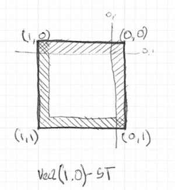

## Formas

Finalmente! Estávamos aperfeiçoando nossas habilidades para esse momento. Você aprendeu a maioria dos fundamentos de GLSL, tipos e funções. Você praticou e praticou suas equações. Agora é a hora de juntarmos tudo. Você está pronto para esse desafio! Neste capítulo, você aprenderá como desenhar formas simples de uma jeito paralelo e procedural.

## Retângulo

Supondo que temos um papel quadriculado como aqueles que nós usávamos em matemática e a nossa lição de casa é desenhar um quadrado. O tamanho do papel é de 10x10 e o quadrado deve ser de 8x8. O que você faria?


Você pintaria tudo exceto a primeira e a última linha e a primeira e a última coluna, certo?

Como isso se relaciona com shaders? Cada pequeno quadrado do nosso papel quadriculado é uma thread (um píxel). Cada quadradinho sabe sua posição, como as coordenadas de um tabuleiro de xadrez. Nos capítulos anteriores, nós mapeamos *x* e *y* para os canais *red* e *green* de cor, nós aprendemos como usar o pequeno território bidimensional entre 0.0 e 1.0. Como podemos usar isso para desenhar um quadrado centralizado no meio da nossa tela?

Vamos começar rascunhando um pseudocódigo que usa  a declaração de `if` sobre o intervalo espacial. Os princípios para fazer isso são extraordinariamente similares ao jeito que pensamos no papel quadriculado.

```glsl
if ( (X GREATER THAN 1) AND (Y GREATER THAN 1) )
    paint white
else
    paint black
```

Agora que temos uma ideia melhor de como isso funcionará, vamos substituir a declaração do `if` com [`step()`](../glossary/?search=step), e ao invés de usar 10x10, vamos usar os valores normalizados entre 0.0 e 1.0:

```glsl
uniform vec2 u_resolution;

void main(){
    vec2 st = gl_FragCoord.xy/u_resolution.xy;
    vec3 color = vec3(0.0);

    // Each result will return 1.0 (white) or 0.0 (black).
    float left = step(0.1,st.x);   // Similar to ( X greater than 0.1 )
    float bottom = step(0.1,st.y); // Similar to ( Y greater than 0.1 )

    // The multiplication of left*bottom will be similar to the logical AND.
    color = vec3( left * bottom );

    gl_FragColor = vec4(color,1.0);
}
```

A função [`step()`](../glossary/?search=step) fará com que todos os píxeis abaixo de 0.1 fiquem pretos (`vec3(0.0)`) e o acima, brancos (`vec3(1.0)`). A multiplicação entre o lado `esquerdo` e `inferior` funciona como uma operação lógica `AND`, onde ambos precisam ser 1.0 para retornar 1.0. Isso desenhará duas linhas pretas, uma abaixo e a outra do lado esquerdo da nossa tela.


No código anterir, nós repetimos a estrutura para cada eixo (esquerda e inferior). Podemos economizar algumas linhas de código passando dois valores diretamente ao [`step()`](../glossary/?search=step) em vez de um. Algo como:

```glsl
vec2 borders = step(vec2(0.1),st);
float pct = borders.x * borders.y;
```

Até agora, nós apenas desenhamos duas bordas (inferior-esquerda) do nosso retângulo. Vamos desenhar as outras duas (superior-direita). Dê uma olhada no código a seguir:

<div class="codeAndCanvas" data="rect-making.frag"></div>

Descomente as *linhas 21-22* e veja como nós invertamos as coordenadas `st` e repetimos a mesma função [`step()`](../glossary/?search=step). Desta forma, o `vec2(0.0,0.0)` será no canto superior direito. Esta é o equivalente digital a girar a página e repetir o procedimento anterior.



Tome nota que nas *linhas 18 e 22*, todos os lados estão senho multiplicados juntos. Isso é equivalente a escrever:

```glsl
vec2 bl = step(vec2(0.1),st);       // bottom-left
vec2 tr = step(vec2(0.1),1.0-st);   // top-right
color = vec3(bl.x * bl.y * tr.x * tr.y);
```

Interessante, não é? Essa técnica é sobre usar [`step()`](../glossary/?search=step) e multiplicação para operações lógicas e girar as coordenadas.

Antes de continuar, tente os seguintes exercícios:

* Mude o tamanho e as proporções do retângulo.

* Experimente no mesmo código usar [`smoothstep()`](../glossary/?search=smoothstep) em vez de [`step()`](../glossary/?search=step). Note que ao trocar os valores, você pode ir de bordas borradas a elegantes bordas suaves.

* Faça uma outra implementação que utiliza [`floor()`](../glossary/?search=floor).

* Escolha a implementação que você mais gostou e faça uma função dela para que você possa usar novamente no futuro. Faça sua função ser flexível e eficiente.

* Crie uma outra função que apenas desenhe o contorno do retângulo.

* Como você faria para mover e posicionar diferentes retângulos na mesma tela? Se você descobrir como, mostre suas habilidades fazendo uma composição de retângulos e cores que se pareça com uma pintura de [Piet Mondrian](http://en.wikipedia.org/wiki/Piet_Mondrian).


## Círculos

Desenhar quadrados num papel quadriculado e retângulos em coordenadas cartesianas é fácil, entretanto círculos exigem uma outra abordagem, principalmente porque precisamos de um algoritmo "por-píxel". Uma solução é *remapear* as coordenadas espaciais para podermos usar a função [`step()`](../glossary/?search=step) para desenhar um círculo.

Como? Vamos começar voltando para aula de matemática e o papel quadriculado, quando nós abríamos um compasso com o raio do círculo, pressionávamos o ponto central do compasso e então, traçávamos o contorno do círculo com um simples giro.


Existem várias formas de calcular aquela distância. A forma mais fácil usa a função [`distance()`](../glossary/?search=distance), que internamente computa a distância ([`length()`](../glossary/?search=length)) da diferença entre dois pontos (neste caso, as coordenadas do píxel e o centro da tela). A função `length()` não é nada além de um atalho para a [equação da hipotenusa](http://en.wikipedia.org/wiki/Hypotenuse) que usa raiz quadrada internamente.


Você pode usar [`distance()`](../glossary/?search=distance), [`length()`](../glossary/?search=length) ou [`sqrt()`](../glossary/?search=sqrt) para calcular a distância do centro da tela. O código a seguir contém estas três funções e o fato nem-tão-surpreendente que cada uma retorna exatamente o mesmo resultado.

* Comente e descomente as linhas para experimentar diferentes formas de obter o mesmo resultado.

<div class="codeAndCanvas" data="circle-making.frag"></div>

No exemplo anterior, nós mapeamos a distância até o centro da tela para a luminosidade da cor do pixel. Quanto mais perto o pixel está do centro, menor (mais escuro) será o valor que ele possui. Note que os valores não vão tão altos porque a distância do centro ( `vec2(0.5, 0.5)` ) mal chega em 0.5. Contemple o mapa e reflita:

* O que você pode inferir sobre ele?

* Como podemos usá-lo para desenhar um círculo?

* Modifique o código acima para conter o gradiente circular inteiramente dentro da tela.

### Campo de distância (Distance Field)

 Também podemos visualizar o exemplo acima como um mapa de altitude, onde as partes mais escuras indicam áreas mais altas. O gradiente nos mostra algo similar ao padrão feito por um cone. Imagine você mesmo no topo deste cone. A distância horizontal até o contorno do cone é 0.5. Está será constante em todas as direções. Ao escolher onde "cortar" o cone, você obterá uma superfície circular maior ou menor.

 

 Basicamente, nós estamos usando uma re-interpretação do espaço (baseando na distância até o centro) para construir formas. Esta técnica é conhecida como "campo de distância" e é usada de diferentes formas desde contornos em fontes até gráficos 3D.

 Faça os seguintes exercícios:

 * Use [`step()`](../glossary/?search=step) para pintar tudo acima de 0.5 de branco e tudo abaixo de preto.

 * Inverta as cores entre fundo e primeiro plano.

 * Usando [`smoothstep()`](../glossary/?search=smoothstep), teste valores diferentes para obter bordas suaves em seu círculo.

 * Quando você estiver satisfeito com a sua implementação, crie uma função dela para que você possa reusar no futuro.

 * Adicione cores ao círculo.

 * Você consegue animar seu círculo para crescer e encolher simulando um coração batendo? (Você pode se inspirar na animação no capítulo anterior.)

 * E quanto a mover este círculo? Você consegue mover ele e posicionar diferentes círculos na tela?

 * O que acontece se você combinar campos de distância usando diferentes funções e operações?

 ```glsl
 pct = distance(st,vec2(0.4)) + distance(st,vec2(0.6));
 pct = distance(st,vec2(0.4)) * distance(st,vec2(0.6));
 pct = min(distance(st,vec2(0.4)),distance(st,vec2(0.6)));
 pct = max(distance(st,vec2(0.4)),distance(st,vec2(0.6)));
 pct = pow(distance(st,vec2(0.4)),distance(st,vec2(0.6)));
 ```

* Faça três composições usando esta técnica. Se elas forem animadas, melhor ainda!

#### Para a sua caixa de ferramentas

Ao falarmos de poder computacional, a função [`sqrt()`](../glossary/?search=sqrt) - e todas funções que dependem dela - podem ser custosas. Aqui está outra forma de criar um campo de distância circular usando [`dot()`](../glossary/?search=dot) (produto escalar).  

<div class="codeAndCanvas" data="circle.frag"></div>

### Propriedades úteis de um Campo de Distância


Campos de distância podem ser usados para desenhar praticamente tudo. Obviamente quanto mais complexa é a forma, mais complicado sua equação será, mas uma vez que você tem a formula para fazer um campo de distância de uma forma em particular, e torna muito fácil combiná-la ou aplicar efeitos a ela, como suavizar suas bordas ou multiplicar o contorno. Por esta razão, campos de distância são populares em renderização de fontes, como [Mapbox GL Labels](https://www.mapbox.com/blog/text-signed-distance-fields/), [Matt DesLauriers](https://twitter.com/mattdesl) [Material Design Fonts](http://mattdesl.svbtle.com/material-design-on-the-gpu) e [como descrito no capítulo 7 de iPhone 3D Programming, O’Reilly](http://chimera.labs.oreilly.com/books/1234000001814/ch07.html#ch07_id36000921).

Dê uma olhada no código a seguir.

<div class="codeAndCanvas" data="rect-df.frag"></div>

Começamos movendo o sistema de coordenadas ao centro e diminuindo ele pela metade para remapear os valores de posição para serem entre -1 e 1. Também, na *linha 24*, nós estamos visualizando os valores de um campo de distância usando uma função [`fract()`](../glossary/?search=fract), tornando fácil ver o padrão que eles criam. O padrão do campo de distância se repete novamente como aneis em um jardim Zen.

Vamos dar uma olhada na fóruma da *linha 19*. Lá nós estamos calculando a distância até a posição em `(.3,.3)` ou `vec3(.3)` em todos os quatro quadrantes (que é o que [`abs()`](../glossary/?search=abs) está fazendo lá).

Se você descomentar a *linha 20*, você notará que nós estamos combinando as distâncias destes quatro pontos usando [`min()`](../glossary/?search=min) com 0. O resultado produzirá um interessante padrão.

Agora, experimente descomentar a *linha 21*; Estamos fazendo o mesmo processo mas usando a função [`max()`](../glossary/?search=max). O resultado será um retângulo com bordas arredondadas. Note como os anéis do campo de distância se suavizam quanto mais eles se distanciam do centro.

Termine descomentando da * linha 27 até 29* uma por uma para entender os diferentes usos de um padrão de campo de distância.

### Formas polares


No capítulo sobre cor, nós mapeamos as coordenadas cartesianas em coordenadas polares calculando o *raio* e *ângulo* de cada pixel com a seguinte fórmula:

```glsl
vec2 pos = vec2(0.5)-st;
float r = length(pos)*2.0;
float a = atan(pos.y,pos.x);
```

Nós usamos parte dessa fórmula no começo deste capítulo para desenhar um círculo. Nós calculamos a distância até o centro usando [`length()`](../glossary/?search=length). Agora que nós entendemos sobre campos de distância, nós podemos aprender outra forma de desenhar formas usando coordenadas polares.

Está técnica é um pouco restrita, mas muito simples. Ela consiste em mudar o raio do círculo baseado no ângulo para chegar em formas diferentes. Como faremos a modulação?  Sim, usando a modelagem de funções!

Abaixo, você verá as mesmas funções em um gráfico cartesiano e em um exemplo de shader em coordenadas polares (entre as *linhas 21 e 25*). Descomente as funções uma a uma, prestando atenção nas relações entre um sistema de coordenadas e o outro.

<div class="simpleFunction" data="y = cos(x*3.);
//y = abs(cos(x*3.));
//y = abs(cos(x*2.5))*0.5+0.3;
//y = abs(cos(x*12.)*sin(x*3.))*.8+.1;
//y = smoothstep(-.5,1., cos(x*10.))*0.2+0.5;"></div>

<div class="codeAndCanvas" data="polar.frag"></div>

Tente:

* Animar estas formas.

* Combinar diferentes funções modeladas para *cortar buracos* na forma e fazer flores, flocos de neve e engrenagens.

* Use a função `plot()` que nós estávamos usando no *Capítulo de Modelagem de Funções* para desenhar apenas o contorno.

### Combinando poderes

Agora que nós aprendemos como modular o raio de um círculo de acordo com o ângulo usando [`atan()`](../glossary/?search=atan) para desenhar formas diferentes, aprendemos como usar `atan()` com campos de distância e a aplicar todos os truques e efeitos possíveis com campos de distância.

O truque usará o número de lados de um polígono para construir um campo de distância usando coordenadas polares. Confira [o código abaixo](http://thndl.com/square-shaped-shaders.html) from [Andrew Baldwin](https://twitter.com/baldand).

<div class="codeAndCanvas" data="shapes.frag"></div>

* Usando este exemplo, faça uma função que recebe a posição e o número de ângulos da forma desejada e retorna um campo de distância do valor.

* Misture campos de distância juntos usando [`min()`](../glossary/?search=min) e [`max()`](../glossary/?search=max).

* Escola um logo geométrico para recriar usando campos de distância.

Parabéns! Você conseguiu passar pela parte difícil! Agora descanse um pouco e deixe esses conceitos se fixarem - Aqui não é tão fácil de desenhar formas simples como em Processing. Na terra dos shaders, pode ser uma tarefa cansativa para se adaptar a este novo paradigma de programação para desenhar formas.

Agora que você sabe como desenhar formas, tenho certeza que novas ideias vão pipocar na sua mente. No próximo capítulo, você aprenderá como mover, rotacionar e escalonar formas. Isso vai permitir que você faça suas composições!
