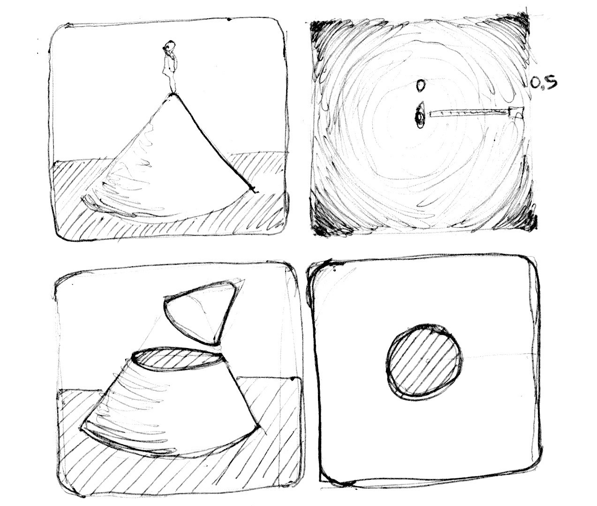

## Formas

Finalmente! A gente vem construindo habilidades para este momento! Você aprendeu a maioria das fundações, tipo s funções GLSL. Você praticou suas equações de formas várias vezes. Agora é a hora de juntar tudo. Você está pronto para este desafio! Neste capítulo, vai aprender como desenhar formas simples, de forma procedural paralela.

### Retângulo

Imagine que tenhamos um papel quadriculado como os que usamos nas aulas e exercícios de casa de matemática, e queremos desenhar um quadrado. O tamanho do papel é 10x10 e o quadrado deveria ser 8x8. O que você vai fazer?


Você pintaria tudo, menos a primeira linha e a última, e a primeira coluna e a última, certo?

E como isso se relaciona com os shaders? Cada quadradinho de nosso papel é uma thread (um pixel). Cada quadradinho sabe sua posição, como as coordenadas de um tabuleiro de xadrez. Em capítulos anteriores, nós mapeamos *x* e *y* para os canais de cores *vermelho* e *verde*, e aprendemos como usar o estreito território bidimensional entre 0.0 e 1.0. Como podemos usar isso para desenhar um quadrado centralizado no meio da nossa tela?

Vamos começar rascunhando um pseudocódigo que usa vários `if` no campo espacial. Os princípios para fazer isso são notavelmente similares ao modo que pensamos no cenário do papel quadriculado.

```glsl
if ( (X MAIOR QUE 1) AND (Y MAIOR QUE 1) )
    pinta de branco
else
    pinta de preto
```

Agora que temos uma ideia melhor de como isos vai funcionar, vamos substituir os `if` com [`step()`](../glossary/?search=step), e, em vez de usar 10x10, vamos usar valores normalizados entre 0.0 e 1.0:

```glsl
uniform vec2 u_resolution;

void main(){
    vec2 st = gl_FragCoord.xy/u_resolution.xy;
    vec3 color = vec3(0.0);

    // Cada resultado retorna  1.0 (branco) ou 0.0 (preto).
    float left = step(0.1,st.x);   // Similar a ( X maior que 0.1 )
    float bottom = step(0.1,st.y); // Similar a ( Y maior que 0.1 )

    // A multiplicação left*bottom vai ser similar ao AND lógico.
    color = vec3( left * bottom );

    gl_FragColor = vec4(color,1.0);
}
```

A função [`step()`](../glossary/?search=step) vai tornar cada pixel abaixo de 0.1 preto (`vec3(0.0)`) e o resto branco (`vec3(1.0)`) . A multiplicação entre `left` e `bottom` funciona como um `AND` lógico, onde os dois devem estar 1.0 para retornar 1.0. Isso desenha duas linhas pretas, uma no fundo, e outra na lado esquerdo do canvas.


No código anterior, repetimos a estrutura para cada eixo (esquerdo e fundo). Podemos economizar algumas linhas de código, passando 2 vaores diretamente para [`step()`](../glossary/?search=step) ao invés de apenas um. Seria algo assim:

```glsl
vec2 borders = step(vec2(0.1),st);
float pct = borders.x * borders.y;
```

Até agora, só desenhamos duas bordar (fundo-esquerda) de nosso retângulo. Vamos desenhar as outras duas (topo-direita). Veja esse código:

<div class="codeAndCanvas" data="rect-making.frag"></div>

Descomente as *linhas 21-22* e veja como invertemos as coordenadas `st` e repetimos a mesma função [`step()`](../glossary/?search=step). Desse jeito, o `vec2(0.0,0.0)` vai estar no canto superior direito. Isso é o equivalente digital a girar a página e repetir o mesmo procedimento.


Note que nas *linhas 18 e 22*, todos os lados estão sendo multiplicados juntos. É o mesmo que escrever:

```glsl
vec2 bl = step(vec2(0.1),st);       // bottom-left
vec2 tr = step(vec2(0.1),1.0-st);   // top-right
color = vec3(bl.x * bl.y * tr.x * tr.y);
```

Interessante, certo? Essa técnica é, basicamente, usar [`step()`](../glossary/?search=step) e multiplicação para operações lógicas, e flipar as coordenadas.

Antes de prosseguir, tente os exercícios a seguir:

* Mude o tamanho e as proporções do retângulo.

* Experimente com o mesmo código, mas usando [`smoothstep()`](../glossary/?search=smoothstep) no lugar de [`step()`](../glossary/?search=step). Note que, ao mudar os valores, você pode ir de beiradas embaçadas até elegantes bordas suaves.

* Faça uma outra implementação que use [`floor()`](../glossary/?search=floor).

* Escolha a implementação de que gostar mais, e faça uma função dela, que você possa reutilizar no futuro. Deixe sua função flexível e eficiente.

* Faça outra função que apenas desenhe o contorno do retângulo.

* Como você acha que poderia mover e colocar retângulos diferentes na mesma tela? Se descobrir como, mostre suas habilidades fazendo uma composição de retângulos e cores que se pareça com uma pintura de [Piet Mondrian](http://en.wikipedia.org/wiki/Piet_Mondrian).


### Círculos

É fácil desenhar quadrados em um papel quadriculado, e retângulos em coordenadas cartesianas, mas círculos requerem outra abordagem, especialmente porque precisamos de um algoritmo "por pixel". Uma solução é *remapear* as coordenadas espaciais de modo que possamos usar uma função [`step()`](../glossary/?search=step) para desenhar um círculo.

Como? Vamos começar, voltando um pouco às aulas de matemática e o papel quadriculado, onde nós abríamos um compasso até o raio do círculo, apertamos uma das pontas do compasso no centro do círculo, e então tracejamos o contorno do círculo com uma rodada do compasso.


Traduzindo isso para um shader, onde cada quadrado no papel é um pixel, implica em *perguntar* a cada pixel (ou thread) se ele está dentro da área do círculo. Fazemos isso calculando a distância do pixel até o centro do círculo.


Existem várias formas de se calcular essa distância. A mais fácil usa a função [`distance()`](../glossary/?search=distance), que, internamente, calcula o [`length()`](../glossary/?search=length) (comprimento) da diferença entre dois pontos (em nosso caso, a coordenada do pixel, e o centro da tela). A função `length()` nada mais é que um atalho para a [equação de hipotenusa](http://en.wikipedia.org/wiki/Hypotenuse) que usa raiz quadrada ([`sqrt()`](../glossary/?search=sqrt)) internamente.


Você pode usar [`distance()`](../glossary/?search=distance), [`length()`](../glossary/?search=length) ou [`sqrt()`](../glossary/?search=sqrt) para calcular a distância até o centro da tela. O código a seguir contém essas três funções e o fato não-surpreendente de que retornam o mesmo resultado.

* Comente e descomente as linhas para testar as diferentes formar de obter o mesmo resultado.

<div class="codeAndCanvas" data="circle-making.frag"></div>

No exemplo anterior, nós mapeamos a distância até o centro para o brilho da cor de cada pixel. Quanto mais ao centro está um pixel, mais escuro ele é (menor valor de cor). Note que os valores não ficam muito altos porque a partir do centro ( `vec2(0.5, 0.5)` ) a distância máxima mal passa de 0.5. Contemple esse mapa e pense:

* O que você pode inferir disso?

* Como podemos usar isso para desen um círculo?

* Modifique o código acima, de modo a conter o gradiente circular inteiro dentro do canvas.

### Campo de distância

Também podemos pensar no exemplo acima como um mapa de altitude, onde áreas mais escuras implicam em maior altura. O gradiente nos mostra algo similar ao padrão feito por um cone. Imagine-se no topo desse cone. A distância horizontal até a borda do cone é 0.5. Isso será constante em todas as direções. Escolhendo onde "cortar" o cone, vai te dar uma superfície circular maior ou menor.



Basicamente, estamos usando uma reinterpretação do espaço (baseado na distância até o centro) para fazer formas. Essa técnica é conhecida como "campo de distância" e é usada e diferentes modos, desde outlines de fontes até gráficos 3D.

Tente os seguintes exercícios:

* Use o [`step()`](../glossary/?search=step) para tornar tudo acima de 0.5 em branco e tudo abaixo para 0.0.

* Inverta as cores do fundo e do primeiro plano.

* Usando [`smoothstep()`](../glossary/?search=smoothstep), faça experiências com valores diferentes para conseguir uma borda suave no seu círculo.

* Uma vez que esteja feliz com uma implementação, faça uma função com ela, para reutilizar no futuro.

* Adicione cor ao círculo.

* Você pode animar seu círculo, para crescer e encolher, simulando a batida de um coração? (Você pode ter alguma inspiração, da animação do capítulo anterior)

* Que tal mover esse círculo? Você consegue movê-lo para lugares diferentes na tela?

* O que acontece se você combinar campos de distância usando diferentes funções e operações?

```glsl
pct = distance(st,vec2(0.4)) + distance(st,vec2(0.6));
pct = distance(st,vec2(0.4)) * distance(st,vec2(0.6));
pct = min(distance(st,vec2(0.4)),distance(st,vec2(0.6)));
pct = max(distance(st,vec2(0.4)),distance(st,vec2(0.6)));
pct = pow(distance(st,vec2(0.4)),distance(st,vec2(0.6)));
```

* Faça três composições usando essa técnica. Se forem animadas, melhor ainda!

#### Para sua caixa de ferramentas

Em termos de poder computacional, a função [`sqrt()`](../glossary/?search=sqrt) - e todas as que dependem dela - pode ser bem cara. Aqui vai outra forma de criar um campo de distância usando [`dot()`](../glossary/?search=dot) (produto escalar).

<div class="codeAndCanvas" data="circle.frag"></div>

### Propriedades úteis  de um Campo de Distância


Campos de Distância podem ser usados para desenhar quase tudo. Obviamente, quanto mais complexa for uma forma, mais complicada vai ser a equação, mas uma vez que você tenha a fórmula para fazer um campo de distância de uma forma específica, é muito fácil combinar e/ou aplicar efeitos a ela, como bordas suaves, e múltiplos outlines. Por causa disso, os campos de distância são populares para rendereizar fontes, como [Mapbox GL Labels](https://blog.mapbox.com/drawing-text-with-signed-distance-fields-in-mapbox-gl-b0933af6f817), [Matt DesLauriers](https://twitter.com/mattdesl) [Material Design Fonts](http://mattdesl.svbtle.com/material-design-on-the-gpu) e [ como descrito no capítulo 7 do livro iPhone 3D Programming, O’Reilly](http://chimera.labs.oreilly.com/books/1234000001814/ch07.html#ch07_id36000921).

Dê uma olhada no código a seguir.

<div class="codeAndCanvas" data="rect-df.frag"></div>

Começamos movendo o sistema de coordenadas para o centro e encolhendo-o pela metade, para remapear os valores de posição entre -1 e 1. Também, na *linha 24*, estamos visualizando os valores do campo de distância usando uma função [`fract()`](../glossary/?search=fract) para facilitar que você veja o padrão que eles criam. O padrão do campo de distância se repete o tempo todo, como anéis num jardim Zen.

Vamos dar uma olhada na fórmula do campo, na *linha 19*. Ali, estamos calculando a distância até a posição `(.3,.3)` ou `vec3(.3)` em todos os nossos quatro quadrantes (é isso o que o [`abs()`](../glossary/?search=abs) está fazendo aqui).

Se você descomentar a *linha 20*, vai notar que estamos combinando as distâncias para esses quatro pontos usando o [`min()`](../glossary/?search=min) para zero. O resultado produz um novo padrão bem interessante.

Agora, tente descomentar a *linha 21*; estamos fazendo o mesmo, mas usando a função [`max()`](../glossary/?search=max). O rsultado é um retângulo com cantos arredondados. Note como os anéis do cmapo ditância ficam mais suaves quanto mais disntantes do centro.

Termine de descomentar as *linhas 27 a 29* uma a uma, para entender os diferentes usos de um padrão de campo de distância.

### Formas Polares


No capítulo sobre sores, nós mapeamos as coordenadas cartesianas para coordenadas polares, calculando o *raio* e os *ângulos* de cada pixel com essa fórmula:

```glsl
vec2 pos = vec2(0.5)-st;
float r = length(pos)*2.0;
float a = atan(pos.y,pos.x);
```

Usamos parte desta fórmula no começo do capítulo para desenhar um círculo. Nós calculamos a distância até o centro usando [`length()`](../glossary/?search=length). Agora que sabemos sobre os os campos de distância, podemos aprender outra forma de desenhar formar, usando coordenadas polares.

Esta técnica é um pouco restritiva, mas bem simples. Ela consiste em mudar o raio de um círculo dependendo do ângulo, para obter formas diferentes. Como a modulação funciona? Sim, usando funções de formas!

Abaixo, você vai encontrar as mesmas funções do gráfico cartesiano e em um exemplo shader de coordenadas polares (entre as *linhas 21 e 25*). Descomente as funções uma a uma, prestando atenção na relação entre um sistema de coordenadas e o outro.

<div class="simpleFunction" data="y = cos(x*3.);
//y = abs(cos(x*3.));
//y = abs(cos(x*2.5))*0.5+0.3;
//y = abs(cos(x*12.)*sin(x*3.))*.8+.1;
//y = smoothstep(-.5,1., cos(x*10.))*0.2+0.5;"></div>

<div class="codeAndCanvas" data="polar.frag"></div>

Tente:

* Animar essas formas.
* Combinar funções de formas diferentes para *cortar buracos* na forma, para fazer flores, flocos de neve e engrenagens.
* Use a função `plot()` que usamos no capítulo sobre *Funções de Formas* para desenhar só o contorno.

### Combinando forças

Agora que aprendemos como modular o raio de um círculo de acordo com o ângulo, usando [`atan()`](../glossary/?search=atan) para desenhar formas diferentes, podemos aprender a usar `atan()` com campos de distância e aplicar todos os truques e efeitos possíveis com campos de distância.

O truque vai usar o número de lados de um polígono para construir o campo de distância, usando coordenadas polares. Veja o [seguinte código](http://thndl.com/square-shaped-shaders.html) do [Andrew Baldwin](https://twitter.com/baldand).

<div class="codeAndCanvas" data="shapes.frag"></div>

* Usando este exemplo, faça uma função que tem como entrada a posição e o número de lados de uma forma desejada, e retorna um valor de campo de distância.

* Misture campos de distância usando [`min()`](../glossary/?search=min) e [`max()`](../glossary/?search=max).

* Escolha um logo geométrico para replicar, usando campos de distância.

Parabéns! Você já passou pela parte mais dura! Dê uma pausa e deixe os conceitos assentarem - desenhar formas simples no Processing é fácil, mas não aqui. Na terra dos shaders, desenhar formas é difícil, e pode ser cansativo se adaptar a esse novo paradigma de programação.

Agora que você já sabe como desenhar formas, tenho certeza de que novas ideias vão pular na sua mente. No capítulo a seguir, você vai aprender como mover, rotacionar e mudar a escala das formas. Isso vai te permitir a fazer composições!
