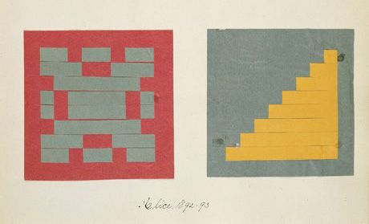

## Фигуры

Наконец то! Мы долго тренировались, и вот этот момент настал! Вы изучили большую часть зяыка GLSL, его типы и функции. Вы раз за разом упражнялись с одномерными функциями, составляя их в сложные формулы. И мы готовы к очередному витку синтеза полученных знаний. Вперёд! В этой главе мы научимся процедурно рисовать простые геометрические фигуры с помощью параллельных вычислений.

### Прямоугольник

Вообразите листок бумаги в клетку, как на уроке математики, где нам задали на дом нарисовать квадрат. Размер листа - 10х10, а квадрат должен быть 8х8. Справитесь?


Наверное, вы бы закрасили всё кроме верхней и нижней строки и кроме крайних столбцов, так?

Как это относится к шейдерам? Каждая клетка нашего листка - это один поток выполнения (то есть пиксель). Каждая клетка знает своё положение, будто это координаты на шахматной доске. В предыдущей главе мы отображали *x* и *y* в *красный* и *зелёный* цветовые каналы, и изучили как использовать узкий участок двумерной территории между 0.0 и 1.0. Как с помощью этого нарисовать квадрат в центре окна?

Начнём с псевдокода, использующего ветвление (`if`) над пространством. Принцип здесь тот же, что и в случае с бумагой в клеточку.

```glsl
if ( (X GREATER THAN 1) AND (Y GREATER THAN 1) ) // если ((х больше 1) и (y больше 1))
    paint white // красим в белый
else // иначе
    paint black // красим в чёрный
```

Теперь, когда мы знаем что делать, давайте заменим `if` на функцию [`step()`](../glossary/?search=step), а вместо листа 10х10 используем нормированные значения между 0.0 и 1.0.

```glsl
uniform vec2 u_resolution;

void main(){
    vec2 st = gl_FragCoord.xy/u_resolution.xy;
    vec3 color = vec3(0.0);

    // Каждый вызов вернёт 1.0 (белый) или 0.0 (чёрный).
    float left = step(0.1,st.x);   // То же, что ( X больше 0.1 )
    float bottom = step(0.1,st.y); // То же, что ( Y больше 0.1 )

    // Умножение left*bottom работает как логическое И.
    color = vec3( left * bottom );

    gl_FragColor = vec4(color,1.0);
}
```

Функция [`step()`](../glossary/?search=step) окрасит пиксели ниже 0.1 в чёрный (`vec3(0.0)`), а остальные - в белый (`vec3(1.0)`). Умножение `left` на `bottom` работает как логическое `И`, где оба значения должны быть равны 1.0 чтобы вернуть 1.0. Этот код нарисует две чёрных линии: снизу и слева изображения.


В коде выше мы повторяем одно и то же действие для обеих осей. Мы можем сэкономить несколько строк кода, передав в [`step()`](../glossary/?search=step) два значения вместо одного:

```glsl
vec2 borders = step(vec2(0.1),st);
float pct = borders.x * borders.y;
```

Итак, мы нарисовали две границы прямоугольника: нижнюю и левую. Давайте дорисуем верхнюю и правую. Рассмотрим следующий код:

<div class="codeAndCanvas" data="rect-making.frag"></div>

Раскомментируйте строки 21-22, чтобы обратить координаты `st` и повторить вызов [`step()`](../glossary/?search=step). Теперь `vec2(0.0,0.0)` окажется в верхнем правом углу. Это переворот страницы с повторением предыдущей процедуры.


Заметим, что в строках 18 и 22 все стороны прямоугольника перемножаются. В более развёрнутом виде это выглядит так:

```glsl
vec2 bl = step(vec2(0.1),st);       // низ и лево
vec2 tr = step(vec2(0.1),1.0-st);   // верх и право
color = vec3(bl.x * bl.y * tr.x * tr.y);
```

Интересно? Вся эта техника направлена на использование [`step()`](../glossary/?search=step), умножения в качестве логической операции и переворот координат.

Перед тем как продолжить, попробуйте выполнить упражнения:

* Измените размер и пропорции прямоугольника.

* Поэкпериментируйте с тем же кодом, используя [`smoothstep()`](../glossary/?search=smoothstep) вместо [`step()`](../glossary/?search=step). Изменяя значения интервала перехода, можно варьировать вид границ от размыливания до элегантного сглаживания.

* Реализуйте то же самое с помощью функции [`floor()`](../glossary/?search=floor).

* Выберете наиболее понравившуюся реализацию и сделайте из неё функцию, которую сможете использовать в будущем. Сделайте эту функцию гибкой и эффективной.

* Напишите функцию, которая рисует только контур прямоугольника.

* Каким образом вы будете рисовать несколько прямоугольников в одном окне и перемещать их? Если догадаетесь как это делается, попробуйте повторить композицию [Пита Мондриана](https://ru.wikipedia.org/wiki/%D0%9C%D0%BE%D0%BD%D0%B4%D1%80%D0%B8%D0%B0%D0%BD,_%D0%9F%D0%B8%D1%82).


### Круги

Очень просто рисовать квадраты на клетчатой бумаге и прямоугольники в декартовых координатах, но круги требуют иного подхода, особенно в наших попиксельных алгоритмах. Одно из решений - перейти к другим пространственным координатам, так чтобы можно было использовать функцию [`step()`](../glossary/?search=step) для рисования кругов.

Как? Давайте вернёмся к уроку математики и бумаге в клеточку. Раскроем циркуль на радиус круга, поставим иглу циркуля в центр и нарисуем окружность поворотом циркуля.


Переводя на язык шейдеров, где каждый пиксель подобен клетке на бумаге, мы должны будем *спросить* каждый пиксель (поток), лежит ли он внутри круга. Сделаем это, вычислив расстояние от пикселя до центра круга.


Есть несколько способов вычислить это расстояние. В простейшем случае используется функция [`distance()`](../glossary/?search=distance), внутри которой вычисляется длина ([`length()`](../glossary/?search=length)) разности между двумя точками (в нашем случае это пиксель и центр изображения). Функция `length()` - ни что иное, как короткое название для формулы длины [гипотенузы](https://ru.wikipedia.org/wiki/%D0%93%D0%B8%D0%BF%D0%BE%D1%82%D0%B5%D0%BD%D1%83%D0%B7%D0%B0), в которой используется квадратный корень ([`sqrt()`](../glossary/?search=sqrt)).


Для вычисления расстояния от центра изображения можно использовать [`distance()`](../glossary/?search=distance), [`length()`](../glossary/?search=length) или [`sqrt()`](../glossary/?search=sqrt). Следующий код демонстрирует все три функции и тот неудивительный факт, что они возвращают один и тот же результат.

* Закомментируйте и раскомментируйте строки, чтобы попробовать различные способы достижения одного и того же.

<div class="codeAndCanvas" data="circle-making.frag"></div>

В предыдущем примере мы отображаем расстояние от центра изображения в яркость пикселя. Чем ближе пиксель к центру, тем он темнее. Заметим, что яркость не становится слишком большой, так как максимальное расстояние до центра (`vec2(0.5, 0.5)`) не превышает 0.5. Внимательно рассмотрите это отображение и подумайте:

* Что из него можно вывести?

* Как им пользоваться для рисования круга?

* Измените код, чтобы весь весь круговой градиент вошёл в изображение.

### Поле расстояний

Пример выше можно рассматривать как карту высот, где темнее значит выше. Тогда круговой градиент является картой конуса. Представим, что мы стоим на вершине конуса. Расстояние до границы конуса по горизонтали равно 0.5, и оно одинаково во всех направлениях. Выбирая высоту разреза конуса горизонтальной плоскостью, мы можем получить окружность большего или меньшего размера.


Фактически, мы интерпретируем пространство в терминах расстояния до центра чтобы рисовать фигуры. Этот подход, известный как «поле расстояний», используется во многих областях, начиная от контуров шрифтов и заканчивая 3D-графикой.

Выполните следующие упражнения:

* Используйте [`step()`](../glossary/?search=step) чтобы превратить все что больше 0.5 в белый, а что меньше - в чёрный.

* Поменяйте местами цвета фона и фигуры.

* Используя [`smoothstep()`](../glossary/?search=smoothstep), добейтесь красивой гладкой границы круга.

* Возьмите понравившуюся реализацию и смастерите функцию для использования в будущем.

* Добавьте кругу цвет.

* Сделайте анимации увеличения и уменьшения круга, похожую на сердцебиение. Подчерпните вдохновение из анимаций в предыдущей главе.

* Как насчёт перемещения круга? Попробуйте подвинуть его и разместить несколько кругов на одном рисунке.

* Что произойдёт, если скомбинировать поля расстояний используя несколько функций и операций?

```glsl
pct = distance(st,vec2(0.4)) + distance(st,vec2(0.6));
pct = distance(st,vec2(0.4)) * distance(st,vec2(0.6));
pct = min(distance(st,vec2(0.4)),distance(st,vec2(0.6)));
pct = max(distance(st,vec2(0.4)),distance(st,vec2(0.6)));
pct = pow(distance(st,vec2(0.4)),distance(st,vec2(0.6)));
```

* Сделайте три композиции с помощью этой техники. Ещё лучше, если они будут движущимися!

#### Инструментарий

В терминах вычислительной мощности функция [`sqrt()`](../glossary/?search=sqrt) и все зависимые от неё функции довольно затратны. Есть другой способ создания круглых полей расстояний с помощью скалярного произведения ([`dot()`](../glossary/?search=dot)).

<div class="codeAndCanvas" data="circle.frag"></div>

### Полезные свойства поля расстояний


С помощью поля расстояний можно нарисовать что угодно. Очевидно, чем сложнее фигура, тем сложнее будет уравнение. Но при наличии формул для создания поля расстояний определённой формы, вы можете с лёгкостью комбинировать фигуры и применять к ним различные эффекты: сглаживание границ, рисование нескольких контуров и т.п. Поэтому поля расстояний находят широкое применение в рисовании шрифтов, например [Mapbox GL Labels](https://blog.mapbox.com/drawing-text-with-signed-distance-fields-in-mapbox-gl-b0933af6f817), [шрифты Material Design](http://mattdesl.svbtle.com/material-design-on-the-gpu) от [Matt DesLauriers](https://twitter.com/mattdesl) и [7 глава книги iPhone 3D Programming, издательство O’Reilly](http://chimera.labs.oreilly.com/books/1234000001814/ch07.html#ch07_id36000921).

Рассмотрим следующий код:

<div class="codeAndCanvas" data="rect-df.frag"></div>

Начнём со сдвига системы координат в центр и сжатия её в 2 раза, чтобы отобразить координаты в пространство между -1.0 и 1.0. В *строке 24* мы визуализируем поле расстояний с помощью [`fract()`](../glossary/?search=fract), чтобы было проще рассмотреть его рисунок. Рисунок поля расстояний повторяется снова и снова, как круги в дзенском саду.

Посмотрите на формулу поля расстояний в 19 строке. в ней мы рассчитываем расстояние до точки `(0.3, 0.3)` во всех четырёх квадрантах (именно для этого там нужен [`abs()`](../glossary/?search=abs).

Раскомментируя *строку 20*, мы сравним эти расстояния с нулём используя функцию [`min()`](../glossary/?search=min). В результате получится новый интересный рисунок.

Теперь раскомментируйте *строку 21*. Произойдёт то же самое, но с функцией [`max()`](../glossary/?search=max), что даст на выходе прямоугольник со скругленными углами. Обратите внимание как кольца поля расстояний становятся более гладкими с удалением от центра.

Наконец, раскомментируйте *строки 27 - 29* одну за другой и рассмотрите различные применения поля расстояний.

### Фигуры в полярных координатах


В главе про цвет мы переходили от декартовых координат в полярным, вычисляя *радиус* и *угол* каждого пикселя с помощью формул:

```glsl
vec2 pos = vec2(0.5)-st;
float r = length(pos)*2.0;
float a = atan(pos.y,pos.x);
```

В начале главы мы использовали часть этих формул для рисования круга. Мы вычисляли расстояние до центра функцией [`length()`](../glossary/?search=length). Теперь, вооружившись знаниями о полях расстояний, мы изучим другой способ рисования фигур в полярных координатах.

Этот подход немного ограничен, но очень прост. Мы будем изменять радиус окружности в зависимости от угла, чтобы получить различные фигуры. Как это работает? Конечно же, с помощью функций формы!

Ниже представлены одни и те же функции в декартовых и в полярных координатах (строки 21 - 25). Раскомментируйте функции одну за одной, обращая внимание на соотношение между системами координат.

<div class="simpleFunction" data="y = cos(x*3.);
//y = abs(cos(x*3.));
//y = abs(cos(x*2.5))*0.5+0.3;
//y = abs(cos(x*12.)*sin(x*3.))*.8+.1;
//y = smoothstep(-.5,1., cos(x*10.))*0.2+0.5;"></div>

<div class="codeAndCanvas" data="polar.frag"></div>

Попробуйте:

* Привести графики в движение.
* Комбинировать функции формы для *вырезания отверстий* в фигурах, чтобы создать цветы, снежинки и шестерёнки.
* Используйте `plot()` из *главы о функциях формы* чтобы нарисовать только контур.

### Сила комбинаций

Мы научились рисовать фигуры, манипулируя радиусом круга в зависимости от угла с помощью функции [`atan()`](../glossary/?search=atan). Теперь давайте попробуем использовать `atan()` совместно с полем расстояний чтобы применить его возможности к фигурам в полярных координатах.

В этом трюке для конструирования поля расстояний в полярных координатах используется количество граней многогранника. Изучите [следующий код](http://thndl.com/square-shaped-shaders.html), написанный [Эндрю Болдуином](https://twitter.com/baldand).

<div class="codeAndCanvas" data="shapes.frag"></div>

* Используя этот пример, напишите функцию, которая принимает положение и количество углов многогранника и возвращает значение поля расстояний в точке.

* Смешайте поля расстояний с помощью функции [`min()`](../glossary/?search=min) и [`max()`](../glossary/?search=max).

* Найдите какой-нибудь логотип из геометрических фигур и воспроизведите его в виде поля расстояний.

Поздравляю! Мы прошли трудную тему! Вдохните и дайте изученным принципам устояться. Рисовать фигуры - это просто в Processing, но не здесь. В мире шейдеров алгоритмы рисования фигур очень заковыристы, и адаптация к такой парадигме программирования может стоить значительных усилий.

В конце этой главы вы найдете ссылку на [PixelSpirit Deck] (https://patriciogonzalezvivo.github.io/PixelSpiritDeck/), эта колода карт поможет вам изучить новые функции SDF, объединить их в свои проекты и использовать на ваших шейдерах. Колода имеет предварительную кривую обучения, поэтому, взяв одну карту в день и работая над ней, вы испытаете свои навыки на месяцы.

Теперь, когда вы умеете рисовать фигуры, новые идеи будут появляться в вашей голове с огромной скоростью. В следующей главе мы научимся двигать, вращать и масштабировать фигуры. Вы сможете делать композиции!
