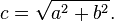

## Şekiller

Sonunda! Bu an için beceriler geliştiriyorduk! GLSL temellerinin, tiplerinin ve fonksiyonlarının çoğunu öğrendiniz. Şekillendirme denklemlerinizi tekrar tekrar pratik ettiniz. Şimdi hepsini bir araya koyma zamanı. Bu meydan okumaya hazırsınız! Bu bölümde basit şekilleri paralel prosedürel bir şekilde nasıl çizeceğinizi öğreneceksiniz.

### Dikdörtgen

Matematik derslerinde kullandığımız gibi bir kareli kağıdımız olduğunu ve ödevimizin bir kare çizmek olduğunu hayal edin. Kağıt boyutu 10x10 ve karenin 8x8 olması gerekiyor. Ne yaparsınız?


İlk ve son satırlar ile ilk ve son sütun dışında her yeri boyarsınız, değil mi?

Bu shader'larla nasıl ilişkilidir? Kareli kağıdımızın her küçük karesi bir iş parçacığıdır (bir piksel). Her küçük kare, bir satranç tahtasının koordinatları gibi konumunu bilir. Önceki bölümlerde *x* ve *y*'yi *kırmızı* ve *yeşil* renk kanallarına eşledik ve 0.0 ile 1.0 arasındaki dar iki boyutlu bölgeyi nasıl kullanacağımızı öğrendik. Tuvalimizin ortasında ortalanmış bir kare çizmek için bunu nasıl kullanabiliriz?

Uzaysal alan üzerinde `if` ifadeleri kullanan sözde kod taslağı çizerek başlayalım. Bunu yapmanın prensipleri, kareli kağıt senaryosu hakkında düşünme şeklimize son derece benzer.

```glsl
if ( (X GREATER THAN 1) AND (Y GREATER THAN 1) )
    paint white
else
    paint black
```

Artık bunun nasıl çalışacağı hakkında daha iyi bir fikrimiz olduğuna göre, `if` ifadesini [`step()`](../glossary/?search=step) ile değiştirelim ve 10x10 kullanmak yerine 0.0 ile 1.0 arasında normalize edilmiş değerler kullanalım:

```glsl
uniform vec2 u_resolution;

void main(){
    vec2 st = gl_FragCoord.xy/u_resolution.xy;
    vec3 color = vec3(0.0);

    // Her sonuç 1.0 (beyaz) veya 0.0 (siyah) döndürecektir.
    float left = step(0.1,st.x);   // ( X 0.1'den büyük ) ile benzer
    float bottom = step(0.1,st.y); // ( Y 0.1'den büyük ) ile benzer

    // left*bottom çarpımı mantıksal AND'e benzer olacaktır.
    color = vec3( left * bottom );

    gl_FragColor = vec4(color,1.0);
}
```

[`step()`](../glossary/?search=step) fonksiyonu 0.1'in altındaki her pikseli siyaha (`vec3(0.0)`) ve geri kalanını beyaza (`vec3(1.0)`) çevirecektir. `left` ile `bottom` arasındaki çarpma, mantıksal `AND` işlemi gibi çalışır; burada her ikisi de 1.0 olmalıdır ki 1.0 döndürülsün. Bu, tuvalin sol tarafında ve alt tarafında iki siyah çizgi çizer.


Önceki kodda her eksen (sol ve alt) için yapıyı tekrarlıyoruz. Bir yerine iki değeri doğrudan [`step()`](../glossary/?search=step)'e geçirerek bazı kod satırlarından tasarruf edebiliriz. Şöyle görünür:

```glsl
vec2 borders = step(vec2(0.1),st);
float pct = borders.x * borders.y;
```

Şu ana kadar dikdörtgenimizin sadece iki kenarını (sol-alt) çizdik. Diğer ikisini (sağ-üst) de yapalım. Aşağıdaki koda göz atın:

<div class="codeAndCanvas" data="rect-making.frag"></div>

`st` koordinatlarını nasıl tersine çevirdiğimizi ve aynı [`step()`](../glossary/?search=step) fonksiyonunu nasıl tekrarladığımızı görmek için *21-22. satırların* yorumunu kaldırın. Bu şekilde `vec2(0.0,0.0)` sağ üst köşede olacaktır. Bu, sayfayı çevirmenin ve önceki prosedürü tekrarlamanın dijital karşılığıdır.


*18 ve 22. satırlarda* tüm kenarların birlikte çarpıldığını not edin. Bu, şunu yazmaya eşdeğerdir:

```glsl
vec2 bl = step(vec2(0.1),st);       // sol-alt
vec2 tr = step(vec2(0.1),1.0-st);   // sağ-üst
color = vec3(bl.x * bl.y * tr.x * tr.y);
```

İlginç değil mi? Bu teknik tamamen [`step()`](../glossary/?search=step) kullanma, çarpma ile mantıksal işlemler yapma ve koordinatları çevirme ile ilgilidir.

İlerlemeden önce, aşağıdaki alıştırmaları deneyin:

* Dikdörtgenin boyutunu ve oranlarını değiştirin.

* [`step()`](../glossary/?search=step) yerine [`smoothstep()`](../glossary/?search=smoothstep) kullanarak aynı kodu deneyin. Değerleri değiştirerek bulanık kenarlardan zarif düzgün sınırlara geçebileceğinizi not edin.

* [`floor()`](../glossary/?search=floor) kullanan başka bir uygulama yapın.

* En çok beğendiğiniz uygulamayı seçin ve gelecekte yeniden kullanabileceğiniz bir fonksiyon yapın. Fonksiyonunuzu esnek ve verimli yapın.

* Sadece dikdörtgenin dış hatlarını çizen başka bir fonksiyon yapın.

* Aynı tuvalde farklı dikdörtgenleri nasıl hareket ettirip yerleştirebileceğinizi düşünüyor musunuz? Nasıl yapılacağını bulursanız, [Piet Mondrian](http://en.wikipedia.org/wiki/Piet_Mondrian) tablosuna benzeyen bir dikdörtgen ve renk kompozisyonu yaparak becerilerinizi sergileyin.


### Daireler

Kareli kağıda kareler ve Kartezyen koordinatlarda dikdörtgenler çizmek kolaydır, ancak daireler farklı bir yaklaşım gerektirir, özellikle "piksel başına" bir algoritmaya ihtiyacımız olduğundan. Bir çözüm, bir daire çizmek için [`step()`](../glossary/?search=step) fonksiyonunu kullanabilmemiz amacıyla uzaysal koordinatları *yeniden eşlemektir*.

Nasıl mı? Matematik dersine ve kareli kağıda geri dönerek başlayalım; burada pergeli dairenin yarıçapına açtık, pergelin bir ucunu dairenin merkezine bastırdık ve sonra basit bir dönüşle dairenin kenarını çizdik.


Bunu, kareli kağıdın her karesinin bir piksel olduğu bir shader'a çevirmek, her piksele (veya iş parçacığına) dairenin alanının içinde olup olmadığını *sormayı* gerektirir. Bunu, pikselden dairenin merkezine olan mesafeyi hesaplayarak yaparız.


Bu mesafeyi hesaplamanın birkaç yolu vardır. En kolay olanı, dahili olarak iki nokta arasındaki farkın [`length()`](../glossary/?search=length)'ini hesaplayan [`distance()`](../glossary/?search=distance) fonksiyonunu kullanır (bizim durumumuzda piksel koordinatı ve tuvalin merkezi). `length()` fonksiyonu, dahili olarak karekök ([`sqrt()`](../glossary/?search=sqrt)) kullanan [hipotenüs denkleminin](http://en.wikipedia.org/wiki/Hypotenuse) bir kısayolundan başka bir şey değildir.



Tuvalin merkezine olan mesafeyi hesaplamak için [`distance()`](../glossary/?search=distance), [`length()`](../glossary/?search=length) veya [`sqrt()`](../glossary/?search=sqrt) kullanabilirsiniz. Aşağıdaki kod bu üç fonksiyonu ve her birinin tam olarak aynı sonucu döndürdüğü şaşırtıcı olmayan gerçeği içerir.

* Aynı sonucu elde etmenin farklı yollarını denemek için satırları yorum satırı yapın ve yorumdan çıkarın.

<div class="codeAndCanvas" data="circle-making.frag"></div>

Önceki örnekte tuvalin merkezine olan mesafeyi pikselin renk parlaklığına eşledik. Bir piksel merkeze ne kadar yakınsa, o kadar düşük (koyu) değere sahiptir. Merkezden (`vec2(0.5, 0.5)`) maksimum mesafe 0.5'i zar zor aştığı için değerlerin çok yükselmediğine dikkat edin. Bu haritayı düşünün:

* Bundan ne çıkarabilirsiniz?

* Bunu bir daire çizmek için nasıl kullanabiliriz?

* Tüm dairesel gradyanı tuvalin içinde tutmak için yukarıdaki kodu değiştirin.

### Mesafe alanı

Yukarıdaki örneği, koyunun daha yüksek anlamına geldiği bir yükseklik haritası olarak da düşünebiliriz. Gradyan bize bir koninin oluşturduğu desene benzer bir şey gösterir. Kendinizi o koninin tepesinde hayal edin. Koninin kenarına olan yatay mesafe 0.5'tir. Bu tüm yönlerde sabit olacaktır. Koniyi nerede "keseceğinizi" seçerek daha büyük veya daha küçük bir dairesel yüzey elde edeceksiniz.


Temel olarak, şekiller yapmak için uzayın bir yeniden yorumunu (merkeze olan mesafeye dayalı) kullanıyoruz. Bu teknik "mesafe alanı" olarak bilinir ve yazı tipi taslağlarından 3D grafiklere kadar farklı şekillerde kullanılır.

Aşağıdaki alıştırmaları deneyin:

* 0.5'in üstündeki her şeyi beyaza ve altındaki her şeyi 0.0'a çevirmek için [`step()`](../glossary/?search=step) kullanın.

* Arka plan ve ön plan renklerini tersine çevirin.

* [`smoothstep()`](../glossary/?search=smoothstep) kullanarak, dairenizde güzel düzgün kenarlıklar elde etmek için farklı değerlerle denemeler yapın.

* Bir uygulamadan memnun olduğunuzda, gelecekte yeniden kullanabileceğiniz bir fonksiyon yapın.

* Daireye renk ekleyin.

* Atan bir kalbi simüle ederek dairenizi büyüyüp küçülecek şekilde canlandırabilir misiniz? (Önceki bölümdeki animasyondan ilham alabilirsiniz.)

* Bu daireyi hareket ettirmeye ne dersiniz? Tek bir tuvalde farklı daireleri hareket ettirip yerleştirebilir misiniz?

* Mesafe alanlarını farklı fonksiyonlar ve işlemler kullanarak birleştirirseniz ne olur?

```glsl
pct = distance(st,vec2(0.4)) + distance(st,vec2(0.6));
pct = distance(st,vec2(0.4)) * distance(st,vec2(0.6));
pct = min(distance(st,vec2(0.4)),distance(st,vec2(0.6)));
pct = max(distance(st,vec2(0.4)),distance(st,vec2(0.6)));
pct = pow(distance(st,vec2(0.4)),distance(st,vec2(0.6)));
```

* Bu tekniği kullanarak üç kompozisyon yapın. Animasyonlu olurlarsa daha da iyi!

#### Araç kutunuz için

Hesaplama gücü açısından [`sqrt()`](../glossary/?search=sqrt) fonksiyonu — ve ona bağlı tüm fonksiyonlar — pahalı olabilir. İşte [`dot()`](../glossary/?search=dot) çarpımını kullanarak dairesel bir mesafe alanı oluşturmanın başka bir yolu.

<div class="codeAndCanvas" data="circle.frag"></div>

### Mesafe alanının faydalı özellikleri


Mesafe alanları neredeyse her şeyi çizmek için kullanılabilir. Açıkçası bir şekil ne kadar karmaşıksa, denklemi de o kadar karmaşık olacaktır, ancak belirli bir şeklin mesafe alanlarını yapma formülüne sahip olduğunuzda, düzgün kenarlar ve çoklu dış hatlar gibi efektleri birleştirmek ve/veya uygulamak çok kolaydır. Bu nedenle mesafe alanları yazı tipi oluşturmada popülerdir, örneğin [Mapbox GL Labels](https://blog.mapbox.com/drawing-text-with-signed-distance-fields-in-mapbox-gl-b0933af6f817), [Matt DesLauriers](https://twitter.com/mattdesl) [Material Design Fonts](http://mattdesl.svbtle.com/material-design-on-the-gpu) ve [iPhone 3D Programming'in 7. Bölümünde, O'Reilly](https://www.oreilly.com/library/view/iphone-3d-programming/9781449388133/ch07.html#ch07_id36000844) tarif edildiği gibi.

Aşağıdaki koda bir göz atın.

<div class="codeAndCanvas" data="rect-df.frag"></div>

Koordinat sistemini merkeze taşıyarak ve konum değerlerini -1 ile 1 arasında yeniden eşlemek için yarıya küçülterek başlıyoruz. Ayrıca *24. satırda* mesafe alanı değerlerini [`fract()`](../glossary/?search=fract) fonksiyonuyla görselleştiriyoruz ve oluşturdukları deseni görmeyi kolaylaştırıyoruz. Mesafe alanı deseni bir Zen bahçesindeki halkalar gibi tekrar tekrar tekrarlanır.

*19. satırdaki* mesafe alanı formülüne bir bakalım. Orada dört çeyrekte de `(.3,.3)` veya `vec3(.3)` konumuna olan mesafeyi hesaplıyoruz (orada [`abs()`](../glossary/?search=abs)'in yaptığı budur).

*20. satırın* yorumunu kaldırırsanız, bu dört noktaya olan mesafeleri [`min()`](../glossary/?search=min) kullanarak sıfıra birleştirdiğimizi not edeceksiniz. Sonuç ilginç yeni bir desen üretir.

Şimdi *21. satırın* yorumunu kaldırmayı deneyin; aynı şeyi ama [`max()`](../glossary/?search=max) fonksiyonunu kullanarak yapıyoruz. Sonuç yuvarlatılmış köşeli bir dikdörtgendir. Mesafe alanı halkaların merkezden uzaklaştıkça nasıl daha düzgün hale geldiğine dikkat edin.

*27-29 arası satırların* yorumunu teker teker kaldırarak mesafe alanı deseninin farklı kullanımlarını anlayın.

### Kutupsal şekiller


Renkler bölümünde Kartezyen koordinatları, her pikselin *yarıçapını* ve *açısını* aşağıdaki formülle hesaplayarak kutupsal koordinatlara eşledik:

```glsl
vec2 pos = vec2(0.5)-st;
float r = length(pos)*2.0;
float a = atan(pos.y,pos.x);
```

Bu formülün bir kısmını bölümün başında bir daire çizmek için kullandık. [`length()`](../glossary/?search=length) kullanarak merkeze olan mesafeyi hesapladık. Artık mesafe alanları hakkında bilgi sahibi olduğumuza göre, kutupsal koordinatlar kullanarak şekil çizmenin başka bir yolunu öğrenebiliriz.

Bu teknik biraz kısıtlayıcıdır ama çok basittir. Farklı şekiller elde etmek için bir dairenin yarıçapını açıya bağlı olarak değiştirmekten oluşur. Modülasyon nasıl çalışır? Evet, şekillendirme fonksiyonları kullanarak!

Aşağıda aynı fonksiyonları Kartezyen grafikte ve kutupsal koordinatlar shader örneğinde (*21 ile 25 arası satırlar*) bulacaksınız. Bir koordinat sistemi ile diğeri arasındaki ilişkiye dikkat ederek fonksiyonların yorumunu teker teker kaldırın.

<div class="simpleFunction" data="y = cos(x*3.);
//y = abs(cos(x*3.));
//y = abs(cos(x*2.5))*0.5+0.3;
//y = abs(cos(x*12.)*sin(x*3.))*.8+.1;
//y = smoothstep(-.5,1., cos(x*10.))*0.2+0.5;"></div>

<div class="codeAndCanvas" data="polar.frag"></div>

Deneyin:

* Bu şekilleri canlandırın.
* Şekilde *delikler açmak* için farklı şekillendirme fonksiyonlarını birleştirerek çiçekler, kar taneleri ve dişliler yapın.
* *Şekillendirme Fonksiyonları Bölümünde* kullandığımız `plot()` fonksiyonunu kullanarak sadece konturu çizin.

### Güçleri birleştirme

Artık farklı şekiller çizmek için [`atan()`](../glossary/?search=atan) kullanarak bir dairenin yarıçapını açıya göre nasıl modüle edeceğimizi öğrendiğimize göre, `atan()`'ı mesafe alanlarıyla kullanmayı ve mesafe alanlarıyla mümkün olan tüm hile ve efektleri uygulamayı öğrenebiliriz.

İşin püf noktası, kutupsal koordinatlar kullanarak bir çokgenin kenar sayısını mesafe alanını oluşturmak için kullanmaktır. [Andrew Baldwin](https://twitter.com/baldand)'dan [aşağıdaki koda](http://thndl.com/square-shaped-shaders.html) göz atın.

<div class="codeAndCanvas" data="shapes.frag"></div>

* Bu örneği kullanarak, istenen bir şeklin konumunu ve köşe sayısını girdi olarak alan ve bir mesafe alanı değeri döndüren bir fonksiyon yapın.

* [`min()`](../glossary/?search=min) ve [`max()`](../glossary/?search=max) kullanarak mesafe alanlarını birbirine karıştırın.

* Mesafe alanlarını kullanarak çoğaltmak için geometrik bir logo seçin.

Tebrikler! Zorlu kısımı atlatınız! Bir mola verin ve bu kavramların yerleşmesine izin verin -- Processing'de basit şekiller çizmek kolaydır ama burada değil. Shader dünyasında şekil çizme sıra dışıdır ve bu yeni kodlama paradigmasına uyum sağlamak yorucu olabilir.

#### Araç kutunuz için

* [LYGIA'nın çizim fonksiyonları](https://lygia.xyz/draw) 2D şekiller ve desenler çizmek için yeniden kullanılabilir fonksiyonlar kümesidir. Mesafe alanları aracılığıyla daha karmaşık şekilleri birleştirmek için [LYGIA'nın SDF fonksiyonları klasörünü](https://lygia.xyz/sdf) de keşfedebilirsiniz. Yeniden kullanılabilirlik, performans ve esneklik için tasarlanmış çok ayrıntılı bir kütüphanedir. Ve herhangi bir projeye ve framework'e kolayca eklenebilir.

* Bu bölümün sonunda [PixelSpirit Deck](https://patriciogonzalezvivo.github.io/PixelSpiritDeck/) bağlantısını bulacaksınız, bu kart destesi yeni SDF fonksiyonlarını öğrenmenize, bunları tasarımlarınıza oluşturmanıza ve shader'larınızda kullanmanıza yardımcı olacaktır. Deste ilerlemeye dayalı bir öğrenme eğrisine sahiptir, bu yüzden her gün bir kart alıp üzerinde çalışmak becerilerinizi aylarca zorlayacaktır.

Artık şekil çizmeyi bildiğinize göre, aklınıza yeni fikirler geleceğinden eminim. Bir sonraki bölümde şekilleri nasıl taşıyacağınızı, döndüreceğinizi ve ölçeklendireceğinizi öğreneceksiniz. Bu, kompozisyonlar yapmanıza olanak tanıyacak!
