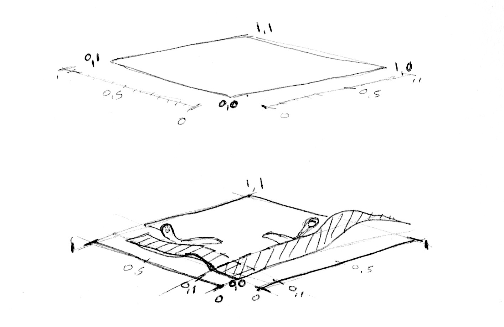
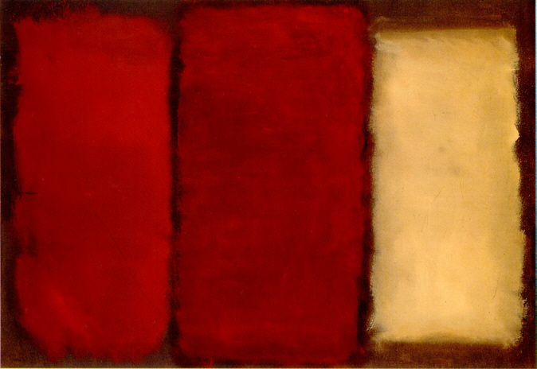

## Shapes


We have been building skill for this moment! We learn most of GLSL foundations, types and functions, together with the knowledge of how to use mathematical equations for shaping values. Now is time to put all that together. In this chapter we are going to learn how to draw simple shapes in a parallel procedural way.

### Rectangle

Think on the double gradient of *x* and *y* maped on the *red* and *green* color channels we did on the uniforms chapter. That's our field, our space and territory. How we can use it to draw a rectangle? 

* Sketch a peace of code that use ```if``` statements over that spacial field between 0.0 and 1.0 in *x* and *y*. 

Once you finish that excersise take a look to the following code and imagine what happen on it.

```glsl
#ifdef GL_ES
precision mediump float;
#endif

uniform vec2 u_resolution;
uniform float u_time;

void main(){
    vec2 st = gl_FragCoord.xy/u_resolution.xy;
    vec3 color = vec3(0.0);
    
    float left = step(0.1,st.x);
    float bottom = step(0.1,st.y);
    
    color = vec3( left * bottom );

    gl_FragColor = vec4(color,1.0);
}
```

Here we are using ```step()``` to turn everything bellow 0.1 to to 0.0. That will make a line on the left and bottom of the canvas.



Looking closely to the previous code, we repeat the structure for each side. That means we can save some lines of code by passing directly two values and treating them in the same way with the same function. Look closely the following code.

<div class="codeAndCanvas" data="rect-making.frag"></div>

To repeat this on the top and left sides we need to invert the ```st``` gradient. That way the ```vec2(0.0,0.0)``` will be on the top left corner.

#### Exercise

* Implement the same code using ```smoothstep()``` instead of ```step()```. Try different values to get different results, go from blurred edges to elegant antialiased borders.

* Do another implementation that use ```mod()```, ```ceil()```, ```floor()``` or ```fract()```.

* Choose the implementation you like the most and make it function you ca reuse in the future. Try to leave it flexible and efficient.

* Make another function to draw just the outline of the a rectagle.

* Make a composition of rectangles and colors that resemble a [Mark Rothko](http://en.wikipedia.org/wiki/Mark_Rothko) painting.



### Circles

Circles requeire another approach. Rectangles were relative easy because of how the cartesian space works. For cicles, we can take advantage again of the polar coordinate system just like we did in the previus chapter. This time we 
just need to calculate the distance to the center. All the points in the circunsference of a circle will have the same distance to the center so we can use this to trace the limits of this shape.

There are several ways to calculate that. The easiest one is just using ```distance()``` functions, which internally get the ```length()``` of the difference between two points (in our case the fragment coordinate and the center of the canvas). The ```length()``` function is nothing but a shortcut of the [hypotenuse equation](http://en.wikipedia.org/wiki/Hypotenuse) that use square root (```sqrt()```) internally.


Take a look to the following code paying attention to what we do with the space coordinates.

<div class="codeAndCanvas" data="circle-making.frag"></div>

The closer to the center we get the lower (darker) the values becomes. Values don't get to high because from the center ( ```vec2(0.5, 0.5)``` ) the maximum distance barely goes over 0.5. Think this pattern or gradiant as a map and think: 

* What you can infer from it? 

* How we can use it to draw circle?

* Comment and uncomment lines to try the different ways to get the same result.

* Modify the above code in order to contain the circular gradient inside the canvas.

### Distance field

Go back to the example above. Imagine this as an altitude map. The gradient show us the pattern of something shape similar to a cone view from above. Imagie your self on the top of that cone, you hold to tip of a ruled tape while you drop the rest. Because you are in the center of the canvas, the ruler will mark "0.5" in the extreme. This will be constant in all your directions. Buy choosing where to cut horizontally the cone you will get a bigger or smaller circular surface. 


This way of undersanding gradients as spacial information can be combined, once again with the shaping functions we have seen to get interesting results. This technique is known as “distant field” and is use in diferent ways from font outlines to 3D graphics.

Try the following excersises:
 
* Use ```set()``` to turn everything above 0.5 to white and everything bellow to 0.0

* Inverse the colors of the background and foreground.

* Using ```smoothstep()``` experiment trying different values to get nice antialiased borders on your circle.

* Once you are happy with your exercises result make a function of it that you can re-use in the future. 

* Can you animate your circle to grow and shrink simulating a beating heart?

* Use your function to mask a color with it.

* Make three compositions using just circles. Then animate them. \

#### For your tool box

* This is another way to create a circular distance field by using ```dot()``` product. This last one is slyly less expensive (in terms of computational power) than ```sqrt()```.

<div class="codeAndCanvas" data="circle.frag"></div>

### More about shapes and distance fields

Distance fields can be use to draw almost everything. Obviously the complex the shape is, the more complicated the equation will be, but it pays off; a convenient feature of this technique is the ability to smooth edges. Because the “topological” nature of them, sharp edges get blended together producing softer edges the more away you are from the center you sample. This is particularly useful on fonts rendering.

Take a look to the following code and note how the space is remaped in this topographical. Like concentric rings of a Zen garde the distance field values get smooth and rounders the further away they are from the center.

<div class="codeAndCanvas" data="triangle-making.frag"></div>

If you play with the code you will discover that inside the triangle there is a negative area. Which in oposition makes shapes extremely sharp to the extreme. Because the values are under zero we can not see the diference but by changing ```fract()``` by ```sin()``` in line 42 you can see the triangle go shrink until disapear. This signed propertyis particular of **Signed Distance Fields**.

### Polar shapes

In the chapter about color we map the cartesian coordinates to polar coordinates by calculating the radius and angles of each pixel with the following formula:

```glsl
    vec2 pos = vec2(0.5)-st;
    float r = length(pos)*2.0;
    float a = atan(pos.y,pos.x);
```

In the previus examples we have use the radius (from the center) to draw a circles, now that we have knowing the angle we can modulate the edges to modify the shape of it. How? Yes! Shaping functions!

Below you will find the same functions in the cartesian graph and in a polar coordinates shader example (between lines 21 and 26). Uncomment one by one the functions paying atention the relationship between one coordinate system and the other

<div class="simpleFunction" data="y = cos(x*3.);
//y = abs(cos(x*3.));
//y = abs(cos(x*2.5))*0.5+0.3;
//y = abs(cos(x*12.)*sin(x*3.))*.8+.1;
//y = smoothstep(-.5,1., cos(x*10.))*0.2+0.5;"></div>

<div class="codeAndCanvas" data="polar.frag"></div>

Try to:

* Animate this shapes
* Combine diferent shaping functions to *cut holes* on the shape to make better flowers, snowflakes and gears.
* Use the ```plot()``` function we were using on the *Shaping Functions Chapter* to draw just the contour.

Congratulations! You have made it through the rough part! Take a break and let this concepts sediment, drawing simple shapes on Processing is really easy but not here. In shader-land everything the way to thing on shapes is twisted and can be exhasting to adpt to this new paradigm of coding. 

Now that you know how to draw shapes I'm sure new ideas will pop to your mind. In the following chapter we will learn more about how to move, rotate and scale them moving. This will allow you to compose them!
