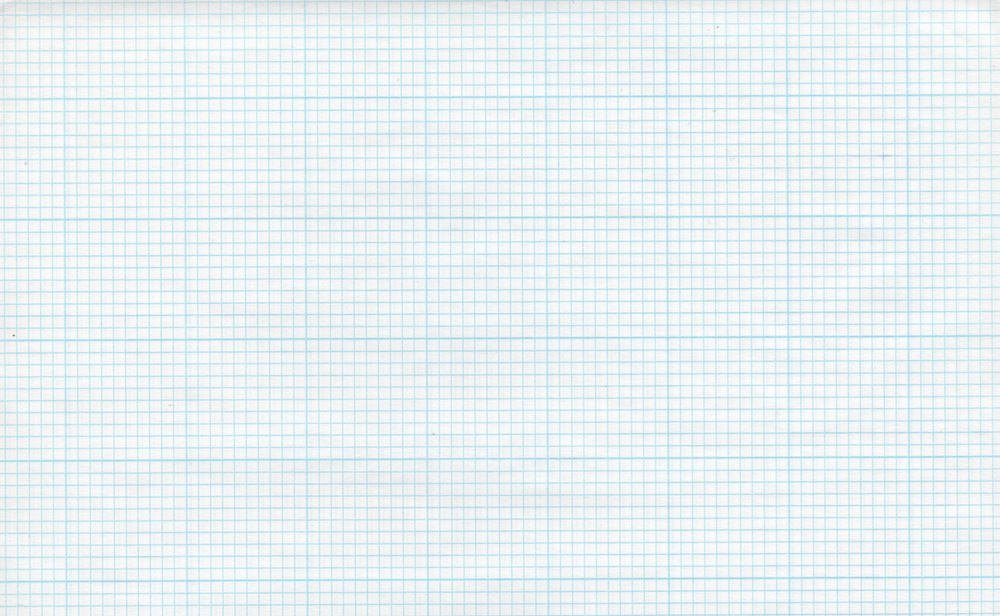
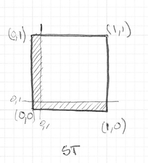

## Shapes


Finally! We have been building skill for this moment! You had learned most of the GLSL foundations, types and functions. You had practiced your shaping equations over and over. Now is time to put all that together. You are up for this challenge! In this chapter we are going to finally learn how to draw simple shapes in a parallel procedural way. 

### Rectangle

Imagine we have a grid paper, like the one we used on math classes, and the homework is to draw a square. The paper size is 10x10 and the square suppose to be 8x8. What you will do?



You paint everything except the last and first rows and last and first column. Right? How this relates to shaders? Each little scare of our grid paper is a thread (a pixel). Each little square knows their position, like the coordinates of a chess board. In previous chapters he have mapped *x* and *y* to the *red* and *green* color channels, we learn that’s our field and space. A narrow two dimensional territory between 0.0 and 1.0. How we can use it to draw a centered square in the middle of our billboard?

* Sketch a peace of code that use ```if``` statements over our spacial field. The principles to do it is remarkable similar to how we think it on the grid paper scenario.

Well done! This is a great step and accomplish. And speaking about steps, how can we simplify this code that use ```if``` statements with [```step()```](../glossary/index.html#step.md) functions? Take a look to the following code.

```glsl
#ifdef GL_ES
precision mediump float;
#endif

uniform vec2 u_resolution;
uniform float u_time;

void main(){
    vec2 st = gl_FragCoord.xy/u_resolution.xy;
    vec3 color = vec3(0.0);
    
    float left = step(0.1,st.x);
    float bottom = step(0.1,st.y);
    
    color = vec3( left * bottom );

    gl_FragColor = vec4(color,1.0);
}
```

Here we are using [```step()```](../glossary/index.html#step.md) to turn everything bellow 0.1 to black color (```vec3(0.0)```). That will make a line on the left and bottom of the canvas.



If we look close, on the previous code we repeat the structure for each axis (left and bottom). We can save some lines of code by passing to [```step()```](../glossary/index.html#step.md)directly two values and treating them in the same way with the same function. Check the following code.

<div class="codeAndCanvas" data="rect-making.frag"></div>

But this rectangle is not centered, is in the top right corner. We need to “take out” equal peaces on both extremes on left-bottom and tight-top to obtain a centered square.

So, to repeat this on the top-right side by uncommenting lines 21 and 22 we invert the ```st``` gradient and repeat the same [```step()```](../glossary/index.html#step.md) function. That way the ```vec2(0.0,0.0)``` will be on the top right corner. This is the digital equivalent of flipping the page and repeating the previous procedure.


Interesting right? This drawing method work per square with the supposition that each one only know it coordinate position. That's why this drawing technique is all about flipping and stretching this coordinate system.

Before going forward, let’s use the simplicity of the rectangle as a training case. Try the following challenges:

* Can you simplify lines between 16 and 21 in a two single lines? What about one line?

* Experiment with the same code but using [```smoothstep()```](../glossary/index.html#smoothstep.md) instead of [```step()```](../glossary/index.html#step.md). Note that by changing values, you can go from blurred edges to elegant antialiased borders.

* Do another implementation that use ```floor()```.

* How you can draw rectangles of different sizes instead of just squares.

* Choose the implementation you like the most and make a function of it that you can reuse in the future. Leave it flexible and efficient.

* Make another function that just draw the outline of a rectangle.

* How do you think we can move and place different rectangles in a  same billboard? If you figurate out how, show of your skills making a composition of rectangles and colors that resemble a [Piet Mondrian](http://en.wikipedia.org/wiki/Piet_Mondrian) painting.


### Circles

Is easy to draw squares on grid paper, in the same way is simple to draw rectangles on cartesians coordinates. But circles requires another approach, specially if we need to come up with a "per-pixel" or "per-square" approach. One solution is to *re-map* the spacial coordinates in a way that we just need to use a ```step()``` function to draw. 

How? Let's start by going back to math class and the grid paper. If you remember we used to open a compass at the desired radius of a circle, then press one of the compass endings at the center of the circle position and then finally trace the contour of it with a simple spin.


Porting this to a shader where each square on the grid is a pixel implies *asking* each pixel (or thread) if they are inside the area of the circle. Right? We can know that area by computing the distance to the center of the center of the circle. 


There are several ways to calculate that. The easiest one is just using the ```distance()``` functions, which internally computes the ```length()``` of the difference between two points (in our case the pixel coordinate and the center of the canvas). The ```length()``` function is nothing but a shortcut of the [hypotenuse equation](http://en.wikipedia.org/wiki/Hypotenuse) that use square root (```sqrt()```) internally.


So far I just describe three functions you can use (```distance()```, ```length()``` and ```sqrt()```) to calculate the distance to the center of the billboard. The following code contain this three functions and the non-surprising fact that each one return the exactly same result.

<div class="codeAndCanvas" data="circle-making.frag"></div>

* Comment and uncomment lines to try the different ways to get the same result.

In the previous example we are matching the distance to the center of the billboard to the color brightness of the pixel. The closer the pixel is to the center the lower (darker) values it have. Is important to notice that the values don't get to high because from the center ( ```vec2(0.5, 0.5)``` ) the maximum distance barely goes over 0.5. Contemplate this map and think:

* What you can infer from it? 

* How we can use this to draw a circle?

* Modify the above code in order to contain the circular gradient inside the canvas.

### Distance field

Imagine the above example as an inverse altitude map. The darker the taller. The gradient show us something similar the pattern made by a cone. Imagine your self on the top of that cone, under your foot you hold the tip of a ruled tape while the rest of it goes down the hill. Because you are in the center of the canvas, the ruler will mark "0.5" in the extreme. This will be constant in all your directions. Buy choosing where to “cut” cone you will get a bigger or smaller circular surface.


Basically we are using a re-interpretation of the space (based on the distance to the center) to make shapes. This technique is known as “distant field” and is use in different ways from font outlines to 3D graphics.

Try the following excursuses:
 
* Use ```set()``` to turn everything above 0.5 to white and everything bellow to 0.0

* Inverse the colors of the background and foreground.

* Using ```smoothstep()``` experiment trying different values to get nice antialiased borders on your circle.

* Once you are happy with an implementation make a function of it that you can reuse in the future. 

* Use your function to mask a color with it.

* Can you animate your circle to grow and shrink simulating a beating heart?

* What about moving this circle? Can you move an place different circles in a single billboard?

* What happen if you combine distances fields together using different functions and operations.

```glsl
pct = distance(st,vec2(0.4)) + distance(st,vec2(0.6));
pct = distance(st,vec2(0.4)) * distance(st,vec2(0.6));
pct = min(distance(st,vec2(0.4)),distance(st,vec2(0.6)));
pct = max(distance(st,vec2(0.4)),distance(st,vec2(0.6)));
pct = pow(distance(st,vec2(0.4)),distance(st,vec2(0.6)));
```

* Make three compositions using this technique. If they are animated better!

#### For your tool box

In terms of computational power ```sqrt()``` function (and all the once that depend on it) can be expensive. Here is another way to create a circular distance field by using ```dot()``` product.

<div class="codeAndCanvas" data="circle.frag"></div>

### Useful properties of a Distance Field


Distance fields can be use to draw almost everything. Obviously the complex the shape is, the more complicated the equation will be, but it pays off; once you have the formula to make distance fields of particular shape is very easy to combine and/or apply effect to it, like smooth edges and multiple outlines. Because of this, distances field are popular in font rendering.

Take a look to the following code.

<div class="codeAndCanvas" data="rect-df.frag"></div>

We start by moving moving the coordinates system to the center and shrieked to the half in order to contain the position values between -1 and 1. Also on *line 24* we are visualizing the distance field values using a ```fract()``` function making it easy to see the pattern they conform. The distance field pattern repeating over and over like rings in a Zen garden.

Let’s take a look to the distance field formula on *line 19*. There we are calculating the distance to the position on ```.3,.3``` or ```vec3(.3)``` in all four sign permutations ( that’s what ```abs()``` is doing there). 

If you uncomment *line 20*, you will note that we are combining the distances to this four point using the ```min()``` to zero. The result produce an interesting new pattern.

Now try uncommenting *line 21*, we are doing the same but using the ```max()``` function. the resultant is a rectangle with rounded corners. Note how the rings of the distance field get smoother the further away they get from the center.

Finish uncommenting the *lines 26 to 29* one by one to understand the different uses of a distance field pattern.

### Polar shapes


In the chapter about color we map the cartesian coordinates to polar coordinates by calculating the *radius* and *angles* of each pixel with the following formula:

```glsl
    vec2 pos = vec2(0.5)-st;
    float r = length(pos)*2.0;
    float a = atan(pos.y,pos.x);
```

We partially use this formula at the beginning of this chapter to draw a circle. We were calculating the distance to the center using ```length()```. Now that we learn about distance fields we  can learn another way of drawing shapes using polar coordinates. 

The technique is a little restrictive but very simple. It consist on modulating the radius of a circle depending on the angle to achieve different shapes. How the modulation work? Yes, using Shaping functions!

Below you will find the same functions in the cartesian graph and in a polar coordinates shader example (between *lines 21 and 26*). Uncomment one by one the functions paying attention the relationship between one coordinate system and the other

<div class="simpleFunction" data="y = cos(x*3.);
//y = abs(cos(x*3.));
//y = abs(cos(x*2.5))*0.5+0.3;
//y = abs(cos(x*12.)*sin(x*3.))*.8+.1;
//y = smoothstep(-.5,1., cos(x*10.))*0.2+0.5;"></div>

<div class="codeAndCanvas" data="polar.frag"></div>

Try to:

* Animate this shapes
* Combine different shaping functions to *cut holes* on the shape to make better flowers, snowflakes and gears.
* Use the ```plot()``` function we were using on the *Shaping Functions Chapter* to draw just the contour.

### Combining powers

Now that we learn how to modulate that radius of a circle according to the angle using the `atan()` to draw different shapes, we can learn how to make distance fields with it and apply all the tricks and effect you can do with them. 

The trick will consist on use the number of edges of a polygon to construct the distance field using polar coordinates. Check the following code from [Andrew Baldwin](https://twitter.com/baldand) [one of his blog post](http://thndl.com/square-shaped-shaders.html) 

<div class="codeAndCanvas" data="shapes.frag"></div>

* Using this example, make a function that given the position and number of corners of a desired shape, return a distance field value.

* Mix distance fields together using ```min()``` and ```max()```.

* Choose a geometric logo to replicate using distance fields.

Congratulations! You have made it through the rough part! Take a break and let this concepts sediment, drawing simple shapes on Processing is really easy but not here. In shader-land everything the way to thing on shapes is twisted and can be exhausting to adapt to this new paradigm of coding. 

Now that you know how to draw shapes I'm sure new ideas will pop to your mind. In the following chapter we will learn more about how to move, rotate and scale them moving. This will allow you to compose them!
