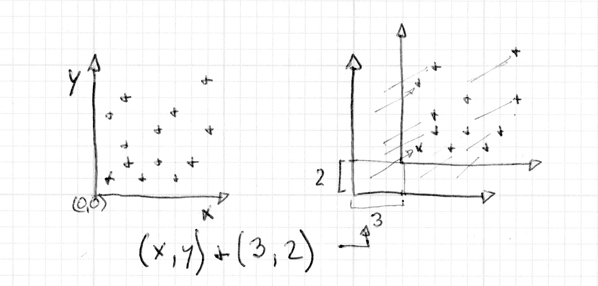
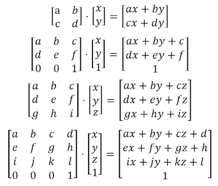
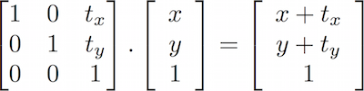
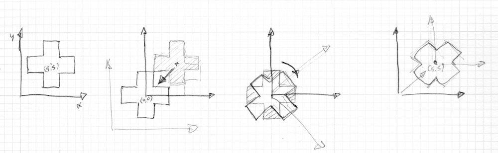
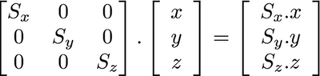

## 2D Matrices 二维矩阵

<canvas id="custom" class="canvas" data-fragment-url="matrix.frag"  width="700px" height="200px"></canvas>

### 平移

之前的章节我们学习了如何制作一些图形 - 而如何移动它们的技巧则是借助移动它们自身的参考坐标系。我们只需要给 ```st``` 变量加上一个包含每个片段的位置的向量。这样就移动了整个坐标系。



还是画着比较更容易解释，如上图所示：

* 取消下面代码中第35行的注释，看下坐标空间是如何平移的。

<div class="codeAndCanvas" data="cross-translate.frag"></div>

现在尝试下下面的练习：

* 结合 ```u_time``` 和造型函数来移动十字，并试着让它有趣一点。找一个你觉得你感兴趣的某种运动形式，让这个十字也这样运动。记录“真实世界”的一些现象或许对你有所启发 — 可以是波的运动，摆动，弹球，汽车的加速运动，一辆自行车的刹车。


### 旋转

要移动物体，我们同样需要移动整个空间（坐标）系统。为此我们将使用一个[矩阵](http://en.wikipedia.org/wiki/Matrix_%28mathematics%29)。矩阵是一个通过行和列定义的一组数。用矩阵乘以一个向量是用一组精确的规则定义的，这样做是为了以一组特定的方式来改变向量的值。

[](https://en.wikipedia.org/wiki/Matrix)

GLSL本身支持2维，3维和4维方阵（m*m矩阵）：[```mat2```](../glossary/?search=mat2) (2x2), [```mat3```](../glossary/?search=mat3) (3x3) 和 [```mat4```](../glossary/?search=mat4) (4x4)。GLSL同样支持矩阵相乘 (```*```)和特殊矩阵函数([```matrixCompMult()```](../glossary/?search=matrixCompMult))。

基于矩阵的特性，我们便有可能构造一个矩阵来产生特定的作用。比如我们可以用一个矩阵来平移一个向量：



更有趣的是，我们可以用矩阵来旋转坐标系统：


看下下面构成2维旋转的矩阵的代码。这个函数根据上面的[公式](http://en.wikipedia.org/wiki/Rotation_matrix)，将二维向量绕 ```vec2(0.0)``` 点旋转。

```glsl
mat2 rotate2d(float _angle){
    return mat2(cos(_angle),-sin(_angle),
                sin(_angle),cos(_angle));
}
```

根据以往我们画形状的方式，这并不是我们想要的。我们的十字是画在画布中心的，对应于点 ```vec2(0.5)``` 。所以，再旋转坐标空间之前，我们需要先把图形移到中心点，坐标 ```vec2(0.0)``` ，再旋转坐标空间，最后在移动回原点。



就像下面的代码：

<div class="codeAndCanvas" data="cross-rotate.frag"></div>

试试下面的练习：

* 取消第45行的代码，看看会发生什么。

* 在37行和39行，将旋转之前的平移注释掉，观察结果。

* 用旋转改进在平移练习中模拟的动画。

### 缩放

我们看到了如何用矩阵平移和旋转物体。（或者更准确的说，如何通过变换坐标系统来旋转和移动物体。）如果你用过3D建模软件或者 Processing中的 pushmatrix 和 popmatrix 函数，你会知道矩阵也可以被用来缩放物体的大小。



根据上面的公式，我们知道如何构造一个2D缩放矩阵：

```glsl
mat2 scale(vec2 _scale){
    return mat2(_scale.x,0.0,
                0.0,_scale.y);
}
```

<div class="codeAndCanvas" data="cross-scale.frag"></div>


试试下面的练习，尝试深入理解矩阵的工作机制：

* 取消上面代码中的第42行来观察空间坐标是如何被缩放的。

* 看看注释掉37和39行，变换之前和之后的缩放，会发生什么。

* 试着结合旋转矩阵和缩放矩阵。注意他们的先后顺序。先乘以一个矩阵，再乘以向量。

* 现在你知道如何画不同的图形，知道如何移动，旋转和缩放它们，是时候用这些来创作了。设计一个[fake UI or HUD (heads up display)](https://www.pinterest.com/patriciogonzv/huds/)。参考[Ndel](https://www.shadertoy.com/user/ndel)在ShaderToy上的例子。

<iframe width="800" height="450" frameborder="0" src="https://www.shadertoy.com/embed/4s2SRt?gui=true&t=10&paused=true" allowfullscreen></iframe>

### Other uses for matrices: YUV color 矩阵的其他应用：YUV 颜色


[YUV](http://en.wikipedia.org/wiki/YUV) 是个用来模拟照片和视频的编码的色彩空间。这个色彩空间考虑人类的感知，减少色度的带宽。

下面的代码展现一种利用GLSL中的矩阵操作来切换颜色模式的有趣可能。

<div class="codeAndCanvas" data="yuv.frag"></div>


正如你所见，我们用对向量乘以矩阵的方式对待色彩。用这种方式，我们“移动”这些值。

这章我们学习如何运用矩阵变换来移动，旋转和缩放向量。除了之前章节学的图形，这些变换是创作的基础。在接下来的章节我们会应用我们所学的制作漂亮的程序纹理。你会发现编程的重复性和多样性是种令人兴奋的实践。
