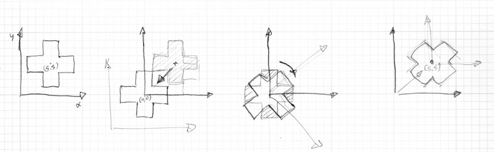

## Matrices 2D

<canvas id="custom" class="canvas" data-fragment-url="matrix.frag"  width="700px" height="200px"></canvas>

### Translation

Au chapitre précédent, nous avons vu comment créer des formes, l'astuce pour déplacer une forme consistait à déplacer le système de coordonnées lui-même.
Nous opérions cette translation en ajoutant un vecteur 2d à la variable ```st``` contenant la position du fragment ce qui avait pour conséquence de décaler la position de l'ensemble des fragments en cours de traitement.


Un exemple sera sans doute plus explicite :

* Décommentez la ligne 35 du code ci-dessous pour voir le système de coordonnées bouger.

<div class="codeAndCanvas" data="cross-translate.frag"></div>

Essayez l'exercice suivant :

* Servez vous d'```u_time``` et des fonctions de formes pour déplacer la croix de façon intéressante.
Pensez à un type de mouvement et tentez de l'appliquer à la croix. Prenez des exemples de la "vraie vie", ça aide! Par exemple, un mouvement de vagues, un pendule, une balle qui rebondit, un vélo qui freine, etc.

### Rotations

Pour effectuer une rotation, nous devons transformer tout le système de coordonnées.
Pour nous aider, nous allons utiliser un objet [matrix](http://en.wikipedia.org/wiki/Matrix_%28mathematics%29) qui permet de manipuler une matrice de transformation 2D.
Une matrice est un objet organisé en 'grille', elle se compose de colonnes et de rangées de chiffres.
Lorsqu'on multiplie un vecteur par une matrice, la matrice exécute une série d'opérations, dans un certain ordre et *transforme* le vecteur en fonction des valeurs qu'elle contient.

C'est pourquoi on les appelle souvent des *matrices de transformations*, la plupart des APIs graphiques - tout support confondu - proposent une matrice de transformation 2D, 3D ou 4D.
Les matrices permettent de stocker plusieurs types de transformations (le plus souvent : translation, rotation et échelle) dans un objet compact et utilisable sur des vecteurs.

Pour en savoir plus, référez vous à l'article Wikipédia sur les matrices: [](https://fr.wikipedia.org/wiki/Matrice_(math%C3%A9matiques))

Le GLSL supporte nativement les matrices à deux, trois et quatre dimensions: [```mat2```](../glossary/?search=mat2) (2x2), [```mat3```](../glossary/?search=mat3) (3x3) et [```mat4```](../glossary/?search=mat4) (4x4).
Le GLSL surcharge certains opérateurs, notamment la multiplication et offre des fonctions spécifiques comme [```matrixCompMult()```](../glossary/?search=matrixCompMult), qui effectue un produit scalaire des composants des matrices passées en argument.

Les matrices sont très utiles et permettent d'obtenir des transformations et des comportements spécifiques.
Par exemple, on peut utiliser une matrice pour appliquer une translation à un vecteur :


La matrice est à gauche, les valeurs de translation *tx* et *ty* (la quantité de déplacement en x et en y) sont stockées à un endroit précis de la matrice (troisième colonne, rangées 1 et 2). le vecteur 2D que nous voulons transformer est au centre, le point entre les deux représente une multiplication et le résultat est à droite.

Une matrice permet également d'effectuer une rotation :


Notez que les valeurs de rotations (*cos()* et *sin()*) sont décrites à un endroit (colonnes, rangées) différent des valeurs de translation (*tx* et *ty*).
C'est ce qui permet de stocker plusieurs transformations dans la même matrice.

Le code suivant montre comment construire une matrice de rotation 2D.
Cette fonction s'appuie sur [la formule suivante](https://fr.wikipedia.org/wiki/Matrice_de_rotation) pour faire pivoter un vecteur 2D autour de l'origine du système de coordonnées : le point ```vec2(0.0)```.

```glsl
mat2 rotate2d(float _angle){
    return mat2(cos(_angle),-sin(_angle),
                sin(_angle),cos(_angle));
}
```

Cette manière d'effectuer une rotation (autour de l'origine) ne marche pas avec l'approche que nous avons eu jusqu'à présent pour dessiner les formes.
En effet notre croix est dessinée au centre du canvas (le point ```vec2(0.5)```) alors que la rotation se fait autour de l'origine (le point ```vec2(0.0)```).
Donc, avant d'effectuer la rotation, nous devons déplacer la forme du `centre` vers l'origine ```vec2(0.0)```, appliquer la rotation puis re-déplacer la forme au `centre` du canvas.



Le code ressemble à ça:

<div class="codeAndCanvas" data="cross-rotate.frag"></div>

Essayez les choses suivantes :

* Décommentez la ligne 45 du code ci-dessus et observez ce qui se passse.

* Commentez les translations avant et après la rotation aux lignes 37 et 39, observez ce qui se passe.

* Utilisez les rotations pour améliorer l'animation basée sur les translations que vous avez fait plus haut.

### Echelle

Nous avons vu que les matrices permettent de déplacer et de faire pivoter les objets dans l'espace ou plus exactement de déplacer l'origine et de lui appliquer une rotation avant de dessiner une forme.
Si vous avez déjà fait de la 3D ou que vous vous êtes déjà servi des méthodes push et pop des matrices dans Processing, vous savez qu'on peut également se servir de matrices pour redimensionner un objet.


Voici à quoi ressemble une matrice 2D de mise à l'échelle:

```glsl
mat2 scale(vec2 _scale){
    return mat2(_scale.x,0.0,
                0.0,_scale.y);
}
```

<div class="codeAndCanvas" data="cross-scale.frag"></div>

Pour mieux comprendre comment ça marche, essayez les choses suivantes :

* Décommentez la ligne 42 du code ci-dessus pour visualiser la mise à l'échelle en couleur.

* Regardez ce qui se passe quand vous commentez les translations avant et après la mise à l'échelle aux lignes 37 et 39.

* Essayez de combiner rotation et mise à l'échelle dans une seule matrice. Attention, l'ordre des opérations est important ; multipliez d'abord les matrices entre elles avant de multiplier le vecteur par la matrice finale.

* A présent que vous savez dessiner des formes et les transformer, essayez de faire une petite composition.
Reprenez le design d'une de ces [fausses UI et HUD (Heads Up Display)](https://www.pinterest.com/patriciogonzv/huds/).
Servez vous du sketch ShaderToy suivant (par [Ndel](https://www.shadertoy.com/user/ndel)) comme point de départ et/ou comme référence.

<iframe width="800" height="450" frameborder="0" src="https://www.shadertoy.com/embed/4s2SRt?gui=true&t=10&paused=true" allowfullscreen></iframe>

### Autres utilisations des matrices: l'espace colorimétrique YUV

[YUV](https://fr.wikipedia.org/wiki/YUV) est un espace colorimétrique utilisé pour l'encodage de photographies et de vidéos analogues.
Il prend en compte ce que perçoit l'oeil humain de la lumière et modifie les plages du spectre lumineux pour s'y adapter.

Dans le code suivant, nous utilisons une matrice pour opérer la conversion d'un espace colorimétrique à l'autre (RGB est l'espace colorimétrique par défaut)

<div class="codeAndCanvas" data="yuv.frag"></div>

Comme vous pouvez le voir, nous traitons les couleurs comme des vecteurs et les multiplions par une matrice.
Nous avons *déplacé* les valeurs de la couleur comme nous aurions déplacé une vecteur de position dans l'espace.

Dans ce chapitre, nous avons vu comment utiliser une matrice pour déplacer, faire pivoter et redimensionner un vecteur.
Ces transformations sont essentielles lorsqu'on veut agencer les formes que nous avons appris à créer au chapitre précédent.
Au chapitre suivant nous allons utiliser ce que nous venons de voir pour créer des motifs procéduraux.
Vous verrez que créer des répétitions et des variations peut être très gratifiant.
