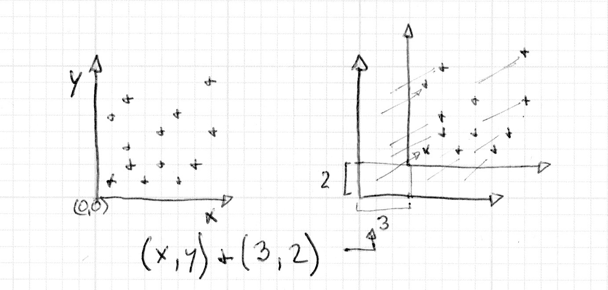
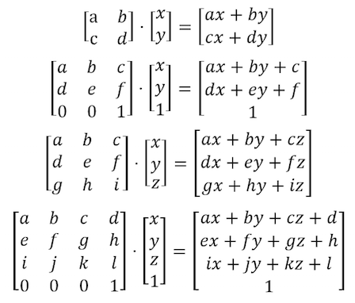
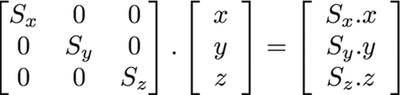

## Matrici 2D

<canvas id="custom" class="canvas" data-fragment-url="matrix.frag"  width="700px" height="200px"></canvas>

### Traslare

Nel capitolo precedente abbiamo imparato a fare alcune figure - il trucco per spostare quelle figure è stato di spostare il sistema di coordinate stesso. Siamo in grado d'ottenere questa trasformazione aggiungendo un vettore alla variabile ```st``` che contiene la posizione di ogni frammento. Ciò causa uno spostamento complessivo del sistema di coordinate.



Di sicuro è più facile da vedere che da spiegare:

* Rimuovete il commento alla linea 35 del codice sottostante e osservate come il sistema di coordinate si muove.

<div class="codeAndCanvas" data="cross-translate.frag"></div>

Ora provate il seguente esercizio:

* Utilizzate ```u_time``` insieme alle funzioni di forma per spostare la piccola croce in un modo interessante. Pensate a un tipo di movimento e tentate di applicarlo alla croce. Prendete degli esempi dal "mondo reale", potrebbero esservi utili - per esempio l'andirivieni delle onde, un movimento a pendolo, una palla che rimbalza, una macchina che accelera, una bicicletta che si ferma.

### Rotazioni

Anche per ruotare degli oggetti abbiamo bisogno di spostare l'intero sistema spaziale. Per questo utilizzeremo una [matrice](https://it.wikipedia.org/wiki/Matrice). Una matrice è un insieme di numeri organizzato in colonne e righe. Quando si moltiplica un vettore per una matrice, la matrice esegue una serie di operazioni e trasforma il vettore in funzione dei valori che questa contiene.

[](https://it.wikipedia.org/wiki/Matrice)

GLSL ha un supporto nativo per le matrici a due, tre e quattro dimensioni: [```mat2```](../glossary/?search=mat2) (2x2), [```mat3```](../glossary/?search=mat3) (3x3) e [```mat4```](../glossary/?search=mat4) (4x4). GLSL supporta anche la moltiplicazione di matrici (```*```) e una funzione specifica chiamata ([```matrixCompMult()```](../glossary/?search=matrixCompMult)).

Le matrici possono essere usate per produrre dei comportamenti specifici. Per esempio per traslare un vettore:


Ancora più interessante è la possibilità di utilizzare una matrice per ruotare il sistema di coordinate:


Il seguente codice mostra come costruire una matrice di rotazione 2D. Questa funzione segue la [formula](http://en.wikipedia.org/wiki/Rotation_matrix) per vettori a due dimensioni e fa ruotare le coordinate intorno al punto ```vec2(0.0)```.

```glsl
mat2 rotate2d(float _angle){
    return mat2(cos(_angle),-sin(_angle),
                sin(_angle),cos(_angle));
}
```

Questa maniera d'effettuare una rotazione (intorno all'origine) non funziona con l'approccio che abbiamo utilizzato finora per disegnare le figure. La nostra croce viene disegnata al centro della tela, che corrisponde alla posizione ```vec2(0.5)```. Quindi, prima di ruotare lo spazio, abbiamo bisogno di spostare la figura dal `centro` alla coordinata ```vec2(0.0)```, poi di ruotare lo spazio, e infine di spostarla di nuovo nella posizione originale.


Date un'occhiata al codice:

<div class="codeAndCanvas" data="cross-rotate.frag"></div>

Provate i seguenti esercizi:

* Rimuovete il commento alla linea 45 del codice qui sopra e prestate attenzione a ciò che accade.

* Commentate le traslazioni, prima e dopo la rotazione, alle linee 37 e 39, e osservate le conseguenze.

* Utilizzate delle rotazioni per migliorare l'animazione che avete simulato nell'esercizio sulla traslazione.

### Scalare

Abbiamo visto come le matrici sono usate per traslare e ruotare gli oggetti nello spazio. (O più precisamente come trasformare il sistema di coordinate per ruotare e spostare gli oggetti.) Se avete utilizzato un software di modellazione 3D o le funzioni push e pop delle matrici in Processing, si sa che le matrici possono essere utilizzati anche per scalare la dimensione di un oggetto.



Usando la formula precedente, siamo in grado di scrivere una matrice a due dimensioni per scalare una figura:

```glsl
mat2 scale(vec2 _scale){
    return mat2(_scale.x,0.0,
                0.0,_scale.y);
}
```

<div class="codeAndCanvas" data="cross-scale.frag"></div>

Provate i seguenti esercizi per capirne il funzionamento.

* Rimuovete il commento alla linea 42 del codice per vedere come funziona la messa in scala attraverso l'uso di colori.

* Osservate cosa succede quando si commentano le traslazioni, prima e dopo il ridimensionamento alle linee 37 e 39.

* Provate a combinare una matrice di rotazione insieme con una matrice di scala. Attenzione, l'ordine delle operazioni è importante: per prima cosa moltiplicate le matrici fra di loro e poi moltiplicate la matrice finale per i vettori.

* Ora che sapete come disegnare, spostare, ruotare, scalare molteplici forme, è il momento di fare una bella composizione. Progettate e realizzate una [falsa UI o HUD (heads up display)](https://www.pinterest.com/patriciogonzv/huds/). Utilizzate il seguente esempio su ShaderToy di [Ndel](https://www.shadertoy.com/user/ndel) per avere un riferimento.

<iframe width="800" height="450" frameborder="0" src="https://www.shadertoy.com/embed/4s2SRt?gui=true&t=10&paused=true" allowfullscreen></iframe>

### Altri usi delle matrici: il colore YUV

Lo [YUV](https://it.wikipedia.org/wiki/YUV) è uno spazio colore utilizzato per la codifica analogica di foto e video che tenga conto della gamma di percezione umana per ridurre la larghezza di banda dei componenti della crominanza.

Nel seguente codice utilizzeremo delle operazioni di matrice in GLSL per trasformare i colori da uno spazio colore all'altro.

<div class="codeAndCanvas" data="yuv.frag"></div>

Come si può vedere, stiamo trattando i colori come dei vettori che vengono moltiplicati con delle matrici. Abbiamo "spostato" i valori di colore come se avessimo spostato un vettore di posizione nello spazio.

In questo capitolo abbiamo imparato come usare le trasformazioni di matrice per spostare, ruotare e ridimensionare i vettori. Queste trasformazioni saranno essenziali per creare delle composizioni con le figure che abbiamo visto nel capitolo precedente. Nel prossimo capitolo provvederemo ad applicare tutto quello che abbiamo imparato per fare dei bei pattern procedurali. Vedrete come la ripetizione e la variazione del codice possano diventare delle pratiche gratificanti.
