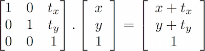

## Двумерные матрицы

<canvas id="custom" class="canvas" data-fragment-url="matrix.frag"  width="700px" height="200px"></canvas>

### Перенос

В предыдущей главе мы научились рисовать фигуры. А для того, чтобы передвинуть фигуру, достаточно передвинуть саму систему координат. Этого можно добиться всего лишь прибавление вектора к переменной ```st```, содержащей положение фрагмента. Это приводит к перемещению всей системы координат в пространстве.


Это проще увидеть, чем объяснить, поэтому смотрите сами:

* Раскомментируйте строку 35 в коде ниже чтобы увидеть как движется само пространство.

<div class="codeAndCanvas" data="cross-translate.frag"></div>

Теперь попробуйте выполнить следующее:

* Используйте ```u_time``` и функции формы для перемещения креста каким-нибудь нестандартным способом. Придумайте движение, которое кажется вам интересным, и заставьте крест двигаться таким образом. Попробуйте срисовать что-нибудь из реального мира, например прибегающие и отступающие волны, движение маятника, подпрыгивающий мячик, ускоряющуюся машину или тормозящий велосипед.

### Повороты

Для вращения объектов нам снова придётся поворачивать всё пространство. Для этого мы воспользуемся [матрицей](https://ru.wikipedia.org/wiki/%D0%9C%D0%B0%D1%82%D1%80%D0%B8%D1%86%D0%B0_(%D0%BC%D0%B0%D1%82%D0%B5%D0%BC%D0%B0%D1%82%D0%B8%D0%BA%D0%B0)). Матрица - упорядоченный в строки и столбцы набор чисел. Векторы умножаются на матрицы по определённым правилам, изменяя значения вектора заданным способом.

[](https://ru.wikipedia.org/wiki/%D0%9C%D0%B0%D1%82%D1%80%D0%B8%D1%86%D0%B0_(%D0%BC%D0%B0%D1%82%D0%B5%D0%BC%D0%B0%D1%82%D0%B8%D0%BA%D0%B0))

В GLSL есть встроенная поддержка двух- трёх- и четырёхмерных матриц: [```mat2```](../glossary/?search=mat2) (2x2), [```mat3```](../glossary/?search=mat3) (3x3) и [```mat4```](../glossary/?search=mat4) (4x4). GLSL так же поддерживает умножение матриц (```*```) и некоторые специальные функции ([```matrixCompMult()```](../glossary/?search=matrixCompMult)).

Мы можем конструировать матрицы, приводящие к определённому поведению. Например, можно использовать матрицу для переноса вектора:



Что более интересно, мы можем использовать матрицу для поворота системы координат:


Взгляните на код функции, которая конструирует двумерную матрицу поворота. Эта функция повторяет приведённую выше [формулу](https://ru.wikipedia.org/wiki/%D0%9C%D0%B0%D1%82%D1%80%D0%B8%D1%86%D0%B0_%D0%BF%D0%BE%D0%B2%D0%BE%D1%80%D0%BE%D1%82%D0%B0) для вращения вектора вокруг точки ```vec2(0.0)```.

```glsl
mat2 rotate2d(float _angle){
    return mat2(cos(_angle),-sin(_angle),
                sin(_angle),cos(_angle));
}
```

Это не совсем то что нам нужно, если мы вспомним наш способ пострения геометрических фигур. Фигура креста нарисована в центре изображения, то есть в точке ```vec2(0.5)```. Поэтому, прежде чем поворачивать пространство, нам нужно передвинуть фигуру из центра в точку ```vec2(0.0)```, и только после этого повернуть пространство, и в конце не забыть передвинуть фигуру в исходное положение.


Рассмотрите код:

<div class="codeAndCanvas" data="cross-rotate.frag"></div>

Попробуйте выполнить следующее:

* Раскомментируйте строку 45 и посмотрите что происходит.

* Закомментируйте сдвиги до и после поворота в строках 37 и 39, понаблюдайте за последствиями.

* Используйте вращение, чтобы улучшить анимацию, которую вы сделали в упражнении про перенос.

### Масштаб

Мы увидели как можно использовать матрицы для переноса и поворота объектов в пространстве. Или, точнее, как трансформировать систему координат для вращения и движения объектов. Если вы пользовались софтом для 3D-моделирования или функциями push и pop для матриц в Processing, вы скорее всего знаете, что с помощью матриц можно ещё и масштабировать объекты.


Следуя этой формуле, можно сконструировать двумерную матрицу масштабирования.

```glsl
mat2 scale(vec2 _scale){
    return mat2(_scale.x,0.0,
                0.0,_scale.y);
}
```

<div class="codeAndCanvas" data="cross-scale.frag"></div>

Выполните следующие упражнения для более глубокого понимания того, как это работает.

* Раскомментируйте строку 42 в коде выше и пронаблюдайте масштабирование пространственных координат.

* Посмотрите что произойдёт, если закомментировать переносы в строках 37 и 39.

* Попробуйте скомбинировать матрицы масштабирования и поворота. Помните, что порядок важен. Сначала перемножьте матрицы, а затем умножайте результат на векторы.

* Теперь когда вы умеете рисовать различные фигуры и управлять их положением в пространстве, мы можем приступить к композиции. придумайте и нарисуйте бутафорский [интерфейс пользователя или HUD](https://www.pinterest.com/patriciogonzv/huds/) (heads up display, то есть когда информация проецируется на стекло шлема или транспортного средства). Для поиска идей используйте следующий пример с ShaderToy, написанный пользователем [Ndel](https://www.shadertoy.com/user/ndel).

<iframe width="800" height="450" frameborder="0" src="https://www.shadertoy.com/embed/4s2SRt?gui=true&t=10&paused=true" allowfullscreen></iframe>

### Другие применения матриц: цвет в пространстве YUV

[YUV](https://ru.wikipedia.org/wiki/YUV) - цветовое пространство для аналогового кодирования фото и видео, разработанное с учётом особенностей восприятия человека чтобы снизить требования к каналу передачи компонентов цвета.

В следующем коде матричные операции GLSL используются весьма интересно - с их помощью сделано преобразование из одного цветового пространства в другое.

<div class="codeAndCanvas" data="yuv.frag"></div>

Здесь мы трактуем цвета как векторы и умножаем их на матрицы. Таким образом, мы «перемещаем» значения цвета.

В этой главе мы научились использовать матричные преобразования для сдвига, поворота и масштабирования векторов. Эти трансформации очень важны при построении композиций из фигур, которые мы рисовали в предыдущей главе. А в следующей главе мы используем все полученные знания для создания красивых процедурных узоров. Вы увидите, что программирование повторений и изменений может быть захватывающим занятием.
