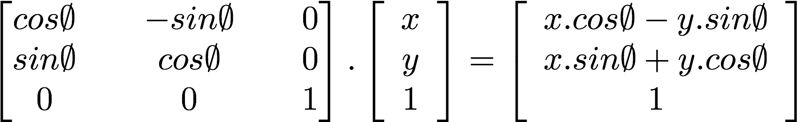

## Двомірні матриці

<canvas id="custom" class="canvas" data-fragment-url="matrix.frag"  width="700px" height="200px"></canvas>

### Переміщення

У попередньому розділі ми навчилися створювати деякі фігури — хитрість переміщення цих фігур полягає в тому, щоб перемістити саму систему координат. Ми можемо досягти цього, просто додавши вектор до змінної ```st```, яка містить розташування кожного фрагмента. Це спричиняє зміщення у просторі усієї системи координат.


Це легше побачити, ніж пояснити, тому дивіться самі:

* Розкоментуйте рядок 35 в коді нижче, щоб побачити, як рухається сам простір.

<div class="codeAndCanvas" data="cross-translate.frag"></div>

Тепер спробуйте наступне:

* Використовуючи змінну ```u_time``` разом із функціями формування, надайде хрестику рух у новому цікавому напрямку. Знайдіть конкретний варіант руху, яка вас цікавить, і спробуйте змусити хрест рухатися таким же чином. Спробуйте для початку щось із "реального світу" — це можуть бути хвилеподібні рухи, коливання маятника, м’яч, що підстрибує, прискорення як в автомобіля чи зупинка велосипеда.

### Обертання

Щоб обертати об'єкти, нам також потрібно рухати всю систему простору. Для цього ми будемо використовувати [матрицю](http://en.wikipedia.org/wiki/Matrix_%28mathematics%29). Матриця — це організований набір чисел у стовпцях і рядках. Вектори помножуються на матриці відповідно до певних правил, щоб змінити значення вектора визначеним чином.

[](https://en.wikipedia.org/wiki/Matrix)

GLSL має вбудовану підтримку дво-, три- та чотиривимірних матриць: [```mat2```](../glossary/?lan=ua&search=mat2) (2x2), [```mat3```](../glossary/?lan=ua&search=mat3) (3x3) та [```mat4```](../glossary/?lan=ua&search=mat4) (4x4). GLSL також підтримує множення матриць (```*```) та специфічну для матриці функцію ([```matrixCompMult()```](../glossary/?lan=ua&search=matrixCompMult)).

Можна побудувати різні матриці для отримання певної поведінки. Наприклад, ми можемо використати матрицю для переміщення вектора:


Що ще цікавіше, ми можемо використати матрицю для обертання системи координат:



Подивіться на наведений нижче код функції, яка створює двовимірну матрицю обертання. Ця функція відповідає наведеній вище [формулі](http://en.wikipedia.org/wiki/Rotation_matrix) для обертання координат навколо точки ```vec2(0.0)```.

```glsl
mat2 rotate2d(float _angle) {
    return mat2(
        cos(_angle), -sin(_angle),
        sin(_angle), cos(_angle)
    );
}
```

Судячи з того, як ми малювали фігури, це не зовсім те, що нам потрібно. Наша форма хреста намальована в центрі полотна, що відповідає позиції ```vec2(0.5)```. Отже, перед тим, як обертати простір, нам потрібно перемістити фігуру із `центру` до координати ```vec2(0.0)```, повернути простір, а потім, нарешті, перемістити його назад у початкове положення.


Це можна запрограмувати таким чином:

<div class="codeAndCanvas" data="cross-rotate.frag"></div>

Спробуйте наступні вправи:

* Розкоментуйте рядок 45 із коду вище та зверніть увагу на те, що відбувається.

* Закоментуйте зміщення координат до та після повороту, у рядках 38 та 42, спостерігаючи за наслідками.

* Використайте обертання, щоб покращити анімацію, яку ви моделювали під час вправи з переміщенням.

### Масштаб

Ми побачили, як матриці використовуються для переміщення та обертання об'єктів у просторі. А точніше, як змінювати системи координат для обертання та переміщення об'єктів. Якщо ви користувалися програмним забезпеченням для 3D-моделювання або функціями `push` та `pop` для матриць у Processing, то знаєте, що матриці також можна використовувати й для масштабування розміру об'єктів.


Дотримуючись попередньої формули, ми можемо створити двомірну матрицю масштабування:

```glsl
mat2 scale(vec2 _scale) {
    return mat2(
        _scale.x, 0.0,
        0.0, _scale.y
    );
}
```

<div class="codeAndCanvas" data="cross-scale.frag"></div>

Спробуйте виконати наступні вправи, щоб глибше зрозуміти, як це працює.

* Розкомментуйте рядок 42 із коду вище, щоб побачити масштабування просторових координат.

* Подивіться, що відбудеться, коли ви закоментуєте переміщення координат до та після масштабування в рядках 37 та 39.

* Спробуйте поєднати матрицю обертання разом із матрицею масштабування. Майте на увазі, що порядок має значення. Спочатку помножте на матрицю, а потім результат помножте на вектори.

* Тепер, коли ви знаєте, як малювати різні фігури, переміщувати, обертати та масштабувати їх, настав час створити гарну композицію. Спроєктуйте та створіть фейковий [UI або HUD](https://www.pinterest.com/patriciogonzv/huds/). HUD (heads up display) — мається на увазі розташування інформації на прозорих поверхнях або дисплеях. Для натхнення та довідки, можете використати наступний ShaderToy-приклад від [Ndel](https://www.shadertoy.com/user/ndel).

<iframe width="800" height="450" frameborder="0" src="https://www.shadertoy.com/embed/4s2SRt?gui=true&t=10&paused=true" allowfullscreen></iframe>

### Інше використання матриць: колір у просторі YUV

[YUV](http://en.wikipedia.org/wiki/YUV) — це колірний простір, який використовується для аналогового кодування фотографій та відео, яке враховує діапазон людського сприйняття для зменшення пропускної здатності компонентів колірності.

Наступний код є цікавою можливістю використовувати матричні операції в GLSL для перетворення кольорів з одного простору в інший.

<div class="codeAndCanvas" data="yuv.frag"></div>

Як бачите, ми розглядаємо кольори як вектори, перемножуючи їх на матриці. Таким чином ми "переміщуємо" значення кольорів.

У цьому розділі ми навчилися використовувати матричні перетворення для переміщення, обертання та масштабування векторів. Ці трансформації будуть корисними для створення композицій із фігур, про які ми дізналися із попереднього розділу. У наступному розділі ми застосуємо всі здобуті знання для створення красивих процедурних візерунків. Ви побачите, що програмування повторень та варіацій може бути захопливою діяльністю.
