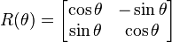
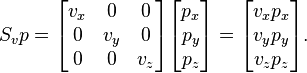

## 2D Matrices

### Translate

In the previous chapter we learned how to make some shapes - the trick to moving those shapes is to move the coordinate system itself. We can achieve that by simply adding a vector to the ```st``` variable that contains the location of each fragment. This causes the whole space coordinate system to move. This is easier to see than to explain, so to see for yourself:

* Uncomment line 35 of the code below to see how the space itself moves around.

<div class="codeAndCanvas" data="cross-translate.frag"></div>
 
Now try the following exercise:

* Using ```u_time``` together with the shaping functions move the small cross around in an interesting way. Search for a specific quality of motion you are interested in and try to make the cross move in the same way. Recording something from the "real world" first might be useful - it could be the coming and going of waves, a pendulum movement, a bouncing ball, a car accelerating, a bicycle stopping.

### Rotations

To rotate objects we also need to move the entire space system. For that we are going to use a [matrix](http://en.wikipedia.org/wiki/Matrix_%28mathematics%29). A matrix is an organized set of numbers in columns and rows. Vectors are multiplied by matrices following a precise set of rules in order to modify the values of the vector in a particular way.


GLSL has native support for two, three and four dimensional matrices: [```mat2```](http://www.shaderific.com/glsl-types/#2x2floatingpointmatrix) (2x2), [```mat3```](http://www.shaderific.com/glsl-types/#3x3floatingpointmatrix) (3x3) and [```mat4```](4x4floatingpointmatrix) (4x4). GLSL also supports matrix multiplication  (```*```) and a matrix specific function ([```matrixCompMult()```](http://www.shaderific.com/glsl-functions/#componentwisematrixmultiplication)).

Based on how matrices behave it's possible to construct matrices to produce specific behaviors. For example we can use a matrix to translate a vector:


____it would be good to draw an example here____

More interestingly, we can use a matrix to rotate the coordinate system: 



Take a look at the following code for a function that constructs a 2D rotation matrix. This function follows the above [formula](http://en.wikipedia.org/wiki/Rotation_matrix) to rotate the coordinates around the ```vec2(0.0)``` point. 

```glsl
mat2 rotate2d(float _angle){
    return mat2(cos(_angle),-sin(_angle),
                sin(_angle),cos(_angle));
}
```

According to the way we've been drawing shapes, this is not exactly what we want. Our cross shape is drawn in the center of the canvas which corresponds to the position ```vec2(0.5)```. So, before we rotate the space we need to move shape from the `center` to the ```vec2(0.0)``` coordinate, rotate the space, then finally move it back to the original place.

____comment the code below to show where you're doing the steps described above____

<div class="codeAndCanvas" data="cross-rotate.frag"></div>

____This paragraph is straight-up impossible to understand and I don't think there's a way to write it well without another example, so consider adding another example or taking this paragraph out (I'm not editing it, so if you leave it in let me know and I'll edit it)____ Note that we need to multiply the rotation matrix for the position vector to return a rotated vector which in our example is just the original position variable that we are over writing. If you want to rotate different elements in different proportions you need to “preserve” the original coordinate system by assigning another vector.  

Try the following exercises:

* Uncomment line 42 of above code and pay attention to what happens.

* Comment the translations before and after the rotation, on lines 37 and 39, and observe the consequences.

* Use rotations to improve the animation you simulated in the translation exercise. 

### Scale

We've seen how matrices are used to translate and rotate objects in space. (Or more precisely to transform the coordinate system to rotate and move the objects.) If you've used 3D modeling software or the push and pop matrix functions in Processing, you will know that matrices can also be used to scale the size of an object. 



Following the previous formula, we can figure out how to make a 2D scaling matrix:

```glsl
mat2 scale(vec2 _scale){
    return mat2(_scale.x,0.0,
                0.0,_scale.y);
}
```

<div class="codeAndCanvas" data="cross-scale.frag"></div> 

Try the following exercises to understand more deeply how this works.

* Uncomment line 42 of above code to see the space coordinate being scaled.

* See what happens when you comment the translations before and after the scaling on lines 37 and 39.

* Try combining a rotation matrix together with a scale matrix. Be aware that the order matters. Multiply by the matrix first and then multiply the vectors.

* Now that you know how to draw different shapes, and move, rotate and scale them, it's time to make a nice composition. Design and construct a [fake UI or HUD (heads up display)](https://www.pinterest.com/patriciogonzv/huds/). Use the following ShaderToy example by [Ndel](https://www.shadertoy.com/user/ndel) for inspiration and reference.

<iframe width="800" height="450" frameborder="0" src="https://www.shadertoy.com/embed/4s2SRt?gui=true&t=10&paused=true" allowfullscreen></iframe>

### Other uses for matrices: YUV color

[YUV](http://en.wikipedia.org/wiki/YUV) is a color space used for analog encoding of photos and videos that takes into account the range of human perception to reduce the bandwidth of chrominance components.

The following code is an interesting opportunity to use matrix operations in GLSL to transform colors from one mode to another.

____add some comments to the code below to describe what you're doing____

<div class="codeAndCanvas" data="yuv.frag"></div>

As you can see we are treating colors as vectors by multiplying them with matrices. In that way we “move” the values around.

____what have we learned in this chapter? what's coming next?____

