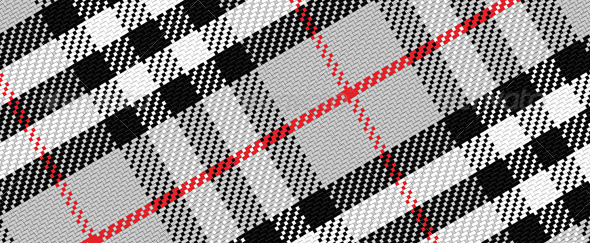

## Motifs

Les shaders sont exécutés au pixel et quel que soit le nombre de répétitions d'une forme, le nombre d'opérations effectuées restera constant.
Cela signifie que les fragments shaders sont tout à fait indiqués pour la création de motifs répétitifs ; des *pavages* du plan.

[  ](../edit.php#09/dots5.frag)

Dans ce chapitre, nous allons mettre en application tout ce que nous avons vu jusqu'à présent et le répéter sur le canvas.
Comme dans les chapitres précédents, notre stratégie consistera à multiplier les coordonnées pour que les formes que nous dessinons restent dans un espace normalisé entre 0 et 1.
Le fait de multiplier les coordonnées du fragment en X et en Y créera une *grille* et le fait de diviser les coordonnées *étirera* une portion du canvas.

*"The grid provides a framework within which human intuition and invention can operate and that it can subvert.
Within the chaos of nature patterns provide a constrast and promise of order.
From early patterns on pottery to geometric mosaics in Roman baths, people have long used grids to enhance their lives with decoration."* [*10 PRINT*, Mit Press, (2013)](http://10print.org/)

Pour commencer, rappelons nous de la méthode [```fract()```](../glossary/?search=fract).
Elle retourne la partie fractionnelle d'un chiffre, ce qui revient à considérer ```fract()``` comme le modulo de 1 ([```mod(x,1.0)```](../glossary/?search=mod)).
Autrement dit, [```fract()```](../glossary/?search=fract) retourne les chiffres après la virgule.
Notre variable normalisée (```st```) va déjà de 0.0 à 1.0 donc il n'est pas très judicieux d'écrire quelque chose comme :

```glsl
void main(){
    vec2 st = gl_FragCoord.xy/u_resolution;
    vec3 color = vec3(0.0);
    st = fract(st);
    color = vec3(st,0.0);
    gl_FragColor = vec4(color,1.0);
}
```
En revanche, si nous multiplions la valeur de ```st``` par 3, l'utilisation de ```fract()``` nous permettra d'obtenir trois séries de valeurs normalisées entre 0 et 1 :
la première série correspondra au moment où ```st``` se trouve entre 0 et 1, la seconde série correspondra au moment où ```st``` se trouve entre 1 et 2 et la troisième série correspondra au moment où ```st``` se trouve entre 2 et 3.

Une fois multiplié par 3, et au lieu de passer de 0 à 1 en X et Y, ```st``` passera de 0 à **3** en X et Y.
Si nous utilisons ```st * 3.0``` tel quel, sa valeur va vite dépasser 1 et nous ne pourrons plus nous en servir comme nous l'avons fait jusqu'à présent ; il ne sera plus normalisé entre 0 et 1.
Si on utilise seulement la partie fractionnelle, on retombe toujours dans un espace normalisé puisque la valeur de ```fract()``` (les chiffres après le virgule) sera toujours comprise entre 0 et 1.
Voici un exemple des valeurs respectives de ```st```, ```st * 3``` et ```fract( st * 3 )```.

```glsl
// Premier bloc
st = 0.00 | st * 3 = 0.00 | fract( st * 3 ) = 0.00
st = 0.10 | st * 3 = 0.30 | fract( st * 3 ) = 0.30
st = 0.20 | st * 3 = 0.60 | fract( st * 3 ) = 0.60
st = 0.30 | st * 3 = 0.90 | fract( st * 3 ) = 0.90
// Second bloc
st = 0.40 | st * 3 = 1.20 | fract( st * 3 ) = 0.20
st = 0.50 | st * 3 = 1.50 | fract( st * 3 ) = 0.50
st = 0.60 | st * 3 = 1.80 | fract( st * 3 ) = 0.80
// Troisième bloc
st = 0.70 | st * 3 = 2.10 | fract( st * 3 ) = 0.10
st = 0.80 | st * 3 = 2.40 | fract( st * 3 ) = 0.40
st = 0.90 | st * 3 = 2.70 | fract( st * 3 ) = 0.70
st = 1.00 | st * 3 = 3.00 | fract( st * 3 ) = 1.00
```

On voit bien que sur le premier bloc, la valeur ```st * 3``` est égale à ```fract( st * 3 )``` mais dès le second *bloc*, ```st * 3``` dépassse 1 alors que ```fract( st * 3 )``` reste toujours compris entre 0 et 1.

<div class="codeAndCanvas" data="grid-making.frag"></div>

Essayons de dessiner quelque chose dans chaque sous-espace en décommentant la ligne 27.
Comme nous ne changeons pas le *ratio* (le rapport largeur/hauteur) en x et y, la forme ne change pas après la multiplication de taille et notre forme s'affiche correctement ; notre cercle est bien circulaire.

Essayez les choses suivantes pour mieux comprendre :

* Changez le facteur de multiplication des coordonnées ```st```, essayez des valeurs inférieures à zéro et des valeurs différentes en X et Y.

* Créez un fonction réutilisable pour cette manipulation.

* Divisez l'espace en 3 lignes et trois colonnes.
Trouvez un moyen de connaître la case dans laquelle se trouve le fragment en cours de traitement et changez la forme dessinée dans la case en fonction de ça.
Essayez de faire un morpion.

### Appliquer une matrice à l'intérieur d'une cellule

Sachant que chaque subdivision est une reproduction du motif original, nous pouvons appliquer une matrice de transformation pour déplacer, pivoter ou redimensionner l'espace dans chaque cellule.

<div class="codeAndCanvas" data="checks.frag"></div>

* Pensez à quelques façons intéressantes d'animer les couleurs et les formes de ce motif. Faites-en trois versions.

* Créez des motifs plus complexes en combinant plusieurs formes.

[](../edit.php#09/diamondtiles.frag)

* Combinez différentes couches de motifs pour composer votre propre [Tartan écossais](https://fr.wikipedia.org/wiki/Tartan).

[  ](http://graphicriver.net/item/vector-pattern-scottish-tartan/6590076)

### Décaler les motifs

Imaginons que nous voulions reproduire un motif *mur de briques*. En regardant le mur, nous constatons que chaque rangées est décalée de moitié par rapport à la précédente.
Comment pourrions-nous faire ça ?


En premier lieu, nous devons savoir si la rangée sur laquelle se trouve notre fragment est paire ou impaire.
Nous pourrons ensuite utiliser cette information pour savoir si on doit ou non se décaler sur l'axe X.

Pour déterminer si notre fragment est sur une ligne paire ou impaire, nous allons nous servir du résultat du modulo [```mod()```](../glossary/?search=mod) de ```2.0```.
Si le modulo 2 est inférieur à 1, nous sommes sur une ligne paire, s'il est supérieur ou égal à 1, nous sommes sur une ligne impaire.

Pour illustrer l'effet du modulo, regardez la formule suivante et décommentez les deux dernières lignes.

<div class="simpleFunction" data="y = mod(x,2.0);
// y = mod(x,2.0) < 1.0 ? 0. : 1. ;
// y = step(1.0,mod(x,2.0));"></div>

On peut utiliser un [opérateur ternaire](https://fr.wikipedia.org/wiki/Op%C3%A9rateur_(informatique)) pour vérifier si le modulo ([```mod()```](../glossary/?search=mod)) renvoie une valeur inférieure à 1 (ligne 2)
ou bien on peut se servir d'un [```step()```](../glossary/?search=step) qui renvoie le même résultat plus vite.

Pourquoi ? Bien qu'il soit difficile de dire comment chaque carte graphique compile et optimise le code, on peut partir du principe que les fonctions natives sont plus rapides que les fonctions personnalisées.
Chaque fois que vous pouvez utiliser une fonction native, faites le !

En fait un opérateur ternaire est un ```if``` déguisé, le programme est obligé de créer et d'évaluer les deux branches du ```if``` ce qui ralentit son exécution. En l'occurrence, on pourrait écrire :

```glsl
y = floor( mod( x, 2.0 ) );
```
qui renverra également 0 si le modulo est inférieur à 1 et 1 si le modulo est compris entre 1 et 2. la différence étant qu'il n'y a besoin de charger qu'une seule valeur en mémoire contre 2 pour un step().
on pourrait même se dispenser du ```floor``` en utilisant un ```cast``` (*transtypage*) en ```int``` (nombre entier):
```glsl
y = float( int( mod( x, 2.0 ) ) );
```

Lorsqu'on *transtype* un ```float``` en ```int``` les chiffres après la virgule sont ignorés ce qui revient à appeler la méthode ```floor``` (en revanche, on doit re-caster le résultat en ```float```).

Maintenant que nous avons un moyen de déterminer si on a un chiffre pair ou impair, on peut s'en servir pour décaler les rangées impaires et obtenir notre *mur de briques*.
Ligne 14, nous avons une fonction qui *détecte* les rangées impaires et leur ajoute un décalage de 0.5 en ```x```.
Notez que pour les rangées paires, le résultat sera ```0.0``` et multiplier ```0.0``` par un décalage de ```0.5``` donnera un décalage de ```0.0```.
Sur les rangées impaires, le résultat sera ```1.0``` qui, multiplié par ```0.5```, décalera la position ```st``` de ```0.5``` sur l'axe des ```x```.

Essayez à présent de commenter la ligne 32, cela va changer le *ratio* (rapport entre largeur et hauteur) et *étirer* les coorodnnées pour produire une brique *moderne*.
En décommentant la ligne 40, on peut visualiser la distorsion grâce aux canaux rouge et vert.

<div class="codeAndCanvas" data="bricks.frag"></div>

* Essayez d'animer le motif en faisant varier la quantité de décalage en fonction du temps.

* Créez une autre animation où les rangées paires bougent vers la droite et les rangées impaires bougeant vers la gauche.

* Pouvez vous appliquer cet effet sur les colonnes?

* Essayez de combiner les décalages en ```x``` et ```y``` pour obtenir quelque chose comme ça :

<a href="../edit.php#09/marching_dots.frag"><canvas id="custom" class="canvas" data-fragment-url="marching_dots.frag"  width="520px" height="200px"></canvas></a>

## Pavage de Truchet

Maintenant que que nous avons vu comment déterminer si une cellule est sur une ligne ou une colonne paire ou impaire, il nous est possible de réutiliser un motif en fonction de sa position.
Prenons le [pavage de Truchet](http://en.wikipedia.org/wiki/Truchet_tiles) [+](http://jean-luc.bregeon.pagesperso-orange.fr/Page%200-27.htm) où un élément simple est présent sous quatre formes :


En changeant de motif d'une case à l'autre, on peut construire une infinité de pavages complexes.


Regardez attentivement la fonction ```rotateTilePattern()```, qui subdivise l'espace en quatre cellules et assigne une rotation à chacune.

<div class="codeAndCanvas" data="truchet.frag"></div>

* Commentez / décommentez et dupliquez les lignes 69 à 72 pour composer de nouveaux motifs.

* Remplacez le triangle blanc par une autre forme : demi cercle, carré pivoté ou lignes.

* Créez d'autres motifs suivant la règle *pair/impair*.

* Variez les propriétés affectées par l'ordre *pair/impair* des cellules.

* Pensez à quelque chose d'autre qui ne soit pas nécessairement un pavage du plan et où vous pourriez appliquer les principes vus dans cette section (exemple : [les Hexagrammes YI Jing](https://fr.wikipedia.org/wiki/Hexagramme_Yi_Jing))

<a href="../edit.php#09/iching-01.frag"><canvas id="custom" class="canvas" data-fragment-url="iching-01.frag"  width="520px" height="200px"></canvas></a>

## Créer ses propres pavages

Créer des motifs procéduraux est un exercice cérébral consistant à trouver un ensemble minimal d'éléments réutilisables.
C'est une pratique très ancienne, en tant qu'espèce, nous avons utilisé les grilles et les motifs pour décorer les textiles, les sols et les objets depuis la nuit des temps.
Des frises grecques aux lattices chinoises, le plaisir des variations et des répétitions est une grande source d'inspiration.
Prenez le temps de vous intéresser aux [motifs](https://www.pinterest.com/patriciogonzv/paterns/) [ornementaux](https://archive.org/stream/traditionalmetho00chririch#page/130/mode/2up)
et constatez que de tout temps, artistes et designers ont navigué entre un ordre prédictible et les variations, accidentelles et chaotiques.
Des motifs islamiques aux textiles africains, nous disposons d'un univers de motifs à explorer.


Ce chapitre clos le dessin algorithmique. Dans les chapitres suivants, nous apprendrons à ramener un peu d'entropie et à produire des designs génératifs.
