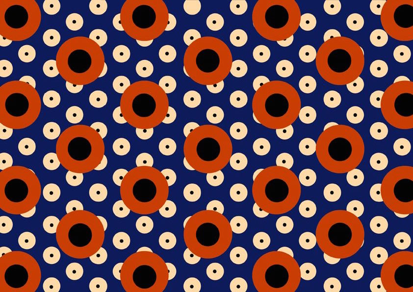
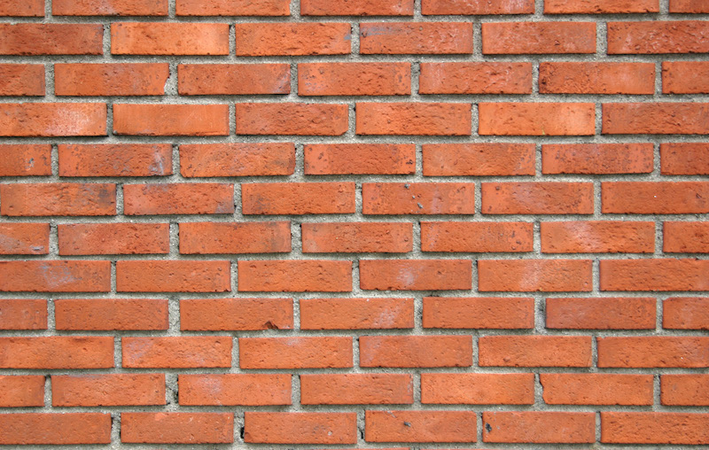

## Patterns (padrões)

Uma vez que os programas de shaders são executados pixel a pixel, não importa o quanto você repete uma forma, o número de cálculos permanece constante. Isso quer dizer que fragment shaders se encaixam perfeitamente para a criação de padrões "tile patterns".

[  ](../edit.php#09/dots5.frag)

Neste capítulo, vamos aplicar o que aprendemos até agora, e repetir isso ao longo da tela. Como nos capítulos anteriores, nossa estratégia será baseada em multiplicar as coordenadas espaciais (entre 0.0 e 1.0), de modo que as formas que desenharmos entre os valores 0.0 e 1.0 serão repetidas para fazer um grid.

*"O grid provê uma framework na qual a intuição e a invenção humana podem operar e que pode subverter. Dentro do caos da natureza, os padrões provêem um contraste e promessa de ordem. Desde padrões mais antigos nas cerâmicas até mosaicos geométricos nos banheiros de Roma, as pessoas têm usado grids para melhorar suas vidas com a decoração."* [*10 PRINT*, Mit Press, (2013)](http://10print.org/)

Primeiro, vamos nos lembras da função [```fract()```](../glossary/?search=fract). Ela retorna a parte fracionária de um número, tornando ```fract()```, em essência, o módulo de um ([```mod(x,1.0)```](../glossary/?search=mod)). Em outras palavras, [```fract()```](../glossary/?search=fract) retorna o número depois do ponto flutuante. Nossa variável do sistema de coordenadas normalizadas (```st```) já vai de 0.0 a 1.0, então não faz sentido termos algo como:

```glsl
void main(){
	vec2 st = gl_FragCoord.xy/u_resolution;
	vec3 color = vec3(0.0);
    st = fract(st);
	color = vec3(st,0.0);
	gl_FragColor = vec4(color,1.0);
}
```

Mas se nós escalarmos o sistema de coordenadas para cima - digamos, aumentar por três - vamos ter três sequências de interpolações lineares entre 0-1:  a primeira, entre 0-1, a segunda para os pontos flutuantes entre 1-2, e a terceira para os pontos flutuantes entre 2-3.

<div class="codeAndCanvas" data="grid-making.frag"></div>

Agora é horas de desenhar algo em cada subespaço, descomentando a linha 27 (devido ao fato de estarmos multiplicando igualmente os valores de x e y, o aspecto do espaço não muda e as formas serão como esperado).

Tente os seguintes exercícios para entender mais a fundo:

* Multiplique o espaço por números diferentes. Tente com valores de ponto flutuante e também com valores diferentes para x e y.

* Crie uma função reutilizável para esse truque com os padrões.

* Divida o espaço em três linhas e três colunas. Ache um jeito de saber em que coluna e linha está a thread, e use isso para mudar a forma que está exibindo. tente compor um jogo da velha. 

### Aplique matrizes dentro dos patterns

Como cada subdivisão ou célula é uma versão menor do sistema de coordenadas normalizadas que já vínhamos usando, podemos aplicar uma transformação de matrizes a ela, de modo a transladar, rotacionar ou escalar o espaço ali dentro.

<div class="codeAndCanvas" data="checks.frag"></div>

* Pense em modos interessantes de animar esse padrão. Considere animação de cores, formas e movimento. Faça três animações diferentes.

* Recrie patterns mais complicados, compondo formas diferentes.


[](../edit.php#09/diamondtiles.frag)

* Combine camadas diferentes de patterns, para compor seus próprios [Scottish Tartan Patterns](https://www.google.com/search?q=scottish+patterns+fabric&tbm=isch&tbo=u&source=univ&sa=X&ei=Y1aFVfmfD9P-yQTLuYCIDA&ved=0CB4QsAQ&biw=1399&bih=799#tbm=isch&q=Scottish+Tartans+Patterns).

[  ](http://graphicriver.net/item/vector-pattern-scottish-tartan/6590076)

### Offset patterns

Então, digamos que queremos imitar um muro de tijolos. Olhando para o muro, você pode ver um deslocamento de meio tijolo em x, entre as linhas. Como podemos fazer isso?



Como primeiro passo, precisamos saber se a linha de nossa thread é uma linha par ou ímpar, porque podemos usar isso a para determinar se precisamos fazer o deslocamento do x nessa linha. 

____nós temos que consertar esses dois próximos parágrafos, juntos____

Para determinar se nossa thread está numa linha par ou ímpar, vamos usar o [```mod()```](../glossary/?search=mod) de ```2.0``` e então ver se se o resultado está abaixo de ```1.0``` ou não. Dê uma olhada na fórmula seguinte e descomente as duas últimas linhas.

<div class="simpleFunction" data="y = mod(x,2.0);
// y = mod(x,2.0) < 1.0 ? 0. : 1. ;
// y = step(1.0,mod(x,2.0));"></div>

Como pode ver, usamos um [operador ternário](https://en.wikipedia.org/wiki/%3F: ) para checar se o [```mod()```](../glossary/?search=mod) de ```2.0``` é abaixo de ```1.0``` (segunda linha) ou de modo similar, podemos usar um [```step()```](../glossary/?search=step) que faz a mesma operação, mas mais rápido. Por quê? Embora seja difícil saber como cada placa gráfica otimiza e compila o programa, é seguro assumir que funções built-in são mais rápidas que as outras. Toda vez que puder usar uma função built-in , use!

Então, agora que temos nossa fórmula para números ímpares, podemos aplicar um deslocamento nas linhas ímpares, para dar um efeito de *tijolos* aos nossos "tiles". A linha 14 do código a seguir é onde estamos usando a função para "detectar" linhas ímpares e dar a elas um offset de meia unidade em ```x```. Note que para linhas pares, o resultado da função é ```0.0```, e multiplicar ```0.0``` pelo offset de ```0.5``` nos dá um offset de  ```0.0```. Mas em linhas ímpares, multiplicamos o resultado da função, ```1.0```, pelo offset de  ```0.5```, o que move o eixo ```x``` do sistema de coordenadas por ```0.5```.

Agora, tente descomentar a linha 32 - isso estica a proporção da tela do sistema de coordenadas, para imitar o aspecto de um "tijolo moderno". Comentando a linha 40, você pode ver como o sistema de coordenadas parece mapeado para o vermelho e o verde. 


<div class="codeAndCanvas" data="bricks.frag"></div>

* Tente animar isso, movendo o offset de acordo com o tempo.

* Faça outra animação onde as linhas pares se movem para a esquerda, e as ímpares para a direita.

* Você consegue repetir esse efeito, mas com colunas?

* Tente combinar um offset nos eixos ```x``` e ```y``` para conseguir algo desse tipo:

<a href="../edit.php#09/marching_dots.frag"><canvas id="custom" class="canvas" data-fragment-url="marching_dots.frag"  width="520px" height="200px"></canvas></a>

## Tiles de Truchet

Agora que já aprendemos como dizer se nossa célula está numa coluna par ou ímpar, é possível reusar um elemento simples dependendo de sua posição. Considere o caso dos [Truchet Tiles](http://en.wikipedia.org/wiki/Truchet_tiles) onde um elemento de design simples pode ser representado em quatro formas diferentes:


Mudando o padrão ao longo dos tiles, é possível construir um conjunto infinito de designs complexos.


Preste bastante atenção à função ```rotateTilePattern()```, que subdivide o espaço em quatro célular e associa uma ângulo de rotação a cada um.

<div class="codeAndCanvas" data="truchet.frag"></div>

* Comente, descomente e duplique as linhas 69 a 72 para compor novos designs.

* Mude o triângulo preto e branco por outro elemento, como: semi-círculos, quadrados rotacionados ou linhas.

* Programe outros padrões, onde os elementos são rotacionados de acordo com a posição.

* Faça um pattern que mude outras propriedades, de acordo com a posição dos elementos.

* Pense em algo mais que não seja necessariamente um pattern onde você pode aplicar os princípios desta seção. (Ex: hexagramas do I Ching)

<a href="../edit.php#09/iching-01.frag"><canvas id="custom" class="canvas" data-fragment-url="iching-01.frag"  width="520px" height="200px"></canvas></a>

## Fazendo suas próprias regras

Fazer padrões procedurais é um exercício mentar para encontrar elementos mínimos reutilizáveis. Esta prática é antiga; como espécie, temos usando grids e padrões para decorar tecidos, pisos e bordas de objetos por muito tempo: desde os padrões de meandros na Grécia antiga, aos designs de treliças chinesas, o prazer  da repetição e variações pegam nossa imaginação. Dê uma olhada em  [padrões](https://www.pinterest.com/patriciogonzv/paterns/) [decorativos](https://archive.org/stream/traditionalmetho00chririch#page/130/mode/2up)  e veja como artistas e designers têm uma longa história de navegar na fina borda entre a previsibilidade da ordem, e a surpresa da variação e o caos. Dos padrões geométricos árabes ao design de lindos tecidos africanos, há um universo inteiro de padrões de onde aprender.


Com este capítulo, terminamos a seção sobre Desenho Algorítmico. Nos capítulos seguintes vamos aprender como trazer alguma entropia para nossos shaders e produzir designs generativos.

