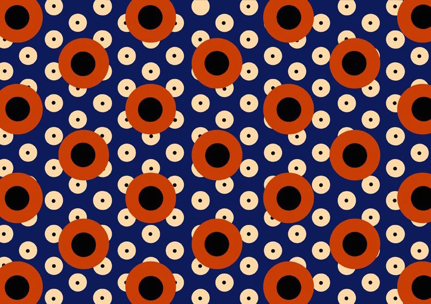
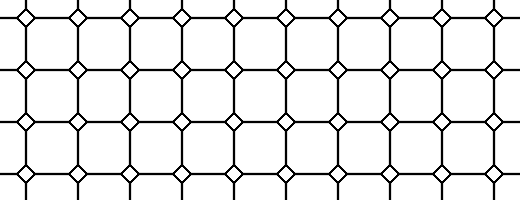
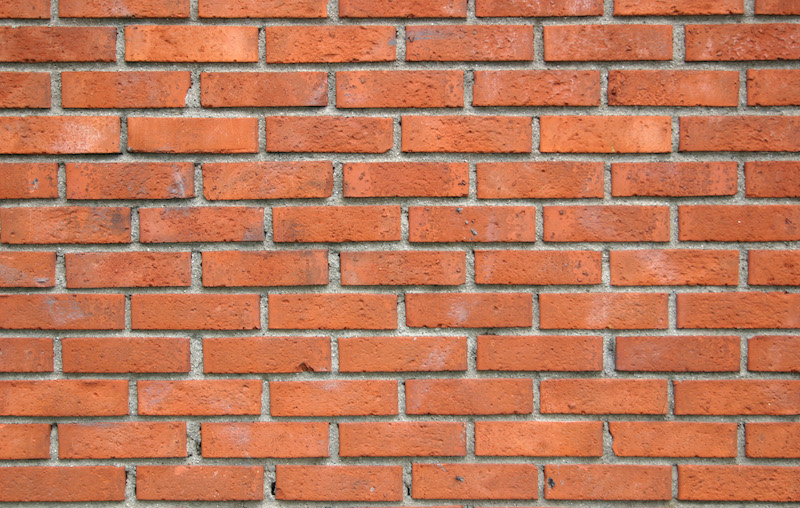
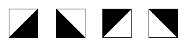
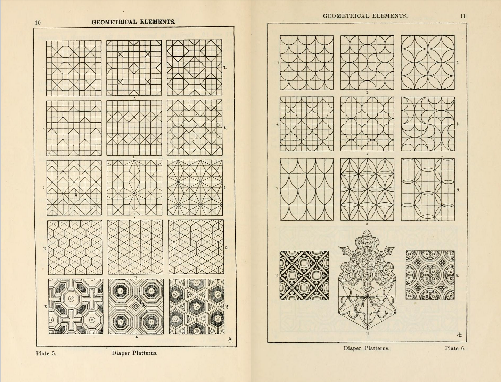

## Patterns

Since shader programs are executed by pixel-by-pixel no matter how much you repeat a shape the number of calculations stays constant. This means that fragment shaders are particulary suitable for tile patterns.

[  ](../edit.php#09/dots5.frag)

In this chapter we are going to apply what we've learned so far and repeat it along a canvas. Like in previous chapters, our strategy will be based on multiplying the space coordinates (between 0.0 and 1.0), so that the shapes we draw between the values 0.0 and 1.0 will be repeated to make a grid.

*"The grid provides a framework within which human intuition and invention can operate and that it can subvert. Within the chaos of nature patterns provide a constrast and promise of order. From early patterns on pottery to geometric mosaics in Roman baths, people have long used grids to enhance their lives with decoration."* [*10 PRINT*, Mit Press, (2013)](http://10print.org/)

First let's remember the [```fract()```](../glossary/?search=fract) function. It returns the fractional part of a number, making ```fract()``` in essence the modulo of one ([```mod(x,1.0)```](../glossary/?search=mod)). In other words, [```fract()```](../glossary/?search=fract) returns the number after the floating point. Our normalized coordinate system variable (```st```) already goes from 0.0 to 1.0 so it doesn't make sense to do something like:

```glsl
void main(){
	vec2 st = gl_FragCoord.xy/u_resolution;
	vec3 color = vec3(0.0);
    st = fract(st);
	color = vec3(st,0.0);
	gl_FragColor = vec4(color,1.0);
}
```

But if we scale the normalized coordinate system up - let's say by three - we will get three sequences of linear interpolations between 0-1: the first one between 0-1, the second one for the floating points between 1-2 and the third one for the floating points between 2-3.

<div class="codeAndCanvas" data="grid-making.frag"></div>

Now it's time to draw something in each subspace, by uncommenting line 27. (Because we are multiplying equally in x and y the aspect ratio of the space doesn't change and shapes will be as expected.)

Try some of the following exercises to get a deeper understanding:

* Multiply the space by different numbers. Try with floating point values and also with different values for x and y.

* Make a reusable function of this tiling trick.

* Divide the space into 3 rows and 3 columns. Find a way to know in which column and row the thread is and use that to change the shape that is displaying. Try to compose a tic-tac-toe match.

### Apply matrices inside patterns

Since each subdivision or cell is a smaller version of the normalized coordinate system we have already been using, we can apply a matrix transformation to it in order to translate, rotate or scale the space inside.

<div class="codeAndCanvas" data="checks.frag"></div>

* Think of interesting ways of animating this pattern. Consider animating color, shapes and motion. Make three different animations.

* Recreate more complicated patterns by composing different shapes.


[](../edit.php#09/diamondtiles.frag)

* Combine different layers of patterns to compose your own [Scottish Tartan Patterns](https://www.google.com/search?q=scottish+patterns+fabric&tbm=isch&tbo=u&source=univ&sa=X&ei=Y1aFVfmfD9P-yQTLuYCIDA&ved=0CB4QsAQ&biw=1399&bih=799#tbm=isch&q=Scottish+Tartans+Patterns).

[  ](http://graphicriver.net/item/vector-pattern-scottish-tartan/6590076)

### Offset patterns

So let's say we want to imitate a brick wall. Looking at the wall, you can see a half brick offset on x in every other row. How we can do that?



As a first step we need to know if the row of our thread is an even or odd number, because we can use that to determine if we need to offset the x in that row. For that we are going to use [```mod()```](../glossary/?search=mod) of ```2.0``` and then see if the result is under ```1.0``` or not. Take a look at the following formula and uncomment the two last lines.

<div class="simpleFunction" data="y = mod(x,2.0);
// y = mod(x,2.0) < 1.0 ? 0. : 1. ;
// y = step(1.0,mod(x,2.0));"></div>

As you can see we can use a [ternary operator](https://en.wikipedia.org/wiki/%3F:) to check if the [```mod()```](../glossary/?search=mod) of ```2.0``` is under ```1.0``` (second line) or similarly we can use a [```step()```](../glossary/?search=step) function which does the same operation, but faster. Why? Although is hard to know how each graphic card optimizes and compiles the code, it is safe to assume that built-in functions are faster than non-built-in ones. Everytime you can use a built-in function, use it!

So now that we have our odd number formula we can apply an offset to the odd rows to give a *brick* effect to our tiles. Line 14 of the following code is where we are using the function to "detect" odd rows and give them a half-unit offset on ```x```. Note that for even rows, the result of our function is ```0.0```, and multiplying ```0.0``` by the offset of ```0.5``` gives an offset of ```0.0```. But on odd rows we multiply the result of our function, ```1.0```, by the offset of ```0.5```, which moves the ```x``` axis of the coordinate system by ```0.5```.

Now try uncommenting line 32 - this stretches the aspect ratio of the coordinate system to mimic the aspect of a "modern brick". By uncommenting line 40 you can see how the coordinate system looks mapped to red and green.

<div class="codeAndCanvas" data="bricks.frag"></div>

* Try animating this by moving the offset according to time.

* Make another animation where even rows move to the left and odd rows move to the right.

* Can you repeat this effect but with columns?

* Try combining an offset on ```x``` and ```y``` axis to get something like this:

<a href="../edit.php#09/marching_dots.frag"><canvas id="custom" class="canvas" data-fragment-url="marching_dots.frag"  width="520px" height="200px"></canvas></a>

## Truchet Tiles

Now that we've learned how to tell if our cell is in an even or odd row or column, it's possible to reuse a single design element depending on its position. Consider the case of the [Truchet Tiles](http://en.wikipedia.org/wiki/Truchet_tiles) where a single design element can be presented in four different ways:



By changing the pattern across tiles, it's possible to construct an infinite set of complex designs.


Pay close attention to the function ```rotateTilePattern()```, which subdivides the space into four cells and assigns an angle of rotation to each one.

<div class="codeAndCanvas" data="truchet.frag"></div>

* Comment, uncomment and duplicate lines 69 to 72 to compose new designs.

* Change the black and white triangle for another element like: half circles, rotated squares or lines.

* Code other patterns where the elements are rotated according to their position.

* Make a pattern that changes other properties according to the position of the elements.

* Think of something else that is not necessarily a pattern where you can apply the principles from this section. (Ex: I Ching hexagrams)

<a href="../edit.php#09/iching-01.frag"><canvas id="custom" class="canvas" data-fragment-url="iching-01.frag"  width="520px" height="200px"></canvas></a>

## Making your own rules

Making procedural patterns is a mental exercise in finding minimal reusable elements. This practice is old; we as a species have been using grids and patterns to decorate textiles, floors and borders of objects for a long time: from meanders patterns in ancient Greece, to Chinese lattice design, the pleasure of repetition and variation catches our imagination. Take some time to look at [decorative](https://archive.org/stream/traditionalmetho00chririch#page/130/mode/2up) [patterns](https://www.pinterest.com/patriciogonzv/paterns/) and see how artists and designers have a long history of navigating the fine edge between the predictability of order and the surprise of variation and chaos. From Arabic geometrical patterns, to gorgeous African fabric designs, there is an entire universe of patterns to learn from.



With this chapter we end the section on Algorithmic Drawing. In the following chapters we will learn how to bring some entropy to our shaders and produce generative designs.
