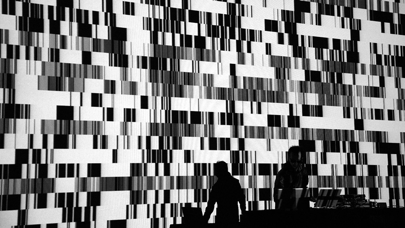

# 生成设计

在经历了众多的重复与秩序之后，笔者自然而然地开始着手创造一些混沌。

## 随机

[ ](http://www.ryojiikeda.com/project/testpattern/#testpattern_live_set)

随机性是熵的最大表现。我们如何在看似可预测而且严苛的代码环境中生成随机性呢？

让我们从分析下面的函数着手:

<div class="simpleFunction" data="y = fract(sin(x)*1.0);"></div>

上面的例子中，我们提取了sin函数其波形的分数部分。值域为```-1.0``` 到 ```1.0``` 之间的[```sin()```](../glossary/?search=sin) 函数被取了小数点后的部分(这里实际是指模1))，返回```0.0``` 到 ```1.0``` 间的正值。我们可以用这种效果通过把正弦函数打散成小片段来得到一些伪随机数。如何实现呢？通过在[```sin(x)```](../glossary/?search=sin)的值上乘以大些的数。点击上面的函数，在1后面加些0。

当你加到 ```100000.0``` （方程看起来是这样的：```y = fract(sin(x)*100000.0)``` ），你再也区分不出sin波了。小数部分的粒度将sine的循环变成了伪随机的混沌。

## 控制混沌

使用随机会很难；它不是太混沌难测就是有时又不够混乱。看看下面的图例。要实现这样的效果，我们像之前描述的那样应用用 ```rand()``` 函数。

细看，你可以看到 [```sin()```](../glossary/?search=sin) 在 ```-1.5707``` 和 ```1.5707``` 上有较大波动。我打赌你现在一定理解这是为什么——那就是sin取得最大值和最小值的地方。

如果你仔细观察随机分布，你会注意到相比边缘，中部更集中。

<div class="simpleFunction" data="y = rand(x);
//y = rand(x)*rand(x);
//y = sqrt(rand(x));
//y = pow(rand(x),5.);"></div>


不久前 [Pixelero](https://pixelero.wordpress.com) 发表了一篇[关于随机分布的有意思的文章](https://pixelero.wordpress.com/2008/04/24/various-functions-and-various-distributions-with-mathrandom/)。 我添加了些前几张图所有的函数来供你试验，看看如何改变分布。取消函数的注释，看看发生什么变化。

如果你读下 [Pixelero 的文章](https://pixelero.wordpress.com/2008/04/24/various-functions-and-various-distributions-with-mathrandom/)，一定谨记我们用的 ```rand()``` 是确定性随机，也被称作是伪随机。这就意味着， 就 ```rand(1.)``` 为例，总会返回相同的值。[Pixelero](https://pixelero.wordpress.com/2008/04/24/various-functions-and-various-distributions-with-mathrandom/) 用 ActionSript 函数做了些参考，```Math.random()```，一个非确定性随机；每次调用都返回不同的值。

## 2D 随机

现在我们对随机有了深入的理解，是时候将它应用到二维，```x``` 轴和 ```y``` 轴。为此我们需要将一个二维向量转化为一维浮点数。这里有几种不同的方法来实现，但 [```dot()```](../glossary/?search=dot) 函数在这个例子中尤其有用。它根据两个向量的方向返回一个 ```0.0``` 到 ```1.0``` 之间的值。

<div class="codeAndCanvas" data="2d-random.frag"></div>

看下第13行和15行，注意我们如何将 ```vec2 st``` 和另一个二维向量 （ ```vec2(12.9898,78.233)```）。

* 试着改变14和15行的值。看看随机图案的变化，想想从中我们能学到什么。

* 好好用鼠标（```u_mouse```）和时间（```u_time```）调戏这个随机函数，更好的理解它如何工作。

## 使用混沌

二维的随机看起来是不是像电视的噪点？对组成图像来说，随机是个难用的原始素材。让我们来学着如何来利用它。

我们的第一步是在网格上的应用；用 [```floor()```](../glossary/?search=floor) 函数，我们将会产生一个单元整数列表。看下下面的代码，尤其是22行和23行。

<div class="codeAndCanvas" data="2d-random-mosaic.frag"></div>

在缩放空间10倍后（在21行），我们将坐标系统的整数和小数部分分离。我们对最后一步操作不陌生，因为我们曾经用这种方法来将空间细分成 ```0.0``` 到 ```1.0``` 的小单元。我们根据得到坐标的整数部分作为一个通用值来隔离一个区域的像素，让它看起来像个单独的单元。然后我们可以用这个通用值来为这个区域得到一个随机值。因为我们的随机函数是伪随机，在那个单元内的所有像素返回的随机值都是一个常量。

取消第29行保留我们坐标的小数部分，这样我们仍旧可以将其用作一个坐标系统，来在单元内部画图形。

结合这两个量 — 坐标的整数部分和小数部分 — 将使你可以结合变化和秩序。

看下这个著名的 ```10 PRINT CHR$(205.5+RND(1)); : GOTO 10```迷宫生成器的GLSL代码块。

<div class="codeAndCanvas" data="2d-random-truchet.frag"></div>

这里我用前一章的 ```truchetPattern()``` 函数根据单元产生的随机值来随机画一个方向的对角线。

你可以通过取消50到53行的代码块的注释得到其他有趣的图案，或者通过取消35和36行来得到图案的动画。

## 掌握随机

[Ryoji Ikeda](http://www.ryojiikeda.com/)，日本电子作曲家、视觉艺术家，是运用随机的大师；他的作品是如此的富有感染力而难忘。他在音乐和视觉媒介中随机的运用，不再是混乱无序，反而以假乱真地折射出我们技术文化的复杂性。

<iframe src="https://player.vimeo.com/video/76813693?title=0&byline=0&portrait=0" width="800" height="450" frameborder="0" webkitallowfullscreen mozallowfullscreen allowfullscreen></iframe>

看看 [Ikeda](http://www.ryojiikeda.com/) 的作品并试试看下面的练习：

* 做按行随机移动的单元（以相反方向）。只显示亮一些的单元。让各行的速度随时间变化。

<a href="../edit.php#10/ikeda-00.frag"><canvas id="custom" class="canvas" data-fragment-url="ikeda-00.frag"  width="520px" height="200px"></canvas></a>

* 同样地，让某几行以不同的速度和方向。用鼠标位置关联显示单元的阀值。

<a href="../edit.php#10/ikeda-03.frag"><canvas id="custom" class="canvas" data-fragment-url="ikeda-03.frag"  width="520px" height="200px"></canvas></a>

* 创造其他有趣的效果。

<a href="../edit.php#10/ikeda-04.frag"><canvas id="custom" class="canvas" data-fragment-url="ikeda-04.frag"  width="520px" height="200px"></canvas></a>

完美地掌握随机之美是困难的，尤其是你想要让作品看起来很自然。随机仅仅是过于混乱了，真实生活中很少有东西看上去如此 ```random()```。如果观察（玻璃床上）雨滴的肌理或是股票的曲线——这两个都挺随机的——但他们和本章开始的随机图案看起来不是同一对爹妈生的。原因？嗯，随机值之间没有什么相关性，而大多数自然图案（肌理）都对前一个状态有所记忆（基于前一个状态）。

下一章我们将学习噪声，一种光滑 和 *自然的* 创作计算机混沌的方式。
