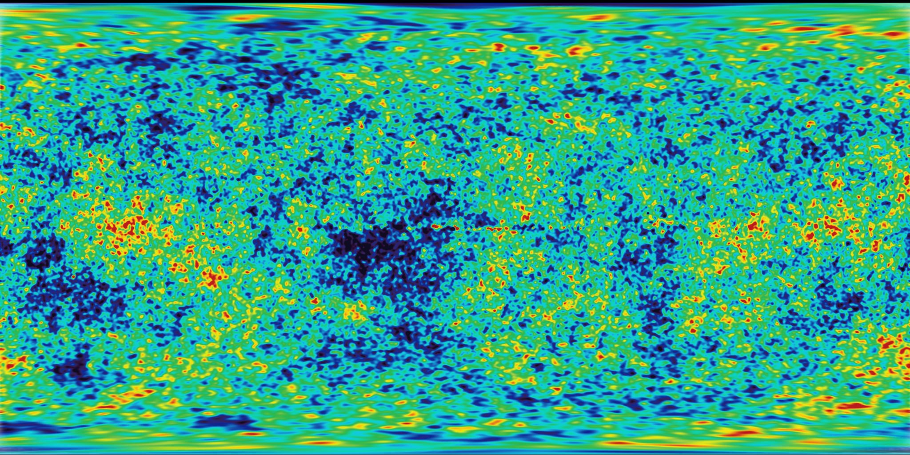

## Noise 噪声

稍事休息，我们来转换一下思路。我们已经玩过了看起来像电视白噪音的 random 函数，尽管脑子里还在嗡嗡地转着 shader，但是已经眼花缭乱了。是时候出去走走了。

我们感知得到浮动在皮肤上的空气，晒在脸上的阳光。世界如此生动而丰富。颜色，质地，声音。当我们走在路上，不免会注意到路面、石头、树木和云朵的表面的样子。


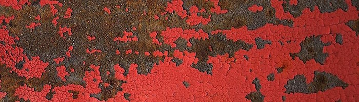
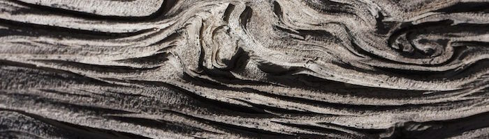
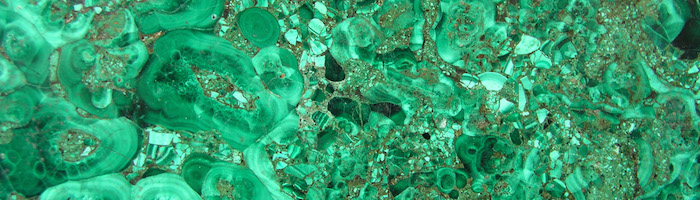
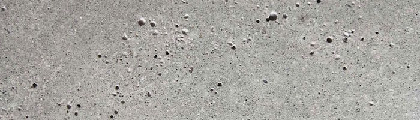
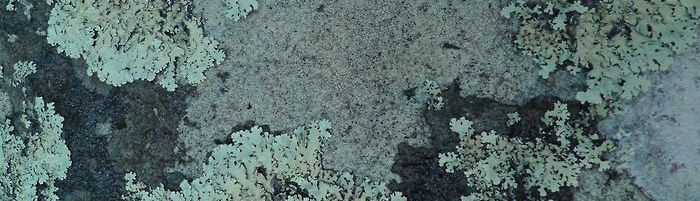
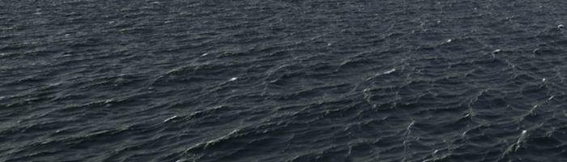

这些纹理的不可预测性可以叫做“random"(随机），但是它们看起来不像是我们之前玩的 random。「真实世界」是如此的丰富而复杂！我们如何才能才能用计算机模拟这些多样的纹理呢？

这就是 [Ken Perlin](https://mrl.nyu.edu/~perlin/) 想要解答的问题。在20世纪80年代早期，他被委任为电影 “Tron”（电子世界争霸战）制作现实中的纹理。为了解决这个问题，他想出了一个优雅的算法，且获得了**奥斯卡奖**（名副其实）。

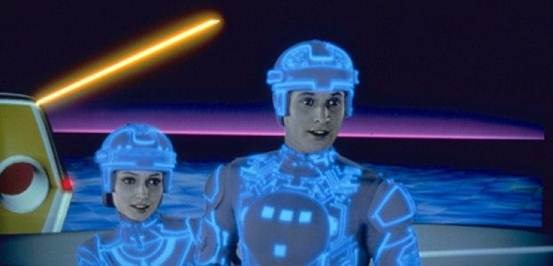

下面这个并不是经典的 Perlin noise 算法，但是这是一个理解如何生成 noise 的好的出发点。

<div class="simpleFunction" data="
float i = floor(x);  // 整数（i 代表 integer）
float f = fract(x);  // 小数（f 代表 fraction）
y = rand(i); //rand() 在之前的章节提过
//y = mix(rand(i), rand(i + 1.0), f);
//y = mix(rand(i), rand(i + 1.0), smoothstep(0.,1.,f));
"></div>

这和之前章节我们做的事情很像。我们把单精度浮点 ```x``` 分割成它的整数部分 ```i``` 和小数部分 ```f``` 。我们用 [```floor()```](.../glossary/?search=floor) 获取 ```i```，用 [```fract()```](.../glossary/?search=fract) 获取 ```f```。然后我们 ```rand()``` x 的整数部分，即根据这个整数生成一个随机值。

在这之后有两个被注释掉的语句。第一句的作用是线性插值。

```glsl
y = mix(rand(i), rand(i + 1.0), f);
```

试试取消这句的注释，看一下会变成什么样子。注意我们储存在 `f` 中的 [```fract()```](.../glossary/?search=fract) 值[```mix()```](.../glossary/?search=mix)了两个随机值。

到本书的这个部分，我们知道我们可以比比线性插值做得更好，不是吗？现在试试取消第二句的注释。第二句用 [```smoothstep()```](.../glossary/?search=smoothstep)进行插值。

```glsl
y = mix(rand(i), rand(i + 1.0), smoothstep(0.,1.,f));
```

在取消注释后，注意顶点的变化如何变得顺滑了起来。在一些 noise 的应用中你会发现程序员喜欢用他们自己的**三次多项式函数**（比如下面的例子），而不是用 [```smoothstep()```](.../glossary/?search=smoothstep)。

```glsl
float u = f * f * (3.0 - 2.0 * f ); // custom cubic curve
y = mix(rand(i), rand(i + 1.0), u); // using it in the interpolation
```

这种 smooth randomness（平滑后的随机值）是一个图形工程师或者说艺术家的制胜法宝——它能生成非常有机的图像或几何形态。Perlin 的 noise 算法被无数次用到各种语言和各种维度的设计中，制作出无数迷人的作品。

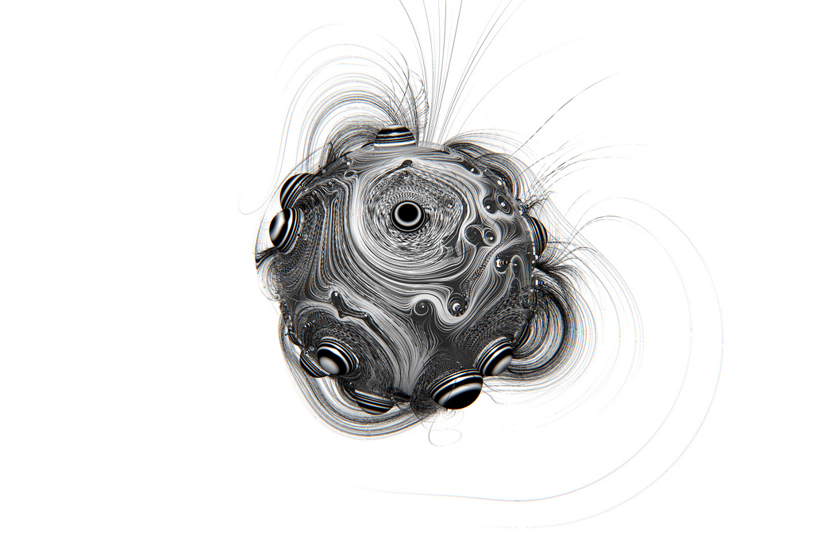

现在轮到你了：

* 写你自己的 ```float noise(float x)``` 函数。

* 用你的 noise 函数为图形制作动效，可以移动，旋转或改变大小。

* 用 noise 让一群图形一起“跳舞”。

* 用 noise 制做有机的形态。

* 创作一个“生物”，给它添加更多独特的动作，使其成为独特的角色。

## 2D Noise

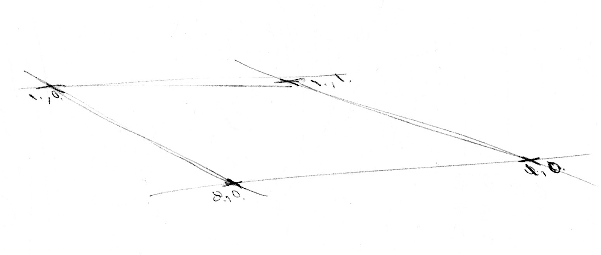

现在我们知道了如何在一维使用 noise，是时候进入二维世界了。在 2D 中，除了在一条线的两点（```fract(x)``` 和 ```fract(x)+1.0```）中插值，我们将在一个平面上的方形的四角（```fract(st)```， ```fract(st)+vec2(1.,0.)```， ```fract(st)+vec2(0.,1.)``` 和 ```fract(st)+vec2(1.,1.)```）中插值。

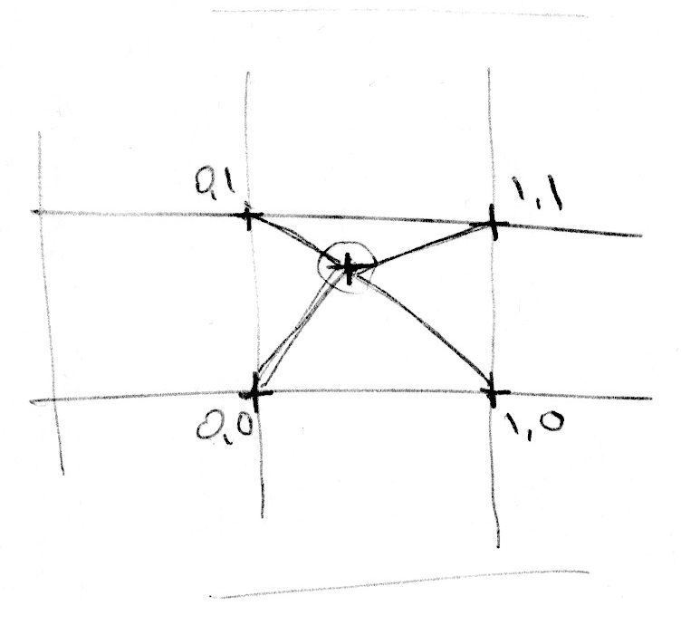

同样，如果我们想要在三维中使用 noise，就需要在一个立方体的8个角中插值。这个技术的重点在于插入随机值，所以我们叫它 **value noise**。

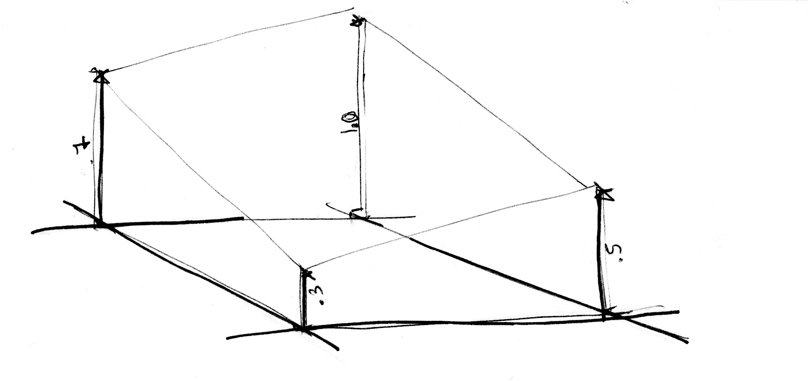

就像一维的那个例子，这个插值不是线性的，而是三次方的，它会平滑地在方形网格中插入点。

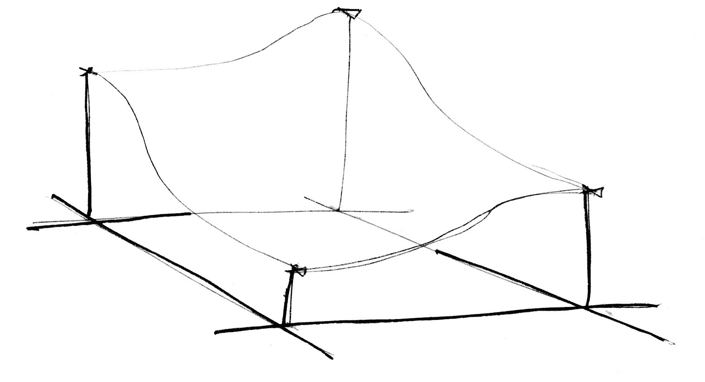

让我们来看一下这个方程。

<div class="codeAndCanvas" data="2d-noise.frag"></div>

我们先把空间大小变成五倍（第 45 行）以便看清栅格间的插值。然后在 noise 函数中我们把空间分成更小的单元。我们把它的整数部分和非整数部分都储存在这个单元里。我们计算整数位置的顶点的坐标，并给每个顶点生成一个随机值（第 23 - 26 行）。最后，在第 35 行用我们之前储存的小数位置的值，在四个顶点的随机值之间插值。

现在又到你了。试试下面的练习：

* 改变第 45 行的乘数。添加动态试试。

* 缩放到什么程度会让 noise 再度变得像 random？

* 缩放到什么程度就看不出来 noise 了？

* 试试看把 noise 函数和鼠标位置连起来。

* 如果我们把 noise 的斜率处理成距离场（distance field）会怎么样？用它来做点有趣的事情。

* 现在你已经可以在混沌和有序之间进行一些操控了，是时候把这些知识用起来了。用长方形，色彩，和 noise 做一幅 [Mark Rothko](http://en.wikipedia.org/wiki/Mark_Rothko) 的复杂的画作吧。

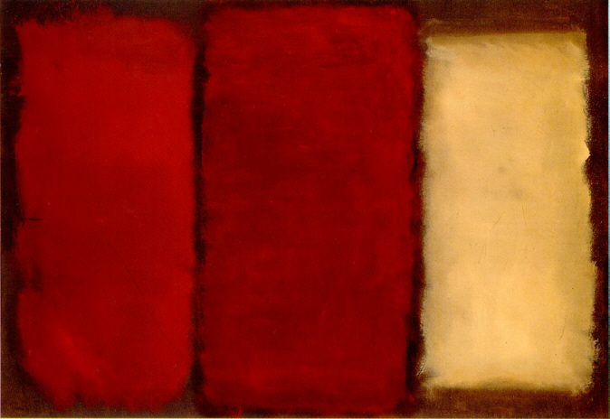

## 生成式设计中的 noise 应用

Noise 算法的设计初衷是将难以言说的自然质感转化成数字图像。在目前我们看到的一维和二维的实践中，都是在random *values*（随机值）之间插值，所以它们才被叫做 **Value Noise**，但是还有很多很多获取 noise 的方法……

[ 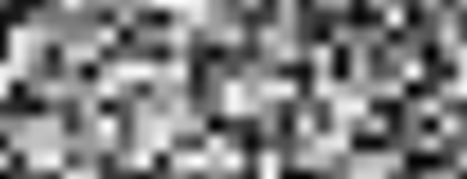 ](../edit.php#11/2d-vnoise.frag)

如你所见，value noise 看起来非常“块状”。为了消除这种块状的效果，在 1985 年 [Ken Perlin](https://mrl.nyu.edu/~perlin/) 开发了另一种 noise 算法 **Gradient Noise**。Ken 解决了如何插入随机的 *gradients*（梯度、渐变）而不是一个固定值。这些梯度值来自于一个二维的随机函数，返回一个方向（```vec2``` 格式的向量），而不仅是一个值（```float```格式）。点击下面的图片查看代码，看这个函数是如何运作的。

[ 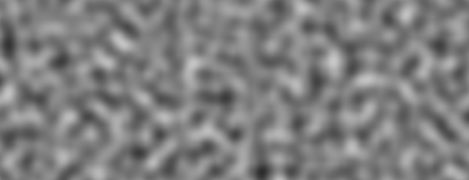 ](../edit.php#11/2d-gnoise.frag)

花一分钟来看看 [Inigo Quilez](http://www.iquilezles.org/) 做的两个例子，注意 [value noise](https://www.shadertoy.com/view/lsf3WH) 和 [gradient noise](https://www.shadertoy.com/view/XdXGW8)的区别。

就像一个画家非常了解画上的颜料是如何晕染的，我们越了解 noise 是如何运作的，越能更好地使用 noise。比如，如果我们要用一个二维的 noise 来旋转空间中的直线，我们就可以制作下图的旋涡状效果，看起来就像木头表皮一样。同样地，你可以点击图片查看代码。

[ 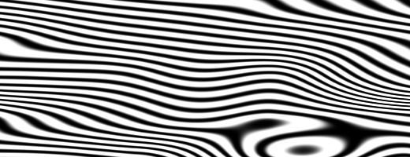 ](../edit.php#11/wood.frag)

```glsl
    pos = rotate2d( noise(pos) ) * pos; // 旋转空间
    pattern = lines(pos,.5); // 画直线
```

另一种用 noise 制作有趣的图案的方式是用 distance field（距离场）处理它，用用 [第七章](../07/)提到的招数。

[ 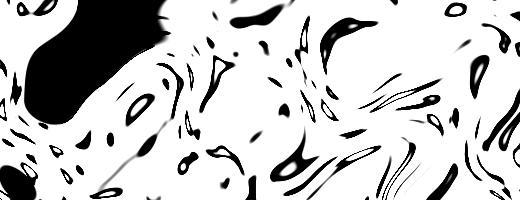 ](../edit.php#11/splatter.frag)

```glsl
    color += smoothstep(.15,.2,noise(st*10.)); // 黑色的泼溅点
    color -= smoothstep(.35,.4,noise(st*10.)); // 泼溅点上的洞
```

第三种方法是用 noise 函数来变换一个形状。这个也需要我们在[第七章](../07/)学到的技术。

<a href="../edit.php#11/circleWave-noise.frag"><canvas id="custom" class="canvas" data-fragment-url="circleWave-noise.frag"  width="300px" height="300"></canvas></a>

给你的练习：

* 你还能做出什么其他图案呢？花岗岩？大理石？岩浆？水？找三种你感兴趣的材质，用 noise 加一些算法把它们做出来。

* 用 noise 给一个形状变形。

* 把 noise 加到动作中会如何？回顾[第八章](../08/)。用移动 “+” 四处跑的那个例子，加一些 random 和 noise 进去。

* 用代码生成波洛克（Jackson Pollock）的画。

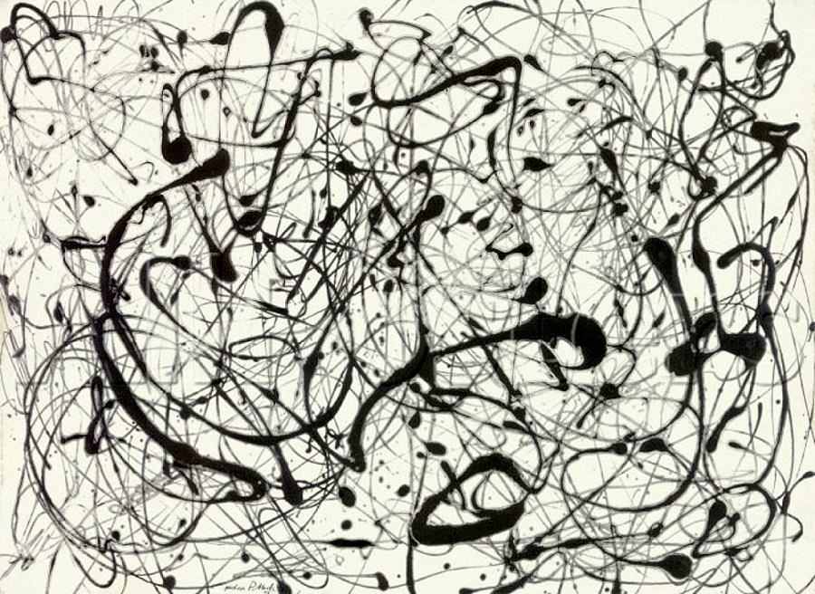

## Simplex Noise

对于 Ken Perlin 来说他的算法所取得的成功是远远不够的。他觉得可以更好。在 2001 年的 Siggraph（译者注：Siggraph是由美国计算机协会「计算机图形专业组」组织的计算机图形学顶级年度会议）上，他展示了 “simplex noise”，simplex noise 比之前的算法有如下优化：

* 它有着更低的计算复杂度和更少乘法计算。
* 它可以用更少的计算量达到更高的维度。
* 制造出的 noise 没有明显的人工痕迹。
* 有着定义得很精巧的连续的 gradients（梯度），可以大大降低计算成本。
* 特别易于硬件实现。

我知道你一定在想：“这人是谁？”是的，他的工作非常杰出！但是说真的，他是如何优化算法的呢？我们已经知道在二维中他是如何在四个点（正方形的四个角）之间插值的；所以没错你已经猜到了，对于三维[（这里有个示例）](../edit.php#11/3d-noise.frag)和四维我们需要插入 8 个和 16 个点。对吧？也就是说对于 N 维你需要插入 2 的 n 次方个点（2^N）。但是 Ken 很聪明地意识到尽管很显然填充屏幕的形状应该是方形，在二维中最简单的形状却是等边三角形。所以他把正方形网格（我们才刚学了怎么用）替换成了单纯形等边三角形的网格。

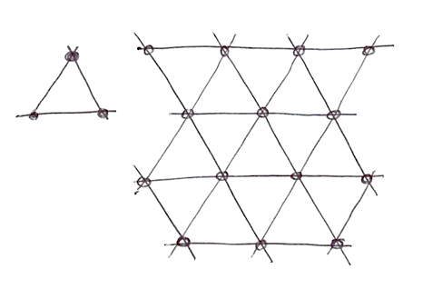

这时 N 维的形状就只需要 N + 1 个点了。也就是说在二维中少了 1 个点，三维中少了 4 个，四维中则少了 11 个！巨大的提升！

在二维中插值过程和常规的 noise 差不多，通过在一组点之间插值。但是在这种情况下，改用单纯形网格，我们只需要给总共 3 个点插值。

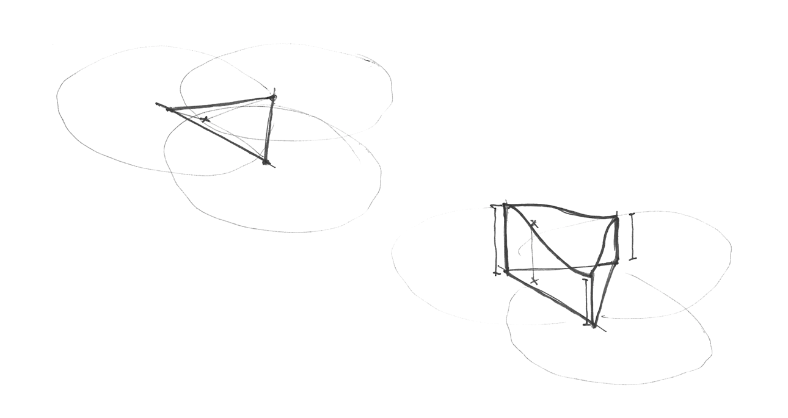

这个单纯形网格是如何制作的？这是另一个聪明绝顶而十分优雅的做法。可以先把常规的四角网格分成两个等腰三角形，然后再把三角形歪斜成等边三角形。

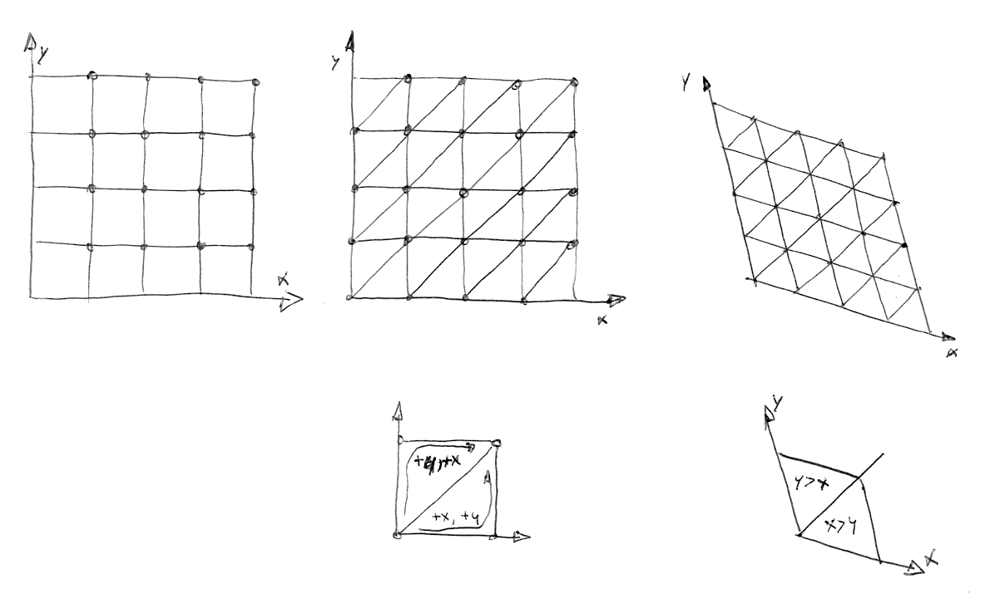

然后，就像 [Stefan Gustavson 在这篇文献中说的](http://staffwww.itn.liu.se/~stegu/simplexnoise/simplexnoise.pdf)：  **“……通过观察转换后坐标的整数部分，我们就可以快速地判断哪个包含着两个单纯形的单元含有我们所需的点。并且通过比较 x 和 y 的大小，我们就可以判断这个点是在上三角还是下三角中，并且遍历这个正确的三角形。”**

在下面的代码中你可以取消第 44 行的注释，看一看网格是如何歪斜的，然后取消第 47 行的注释，看一看如何建造单纯形网格。注意第 22 行中我们仅仅通过判断 if ```x > y``` (下三角) 还是 ```y > x``` (上三角)，就把歪斜过的正方形切成了两个等腰三角形。

<div class="codeAndCanvas" data="simplex-grid.frag"></div>

另一个 **Simplex Noise** 的优化是把三次 Hermite 函数（Cubic Hermite Curve：_f(x) = 3x^2-2x^3_，和 [```smoothstep()```](.../glossary/?search=smoothstep) 一样）替换成了四次 Hermite 函数（ _f(x) = 6x^5-15x^4+10x^3_ ）。这就使得函数曲线两端更“平”，所以每个格的边缘更加优雅地与另一个衔接。也就是说格子的过渡更加连续。你可以取消下面例子的第二个公式的注释，亲眼看看其中的变化（或者看[这个例子](https://www.desmos.com/calculator/2xvlk5xp8b)）。

<div class="simpleFunction" data="
// 三次 Hermite 曲线。和 SmoothStep() 一样
y = x*x*(3.0-2.0*x);
// 四次 Hermite 曲线
//y = x*x*x*(x*(x*6.-15.)+10.);
"></div>

注意曲线的末端发生了怎样的变化。你可以阅读 [Ken 自己的解释](http://mrl.nyu.edu/~perlin/paper445.pdf)了解更多。

所有这些进展汇聚成了算法中的杰作 **Simplex Noise**。下面是这个算法在 GLSL 中的应用，作者是 Ian McEwan，以[这篇论文](http://webstaff.itn.liu.se/~stegu/jgt2012/article.pdf)发表，对于我们的教学而言太复杂了，但你可以点开看看，也许没有你想象得那么晦涩难懂。

[ 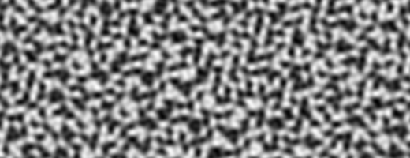 ](../edit.php#11/2d-snoise-clear.frag)

好了，技术细节就说到这里，现在你可以利用它好好自由发挥一下：

* 凝神思考每个 noise 的实例的模样。设想它们是你的原材料，就像雕塑家手中的大理石。你觉得每一个带给你怎样不同的“感觉“？眯起你的眼睛释放想象力，就像你在观察云朵的形状的时候那样。你看到了什么？你想起了什么？你觉得每个 noise 生成的图像可以用来做成什么？放开胆量去做吧，用代码实现它。

* 做一个 shader 来表现流体的质感。比如像[熔岩灯](https://en.wikipedia.org/wiki/Lava_lamp?oldformat=true)，墨水滴，水，等等。

<a href="../edit.php#11/lava-lamp.frag"><canvas id="custom" class="canvas" data-fragment-url="lava-lamp.frag"  width="520px" height="200px"></canvas></a>

* 用 Simplex Noise 给你现在的作品添加更多的材质效果。

<a href="../edit.php#11/iching-03.frag"><canvas id="custom" class="canvas" data-fragment-url="iching-03.frag"  width="520px" height="520px"></canvas></a>

在本章我们介绍了一些操控混沌的方法。这并不是一件简单的工作！成为 noise 超级大师需要时间和努力。

在下面的章节我们会看到一些很有名的技术，来修葺你的技能树，并且从 noise 中学到更多，并利用 shader 设计出更多优质的生成式艺术作品。在那之前，去外面走走，享受深入思考自然和错综复杂的图案的时光吧。培养洞察力也许需要和动手能力相同（甚至更多）的努力。出门走走享受今天剩余的时光吧！

<p style="text-align:center; font-style: italic;">
“和树聊聊天吧，和它交个朋友。” Bob Ross
</p>
