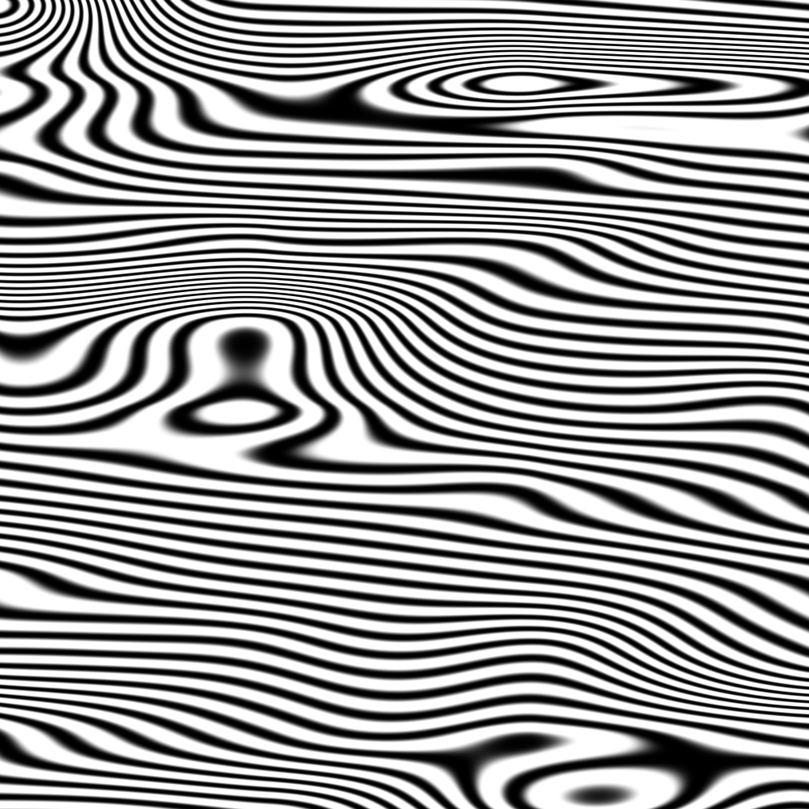

## Noise

It's time for a break! We've been playing with random functions that look like TV white noise, our head is still spinning thinking about shaders, and our eyes are tired. Time to go out for a walk!

是时候来点突破了！我们已经玩过了看起来像电视白噪音的 random 函数，我们脑袋还在想着 shader，但是眼睛已经花了。是时候出去走走了！

We feel the air on our skin, the sun in our face. The world is such a vivid and rich place. Colors, textures, sounds. While we walk we can't avoid noticing the surface of the roads, rocks, trees and clouds. 

我们感知得到浮动在皮肤上的空气，晒在脸上的阳光。世界如此生动与丰富。颜色，质地，声音。当我们走在路上，不免会注意到路面、石头、树木和云朵的表面的样子。


The unpredictability of these textures could be called "random," but they don't look like the random we were playing with before. The “real world” is such a rich and complex place! How can we approximate this variety computationally?

这些纹理的不可预测性应该叫做“random"(随机），但是它们看起来不像是我们之前玩的 random。“真实世界”是如此的丰富而复杂！我们如何才能才能用计算机模拟这些多样的纹理呢？

This was the question [Ken Perlin](https://mrl.nyu.edu/~perlin/) was trying to solve in the eary 1980s when he was commissioned to generate more realistic textures for the movie "Tron." In response to that, he came up with an elegant *Oscar winning* noise algorithm. (No biggie.)

这就是 [Ken Perlin](https://mrl.nyu.edu/~perlin/) 想要解答的问题。在20世纪80年代早期，他被委任为电影“Tron”（电子世界争霸战）制作现实中的纹理。为了解决这个问题，他想出了一个优雅的算法，且获得了**奥斯卡奖**（名副其实）。


The following is not the classic Perlin noise algorithm, but it is a good starting point to understand how to generate noise.

下面这个并不是经典的 Perlin noise 算法，但是这是一个理解如何生成 noise 的好的出发点。

<div class="simpleFunction" data="
float i = floor(x);  // 整数（i 代表 integer）
float f = fract(x);  // 小数（f 代表 fraction）
y = rand(i); //rand() 在之前的章节提过
//y = mix(rand(i), rand(i + 1.0), f);
//y = mix(rand(i), rand(i + 1.0), smoothstep(0.,1.,f));
"></div>

In these lines we are doing something similar to what we did in the previous chapter. We are subdividing a continuous floating number (```x```) into its integer (```i```) and fractional (```f```) components. We use [```floor()```](.../glossary/?search=floor) to obtain ```i``` and [```fract()```](.../glossary/?search=fract) to obtain ```f```. Then we apply ```rand()``` to the integer part of ```x```, which gives a unique random value for each integer.

这和之前章节我们做的事情很像。我们把单精度浮点 ```x``` 再分割成它的整数部分 ```i``` 和小数部分 ```f``` 。我们用 [```floor()```](.../glossary/?search=floor) 获取 ```i```，用 [```fract()```](.../glossary/?search=fract) 获取 ```f```。然后我们 ```rand()``` x 的整数部分，即根据这个整数生成一个随机值。

在这之后有两个被注释掉的语句。第一句的作用是线性插值。

After that you see two commented lines. The first one interpolates each random value linearly.

```glsl
y = mix(rand(i), rand(i + 1.0), f);
``` 

Go ahead and uncomment this line to see how this looks. We use the [```fract()```](.../glossary/?search=fract) value store in `f` to [```mix()```](.../glossary/?search=mix) the two random values.

At this point in the book, we've learned that we can do better than a linear interpolation, right? 
Now try uncommenting the following line, which uses a [```smoothstep()```](.../glossary/?search=smoothstep) interpolation instead of a linear one.

试试取消这句的注释（即去掉 ```//``` ），看一下会变成什么样子。注意我们储存在 `f` 中的 [```fract()```](.../glossary/?search=fract) 值混合（[```mix()```](.../glossary/?search=mix))了两个随机值。

到本书的这个部分，我们知道我们可以比比线性插值做得更好，不是吗？现在试试取消第二句的注释。第二句用 [```smoothstep()```](.../glossary/?search=smoothstep)进行插值。

```glsl
y = mix(rand(i), rand(i + 1.0), smoothstep(0.,1.,f));
```

After uncommenting it, notice how the transition between the peaks gets smooth. In some noise implementations you will find that programmers prefer to code their own cubic curves (like the following formula) instead of using the [```smoothstep()```](.../glossary/?search=smoothstep). 

在取消注释后，注意顶点的变化如何变得顺滑了起来。在一些 noise 的应用中你会发现程序员喜欢用他们自己的**立方曲线？**（比如下面的例子），而不是用 [```smoothstep()```](.../glossary/?search=smoothstep)。

```glsl
float u = f * f * (3.0 - 2.0 * f ); // custom cubic curve
y = mix(rand(i), rand(i + 1.0), u); // using it in the interpolation
```

This *smooth randomness* is a game changer for graphical engineers or artists - it provides the ability to generate images and geometries with an organic feeling. Perlin's Noise Algorithm has been implemented over and over in different languages and dimensions to make mesmerizing pieces for all sorts of creative uses.

这个 **流畅的随机性**（smooth randomness）是一个图形工程师或者说艺术家的**游戏转换器？**——它能生成非常有机的图像或几何形态。Perlin 的 noise 算法被无数次用到各种语言和各种维度的设计中，制作出无数令人迷醉的作品。


Now it's your turn:

* Make your own ```float noise(float x)``` function.

* Use your noise function to animate a shape by moving it, rotating it or scaling it.

* Make an animated composition of several shapes 'dancing' together using noise.

* Construct "organic-looking" shapes using the noise function.

* Once you have your "creature," try to develop it further into a character by assigning it a particular movement.

现在轮到你了：

* 写你自己的 ```float noise(float x)``` 函数。

* 用你的 noise 函数为图形制作动效，可以移动，旋转或改变大小。

* 用 noise 让一群图形一起“跳舞”。

* 用 noise 制做有机的形态。

* 创作一个“生物”，给它添加更多独特的动作，使其成为独特的角色。

## 2D Noise


Now that we know how to do noise in 1D, it's time to move on to 2D. In 2D, instead of interpolating between two points of a line (```fract(x)``` and ```fract(x)+1.0```), we are going to interpolate between the four corners of the square area of a plane (```fract(st)```, ```fract(st)+vec2(1.,0.)```, ```fract(st)+vec2(0.,1.)``` and ```fract(st)+vec2(1.,1.)```).

现在我们知道了如何在一维使用 noise，是时候进入二维了。在 2D 中，除了在一条线的两点（```fract(x)``` 和 ```fract(x)+1.0```）中插值，我们将在一个平面上的方形的四角（```fract(st)```， ```fract(st)+vec2(1.,0.)```， ```fract(st)+vec2(0.,1.)``` 和 ```fract(st)+vec2(1.,1.)```）中插值。


Similarly, if we want to obtain 3D noise we need to interpolate between the eight corners of a cube. This technique is all about interpolating random values, which is why it's called **value noise**.

相似地，如果我们想要在三维中使用 noise，就需要在一个立方体的8个角中插值。这个技术的重点在于插入随机值，所以我们叫它**？value noise**。


Like the 1D example, this interpolation is not linear but cubic, which smoothly interpolates any points inside our square grid.

就像一维的例子，这个插值不是线性的，而是三次方的，**？它会流畅地在我们的方形网格插入任何点。**


Take a look at the following noise function. 

让我们来看一下这个方程。

<div class="codeAndCanvas" data="2d-noise.frag"></div>

We start by scaling the space by 5 (line 45) in order to see the interpolation between the squares of the grid. Then inside the noise function we subdivide the space into cells. We store the integer position of the cell along with the fractional positions inside the cell. We use the integer position to calculate the four corners' coordinates and obtain a random value for each one (lines 23-26). Finally, in line 35 we interpolate between the 4 random values of the corners using the fractional positions we stored before.

我们先把空间大小变成五倍（第 45 行）以便看清栅格间的插值。然后在 noise 函数中我们把空间分成更小的单元。我们把它的整数部分和非整数部分都储存在这个单元里。我们计算整数位置的顶点的坐标，并给每个顶点生成一个随机值（第 23 - 26 行）。最后，在第 35 行用我们之前储存的非整数位置，在四个顶点的随机值之间插值。

Now it's your turn. Try the following exercises:

* Change the multiplier of line 45. Try to animate it.

* At what level of zoom does the noise start looking like random again?

* At what zoom level is the noise is imperceptible?

* Try to hook up this noise function to the mouse coordinates.

* What if we treat the gradient of the noise as a distance field? Make something interesting with it.

* Now that you've achieved some control over order and chaos, it's time to use that knowledge. Make a composition of rectangles, colors and noise that resembles some of the complexity of a [Mark Rothko](http://en.wikipedia.org/wiki/Mark_Rothko) painting.

现在又到你的时间了。试试下面的练习：

* 改变第 45 行的乘数。添加动态试试。

* 缩放到什么程度会让 noise 再度变得像 random？

* 缩放到什么程度就看不出来 noise 了？

* 试试看把 noise 函数和鼠标位置连起来。

* 如果我们把 noise 的斜率处理成**距离场？**（distance field）会怎么样？用它来做点有趣的事情。

* 现在你已经可以在混沌和有序之间进行一些操控了，是时候把这些知识用起来了。


## Using Noise in Generative Designs 生成式设计中的 noise 应用

Noise algorithms were originally designed to give a natural *je ne sais quoi* to digital textures. The 1D and 2D implementations we've seen so far were interpolations between random *values*, which is why they're called **Value Noise**, but there are more ways to obtain noise...

Noise 算法的设计初衷是将难以言说的自然质感转化成数字图像。在目前我们看到的一维和二维的实践中，都是在random *values*（随机值）之间插值，所以它们才被叫做**Value Noise？**（固定值噪声？），但是还有很多很多获取 noise 的方法……

[  ](../edit.html#11/2d-vnoise.frag)

As you discovered in the previous exercises, value noise tends to look "blocky." To diminish this blocky effect, in 1985 [Ken Perlin](https://mrl.nyu.edu/~perlin/) developed another implementation of the algorithm called **Gradient Noise**. Ken figured out how to interpolate random *gradients* instead of values. These gradients were the result of a 2D random function that returns directions (represented by a ```vec2```) instead of single values (```float```). Click on the following image to see the code and how it works.

如你所见，value noise 看起来非常“块状”。为了消除这种块状的效果，在 1985 年 [Ken Perlin](https://mrl.nyu.edu/~perlin/) 开发了另一种 noise 算法 **Gradient Noise?**（梯度噪声？）。Ken 解决了如何插入随机的*gradients*（梯度）而不是一个固定值。这些梯度值来自于一个二维的随机函数，返回一个方向（```vec2``` 格式的向量），而不仅是一个值（```float```格式）。点击下面的图片查看代码，看这个函数是如何运作的。

[  ](../edit.html#11/2d-gnoise.frag)

Take a minute to look at these two examples by [Inigo Quilez](http://www.iquilezles.org/) and pay attention to the differences between [value noise](https://www.shadertoy.com/view/lsf3WH) and [gradient noise](https://www.shadertoy.com/view/XdXGW8).

花一分钟来看看 [Inigo Quilez](http://www.iquilezles.org/) 做的两个例子，注意 [value noise](https://www.shadertoy.com/view/lsf3WH) 和 [gradient noise](https://www.shadertoy.com/view/XdXGW8)的区别。

Like a painter who understands how the pigments of their paints work, the more we know about noise implementations the better we will be able to use them. For example, if we use a two dimensional noise implementation to rotate the space where straight lines are rendered, we can produce the following swirly effect that looks like wood. Again you can click on the image to see what the code looks like. 

就像一个画家非常了解画上的颜料是如何晕染的，我们越了解 noise 是如何运作的，越能更好地使用 noise。比如，如果我们要用一个二维的 noise 来旋转空间中的直线，我们就可以制作下图的旋涡状效果，看起来就像木头表皮一样。同样地，你可以点击图片查看代码。

[  ](../edit.html#11/wood.frag)

```glsl
    pos = rotate2d( noise(pos) ) * pos; // 旋转空间
    pattern = lines(pos,.5); // 画直线
```

Another way to get interesting patterns from noise is to treat it like a distance field and apply some of the tricks described in the [Shapes chapter](../07/).

另一种用 noise 制作有趣的图案的方式是用 distance field（距离场？查看前几章翻译）处理它，用用 [第七章](../07/)提到的招数。

[  ](../edit.html#11/splatter.frag)

```glsl
    color += smoothstep(.15,.2,noise(st*10.)); // 黑色的泼溅点
    color -= smoothstep(.35,.4,noise(st*10.)); // 泼溅点上的洞
```

A third way of using the noise function is to modulate a shape. This also requires some of the techniques we learned in the [chapter about shapes](../07/).

第三种方法是用 noise 函数来变换一个形状。这个也需要我们在[第七章](../07/)学到的技术。

<a href="../edit.html#11/circleWave-noise.frag"><canvas id="custom" class="canvas" data-fragment-url="circleWave-noise.frag"  width="300px" height="300"></canvas></a> 

For you to practice:

* What other generative pattern can you make? What about granite? marble? magma? water? Find three pictures of textures you are interested in and implement them algorithmically using noise.
* Use noise to modulate a shape.
* What about using noise for motion? Go back to the [Matrix chapter](../08/). Use the translation example that moves the "+" around, and apply some *random* and *noise* movements to it.
* Make a generative Jackson Pollock.

小练习：

* 你还能做出什么其他图案呢？花岗岩？大理石？岩浆？水？找三种你感兴趣的材质，用 noise 加一些算法把它们做出来。
* 用 noise 给一个形状变形。
* 把 noise 加到动作中会如何？回顾[第八章](../08/)。用移动 “+” 四处跑的那个例子，加一些 random 和 noise 进去。
* 用代码生成波洛克（Jackson Pollock）的画。


## Simplex Noise

For Ken Perlin the success of his algorithm wasn't enough. He thought it could perform better. At Siggraph 2001 he presented the "simplex noise" in which he achieved the following improvements over the previous algorithm:

* An algorithm with lower computational complexity and fewer multiplications.
* A noise that scales to higher dimensions with less computational cost.
* A noise without directional artifacts.
* A noise with well-defined and continuous gradients that can be computed quite cheaply.
* An algorithm that is easy to implement in hardware.

对于 Ken Perlin 来说他的算法所取得的成功是远远不够的。他觉得可以更好。在 2001 年的 Siggraph（Siggraph是由美国计算机协会「计算机图形专业组」组织的计算机图形学顶级年度会议）上，他展示了“simplex noise”（simplex 噪声），“simplex noise”比之前的算法有如下优化：

* 它有着更低的计算复杂度和更少乘法计算。
* 它可以用更少的计算量达到更高的维度。
* 制造出的 noise 没有明显的人工痕迹。
* 有着设计精良的连续的梯度可以大大降低计算成本。
* 特别易于硬件实现。

I know what you are thinking... "Who is this man?" Yes, his work is fantastic! But seriously, how did he improve the algorithm? Well, we saw how for two dimensions he was interpolating 4 points (corners of a square); so we can correctly guess that for [three (see an implementation here)](../edit.html#11/3d-noise.frag) and four dimensions we need to interpolate 8 and 16 points. Right? In other words for N dimensions you need to smoothly interpolate 2 to the N points (2^N). But Ken smartly noticed that although the obvious choice for a space-filling shape is a square, the simplest shape in 2D is the equilateral triangle. So he started by replacing the squared grid (we just learned how to use) for a simplex grid of equilateral triangles.

我知道你一定在想：“这人是谁？”是的，他的工作非常杰出！但是说真的，他是如何优化算法的呢？我们已经知道在二维中他是如何在四个点（正方形的四个角）之间插值的；所以没错你已经猜到了，对于三维[（这里有个示例）](../edit.html#11/3d-noise.frag)和四维我们需要插入 8 个和 16 个点。对吧？也就是说对于 N 维你需要插入 2 的 n 次方个点（2^N）。但是 Ken 很聪明地意识到尽管很显然填充屏幕的形状应该是方形，在二维中最简单的形状却是等边三角形。所以他把正方形网格（我们才刚学了怎么用）替换成了单纯形等边三角形的网格。


The simplex shape for N dimensions is a shape with N + 1 corners. In other words one fewer corner to compute in 2D, 4 fewer corners in 3D and 11 fewer corners in 4D! That's a huge improvement!

In two dimensions the interpolation happens similarly to regular noise, by interpolating the values of the corners of a section. But in this case, by using a simplex grid, we only need to interpolate the sum of 3 corners.

这时 N 维的形状就只需要 N + 1 个点了。也就是说在二维中少了 1 个点，三维中少了 4 个，四维中则少了 11 个！巨大的提升！

在二维中差之过程和常规的 noise 差不多，通过在一组点之间插值。但是在这种情况下，改用单纯形网格，我们只需要给总共 3 个点插值。


How is the simplex grid made? In another brilliant and elegant move, the simplex grid can be obtained by subdividing the cells of a regular 4 cornered grid into two isosceles triangles and then skewing it until each triangle is equilateral.

这个单纯形网格是如何制作的？这是另一个聪明绝顶而十分优雅的做法。可以先把常规的四角网格分成两个等腰三角形，然后再把三角形歪成等边三角形。


Then, as [Stefan Gustavson describes in this paper](http://staffwww.itn.liu.se/~stegu/simplexnoise/simplexnoise.pdf): _"...by looking at the integer parts of the transformed coordinates (x,y) for the point we want to evaluate, we can quickly determine which cell of two simplices that contains the point. By also comparing the magnitudes of x and y, we can determine whether the point is in the upper or the lower simplex, and traverse the correct three corner points."_ 

In the following code you can uncomment line 44 to see how the grid is skewed, and then uncomment line 47 to see how a simplex grid can be constructed. Note how on line 22 we are subdividing the skewed square into two equilateral triangles just by detecting if ```x > y``` ("lower" triangle) or ```y > x``` ("upper" triangle).

然后，就像 [Stefan Gustavson 在这篇文献中说的](http://staffwww.itn.liu.se/~stegu/simplexnoise/simplexnoise.pdf)：  _“……通过观察转换后坐标的整数部分，我们就可以快速地判断哪个包含着两个单纯形的单元含有我们所需的点。并且通过比较 x 和 y 的大小，我们就可以判断这个点是在上三角还是下三角中，并且遍历这个正确的三角形。”_

在下面的代码中你可以取消第 44 行的注释，看一看网格是如何歪斜的，然后取消第 47 行的注释，看一看如何建造单纯形网格。注意第 22 行中我们仅仅通过判断 if ```x > y``` (下三角) 还是 ```y > x``` (上三角)，就把歪斜过的正方形切成了两个等腰三角形。

<div class="codeAndCanvas" data="simplex-grid.frag"></div>

Another improvement introduced by Perlin with **Simplex Noise**, is the replacement of the Cubic Hermite Curve ( _f(x) = 3x^2-2x^3_ , which is identical to the [```smoothstep()```](.../glossary/?search=smoothstep) function) for a Quintic Hermite Curve ( _f(x) = 6x^5-15x^4+10x^3_ ). This makes both ends of the curve more "flat" so each border gracefully stiches with the next one. In other words you get a more continuous transition between the cells. You can see this by uncommenting the second formula in the following graph example (or see the [two equations side by side here](https://www.desmos.com/calculator/2xvlk5xp8b)). 

另一个 **Simplex Noise** 的优化是把三次埃尔米特函数（Cubic Hermite Curve：_f(x) = 3x^2-2x^3_，和 [```smoothstep()```](.../glossary/?search=smoothstep) 一样）替换成了四次埃尔米特函数（ _f(x) = 6x^5-15x^4+10x^3_ ）。这就使得函数曲线两端更“平”，所以每个格的边缘更加优雅地与另一个衔接。也就是说格子的过渡更加连续。你可以取消下面例子的第二个公式的注释，亲眼看看其中的变化（或者看[这个例子](https://www.desmos.com/calculator/2xvlk5xp8b)）。

<div class="simpleFunction" data="
// 三次埃尔米特曲线。和 SmoothStep() 一样
y = x*x*(3.0-2.0*x);
// 四次埃尔米特曲线
//y = x*x*x*(x*(x*6.-15.)+10.);
"></div>

Note how the ends of the curve change. You can read more about this in [Ken's own words](http://mrl.nyu.edu/~perlin/paper445.pdf).

All these improvements result in an algorithmic masterpiece known as **Simplex Noise**. The following is a GLSL implementation of this algorithm made by Ian McEwan (and presented in [this paper](http://webstaff.itn.liu.se/~stegu/jgt2012/article.pdf)) which is overcomplicated for educational purposes, but you will be happy to click on it and see that it is less cryptic than you might expect.

注意曲线的末端发生了怎样的变化。你可以阅读 [Ken 自己的阐述](http://mrl.nyu.edu/~perlin/paper445.pdf)了解更多。

所有这些进步汇聚成了算法中的杰作 **Simplex Noise**。下面是这个算法在 GLSL 中的应用，作者是 Ian McEwan，以[这篇论文](http://webstaff.itn.liu.se/~stegu/jgt2012/article.pdf)发表，对于我们的教学而言太复杂了，但你可以点开看看，也许没有你想象得那么晦涩难懂。

[  ](../edit.html#11/2d-snoise-clear.frag)

Well... enough technicalities, it's time for you to use this resource in your own expressive way:

* Contemplate how each noise implementation looks**【？？】**. Imagine them as a raw material, like a marble rock for a sculptor. What can you say about about the "feeling" that each one has? Squinch your eyes to trigger your imagination, like when you want to find shapes in a cloud. What do you see? What are you reminded of? What do you imagine each noise implementation could be made into? Following your guts and try to make it happen in code.

* Make a shader that projects the illusion of flow. Like a lava lamp, ink drops, water, etc.

好了，技术细节就说到这里，现在你可以利用它好好自由发挥一下：

* 深入思考每个 noise 算法为什么看起来是这样的。把它们想象成原材料，比如雕塑家手中的大理石。你觉得每一个带给你怎样不同的“感觉“？眯起你的眼睛释放想象力，就像你在寻找云朵的形状的蛛丝马迹。你看到了什么？你想起了什么？你觉得每个 noise 生成的图像可以用来做成什么？放开胆量去做吧，用代码实现它。

<a href="../edit.html#11/lava-lamp.frag"><canvas id="custom" class="canvas" data-fragment-url="lava-lamp.frag"  width="520px" height="200px"></canvas></a> 

* Use Simplex Noise to add some texture to a work you've already made.

* 用 Simplex Noise 给你现在的作品添加更多的材质效果。

<a href="../edit.html#11/iching-03.frag"><canvas id="custom" class="canvas" data-fragment-url="iching-03.frag"  width="520px" height="520px"></canvas></a> 

In this chapter we have introduced some control over the chaos. It was not an easy job! Becoming a noise-bender-master takes time and effort. 

In the following chapters we will see some well known techniques to perfect your skills and get more out of your noise to design quality generative content with shaders. Until then enjoy some time outside contemplating nature and its intricate patterns. Your ability to observe needs equal (or probably more) dedication than your making skills. Go outside and enjoy the rest of the day!

在本章我们介绍了一些操控混沌的方法。这并不是一件简单的工作！成为 noise 超级大师需要时间和努力。

在下面的章节我们会看到一些有名的技术，用来修葺你的技能树，并且从 noise 中学习更多，利用 shader 设计出更多优质的生成式艺术作品。在那之前，去外面走走，享受深入思考自然和错综复杂的图案的时光吧。培养洞察力也许需要和动手能力相同（甚至更多）的努力。出门走走享受今天剩余的时光吧！

<p style="text-align:center; font-style: italic;">
”和树聊聊天吧，和它交个朋友。“ Bob Ross
</p> 
