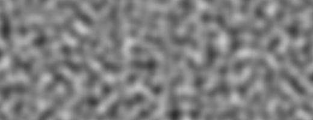

## نویز

وقت استراحت است! با  تابع های رندومی که مانند برفک ها تلویزیون بودند کار کردیم و هنوز سرمان گیح می‌رود و چشمانامان خسته شده است:) وقتش هست که کمی قدم بزنیم!

ما روی پوست خود هوا و خوشید را روی صورتمان حس می‌کنیم. جهان اینگونه زنده و غنی است. رنگ ها، صدا ها و بافت ها. وقتی راه می‌رویم نمی‌توانیم از سطوح جاده و سنگ ها و درختان و ابرها چشم پوشی کنیم.


به غیر قابل پیش بینی بودن این رنگ ها رندوم گفته می‌شود. اما مانند رندومی که در دروس قبلی کار کردیم نیستند. جهان جایی غنی و پیچیده است! چگونه می‌توان این تنوع را از نظر محاسباتی پیاده سازی کرد؟

این سوالی بود که [Ken Perlin](https://mrl.nyu.edu/~perlin/) قصد داشت در اوایل دهه 1980 آن را حل کند، وقتی که وظیفه داشت بافتی واقعی تر برای فیلم ترون ایجاد کند. برای این منظور اون الگوریتمی ایجاد کرد که موجب برنده شدن جایزه اسکار شد.


کد زیر نمونه اصلی نویز پرلین نیست اما برای شروع و درک این مبحث مناسب است.

<div class="simpleFunction" data="
float i = floor(x);  // integer
float f = fract(x);  // fraction
y = rand(i); //rand() is described in the previous chapter
//y = mix(rand(i), rand(i + 1.0), f);
//y = mix(rand(i), rand(i + 1.0), smoothstep(0.,1.,f));
"></div>

در این خطوط کاری مشابه قسمت های قبلی می‌کنیم. ما عدد ادامه دار یعنی (```x```) را تبیدل به اعداد صحیح یعنی (```i```) و مقدار کسری اش  (```f```)  می‌کنیم. از [```floor()```](../glossary/?search=floor) برای ساخت ```i``` و [```fract()```](../glossary/?search=fract) برای ساخت ```f``` استفاده می‌کنیم. بعد تابع ```rand()``` را به قسمت صحیح ```x``` اعمال می‌کنیم, که در نتیجه یک عدد رندوم خاص برای هر مقدار صحیح می‌دهد.

بعد از این ها ما دو خط کامنت شده داریم. اولی بین دو تابع رندوم بصورت خطی عمل درون یابی انجام می‌دهد..

```glsl
y = mix(rand(i), rand(i + 1.0), f);
```

این خط را از حالت کامت خارج کنید و ببینید چه شکلی می‌شود. از مقادیر [```fract()```](../glossary/?search=fract) ذخیره شده در `f` برای [```mix()```](../glossary/?search=mix) درون یابی بین دو مقدار رندوم استفاده می‌کنیم.

اما می‌توانیم کاری بهتر از درون یابی خطی انجام دهیم.
حالا خطی که از[```smoothstep()```](../glossary/?search=smoothstep) استفاده می‌کند را از حالت کامنت خارج کنید. 

```glsl
y = mix(rand(i), rand(i + 1.0), smoothstep(0.,1.,f));
```
در این کد می‌بیندی که انتقال بین قله ها نرم تر صورت گرفته است.در برخی پیاده سازی های نویز برنامه نویسان تمایل دارند نویز مکعبی خود را پیاده سازی کنند (مانند فرمول زیر) به جای استفاده از [```smoothstep()```](../glossary/?search=smoothstep).

```glsl
float u = f * f * (3.0 - 2.0 * f ); // custom cubic curve
y = mix(rand(i), rand(i + 1.0), u); // using it in the interpolation
```

این رندوم نرم یک عنصر اساسی برای مهندسان گرافیک و آرتیست ها است و  این امکان را می‌دهد که تصاویر و اشکال با حسی اورگانیک ساخته شوند. الگوریتم نویز پرلین بار ها در زبان ها و ابعاد مختلف پیاده سازی شده است تا قطعاتی مسحور کننده برای انواع استفاده های خلاقانه بسازد.


حالا نوبت شماست:

* تابع نویز ```float noise(float x)``` مخصوص خودتان را بسازید.

* از تابع نویز خود برای انیمیت کردن، تغییر زاویه و اندازه شکل استفاده کنید.

* یک ترکیب متحرک از اشیایی بسازید که در حال رقصیدن باشند.

* یک شکل خاص و استثنایی با استفاده از نویز بسازید.

* هنگامی که شکلتان را ساختید سعی کنید با اضافه کردن حرکتی خاص آن را بیشتر به یک شخصیت تبدیل کنید.

## نویز دو بعدی


حال که می‌دانیم چگونه در یک بعد نویز بسازیم, وقتش است به سراغ دو بعدی ها برویم. در دو بعدی, به جای درون یابی بین دو نقظه از یک خط (```fract(x)``` و ```fract(x)+1.0```), باید بین 4 گوشه یک صفحه درون یابی کنیم (```fract(st)```, ```fract(st)+vec2(1.,0.)```, ```fract(st)+vec2(0.,1.)``` و```fract(st)+vec2(1.,1.)```).


به طور مشابه، اگر بخواهیم نویز سه بعدی ایجاد کنیم باید بین 8 گوشه یک مکعب درون یابی کنیم. این تکنیک تمام در مورد درون یابی بین مقادیر است، به همین علت هم به آن نویز مقدار گفته می‌شود.


مانند مثال یک بعدی، این درون یابی بطور خطی نیست بلکه بصورت cubic است، به طوری که هر نقطه داخل محدوده مان را درون یابی می‌کند.


به این تابع نویز نگاهی بیاندازید.

<div class="codeAndCanvas" data="2d-noise.frag"></div>

اول فضا را 5 برابر کردیم(در خط 45) تا درون یابی بین مربع هاقابل مشاهده باشند. سپس در تابع نویز, فضا را مانند سلول هایی در نظر گرفتیم. همچنین مقدار صحیح سلول ها و مقدار کسری سلول ها را ذخیره کرده ایم. از مختصاصت صحیح برای محاسبه مقادیر رندوم گوشه ها استفاده می‌کنیم، برای هر گوشه مقداری را بدست می‌آوریم(در خطوط 23 تا 26) در نهایت در خط 35 با استفاده از مقادیر کسری هر سلول، درون یابی بین چهار گوشه را انجام می‌دهیم.

حالا نوبت شماست، این تمرین ها را انجام دهید:

* در خط 45 ضرب را تغییر دهید. سعی کنید آن متحرک کنید.

* در چه مرحله از زوم دوباره نویز شبیه رندوم می‌شود؟

* تا چه مقداری از زوم نویز محسوس نیست؟ 

* سعی کنید این تابع نویز را با مختصات موس پیوند بزنید.

* چه می‌شود اگر طیف نویز را مثل یک میدان فیلد در نظر بگیریم؟ یک کار جالب با آن انجام دهید.

* حال که بین نظم و هرج و مرج به کنترلی رسیدیم، وقتش است از دانشمان اسفاده کنیم. ترکیبی از مستطیل ها درست کنید, سعی کنید رنگ بندی و پیچیدگی های نقاشی [Mark Rothko](http://en.wikipedia.org/wiki/Mark_Rothko) را بوجود آورید.


## استفاده از نویز در طراحی ها مولد

الگوریتم های نویز برای طبیعی تر جلوه دادن تصاویر بوجود آمدند. نویز های یک بعدی و دو بعدی که فعلا دیدیم، درون یابی بین چند مقدار بودند، به همین علت هم به آنان نویز مقدار گفته می‌شود، اما روش های دیگری نیز برای ساختن نویز وجود دارد.

[  ](../edit.php#11/2d-vnoise.frag)

همانطور که در تمرین های قبلی متوجه شدید, نویز های مقدار تمایل به تکه تکه بودن بلاکی دارند." برای کاهش تکه تکه ای بودن نویز, در 1985 [کن پرلین](https://mrl.nyu.edu/~perlin/) نوعی دیگر از الگوریتم نویز را به نام Gradient Noise خلق کرد. اون فهمید چگونه بجای مقادیر، بین شیب ها یا همان Gradient ها درون یابی کند. این گرادیان ها نتیجه یک رندوم دو بعدی که جهت را  (represented by a ```vec2```) به جای یک مقدار (```float```) برمی‌گرداند است. بر روی عکس پایین کلیک کنید و ببیند که چگونه کار می‌کند.

[  ](../edit.php#11/2d-gnoise.frag)

چند دقیقه به مثال های [Inigo Quilez](http://www.iquilezles.org/) و به تفاوت بین این دو نویز  [value noise](https://www.shadertoy.com/view/lsf3WH) و [gradient noise](https://www.shadertoy.com/view/XdXGW8) توجه کنید.

مانند نقاش که می‌داند رنگ دانه ها چگونه عمل می‌کنند، ما نیز هرچه بیشتر در مورد نحوه پیاده سازی نویز بدانیم، بهتر می‌توانیم از آن استفاده کنیم. برای مثال, اگر ما از نویز دوبعدی برای چرخش فضای در جایی که خط های مستقیم رندر شده اند استفاده کنیم، می‌توانیم افکت چرخشی زیر که شبیه تکستچر چوب است را پیاده سازی کنیم. می‌توانید با کلیک روی تصویر زیر کد آن را مشاهده کنید

[  ](../edit.php#11/wood.frag)

```glsl
    pos = rotate2d( noise(pos) ) * pos; // rotate the space
    pattern = lines(pos,.5); // draw lines
```

راه جالب دیگر برای ساخت پترن، رفتار کردن با انان به عنوان فیلد فاصله است. چند ترفند  [Shapes chapter](../07/) را می‌توان روی آن پیاده کنید.

[  ](../edit.php#11/splatter.frag)

```glsl
    color += smoothstep(.15,.2,noise(st*10.)); // Black splatter
    color -= smoothstep(.35,.4,noise(st*10.)); // Holes on splatter
```

راه دیگر اسفاده از نویز ها تعدیل کردن اشکال است. که نیاز به استفاده از تکنیک هایی دارد که در فصل [chapter about shapes](../07/) یاد گرفتیم.

<a href="../edit.php#11/circleWave-noise.frag"><canvas id="custom" class="canvas" data-fragment-url="circleWave-noise.frag"  width="300px" height="300"></canvas></a>

برای تمرین:

* چه پترن های مولد دیگری می‌توانید بسازید؟ سنگ گرانیت؟ مرمر؟ گدازه؟ آب؟ سه تصویر دلخواه را که می‌خواهید با نویز پیاده سازی کنید انتخاب و سعی کنید با استفاده از الگوریتم ها آنان را پیاده سازی کنید.
* از نویز برای تعدیل یک شی استفاده کنید.
* اگر از نویز برای حرکت و جنبش استفاده کنیم چه? نگاهی به فصل [Matrix chapter](../08/) بیاندازید. از تابع انتقالی که "+" را می‌چرخواند استفاده کنید, و نویز و رندوم به آن  اضافه کنید.
* سعی کنید یکی از اثر های Jackson Pollock را بازسازی کنید.


## بهبود نویز

یکی از بهبود های پریل برای نویز ساده اش، تعویض منحنی cubic Hermite  ( _f(x) = 3x^2-2x^3_ , که مانند [```smoothstep()```](../glossary/?search=smoothstep) هست) با منحنی quintic interpolation ( _f(x) = 6x^5-15x^4+10x^3_ ) است.  این کار باعث می‌شود دو انتهای منحنی مسطح تر باشند، پس هر حاشیه با ظرافت بیشتر و بهتری به مرز بعدی متصل می‌شود  . به زبان دیگر, یک انتقال مداوم و نرم تر بین سلول ها خواهید داشت. می‌توانید در مثال زیر این دو را با هم مقایسه کنید (یا [دو معادله را در اینجا مشاهده کنید](https://www.desmos.com/calculator/2xvlk5xp8b)).

<div class="simpleFunction" data="
// Cubic Hermite Curve.  Same as SmoothStep()
y = x*x*(3.0-2.0*x);
// Quintic interpolation curve
//y = x*x*x*(x*(x*6.-15.)+10.);
"></div>

دقت کنید چگونه انتهای بردار ها تغییر می‌کند. برای اطلاعات بیشتر در این زمینه [Ken's own words](http://mrl.nyu.edu/~perlin/paper445.pdf).


## Simplex نویز

برای پرلین، موفقیت این الگوریتم کافی نبود. او فکر می‌کرد بهتر از این ها می‌تواند انجام دهد. در جشنواره سیگراف سال 2001 او samplex noise را معرفی کرد، که منجرب به این پیشرفت ها نسبت به الگوریتم قبلی شده بود:

* الگوریتم با پیچیدگی محاسباتی و عملیات ضرب کمتر.
* نویزی که با ابعاد بالاتر و همزمام هزینه کمتر قابل اجرا بود.
* نویزی بدون مصنوعات جهت دار.
* نویزری با گرادیانت(شیب) های مشخص و مداوم که بسیار ارزان قابل محاسبه است.
* الگوریتم به راحتی روی سخت افزار قابل اجرا است.

می‌دانم الان چه فکری می‌کنید... "این مرد دیگر کیست؟" بله، کار های او فوق العادست! اما جدا, چگونه الگوریتم را تقویت کرد؟ ، خب دیده بودیم چگونه در دو بعد بین 4 نقطه درون یابی می‌کردیم (گوشه های مربع); پس می‌توان حدس زد برای [سه بعد (پیاده سازی شده در اینجا)](../edit.php#11/3d-noise.frag) و چهار بعدی ما به 8 و 16 نقطه برای درون یابی نیاز داریم. درست است؟ به عبارتی برای n بعد به دو بتوان n درون یابی نیاز داریم. بن این موضوع را متوجه شده بود، واضح است که راحترین شکل برای پر کردن فضا مربع است, ام ساده ترین شکل دو بعدی، مثلث متساوی الاضلاع است. پس شروع به تعویض صفحه مختصات مربعی (که یاد گرفتیم چگونه کار می‌کند) با یک مختصات ساده شده مثلث متساوی الاضلاع کرد.


ساده ترین شکل در فضای n بعدی، شکلی است با n+1 گوشه. در نتیجه نقاط کمتر برای درون یابی در دوبعدی و سه بعدی و چهار بعدی مورد استفاده قرار می‌گیرد! این یک بهبود بزرگ است!  

در دوبعدی این درون یابی شبیه الگوریتم نویز معمولی است، همان درون یابی مقدار گوشه ها. با این تفاوت که، با استفاده از مختصات ساده شده، کافیست بین سه نقطه درون یابی کنیم.


مختصات ساده شده تا به اینجا چگونه بود؟ در یک اقدام هوشمندانه دیگر این مختصات ساده را می‌توان از صفحه بندی معمولی 4 گوشه ای بدست آورد. به طوری که هر 4 گوشیه شامل دو مثلث متقارن هستن و با کج کردن آن ها می‌توان آنان را به مثلث متساوی الاضلاع تبدیل کرد.


Stefan Gustavson, [در این مقله می‌گوید:](http://staffwww.itn.liu.se/~stegu/simplexnoise/simplexnoise.pdf): _".با نظر به قسمت های صحیح مختصات تبدیل شده برای نقطه ای که می‌خواهیم ارزیابی کنیم، می‌توانیم سریع محاسبه کنیم که کدام سلول حاوی نقطه مورد نظر اسj. il]kdk fh lrhdsi lrhndv x,y می‌توانیم تعیین کنیم که آیا این تقطه بالای سلول است یا پایین آن."_

در مثال زیر خط 44 را از حالت کامنت در بیاورید تا ببنید مختصات چگونه کشیده می‌شود, و بعد خط 47 را از حالت کامنت خارج کنید تا ببنید صفحه بندی simplex  چگونه ساخته می‌شود. توجه کنید که چگونه در خط 22 مربع کج شده را به دو مثلث متساوی الاضلاع تقسیم می‌کنیم، ان هم فقط با استفاده از if ```x > y``` (مثلث پایینی) or ```y > x``` (مثلث بالایی).

<div class="codeAndCanvas" data="simplex-grid.frag"></div>

نتیجه تمام این پیشرفت ها الگوریتمی شد به نام Simplex Noise. در ادامه بصورت GLSL این الگوریتم توسط Ian McEwan وStefan Gustavson پیاده سازی شده است (ارائه شده  [در این مقاله](http://webstaff.itn.liu.se/~stegu/jgt2012/article.pdf)) که البته برای مقاصد آموزشی بیش از حد پیچیده است,البته خوشحال باشید در کد زیر به صورت ساده تر و سریع تر این الگوریتم قابل مشاهده است.

[  ](../edit.php#11/2d-snoise-clear.frag)

خب بحث های تکنیک دیگر کافیست, حال زمان آن است از این منابع برای کار های خود استفاده کنید:

* نگاه کنید که هر نویز به چه شکلی هست. آن ها را به مانند ماده اولیه ای مثل سنگ مرمر برای مجسمه ساز تصور کنید. چه نظری در مورد هر کدام دارید؟ چه حسی به شما می‌دهند? چشم هایتان بمالید و تخیلاتتان را تحریک کنید، مانند زمانی که میخواهید اشکالی از ابر ها پیدا کنید. چه چیزی می‌بینید? شما را یاد چه می اندازد? چه تصوری می‌توانید بکنید که از هر جزئ نویز چه می‌توان ساخت? دنبال ندای درونتان بروید و سعی کنید کد آن را پیاده کنید.

* شیدری بسازید که توهم جریان را نشان دهد. مثل چراغ لاوا, قطره جوهر, آب, و غیره.

<a href="../edit.php#11/lava-lamp.frag"><canvas id="custom" class="canvas" data-fragment-url="lava-lamp.frag"  width="520px" height="200px"></canvas></a>

* از Simplex Noise برای اضافه کردن تکتچر به کار هایی که تا امروز کرده اید استفاده کنید.

<a href="../edit.php#11/iching-03.frag"><canvas id="custom" class="canvas" data-fragment-url="iching-03.frag"  width="520px" height="520px"></canvas></a>

در این فصل مباحثی در مورد کنترل هرج و مرج داشتیم. کار راحتی نبود! حرفه ای شدن در نویز های زمان و تمرین زیادی می‌طلبد.

در فصل بعدی برخی دیگر از تکنیک های شناخته شده برای تکمیل مهارت های تان و استفاده بیش از پیش از نویز ها برای طراحی شیدر های با کیفیت را خواهیم دید. تا آن زمان از الگو های پیچیده نویز لذت ببرید. توانایی مشاهده شما نیز به اندازه مهارت ساختن، نیاز به تمرین دارد، بیرون بروید و از بقیه روز لذت ببرید!

<p style="text-align:center; font-style: italic;">"Talk با درختان حرف بزنید و با آنان دوست شوید." Bob Ross
</p>
