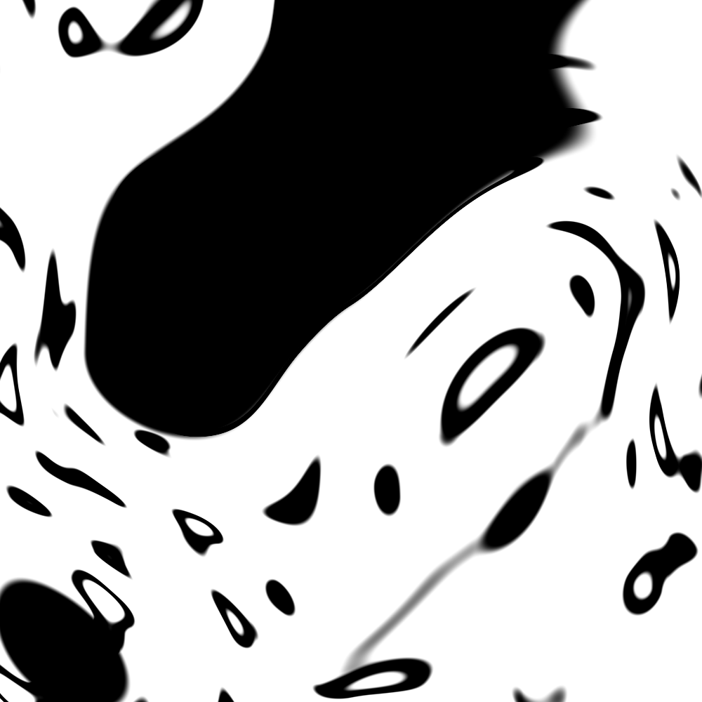

## Noise
## ノイズ


It's time for a break! We've been playing with random functions that look like TV white noise, our head is still spinning thinking about shaders, and our eyes are tired. Time to go out for a walk!

少し休憩しましょう！ここまでテレビのホワイトノイズに見えるようなランダム関数を扱ってきましたが、私たちの頭はまだシェイダーのことを考えることでいっぱいで、目が疲れてきました。散歩に出る時間です！

We feel the air on our skin, the sun in our face. The world is such a vivid and rich place. Colors, textures, sounds. While we walk we can't avoid noticing the surface of the roads, rocks, trees and clouds.

（散歩をしていると）空気を肌に、太陽を顔に感じます。世界はこのように鮮やかで豊かな場所なのです。色、テキスチャー、音。歩いている間、道や岩、木や雲のサーフェスに注目せざるにはいられません。


The unpredictability of these textures could be called "random," but they don't look like the random we were playing with before. The “real world” is such a rich and complex place! How can we approximate this variety computationally?

これらのテキスチャーは予測不可能という点では「ランダム」と呼ぶことができるでしょう。でも、これらの外見は明らかに前の章で私たちが扱ってきたランダムとは違います。「現実世界」はこのように豊かで複雑な場所なのです！それでは、コンピューターを用いてこのようなレベルの多様性に近づくためにはどうしたらいいのでしょうか。

This was the question [Ken Perlin](https://mrl.nyu.edu/~perlin/) was trying to solve in the eary 1980s when he was commissioned to generate more realistic textures for the movie "Tron." In response to that, he came up with an elegant *Oscar winning* noise algorithm. (No biggie.)

この疑問は、[Ken Perlin](https://mrl.nyu.edu/~perlin/) が1980年代初期に、「TRON」というディズニーの新作映画のために「もっとリアルな」テキスチャーを生成するという仕事を依頼されたときに、取り組んでいた問題です。 結果として、彼は *オスカー賞を受賞した* エレガントなノイズ・アルゴリズムにたどりつきました。たいしたことではありません。


The following is not the classic Perlin noise algorithm, but it is a good starting point to understand how to generate noise.

下記は、クラシックなパーリンノイズアルゴリズムではありませんが、どのようにして *スムーズなランダム* つまり *ノイズ* を生成するかについて理解するよい出発点になります。

<div class="simpleFunction" data="
float i = floor(x);  // integer
float f = fract(x);  // fraction
y = rand(i);
//y = mix(rand(i), rand(i + 1.0), f);
//y = mix(rand(i), rand(i + 1.0), smoothstep(0.,1.,f));
"></div>

In these lines we are doing something similar to what we did in the previous chapter. We are subdividing a continuous floating number (```x```) into its integer (```i```) and fractional (```f```) components. We use [```floor()```](.../glossary/?search=floor) to obtain ```i``` and [```fract()```](.../glossary/?search=fract) to obtain ```f```. Then we apply ```rand()``` to the integer part of ```x```, which gives a unique random value for each integer.

この箇所では、前の章と同じようなことを行っています。連続的な小数点の値 (```x````) を [```floor()```](.../glossary/?search=floor) を用いて整数 (```i```)  に細分し、それぞれの整数にランダム (```rand()```) な数値を獲得します。それと同時に、 [```fract()```](.../glossary/?search=fract) を使って各セクションの端数部分をたくわえ、それを ```f``` 変数に格納します。

After that you see two commented lines. The first one interpolates each random value linearly.

その後に、コメントのついた２行があります。始めの１行はそれぞれのランダム値をリニアに補間しています。

```glsl
y = mix(rand(i), rand(i + 1.0), f);
```

Go ahead and uncomment this line to see how this looks. We use the [```fract()```](.../glossary/?search=fract) value store in `f` to [```mix()```](.../glossary/?search=mix) the two random values.

先に進みましょう。この行のコメントを外して、どのように見えるか観察してみます。２つのランダムの値を [```mix()```](.../glossary/?search=mix)  するために、`f` に格納されている [```fract()```](.../glossary/?search=fract) の値を使います。

At this point in the book, we've learned that we can do better than a linear interpolation, right?
Now try uncommenting the following line, which uses a [```smoothstep()```](.../glossary/?search=smoothstep) interpolation instead of a linear one.

この本のこの時点で、私たちはリニアな補間よりもよいやり方を学びました。わかりますか？
それでは次に、リニアなもののかわりに[```smoothstep()```](.../glossary/?search=smoothstep) な補間を使っている下記の行のコメントを外してみましょう。

```glsl
y = mix(rand(i), rand(i + 1.0), smoothstep(0.,1.,f));
```

After uncommenting it, notice how the transition between the peaks gets smooth. In some noise implementations you will find that programmers prefer to code their own cubic curves (like the following formula) instead of using the [```smoothstep()```](.../glossary/?search=smoothstep).

コメントを外すと、ピークとピークの間の変遷がスムーズになっていることに気づくと思います。ノイズを履行するときに、あるプログラマーは[```smoothstep()```](.../glossary/?search=smoothstep) を使うかわりに、自分自身の３次曲線のカーブ (例えば下記のような公式) を好むことに気がつくでしょう。

```glsl
float u = f * f * (3.0 - 2.0 * f ); // custom cubic curve
y = mix(rand(i), rand(i + 1.0), u); // using it in the interpolation
```

```glsl
float u = f * f * (3.0 - 2.0 * f ); // カスタムな３次曲線
y = mix(rand(i), rand(i + 1.0), u); // それを補間に使う
```

This *smooth randomness* is a game changer for graphical engineers or artists - it provides the ability to generate images and geometries with an organic feeling. Perlin's Noise Algorithm has been implemented over and over in different languages and dimensions to make mesmerizing pieces for all sorts of creative uses.

*スムーズなランダム* は、グラフィックのエンジニアにとって革新的な存在です。それはオーガニックな感触のイメージやジオメトリーを生成する力を与えてくれます。パーリンノイズアルゴリズムは、催眠術的な作品をつくるためのあらゆるクリエイティブな手法のために、様々な言語や次元で繰り返し使われてきました。


Now it's your turn:
次はあなたの番です。

* Make your own ```float noise(float x)``` function.
* あなた自身の ```float noise(float x)``` 関数をつくってみましょう。

* Use your noise function to animate a shape by moving it, rotating it or scaling it.
* ノイズ関数を使って、１つの形が動いたり、回転したり、大きさが変わったりするアニメーションをつくりましょう。

* Make an animated composition of several shapes 'dancing' together using noise.
* ノイズを用いていくつかの形が 'ダンスしている' ようなアニメーションをつくりましょう。

* Construct "organic-looking" shapes using the noise function.
* ノイズ関数を使って "オーガニックな外見" の形を描いてみましょう。

* Once you have your "creature," try to develop it further into a character by assigning it a particular movement.
* あなたの "創造物" を手にしたら、特定の動きを割り当てることで、キャラクターをどんどん発展させていきましょう。

## 2D Noise
## 2D ノイズ


Now that we know how to do noise in 1D, it's time to move on to 2D. In 2D, instead of interpolating between two points of a line (```fract(x)``` and ```fract(x)+1.0```), we are going to interpolate between the four corners of the square area of a plane (```fract(st)```, ```fract(st)+vec2(1.,0.)```, ```fract(st)+vec2(0.,1.)``` and ```fract(st)+vec2(1.,1.)```).

ここまででどのようにして１Dのノイズを扱うかを学んできました。次は２Dにうつりましょう。線の２点 (```fract(x)``` と ```fract(x)+1.0```)の間を補間するかわりに、２Dにおいては、四角い（正方形の？）平面領域の４つの角の点 (```fract(st)```, ```fract(st)+vec2(1.,0.)```, ```fract(st)+vec2(0.,1.)``` and ```fract(st)+vec2(1.,1.)```) を補間します。


Similarly, if we want to obtain 3D noise we need to interpolate between the eight corners of a cube. This technique is all about interpolating random values, which is why it's called **value noise**.

同様にして、３Dノイズを手に入れるには、立方体の８つの角の間を補間する必要があります。このテクニックはすべてランダムな値の補間についてなので、 **value noise** とよばれています。


Like the 1D example, this interpolation is not linear but cubic, which smoothly interpolates any points inside our square grid.

１Dの例のように、この補間はリニアではなく、四角いグリッドの中のどの点もスムーズに補間できるキュービック（三次関数？）なものです。


Take a look at the following noise function.

下記のノイズ関数を見てみてください。

<div class="codeAndCanvas" data="2d-noise.frag"></div>

We start by scaling the space by 5 (line 45) in order to see the interpolation between the squares of the grid. Then inside the noise function we subdivide the space into cells. We store the integer position of the cell along with the fractional positions inside the cell. We use the integer position to calculate the four corners' coordinates and obtain a random value for each one (lines 23-26). Finally, in line 35 we interpolate between the 4 random values of the corners using the fractional positions we stored before.

グリッドの四角の間の補間を見るために、空間を５ずつに区切る所からはじめます (45行目)。次に、ノイズ関数の中に、空間をセルに細分していきます。セルの整数ポジションとともに端数ポジションを、セルの中に格納します。整数ポジションを四つの角の座標点の計算に用い、それぞれに対するランダム値を獲得します (23-26行)。最後に、３５行目で、前に格納した端数ポジションを使って、角の４つのランダム値の間を補間します。

Now it's your turn. Try the following exercises:
今度はあなたの番です。下記のエクササイズをやってみましょう。

* Change the multiplier of line 45. Try to animate it.

* 45行目の乗数を変えてみましょう。アニメーションにしてみましょう。

* At what level of zoom does the noise start looking like random again?

* どのレベルのズームで、ノイズはランダムに再び見え始めるようになりますか？

* At what zoom level is the noise is imperceptible?

* どのレベルのズームで、ノイズがわからなくなりますか？

* Try to hook up this noise function to the mouse coordinates.

* このノイズ関数を、マウスの位置に適応させてみましょう。

* What if we treat the gradient of the noise as a distance field? Make something interesting with it.

* ノイズのグラデーションを距離として扱ってみるとどうなりますか？これを使って何か興味深いものをつくってください。

* Now that you've achieved some control over order and chaos, it's time to use that knowledge. Make a composition of rectangles, colors and noise that resembles some of the complexity of a [Mark Rothko](http://en.wikipedia.org/wiki/Mark_Rothko) painting.

* これであなたもある程度、秩序とカオスのコントロールができるようになりました。今度はこの知識を活用する時間です。 [Mark Rothko](http://en.wikipedia.org/wiki/Mark_Rothko) の絵画の複雑さのような四角と色、そしてノイズのコンポジションをつくってみましょう。


## Using Noise in Generative Designs

Noise algorithms were originally designed to give a natural *je ne sais quoi* to digital textures. The 1D and 2D implementations we've seen so far were interpolations between random *values*, which is why they're called **Value Noise**, but there are more ways to obtain noise...

[  ](../edit.html#11/2d-vnoise.frag)

As you discovered in the previous exercises, value noise tends to look "blocky." To diminish this blocky effect, in 1985 [Ken Perlin](https://mrl.nyu.edu/~perlin/) developed another implementation of the algorithm called **Gradient Noise**. Ken figured out how to interpolate random *gradients* instead of values. These gradients were the result of a 2D random function that returns directions (represented by a ```vec2```) instead of single values (```float```). Click on the following image to see the code and how it works.

[  ](../edit.html#11/2d-gnoise.frag)

Take a minute to look at these two examples by [Inigo Quilez](http://www.iquilezles.org/) and pay attention to the differences between [value noise](https://www.shadertoy.com/view/lsf3WH) and [gradient noise](https://www.shadertoy.com/view/XdXGW8).

Like a painter who understands how the pigments of their paints work, the more we know about noise implementations the better we will be able to use them. For example, if we use a two dimensional noise implementation to rotate the space where straight lines are rendered, we can produce the following swirly effect that looks like wood. Again you can click on the image to see what the code looks like.

[  ](../edit.html#11/wood.frag)

```glsl
    pos = rotate2d( noise(pos) ) * pos; // rotate the space
    pattern = lines(pos,.5); // draw lines
```

Another way to get interesting patterns from noise is to treat it like a distance field and apply some of the tricks described in the [Shapes chapter](../07/).

[  ](../edit.html#11/splatter.frag)

```glsl
    color += smoothstep(.15,.2,noise(st*10.)); // Black splatter
    color -= smoothstep(.35,.4,noise(st*10.)); // Holes on splatter
```

A third way of using the noise function is to modulate a shape. This also requires some of the techniques we learned in the [chapter about shapes](../07/).

<a href="../edit.html#11/circleWave-noise.frag"><canvas id="custom" class="canvas" data-fragment-url="circleWave-noise.frag"  width="300px" height="300"></canvas></a>

For you to practice:

* What other generative pattern can you make? What about granite? marble? magma? water? Find three pictures of textures you are interested in and implement them algorithmically using noise.
* Use noise to modulate a shape.
* What about using noise for motion? Go back to the [Matrix chapter](../08/). Use the translation example that moves the "+" around, and apply some *random* and *noise* movements to it.
* Make a generative Jackson Pollock.


## Simplex Noise

For Ken Perlin the success of his algorithm wasn't enough. He thought it could perform better. At Siggraph 2001 he presented the "simplex noise" in which he achieved the following improvements over the previous algorithm:

* An algorithm with lower computational complexity and fewer multiplications.
* A noise that scales to higher dimensions with less computational cost.
* A noise without directional artifacts.
* A noise with well-defined and continuous gradients that can be computed quite cheaply.
* An algorithm that is easy to implement in hardware.

I know what you are thinking... "Who is this man?" Yes, his work is fantastic! But seriously, how did he improve the algorithm? Well, we saw how for two dimensions he was interpolating 4 points (corners of a square); so we can correctly guess that for [three (see an implementation here)](../edit.html#11/3d-noise.frag) and four dimensions we need to interpolate 8 and 16 points. Right? In other words for N dimensions you need to smoothly interpolate 2 to the N points (2^N). But Ken smartly noticed that although the obvious choice for a space-filling shape is a square, the simplest shape in 2D is the equilateral triangle. So he started by replacing the squared grid (we just learned how to use) for a simplex grid of equilateral triangles.


The simplex shape for N dimensions is a shape with N + 1 corners. In other words one fewer corner to compute in 2D, 4 fewer corners in 3D and 11 fewer corners in 4D! That's a huge improvement!

In two dimensions the interpolation happens similarly to regular noise, by interpolating the values of the corners of a section. But in this case, by using a simplex grid, we only need to interpolate the sum of 3 corners.


How is the simplex grid made? In another brilliant and elegant move, the simplex grid can be obtained by subdividing the cells of a regular 4 cornered grid into two isosceles triangles and then skewing it until each triangle is equilateral.


Then, as [Stefan Gustavson describes in this paper](http://staffwww.itn.liu.se/~stegu/simplexnoise/simplexnoise.pdf): _"...by looking at the integer parts of the transformed coordinates (x,y) for the point we want to evaluate, we can quickly determine which cell of two simplices that contains the point. By also comparing the magnitudes of x and y, we can determine whether the point is in the upper or the lower simplex, and traverse the correct three corner points."_

In the following code you can uncomment line 44 to see how the grid is skewed, and then uncomment line 47 to see how a simplex grid can be constructed. Note how on line 22 we are subdividing the skewed square into two equilateral triangles just by detecting if ```x > y``` ("lower" triangle) or ```y > x``` ("upper" triangle).

<div class="codeAndCanvas" data="simplex-grid.frag"></div>

Another improvement introduced by Perlin with **Simplex Noise**, is the replacement of the Cubic Hermite Curve ( _f(x) = 3x^2-2x^3_ , which is identical to the [```smoothstep()```](.../glossary/?search=smoothstep) function) for a Quintic Hermite Curve ( _f(x) = 6x^5-15x^4+10x^3_ ). This makes both ends of the curve more "flat" so each border gracefully stiches with the next one. In other words you get a more continuous transition between the cells. You can see this by uncommenting the second formula in the following graph example (or see the [two equations side by side here](https://www.desmos.com/calculator/2xvlk5xp8b)).

<div class="simpleFunction" data="
// Cubic Hermine Curve.  Same as SmoothStep()
y = x*x*(3.0-2.0*x);
// Quintic Hermine Curve
//y = x*x*x*(x*(x*6.-15.)+10.);
"></div>

Note how the ends of the curve change. You can read more about this in [Ken's own words](http://mrl.nyu.edu/~perlin/paper445.pdf).

All these improvements result in an algorithmic masterpiece known as **Simplex Noise**. The following is a GLSL implementation of this algorithm made by Ian McEwan (and presented in [this paper](http://webstaff.itn.liu.se/~stegu/jgt2012/article.pdf)) which is overcomplicated for educational purposes, but you will be happy to click on it and see that it is less cryptic than you might expect.

[  ](../edit.html#11/2d-snoise-clear.frag)

Well... enough technicalities, it's time for you to use this resource in your own expressive way:

* Contemplate how each noise implementation looks. Imagine them as a raw material, like a marble rock for a sculptor. What can you say about about the "feeling" that each one has? Squinch your eyes to trigger your imagination, like when you want to find shapes in a cloud. What do you see? What are you reminded of? What do you imagine each noise implementation could be made into? Following your guts and try to make it happen in code.

* Make a shader that projects the illusion of flow. Like a lava lamp, ink drops, water, etc.

<a href="../edit.html#11/lava-lamp.frag"><canvas id="custom" class="canvas" data-fragment-url="lava-lamp.frag"  width="520px" height="200px"></canvas></a>

* Use Simplex Noise to add some texture to a work you've already made.

<a href="../edit.html#11/iching-03.frag"><canvas id="custom" class="canvas" data-fragment-url="iching-03.frag"  width="520px" height="520px"></canvas></a>

In this chapter we have introduced some control over the chaos. It was not an easy job! Becoming a noise-bender-master takes time and effort.

In the following chapters we will see some well known techniques to perfect your skills and get more out of your noise to design quality generative content with shaders. Until then enjoy some time outside contemplating nature and its intricate patterns. Your ability to observe needs equal (or probably more) dedication than your making skills. Go outside and enjoy the rest of the day!

<p style="text-align:center; font-style: italic;">"Talk to the tree, make friends with it." Bob Ross
</p>