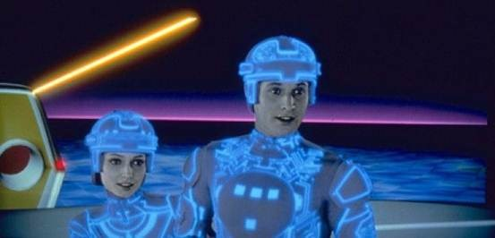
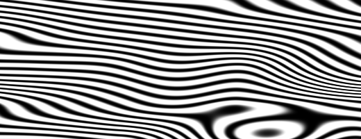

## 노이즈

조금 쉴 시간이다! TV 노이즈화면처럼 보이는 랜덤함수를 가지고 놀면서도 여전히 쉐이더를 생각하고, 머리는 빙빙 돌며 눈은 피곤하다. 잠시 산책하러 가보자!

공기는 피부를 스치고, 얼굴에 햇빛이 쬔다. 세상은 정말 생생하고 풍요로운 곳이다. 색깔, 질감, 소리.  
걷는 동안 우리는 도로, 바위, 나무, 구름의 표면을 알아차리지 않을 수 없다.


이런 질감의 예측 불가능성은 "랜덤"이라고 불릴 수 있지만, 우리가 전에 가지고 놀았던 랜덤과는 다르게 보인다. "실제 세계"는 정말 풍부하고 복잡한 곳이다! 어떻게 하면 이 다양성을 수치적으로 추정할 수 있을까?

이 질문은 [Ken Perlin](https://mrl.nyu.edu/~perlin/)이 1980년대 초 영화 "트론"을 위해 좀 더 현실적인 질감을 만들어내라는 의뢰를 받았을 때 해결하고자 했던 것이었다. 이에 대한 대답으로, 그는 *Oscar winning* 이라는 우아한 노이즈 알고리즘을 고안해냈다. (별건 아니다.)



다음 코드는 전통적인 Perlin 노이즈 알고리즘은 아니지만, 노이즈를 생성하는 방법을 이해할 수 있는 좋은 출발점이다.

<div class="simpleFunction" data="
float i = floor(x);  // integer
float f = fract(x);  // fraction
y = rand(i); //rand() is described in the previous chapter
//y = mix(rand(i), rand(i + 1.0), f);
//y = mix(rand(i), rand(i + 1.0), smoothstep(0.,1.,f));
"></div>

이 코드에서 우리는 앞서 했던 것과 비슷한 일을 하고 있다. 실수(`x`)를 정수(`i`) 성분과 소수점 이하(`f`) 성분으로 세분화하고 있다. `i`를 얻을 때는 [`floor()`](../glossary/?search=floor)를, `f`를 얻을 때는 [`fract()`](../glossary/?search=fract)를 사용한다. 그런 다음 각 정수에 대해 고유한 랜덤 값을 제공하는 `x`의 정수 부분에 `rand()`를 적용한다.

그 다음 두 개의 주석이 보일 것이다. 첫 번째는 각 랜덤 값을 선형보간한다.

```glsl
y = mix(rand(i), rand(i + 1.0), f);
```

이 줄의 주석을 해제해보고 어떤지 확인해보아라. 우리는 두 랜덤 값의 `f`에서 [`mix()`](../glossary/?search=mix) 사이의 [`fract()`](../glossary/?search=fract) 값 저장소를 사용한다.  `f`에 저장된 [`fract()`](../glossary/?search=fract) 값을 사용하여 두 랜덤 값을 [`mix()`](../glossary/?search=mix)한다.

이쯤 왔으면, 우린 선형보간보다 더 잘 할 수 있다는 것을 배웠다. 그렇지 않은가?  
이제 선형보간 대신 [`smoothstep()`](../glossary/?search=smoothstep) 보간을 사용하는 다음 줄의 주석을 해제해 보시오.

```glsl
y = mix(rand(i), rand(i + 1.0), smoothstep(0.,1.,f));
```

주석을 해제하여 어떻게 정점 끼리의 전환이 매끄럽게 이루어지는지 알아보자. 일부 노이즈 구현에서 프로그래머들은 [`smoothstep()`](../glossary/?search=smoothstep)를 사용하는 대신 자신만의 3차 곡선(다음 공식과 같은)을 코드화하는 것을 선호한다는 것을 알게 될 것이다.

```glsl
float u = f * f * (3.0 - 2.0 * f ); // custom cubic curve
y = mix(rand(i), rand(i + 1.0), u); // using it in the interpolation
```

이 *매끄러운 무작위성*은 그래픽 엔지니어와 아티스트의 게임체인저로서, 유기적인 느낌으로 이미지와 형상을 생성할 수 있는 기능을 제공한다. Perlin 노이즈 알고리즘은 끊임없이 다양한 언어와 차원으로 구현되어 온갖 종류의 창조적인 용도로 매혹적인 작품을 만들었다.


이제 여러분의 차례다:

* 여러분만의 `float noise(float x)` 함수를 만들어보아라.

* 여러분만의 노이즈 함수로 도형에 움직임,회전,스케일링을 적용하여 애니메이션을 만들어 보시오.

* 노이즈를 사용해 여러 도형의 '춤'을 애니메이션으로 구성해보시오.

* 노이즈를 사용하여 "유기적으로 보이는" 도형을 구현해 보시오.

* 여러분만의 "크리쳐"를 만들었다면, 특정 움직임을 부여하여 캐릭터로 발전시켜 보시오.
  
## 2차원 노이즈


이제 1차원 노이즈를 처리하는 방법을 알았으니 2차원으로 넘어갈 때이다.  
2차원에서는 선의 두 점(`fract(x)`, `fract(x)+1.0`) 사이에 보간하는 대신, 평면의 정사각형 영역의 네 꼭짓점을 보간할 것이다.(`fract(st)`, `fract(st)+vec2(1.,0.)`, `fract(st)+vec2(0.,1.)`, `fract(st)+vec2(1.,1.)`).


마찬가지로, 3차원 노이즈를 얻으려면 큐브의 8개 꼭짓점 사이를 보간해야 한다.  
 이 기법은 모두 랜덤 값을 보간하는 데 사용되므로 **값 노이즈**라고 불린다.


1차원 예제와 마찬가지로, 이것은 선형보간이 아닌 삼차보간이며, 정사각형 그리드 내부의 모든 점을 매끄럽게 보간한다.


다음 노이즈 함수를 살펴보시오.

<div class="codeAndCanvas" data="2d-noise.frag"></div>

우리는 그리드의 정사각형 사이의 보간을 보기 위해 공간을 5배(45행) 확장하는 것으로 시작한다. 그 다음, 노이즈함수에서 공간을 셀로 세분한다. 우리는 셀 내부의 소수점 위치와 함께 셀의 정수 위치를 저장한다. 정수 위치를 사용하여 네 꼭짓점의 좌표를 계산하고 각 좌표의 랜덤 값(23-26행)을 구한다. 마지막으로, 35행 에서는 이전에 저장했던 소수점 위치를 사용하여 4개의 꼭짓점의 랜덤 값들의 사이를 보간한다.

이제 여러분 차례다. 다음 연습을 해보시오.

* 45행의 승수를 변경해보고, 애니메이션을 시도해 보시오.

* 얼마나 확대/축소를 해야 노이즈가 다시 랜덤처럼 보이기 시작하는가?

* 얼마나 확대/축소를 해야 노이즈를 감지할 수 없는가?

* 이 노이즈 함수를 마우스 좌표와 연동해 보시오.

* 노이즈의 기울기를 거리 장으로 생각해보면 어떨까? 그것으로 뭔가 재미있는 것을 만들어 보시오.

* 질서와 혼돈에 대한 통제력을 어느 정도 확보했으므로 이제 이 지식을 활용할 때이다.  
[Mark Rothko](http://en.wikipedia.org/wiki/Mark_Rothko) 그림의 복잡성을 닮은 직사각형, 색상 및 노이즈를 구성해보시오.


## 제너러티브 디자인에서의 노이즈

노이즈 알고리즘은 원래 디지털 텍스처에 자연스러운 *je ne sais quoi(말로 나타낼 수 없는 일)* 를 제공하도록 설계되었다. 지금까지 살펴본 1차원 및 2차원 구현은 랜덤 *값* 사이의 보간이었다. 그래서 **값 노이즈** 라고 부르지만 노이즈를 얻을 수 있는 방법은 더 많다.

[](../edit.php#11/2d-vnoise.frag)

이전 연습문제에서 발견했듯, 값노이즈는 "블록처럼" 보이는 경향이 있다. 이러한 블록 효과를 줄이기 위해 1985년 [Ken Perlin](https://mrl.nyu.edu/~perlin/)은 **그라디언트 노이즈**라는 알고리즘을 개발했다. Ken은 값 대신 랜덤 *그라디언트*를 보간하는 방법을 알아냈다. 이러한 그라디언트는 단일 값(`float`)이 아닌 방향(`vec2`로 표현)을 반환하는 2D 랜덤 함수의 결과였다. 다음 이미지를 클릭하여 코드와 작동 방식을 확인하시오.

[](../edit.php#11/2d-gnoise.frag)

잠시 [Inigo Quilez](http://www.iquilezles.org/)의 이 두 가지 예를 통해 [값 노이즈](https://www.shadertoy.com/view/lsf3WH)와 [그라디언트 노이즈](https://www.shadertoy.com/view/XdXGW8)의 차이점을 살펴보십시오.

페인트칠의 색소가 어떻게 작용하는지 이해하는 화가처럼, 우리도 노이즈 구현에 대해 더 잘 이해할수록 더 잘 사용할 수 있을 것이다. 예를 들어, 직선이 렌더링되는 공간을 회전하기 위해 2차원 노이즈 구현을 사용하면, 다음과 같이 나무처럼 보이는 소용돌이 효과를 생성할 수 있다. 이미지를 클릭하여 코드를 확인 할 수 있다.

[](../edit.php#11/wood.frag)

```glsl
pos = rotate2d( noise(pos) ) * pos; // rotate the space
pattern = lines(pos,.5); // draw lines
```

노이즈로부터 흥미로운 패턴을 얻는 또 다른 방법은, 노이즈를 거리장처럼 생각하고 [도형 단원](../07/)에서 설명한 몇 가지 기술을 적용하는 것이다.

[  ](../edit.php#11/splatter.frag)

```glsl
color += smoothstep(.15,.2,noise(st*10.)); // Black splatter
color -= smoothstep(.35,.4,noise(st*10.)); // Holes on splatter
```

노이즈 함수를 사용하는 세 번째 방법은 도형을 조정하는 것이다. 이 또한 [도형 단원](../07/)에서 배운 몇 가지 테크닉을 필요로 한다.

<a href="../edit.php#11/circleWave-noise.frag"><canvas id="custom" class="canvas" data-fragment-url="circleWave-noise.frag"  width="300px" height="300"></canvas></a>

연습해보시오:

* 어떤 제너러티브 패턴을 만들 수 있는가? 화강암? 대리석? 마그마? 물?  
여러분이 관심있는 질감의 사진 3개를 찾아서 노이즈를 이용하여 알고리즘적으로 구현해보시오.
* 노이즈를 이용하여 도형을 조정해보시오.
* 노이즈를 움직임에 이용하는 것은 어떨까? [행렬 단원](../08/)으로 돌아가서 "+"를 이리저리 움직이는 예제에 일부 *랜덤* 및 *노이즈* 이동을 적용해보자.
* 제너러티브 Jackson Pollock을 만들어보시오.


## 개선된 노이즈

Perlin에 의한 비심플렉스 노이즈에서 **심플렉스 노이즈**로의 개선은 3차 헤르마이트 곡선( _f(x) = 3x^2-2x^3_, [`smoothstep()`](../glossary/?search=smoothstep) 함수와 동일)을 5차 보간 곡선( _f(x) = 6x^5-15x^4+10x^3_ )으로 대체하는 것이다. 이렇게 하면 곡선의 양끝이 "평탄"해져서 각 경계가 우아하게 결합된다. 다시 말해서, 셀 간에 전환을 더 연속적으로 만들 수 있다. 다음 그래프 예제에서 두 번째 공식의 주석을 해제하면 이를 확인할 수 있다.(또는 [두 개의 방정식이 나란히 여기에 있음](https://www.desmos.com/calculator/2xvlk5xp8b)) 참고.

<div class="simpleFunction" data="
// Cubic Hermite Curve.  Same as SmoothStep()
y = x*x*(3.0-2.0*x);
// Quintic interpolation curve
//y = x*x*x*(x*(x*6.-15.)+10.);
"></div>

곡선의 끝 부분이 어떻게 변하는지 확인해보시오. 이에 대한 자세한 내용은 [Ken's own words](http://mrl.nyu.edu/~perlin/paper445.pdf)에서 확인할 수 있다.


## 심플렉스 노이즈

Ken Perlin은 그의 알고리즘이 단지 성공했다는것만으로는 충분하지 않다고 생각했다. 더 개선할 여지가 있다고 생각했다. 그는 Siggraph 2001에서 이전 알고리즘보다 다음과 같은 개선된 "심플렉스 노이즈"를 제시하였다.

* 계산 복잡도가 낮고 곱셈이 적은 알고리즘이다.
* 더 적은 계산 비용으로 더 높은 차원으로 확장되는 노이즈다.
* 방향에 의한 아티팩트가 없는 노이즈다.
* 상당히 저렴하게 계산할 수 있는 잘 정의되고 연속적인 그라디언트를 갖는 노이즈다.
* 하드웨어에서 구현하기 쉬운 알고리즘이다.

여러분이 무슨 생각을 하는지 안다... "이 남자는 누구지?" 그래, 그의 작품은 환상적이다! 하지만 진지하게, 어떻게 알고리즘을 개선했을까? 우리는 2차원에서 그가 4점(사각형의 꼭짓점)을 보간하는 방법을 보았다. 그래서 우리는 [3차원 (구현 예제)](../edit.php#11/3d-noise.frag)과 4차원의 경우 정확히 8점과 16점을 보간해야 한다고 추측할 수 있다. 그렇지 않은가? 즉, N차원의 경우 2에서 N점(2^N)까지 부드럽게 보간해야 한다. 그러나 Ken은 공간을 채우는 모양을 위한 확실한 선택은 정사각형이지만, 2차원에서 가장 간단한 모양은 정삼각형이라는 것을 똑똑히 알아차렸다. 그래서 그는 정삼각형의 심플렉스 그리드를 위해 정사각 그리드(방금 사용법을 배웠다)를 교체하는 것으로 시작했다.


N 차원 심플렉스 도형은 N + 1개의 꼭짓점이 있다. 즉, 2D로 계산할 때 한 꼭짓점 적게, 3D일때는 네 꼭짓점 적게, 4D일때는 11개의 꼭짓점이 적다! 엄청난 발전이다!

2차원 보간은 한 구역의 꼭짓점 값을 보간하여 일반 노이즈와 유사하다. 그러나 이런 경우, 심플렉스 그리드를 사용하여 겨우 세 꼭짓점의 합만 보간하면 된다.


심플렉스 그리드는 어떻게 만들어질까? 한가지 훌륭하고 우아한 방법이 있는데, 일반적인 4개의 꼭짓점을 갖는 그리드의 셀을 두 개의 이등변 삼각형으로 분리한 다음, 각 삼각형이 정삼각형이 될 때까지 비틀어 심플렉스 그리드를 얻을 수 있다.


그리고 [Stefan Gustavson의 본 논문에서의 설명](http://staffwww.itn.liu.se/~stegu/simplexnoise/simplexnoise.pdf)에 의하면,  
_"...계산하고싶은 지점의 변환된 좌표(x,y)의 정수 부분을 보면 두 개의 단순한 도형 중 어느셀이 그 점을 포함하는지 빠르게 결정할 수 있다. 또한 x와 y의 크기를 비교하여 점이 상단심플렉스인지 하단심플렉스인지 파악하여 세 개의 정확한 꼭짓점을 횡단할 수 있다."_

아래 코드에서, 44행의 주석을 풀어 그리드가 어떻게 치우쳐 있는지 확인한 다음 47행의 주석을 풀어 단순 그리드가 어떻게 구성돼있는지 확인할 수 있다. 22행에서 `x > y`("낮은" 삼각형) 또는 `y > x`("위" 삼각형)를 감지하는 것만으로 왜곡된 정사각형을 두 개의 정삼각형으로 분리할 수 있는지 알아두시오.

<div class="codeAndCanvas" data="simplex-grid.frag"></div>

이러한 모든 개선으로 **Simplex Noise**라는 알고리즘적 걸작이 탄생했다. 다음은 Ian McEwan 및 Stefan Gustavson이 만든 이 알고리즘의 GLSL 구현이다([이 문서](http://webstaff.itn.liu.se/~stegu/jgt2012/article.pdf)에 나와있다). 이 알고리즘은 교육용으로는 지나치게 복잡하지만, 여러분의 걱정보다 코드가 덜 암호화돼있고,짧고, 빠르다.

[  ](../edit.php#11/2d-snoise-clear.frag)

자... 기술적으로는 충분하니, 이제 이 리소스를 표현을 위한 용도로 사용할 때이다.

* 각 노이즈의 구현체가 어떻게 생겼을지 고민해보자. 조각가의 대리석 같은 원료라고 상상해보라. 각각의 "느낌"에 대해 어떻게 이야기 할 수 있는가? 마치 구름 속에서 도형을 찾고 싶을 때처럼 눈을 가늘게 뜨고 상상력을 불러일으켜라. 무엇이 보이는가? 뭐가 기억나는가? 각 노이즈 구현체가 무엇을 만들어 낼 수 있다고 생각하는가? 여러분의 느낌대로 그것을 코드로 구현해 보려고 노력해보시오

* 라바 램프, 잉크 방울, 물 등 흐름의 환상을 투영하는 쉐이더를 만들어 보자.

<a href="../edit.php#11/lava-lamp.frag"><canvas id="custom" class="canvas" data-fragment-url="lava-lamp.frag"  width="520px" height="200px"></canvas></a>

* Simplex Noise를 사용하여 이미 만든 작업에 텍스처를 추가해보자.

<a href="../edit.php#11/iching-03.frag"><canvas id="custom" class="canvas" data-fragment-url="iching-03.frag"  width="520px" height="520px"></canvas></a>

이번 챕터에서는 카오스를 제어하는 몇 가지 방법을 소개했다. 결코 만만한 일이 아니었다! 노이즈의 달인이 되기 위해서는 많은 노력과 시간이 필요하다.

다음 챕터에서는 노이즈와 쉐이더로 고품질 생성적 콘텐츠를 설계할 수 있는 몇 가지 잘 알려진 기술을 살펴볼 것 이다. 그때까지 바깥에 나가서 자연과 그 복잡한 무늬를 사색하는 시간을 즐기시오. 관찰력은 제작 능력보다 동등한(혹은 더 많은) 헌신을 필요로 한다. 밖에 나가서 하루의 남은 시간을 즐기세요!

<p style="text-align:center; font-style: italic;">"나무에게 말을 걸고, 친구가 되어보아라" 밥 로스
</p>
