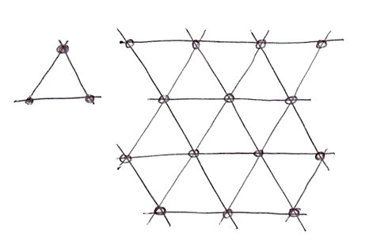

## Noise (pol. "szum")

Czas na przerwę! Bawiliśmy się losowymi funkcjami, które wyglądają jak szum telewizyjny (tzw. "szum biały", ang. "white noise"), w głowie wciąż się kręci od myślenia o shaderach, a oczy są po prostu zmęczone. Czas wyjść na spacer!

Czujemy powietrze na skórze, słońce na twarzy. Świat jest tak żywym i bogatym miejscem. Kolory, tekstury, dźwięki. Podczas spaceru widzimy powierzchnię dróg, skał, drzew i chmur.

<!-- ## Noise

It's time for a break! We've been playing with random functions that look like TV white noise, our head is still spinning thinking about shaders, and our eyes are tired. Time to go out for a walk!

We feel the air on our skin, the sun in our face. The world is such a vivid and rich place. Colors, textures, sounds. While we walk we can't avoid noticing the surface of the roads, rocks, trees and clouds. -->


Nieprzewidywalność tych tekstur można by nazwać "losową", ale nie przypominają one losowości, z którą bawiliśmy się wcześniej. "Prawdziwy świat" jest tak bogatym i złożonym miejscem! Jak możemy zamodelować tę różnorodność obliczeniowo?

To było pytanie, które [Ken Perlin](https://mrl.nyu.edu/~perlin/) próbował rozwiązać we wczesnych latach 80-tych, kiedy otrzymał zlecenie wygenerowania bardziej realistycznych tekstur do filmu "Tron". W odpowiedzi na to wymyślił elegancki algorytm szumu, za który później otrzymał Oskara.

<!-- The unpredictability of these textures could be called "random," but they don't look like the random we were playing with before. The “real world” is such a rich and complex place! How can we approximate this variety computationally?

This was the question [Ken Perlin](https://mrl.nyu.edu/~perlin/) was trying to solve in the early 1980s when he was commissioned to generate more realistic textures for the movie "Tron." In response to that, he came up with an elegant *Oscar winning* noise algorithm. (No biggie.) -->


Poniższy kod nie jest klasycznym algorytmem szumu Perlina, ale jest dobrym punktem wyjścia do zrozumienia sposobu generowania szumu.

<!-- The following is not the classic Perlin noise algorithm, but it is a good starting point to understand how to generate noise. -->

<div class="simpleFunction" data="
float i = floor(x);  // cz. całkowita
float f = fract(x);  // cz. ułamkowa
y = rand(i); //funkcja rand() opisana jest w poprzednim rozdziale 
//y = mix(rand(i), rand(i + 1.0), f);
//y = mix(rand(i), rand(i + 1.0), smoothstep(0.,1.,f));
"></div>

W tych liniach robimy coś podobnego do tego, co robiliśmy w poprzednim rozdziale. Dzielimy ciągłą liczbę zmiennoprzecinkową (``x``) na jej składowe całkowitą (``i``) i ułamkową (``f``). Używamy [``floor()``](../glossary/?search=floor) aby uzyskać ``i`` oraz [``fract()``](../glossary/?search=fract) aby uzyskać ``f``. Następnie stosujemy ``rand()`` do części całkowitej ``x``, co daje unikalną wartość losową dla każdej liczby całkowitej.

Spójrz na dwie skomentowane linie. Pierwsza z nich interpoluje liniowo każdą wartość losową.


<!-- In these lines we are doing something similar to what we did in the previous chapter. We are subdividing a continuous floating number (```x```) into its integer (```i```) and fractional (```f```) components. We use [```floor()```](../glossary/?search=floor) to obtain ```i``` and [```fract()```](../glossary/?search=fract) to obtain ```f```. Then we apply ```rand()``` to the integer part of ```x```, which gives a unique random value for each integer.

After that you see two commented lines. The first one interpolates each random value linearly. -->

```glsl
y = mix(rand(i), rand(i + 1.0), f);
```

Odkomentuj tę linię, aby zobaczyć jak to wygląda. Używamy `f` do interpolacji liniowej dwóch sąsiadujących wartości losowych za pomocą funkcji [``mix()``](../glossary/?search=mix).

Nauczyliśmy się, że możemy zrobić coś lepszego niż interpolacja liniowa, prawda?
Spróbuj teraz odkomentować kolejną drugą linię, która używa interpolacji [``smoothstep()``](../glossary/?search=smoothstep) zamiast liniowej.

<!-- Go ahead and uncomment this line to see how this looks. We use the [```fract()```](../glossary/?search=fract) value store in `f` to [```mix()```](../glossary/?search=mix) the two random values.

At this point in the book, we've learned that we can do better than a linear interpolation, right?
Now try uncommenting the following line, which uses a [```smoothstep()```](../glossary/?search=smoothstep) interpolation instead of a linear one. -->

```glsl
y = mix(rand(i), rand(i + 1.0), smoothstep(0.,1.,f));
```

Po odkomentowaniu zauważ, jak przejście między szczytami staje się gładkie. W niektórych implementacjach szumu można zauważyć, że programiści wolą kodować własne krzywe sześcienne (ang. "cubic curves") (jak w kodzie poniżej) zamiast używać [``smoothstep()``](../glossary/?search=smoothstep).

<!-- After uncommenting it, notice how the transition between the peaks gets smooth. In some noise implementations you will find that programmers prefer to code their own cubic curves (like the following formula) instead of using the [```smoothstep()```](../glossary/?search=smoothstep). -->

```glsl
float u = f * f * (3.0 - 2.0 * f ); // spersonalizowana funkcja sześcienna
y = mix(rand(i), rand(i + 1.0), u); // interpolacja z jej pomocą
```

Ta *płynna losowość* jest przełomem dla programistów grafiki i artystów - daje możliwość generowania organicznych obrazów i geometrii. Algorytm Szumu Perlina był wielokrotnie implementowany w różnych językach i wymiarach, aby móc tworzyć hipnotyzujące dzieła w celach kreatywnych.

<!-- 
This *smooth randomness* is a game changer for graphical engineers or artists - it provides the ability to generate images and geometries with an organic feeling. Perlin's Noise Algorithm has been implemented over and over in different languages and dimensions to make mesmerizing pieces for all sorts of creative uses. -->


Teraz twoja kolej:

* Stwórz własną funkcję ``float noise(float x)``.

* Użyj swojej funkcji szumu do animowania kształtu poprzez przesuwanie go, obracanie lub skalowanie.

* Zrób animowaną kompozycję kilku kształtów "tańczących" razem przy użyciu szumu.

* Skonstruuj "organicznie wyglądające" kształty używając funkcji noise.

<!-- Now it's your turn:

* Make your own ```float noise(float x)``` function.

* Use your noise function to animate a shape by moving it, rotating it or scaling it.

* Make an animated composition of several shapes 'dancing' together using noise.

* Construct "organic-looking" shapes using the noise function.

* Once you have your "creature," try to develop it further into a character by assigning it a particular movement. -->

## Szum 2D 


Teraz, gdy wiemy jak zrobić szum w 1D, czas przejść do 2D. W 2D zamiast interpolować między dwoma punktami linii (``rand(x)`` i ``rand(x)+1.0``), będziemy interpolować pomiędzy czterema narożnikami kwadratowego obszaru płaszczyzny (``rand(st)``, ``rand(st)+vec2(1.,0.)``, ``rand(st)+vec2(0.,1.)`` oraz ``rand(st)+vec2(1.,1.)``).

<!-- Now that we know how to do noise in 1D, it's time to move on to 2D. In 2D, instead of interpolating between two points of a line (```fract(x)``` and ```fract(x)+1.0```), we are going to interpolate between the four corners of the square area of a plane (```fract(st)```, ```fract(st)+vec2(1.,0.)```, ```fract(st)+vec2(0.,1.)``` and ```fract(st)+vec2(1.,1.)```). -->


Podobnie, jeśli chcemy uzyskać szum 3D musimy interpolować pomiędzy ośmioma rogami sześcianu. W tej technice chodzi o interpolację losowych wartości ang. (ang. "random **value**s"), dlatego nazywa się ją **value noise**.

<!-- Similarly, if we want to obtain 3D noise we need to interpolate between the eight corners of a cube. This technique is all about interpolating random values, which is why it's called **value noise**. -->


Podobnie jak w przykładzie 1D, interpolacja ta nie jest liniowa, ale sześcienna, więc płynnie interpoluje wszelkie punkty wewnątrz naszego kwadratowego obszaru.

<!-- Like the 1D example, this interpolation is not linear but cubic, which smoothly interpolates any points inside our square grid. -->


Przyjrzyj się następującej funkcji szumu.

<!-- Take a look at the following noise function. -->

<div class="codeAndCanvas" data="2d-noise.frag"></div>

Zaczynamy od przeskalowania przestrzeni o 5 (linia 45). Następnie wewnątrz funkcji szumu dzielimy przestrzeń na kafellki. Przechowujemy pozycję kafelka jako cześć całkowitą oraz pozycje wewnątrz kafelka jako część ułamkową. Używamy części całkowitej do obliczenia współrzędnych czterech narożników, otrzymując losową wartość dla każdego z nich (linie 23-26). Na koniec, w linii 35 interpolujemy pomiędzy 4 losowymi wartościami narożników używając części ułamkowej.

<!-- We start by scaling the space by 5 (line 45) in order to see the interpolation between the squares of the grid. Then inside the noise function we subdivide the space into cells. We store the integer position of the cell along with the fractional positions inside the cell. We use the integer position to calculate the four corners' coordinates and obtain a random value for each one (lines 23-26). Finally, in line 35 we interpolate between the 4 random values of the corners using the fractional positions we stored before. -->

Teraz twoja kolej. Spróbuj wykonać następujące ćwiczenia:

* Zmień mnożnik w linii 45. Spróbuj go zanimować.

* Przy jakim poziomie powiększenia szum zaczyna znowu wyglądać kompletnie losowo (jak, wspomniany na początku rozdziału, biały szum)?

* Przy jakim poziomie powiększenia szum jest niezauważalny?

* Spróbuj podpiąć tę funkcję szumu do współrzędnych myszy.

* A gdyby tak potraktować gradient szumu jako pole odległości? Zrób z tym coś ciekawego.

* Teraz, gdy osiągnąłeś już pewną kontrolę nad porządkiem i chaosem, czas wykorzystać tę wiedzę. Stwórz kompozycję z prostokątów, kolorów i szumu, która przypomina nieco złożoność obrazu [Marka Rothko](http://en.wikipedia.org/wiki/Mark_Rothko).

<!-- Now it's your turn. Try the following exercises:

* Change the multiplier of line 45. Try to animate it.

* At what level of zoom does the noise start looking like random again?

* At what zoom level is the noise is imperceptible?

* Try to hook up this noise function to the mouse coordinates.

* What if we treat the gradient of the noise as a distance field? Make something interesting with it.

* Now that you've achieved some control over order and chaos, it's time to use that knowledge. Make a composition of rectangles, colors and noise that resembles some of the complexity of a [Mark Rothko](http://en.wikipedia.org/wiki/Mark_Rothko) painting. -->


## Szum a design generatywny

Algorytmy szumu zostały pierwotnie zaprojektowane w celu nadania naturalnego *je ne sais quoi* cyfrowym teksturom. Implementacje 1D i 2D, które widzieliśmy do tej pory, były interpolacjami pomiędzy losowymi *wartościami*, dlatego nazywane są **Value Noise**, ale istnieje więcej sposobów na uzyskanie szumu...

<!-- Noise algorithms were originally designed to give a natural *je ne sais quoi* to digital textures. The 1D and 2D implementations we've seen so far were interpolations between random *values*, which is why they're called **Value Noise**, but there are more ways to obtain noise... -->

[  ](../edit.php#11/2d-vnoise.frag)

Jak odkryłeś w poprzednich ćwiczeniach, value noise ma tendencję do wyglądania "blokowo". Aby zmniejszyć ten blokowy efekt, w 1985 roku [Ken Perlin](https://mrl.nyu.edu/~perlin/) opracował inną implementację algorytmu o nazwie **Gradient Noise**. Ken wymyślił jak interpolować losowe *gradienty* zamiast wartości. Gradienty te były wynikiem funkcji losowej 2D, która zwraca kierunki (reprezentowane przez ``vec2``) zamiast pojedynczych wartości (``float``). Kliknij na poniższy obrazek, aby zobaczyć kod i sposób jego działania.

<!-- As you discovered in the previous exercises, value noise tends to look "blocky." To diminish this blocky effect, in 1985 [Ken Perlin](https://mrl.nyu.edu/~perlin/) developed another implementation of the algorithm called **Gradient Noise**. Ken figured out how to interpolate random *gradients* instead of values. These gradients were the result of a 2D random function that returns directions (represented by a ```vec2```) instead of single values (```float```). Click on the following image to see the code and how it works. -->

[  ](../edit.php#11/2d-gnoise.frag)

Poświęć chwilę na przyjrzenie się tym dwóm przykładom autorstwa [Inigo Quilez](http://www.iquilezles.org/) i zwróć uwagę na różnice pomiędzy [value noise](https://www.shadertoy.com/view/lsf3WH) a [gradient noise](https://www.shadertoy.com/view/XdXGW8).

Podobnie jak malarz, który rozumie, jak działają pigmenty jego farb, im więcej wiemy o implementacjach szumu, tym lepiej będziemy mogli z nich korzystać. Na przykład, jeśli użyjemy dwuwymiarowej implementacji szumu do obrócenia przestrzeni, w której renderowane są linie proste, możemy uzyskać następujący drewno-podobny efekt. Ponownie możesz kliknąć na obrazek, aby zobaczyć, jak wygląda kod.

<!-- Take a minute to look at these two examples by [Inigo Quilez](http://www.iquilezles.org/) and pay attention to the differences between [value noise](https://www.shadertoy.com/view/lsf3WH) and [gradient noise](https://www.shadertoy.com/view/XdXGW8).

Like a painter who understands how the pigments of their paints work, the more we know about noise implementations the better we will be able to use them. For example, if we use a two dimensional noise implementation to rotate the space where straight lines are rendered, we can produce the following swirly effect that looks like wood. Again you can click on the image to see what the code looks like. -->

[  ](../edit.php#11/wood.frag)

```glsl
    pos = rotate2d( noise(pos) ) * pos; // obracanie przestrzeni
    pattern = lines(pos,.5); // rysowanie linii
```

Innym sposobem na uzyskanie ciekawych wzorów z szumu jest potraktowanie go jak pola odległości i zastosowanie niektórych sztuczek opisanych w rozdziale [Kształty](../07/).

<!-- Another way to get interesting patterns from noise is to treat it like a distance field and apply some of the tricks described in the [Shapes chapter](../07/). -->

[  ](../edit.php#11/splatter.frag)

```glsl
    color += smoothstep(.15,.2,noise(st*10.)); // Czarny rozprysk
    color -= smoothstep(.35,.4,noise(st*10.)); // Dziury w rozprysku
```

Trzecim sposobem wykorzystania funkcji szumu jest modulowanie kształtu. To również wymaga pewnych technik, które poznaliśmy w [rozdziale o kształtach](../07/).

<!-- A third way of using the noise function is to modulate a shape. This also requires some of the techniques we learned in the [chapter about shapes](../07/). -->

<a href="../edit.php#11/circleWave-noise.frag"><canvas id="custom" class="canvas" data-fragment-url="circleWave-noise.frag"  width="300px" height="300"></canvas></a>

Do poćwiczenia:

* Jaki inny wzór generatywny możesz stworzyć? Co z granitem? marmurem? magmą? wodą? Znajdź trzy zdjęcia interesujących Cię tekstur i zaimplementuj je algorytmicznie za pomocą szumu.
* Użyj szumu do modulacji kształtu.
* A co z wykorzystaniem szumu do ruchu? Wróć do rozdziału [Macierze](../08/). Użyj przykładu z translacją kształtu "+" i zastosuj do niego kilka *losowych* i *szumowych* ruchów.
* Zrób generatywnego Jacksona Pollocka.

<!-- For you to practice:

* What other generative pattern can you make? What about granite? marble? magma? water? Find three pictures of textures you are interested in and implement them algorithmically using noise.
* Use noise to modulate a shape.
* What about using noise for motion? Go back to the [Matrix chapter](../08/). Use the translation example that moves the "+" around, and apply some *random* and *noise* movements to it.
* Make a generative Jackson Pollock. -->


## Lepszy szum

Ulepszenie oryginalnego szumu Perlina, zwane **Simplex Noise**, polega na zastąpieniu sześciennej krzywej Hermite'a ( _f(x) = 3x^2-2x^3_ , która jest identyczna z funkcją [``smoothstep()``](../glossary/?search=smoothstep)) kwintową krzywą interpolacyjną ( _f(x) = 6x^5-15x^4+10x^3_ ). Dzięki temu oba końce krzywej są bardziej "płaskie", więc każda granica z wdziękiem zszywa się z następną. Innymi słowy, otrzymujesz bardziej ciągłe przejście między komórkami. Możesz to zobaczyć, odkomentowując drugą formułę w poniższym przykładzie wykresu (lub zobacz [dwa równania obok siebie tutaj](https://www.desmos.com/calculator/2xvlk5xp8b)).

<!-- An improvement by Perlin to his original non-simplex noise **Simplex Noise**, is the replacement of the cubic Hermite curve ( _f(x) = 3x^2-2x^3_ , which is identical to the [```smoothstep()```](../glossary/?search=smoothstep) function) with a quintic interpolation curve ( _f(x) = 6x^5-15x^4+10x^3_ ). This makes both ends of the curve more "flat" so each border gracefully stitches with the next one. In other words, you get a more continuous transition between the cells. You can see this by uncommenting the second formula in the following graph example (or see the [two equations side by side here](https://www.desmos.com/calculator/2xvlk5xp8b)). -->

<div class="simpleFunction" data="
// Cubic Hermite Curve.  Same as SmoothStep()
y = x*x*(3.0-2.0*x);
// Quintic interpolation curve
//y = x*x*x*(x*(x*6.-15.)+10.);
"></div>

Zauważ, jak zmieniają się końce krzywej. Więcej na ten temat możesz usłyszeć [z ust Kena Perlina](http://mrl.nyu.edu/~perlin/paper445.pdf).

<!-- Note how the ends of the curve change. You can read more about this in [Ken's own words](http://mrl.nyu.edu/~perlin/paper445.pdf). -->


## Simplex Noise

Dla Kena Perlina sukces jego algorytmu nie był wystarczający. Uważał, że może on działać lepiej. Na Siggraph 2001 zaprezentował "simplex noise", w którym osiągnął następujące ulepszenia w stosunku do poprzedniego algorytmu:

* Algorytm o mniejszej złożoności obliczeniowej i mniejszej liczbie mnożeń.
* Szum, który skaluje się do wyższych wymiarów przy mniejszym koszcie obliczeniowym.
* Szum bez artefaktów kierunkowych.
* Szum z dobrze zdefiniowanymi i ciągłymi gradientami, o niskim koszcie obliczeniowym.
* Algorytm, który jest łatwy do zaimplementowania w hardware'rze.

<!-- For Ken Perlin the success of his algorithm wasn't enough. He thought it could perform better. At Siggraph 2001 he presented the "simplex noise" in which he achieved the following improvements over the previous algorithm:

* An algorithm with lower computational complexity and fewer multiplications.
* A noise that scales to higher dimensions with less computational cost.
* A noise without directional artifacts.
* A noise with well-defined and continuous gradients that can be computed quite cheaply.
* An algorithm that is easy to implement in hardware. -->

Wiem, co myślisz... "Kim jest ten człowiek?" Tak, jego praca jest fantastyczna! Ale poważnie, w jaki sposób ulepszył ten algorytm? Cóż, widzieliśmy jak dla dwóch wymiarów interpolował 4 punkty (rogi kwadratu); możemy więc poprawnie zgadnąć, że dla [trzech (zobacz implementację tutaj)](../edit.php#11/3d-noise.frag) i czterech wymiarów musimy interpolować 8 i 16 punktów. Prawda? Innymi słowy dla N wymiarów musisz płynnie interpolować 2 do N punktów (2^N). Ale Ken sprytnie zauważył, że chociaż oczywistym wyborem dla kształtu wypełniającego przestrzeń jest kwadrat, najprostszym kształtem w 2D jest trójkąt równoboczny. Zaczął więc od zastąpienia siatki kwadratowej (niedawno nauczyliśmy się jej używać) siatką trójkątów równobocznych (inaczej zwaną *siatką sympleksową*).

<!-- I know what you are thinking... "Who is this man?" Yes, his work is fantastic! But seriously, how did he improve the algorithm? Well, we saw how for two dimensions he was interpolating 4 points (corners of a square); so we can correctly guess that for [three (see an implementation here)](../edit.php#11/3d-noise.frag) and four dimensions we need to interpolate 8 and 16 points. Right? In other words for N dimensions you need to smoothly interpolate 2 to the N points (2^N). But Ken smartly noticed that although the obvious choice for a space-filling shape is a square, the simplest shape in 2D is the equilateral triangle. So he started by replacing the squared grid (we just learned how to use) for a simplex grid of equilateral triangles. -->



Kształt dla N wymiarów to kształt z N + 1 wierzchołkami. Innymi słowy jeden wierzchołek mniej do obliczenia w 2D, 4 wierzchołki mniej w 3D i 11 wierzchołków mniej w 4D! To ogromna poprawa!

W dwóch wymiarach interpolacja odbywa się podobnie do zwykłego szumu, poprzez interpolację wartości wierzchołków odcinka. Ale w tym przypadku, dzięki zastosowaniu siatki sympleksowej, musimy tylko interpolować sumę 3 wierzchołków.

<!-- The simplex shape for N dimensions is a shape with N + 1 corners. In other words one fewer corner to compute in 2D, 4 fewer corners in 3D and 11 fewer corners in 4D! That's a huge improvement!

In two dimensions the interpolation happens similarly to regular noise, by interpolating the values of the corners of a section. But in this case, by using a simplex grid, we only need to interpolate the sum of 3 corners. -->


Jak powstaje siatka sympleksowa? W kolejnym błyskotliwym i eleganckim posunięciu, można ją uzyskać poprzez podział kwadratowych kafelków na dwa trójkąty równoramienne, a następnie przekrzywienia ich, aż każdy trójkąt będzie równoboczny. Proces ten szerzej opisany jest w [artykule Stefana Gustavsona](http://staffwww.itn.liu.se/~stegu/simplexnoise/simplexnoise.pdf).

<!-- How is the simplex grid made? In another brilliant and elegant move, the simplex grid can be obtained by subdividing the cells of a regular 4 cornered grid into two isosceles triangles and then skewing it until each triangle is equilateral. -->


<!-- Then, as [Stefan Gustavson describes in this paper](http://staffwww.itn.liu.se/~stegu/simplexnoise/simplexnoise.pdf): _"...by looking at the integer parts of the transformed coordinates (x,y) for the point we want to evaluate, we can quickly determine which cell of two simplices that contains the point. By also comparing the magnitudes of x and y, we can determine whether the point is in the upper or the lower simplex, and traverse the correct three corner points."_

In the following code you can uncomment line 44 to see how the grid is skewed, and then uncomment line 47 to see how a simplex grid can be constructed. Note how on line 22 we are subdividing the skewed square into two equilateral triangles just by detecting if ```x > y``` ("lower" triangle) or ```y > x``` ("upper" triangle). -->


<!-- [Stefan Gustavson w tej pracy](http://staffwww.itn.liu.se/~stegu/simplexnoise/simplexnoise.pdf) opisuje : _"...patrząc na części całkowite przekształconych współrzędnych (x,y) możemy szybko określić, który kafelek dwóch prostopadłościanów zawiera ten punkt. Porównując również wielkości x i y, możemy określić, czy punkt znajduje się w górnej czy dolnej prostej i przemierzyć właściwe trzy punkty narożne."_. -->

W poniższym kodzie możesz odkomentować linię 44, aby zobaczyć jak siatka jest przekrzywiona, a następnie odkomentować linię 47, aby zobaczyć siatkę simpleksową. Zauważ jak w linii 22 dzielimy przekrzywiony kwadrat na dwa trójkąty równoboczne poprzez wykrycie czy ``x > y`` (dolny" trójkąt) lub ``y > x`` (górny" trójkąt).

<div class="codeAndCanvas" data="simplex-grid.frag"></div>

<!-- All these improvements result in an algorithmic masterpiece known as **Simplex Noise**. The following is a GLSL implementation of this algorithm made by Ian McEwan and Stefan Gustavson (and presented in [this paper](http://webstaff.itn.liu.se/~stegu/jgt2012/article.pdf)) which is overcomplicated for educational purposes, but you will be happy to click on it and see that it is less cryptic than you might expect, and the code is short and fast. -->

Wszystkie te ulepszenia skutkują algorytmicznym arcydziełem, jakim jest **Simplex Noise**. Poniżej znajduje się implementacja GLSL tego algorytmu wykonana przez Iana McEwana i Stefana Gustavsona (i przedstawiona w [tym artykule](http://webstaff.itn.liu.se/~stegu/jgt2012/article.pdf)), która w celach edukacyjnych jest nadmiernie skomplikowana , ale przekonasz się, że jest też mniej enigmatyczna niż można by się spodziewać, a kod jest krótki i szybki.

[  ](../edit.php#11/2d-snoise-clear.frag)

Cóż... dość technicznych rozważań, czas na wykorzystanie tego narzędzia we własny, ekspresyjny sposób:

* Kontempluj, jak wygląda każda implementacja szumu. Wyobraź sobie je jako surowy materiał, jak marmurowy kamień dla rzeźbiarza. Co możesz powiedzieć o "uczuciu", jakie ma każda z nich? Zmruż oczy, aby uruchomić wyobraźnię, tak jak wtedy, gdy chcesz znaleźć kształty w chmurze. Co widzisz? Co ci się przypomina? W co każda implementacja szumu mogłaby zostać przeobrażana? Podążając za swoją intuicją, spróbuj zrealizować to w kodzie.

* Zrób shader, który tworzy iluzję przepływu. Jak lampa lawowa, krople atramentu, woda itp.

<!-- Well... enough technicalities, it's time for you to use this resource in your own expressive way:

* Contemplate how each noise implementation looks. Imagine them as a raw material, like a marble rock for a sculptor. What can you say about about the "feeling" that each one has? Squinch your eyes to trigger your imagination, like when you want to find shapes in a cloud. What do you see? What are you reminded of? What do you imagine each noise implementation could be made into? Following your guts and try to make it happen in code.

* Make a shader that projects the illusion of flow. Like a lava lamp, ink drops, water, etc. -->

<a href="../edit.php#11/lava-lamp.frag"><canvas id="custom" class="canvas" data-fragment-url="lava-lamp.frag"  width="520px" height="200px"></canvas></a>

* Użyj Simplex Noise, aby dodać trochę tekstury do pracy, którą już wykonałeś.

<!-- * Use Simplex Noise to add some texture to a work you've already made. -->

<a href="../edit.php#11/iching-03.frag"><canvas id="custom" class="canvas" data-fragment-url="iching-03.frag"  width="520px" height="520px"></canvas></a>

W tym rozdziale wprowadziliśmy pewną kontrolę nad chaosem. Nie była to łatwa praca! Zostanie zaklinaczem chaosu wymaga czasu i wysiłku.

W następnych rozdziałach zobaczymy kilka dobrze znanych technik, które pozwolą ci udoskonalić swoje umiejętności i wydobyć więcej z szumu, aby zaprojektować wysokiej jakości generatywne dzieła za pomocą shaderów. Do tego czasu ciesz się czasem na zewnątrz, kontemplując naturę i jej zawiłe wzory. Twoja umiejętność obserwacji wymaga równego (a może nawet większego) poświęcenia niż twoje umiejętności tworzenia. Wyjdź na zewnątrz i ciesz się resztą dnia!

<!-- In this chapter we have introduced some control over the chaos. It was not an easy job! Becoming a noise-bender-master takes time and effort.

In the following chapters we will see some well known techniques to perfect your skills and get more out of your noise to design quality generative content with shaders. Until then enjoy some time outside contemplating nature and its intricate patterns. Your ability to observe needs equal (or probably more) dedication than your making skills. Go outside and enjoy the rest of the day! -->

<p style="text-align:center; font-style: italic;">"Talk to the tree, make friends with it." Bob Ross
</p>
