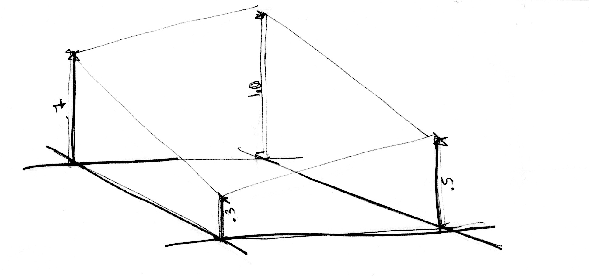

## Noise (Ruído)

Chegou a hora de um intervalo! Nós estamos explorando todas essas funções de aleatório que se parecem com ruído branco de TV, nossa cabeça ainda está rodando pensando em shaders, nossos olhos estão cansados. Hora de dar uma volta!

Nós sentimos o ar em nossa pele, o sol em nosso rosto. O mundo é um lugar vívido e rico. Cores, texturas, sons. Enquanto nós caminhamos, nós não conseguimos evitar perceber a superfície das estradas, das pedras, árvores e nuvens.


A imprevisibilidade dessas texturas podem ser chamadas de "aleatório", mas elas não se parecem com o mesmo aleatório que estávamos explorando antes. O "mundo real" é um lugar tão rico e complexo! Como podemos aproximar computacionalmente essa variedade.

Essa é o mistério que [Ken Perlin](https://mrl.nyu.edu/~perlin/) tentava resolver nos começo dos anos 80, quando ele foi contratado para gerar texturas mais realistas para o filme "Tron". Em resposta a isso, ele criou um elegante algoritmo *Vencedor de Oscar* de Noise (Ruído).


O que vem a seguir não é o algoritmo clássico de Perlin Noise, mas é um bom ponto de partida para entender como gerar ruído.

<div class="simpleFunction" data="
float i = floor(x);  // integer
float f = fract(x);  // fraction
y = rand(i); //rand() is described in the previous chapter
//y = mix(rand(i), rand(i + 1.0), f);
//y = mix(rand(i), rand(i + 1.0), smoothstep(0.,1.,f));
"></div>

Nessas linhas, nós estamos fazendo algo similar com o que nós fizemos no capítulo anterior. Estamos subdividindo um número flutuante contínuo (```x```) nos componentes: inteiro (```i```) e um fracionária (```f```). Nós usamos [```floor```](../glossary/?search=floor) para obter ```f```. Então nós aplicamos ```rand()``` na parte inteira de ```x```, que nos retorna um valor aleatório único para cada inteiro.

Após isso, você vê duas linhas comentadas. A primeira interpola cada valor aleatório de forma linear.

```glsl
y = mix(rand(i), rand(i + 1.0), f);
```

Vá em frente e descomente estas linhas para ver o resultado. Nós usamos o valor [```fract()```](../glossary/?search=fract) armazenado em `f` para [```mix()```](../glossary/?search=mix) (interpolar) os dois valores aleatórios.

A esta altura do livro, nós já aprendemos que podemos fazemos melhor que apenas uma interpolação linear, certo?
Agora, experimente descomentar a linha seguinte, que usa uma interpolação de [```smoothstep()```](../glossary/?search=smoothstep) em vez de uma linear.

```glsl
y = mix(rand(i), rand(i + 1.0), smoothstep(0.,1.,f));
```

Depois de descomentá-la, perceba como a transição entre os picos se suaviza. Em algumas implementações de noise, você perceberá que os programadores preferem escrever as próprias curvas cúbicas (como esta na fórmula seguinte) em vez de usar  [```smoothstep()```](../glossary/?search=smoothstep).

```glsl
float u = f * f * (3.0 - 2.0 * f ); // custom cubic curve
y = mix(rand(i), rand(i + 1.0), u); // using it in the interpolation
```

Esta *suavização alatória* é um divisor de águas para engenheiros gráficos ou artistas - ela nos proporciona a habilidade de gerar imagens e geometria com um sentimento orgânico. O algoritmo de Perlin Noise foi implementado repetidas vezes em diversas linguagens e dimensões para criar peças hipnotizantes para todos os tipos de uso criativo.


Agora é a sua vez:

* Faça sua própria função ```float noise(float x)```.

* Use sua função de Noise para animar uma forma se movendo, rotacioná-la ou alterar sua escala.

* Faça uma composição animada com múltiplas formas 'dançando' juntas utilizando noise.

* Construa uma forma de aparência "orgânica" utilizando a função de noise.

* Depois de conceber sua "criatura", tente ir além em transformá-la em um personagem ao atribuí-la um movimento próprio.

 ## Noise 2D

 

 Agora que nós sabemos como fazer Noise em 1D, está na hora de partirmos para 2D. Em 2D, em vez de interpolar entre dois pontos de uma linha  (```fract(x)``` e ```fract(x)+1.0```), nós vamos interpolar entre quatro vértices de uma área quadrada de um plano (```fract(st)```, ```fract(st)+vec2(1.,0.)```, ```fract(st)+vec2(0.,1.)``` e ```fract(st)+vec2(1.,1.)```).

 

 Analogicamente, se nós quisermos obter um ruído 3D, nós precisamos interpolá-lo entre os oito vértices do cubo. Esta técnica é tudo uma questão de interpolar valores, por isso é chamada **Ruído de Valor**.

 

Como no exemplo 1D, esta interpolação não é linear, mas cúbica, na qual suavemente se interpola qualquer ponto dentro de nossa grade quadrada.


Dê uma olhada na seguinte função noise.

<div class="codeAndCanvas" data="2d-noise.frag"></div>

Nós começamos alterando a escala do espaço por 5 para que se possa ver a interpolação entre os quadrados da grade. Então, dentro da função noise, nós subdividimos o espaço em células. Nós armazenamos a posição inteira ao longo da célula com a posição fracionária de dentro da célula. Nós usamos a posição inteira para calcular as quatro coordenadas dos cantos e obtemos um valor aleatório para cada uma (linhas 23-26). Por último, na linha 35, interpolamos entre os 4 valores aleatórios dos cantos usando a posição fracionária que armazenamos antes.

Agora é a sua vez. Tente os seguintes exercícios:

* Mude o multiplicador na linha 45. Tente animá-lo.

* Em qual nível de zoom o Noise começa a se parecer como Random novamente?

* Em qual nível de zoom o Noise é imperceptível?

* Tente associar a função de noise com as coordenadas do mouse.

* Agora, e se nós tratarmos o gradiente do Noise como um campo de distância? Faça algo interessante a partir disso.

* Agora que conseguimos obter controle sobre a ordem e o caos, é hora de usar nosso conhecimento. Faça uma composição com retângulos, cores e ruído que nos lembre um pouco da complexidade de uma pintura de [Mark Rothko](http://en.wikipedia.org/wiki/Mark_Rothko).


## Utilizando Noise em Designs Generativos

Algoritmos de noise foram originalmente desenhados para nos retornar um natural *je ne sais quoi* em texturas digitais. As implementações 1D e 2D que nós vimos até agora são interpolações entre *valores* aleatórios, por essa razão são chamados **Ruído de Valor**, mas existem muitas outras formas de obter ruído...

[  ](../edit.php#11/2d-vnoise.frag)

Como você percebeu nos últimos exercícios, valores ruidosos tendem a parecer "quadriculados". Para diminuir esse efeito, em 1985 [Ken Perlin](https://mrl.nyu.edu/~perlin/) desenvolveu outra implementação do algoritmo chamado **Ruído de Gradiente**. Ken descobriu como interpolar *gradientes* aleatórios ao invés de valores. Estes gradientes são o resultado de uma função aleatória 2D que retorna direções (representadas por um ```vec2```) em vez de valores únicos (```float```). Clique na seguinte imagem para ver o código e como essa técnica funciona.

[  ](../edit.php#11/2d-gnoise.frag)

Tome um minuto para olhar estes dois exemplos por [Inigo Quilez](http://www.iquilezles.org/) e preste atenção para as diferenças entre [value noise](https://www.shadertoy.com/view/lsf3WH) e [gradient noise](https://www.shadertoy.com/view/XdXGW8).

Como um pintor que entende como os pigmentos de suas pinturas funcionam, quanto mais sabermos sobre as implementações de noise, melhor nós poderemos usá-las. Por exemplo, se nós usarmos uma implementação de noise bidimensional para rotacionar o espaço onde linhas retas são renderizadas, nós podemos reproduzir o seguinte efeito de redemoinho que nos lembra madeira. Você pode clicar na imagem para ver como esse código se parece.

[  ](../edit.php#11/wood.frag)

```glsl
    pos = rotate2d( noise(pos) ) * pos; // rotate the space
    pattern = lines(pos,.5); // draw lines
```

Um outro jeito de se interessar por padrões de ruído, é tratá-los como um campo de distância e aplicar alguns truques descritos no [capítulo Formas](../07/).

[  ](../edit.php#11/splatter.frag)

```glsl
    color += smoothstep(.15,.2,noise(st*10.)); // Black splatter
    color -= smoothstep(.35,.4,noise(st*10.)); // Holes on splatter
```

Uma terceira forma é usar as funções de noise para modular uma forma. Essa forma também pode requerer algumas técnicas que aprendemos no [capítulo sobre formas](../07/).

<a href="../edit.php#11/circleWave-noise.frag"><canvas id="custom" class="canvas" data-fragment-url="circleWave-noise.frag"  width="300px" height="300"></canvas></a>

Para você praticar:

* Quais outros padrões generativos você pode fazer? Que tal granito? Mármore? Magma? Água? Encontre três fotos de textura que você tem interesse em implementá-los algoritmicamente usando noise.
* Use noise para modular uma forma.
* E quanto a usar noise para movimento? Volte ao [capítulo Matrizes](../08/). Use o exemplo de translação que circunda o "+" e aplique um pouco de movimentos *random* e *noise* e ele.
* Faça um generativo Jackson Pollock.


## Melhorando o noise

Uma melhoria por Perlin em seu noise non-simplex original **Simplex Noise**, é a substituição da curva cúbica Hermite ( _f(x) = 3x^2-2x^3_ , que é idêntica à função [```smoothstep()```](../glossary/?search=smoothstep)) com uma interpolação da curva quíntica ( _f(x) = 6x^5-15x^4+10x^3_ ). Isso faz com que ambos finais da curva sejam mais "achatados" então cada borda graciosamente se costurem com a próxima. Em outras palavras, você obtém uma transição mais contínua entre as células. Você pode observar isso ao descomentar a segunda fórmula no seguinte exemplo gráfico (ou ver as [duas equações lado a lado aqui](https://www.desmos.com/calculator/2xvlk5xp8b)).

<div class="simpleFunction" data="
// Cubic Hermite Curve.  Same as SmoothStep()
y = x*x*(3.0-2.0*x);
// Quintic interpolation curve
//y = x*x*x*(x*(x*6.-15.)+10.);
"></div>

Note como o fim das curvas mudam. Você pode ler mais sobre isso nas [próprias palavras de Ken](http://mrl.nyu.edu/~perlin/paper445.pdf).


## Simplex noise

Para Ken Perlin, o sucesso de seu algoritmo não foi o suficiente, ele acreditava que podia ser mais performático. Na Siggraph de 2001, ele apresentou o "simplex noise", onde ele obteve o seguinte avanço sobre o algoritmo anterior:

* Um algoritmo com menor complexidade computacional e menos multiplicações.
* Um Noise que se escalona para maiores dimensões com menos custo computacional.
* Um Noise sem artefatos de direção.
* Um Noise com gradientes bem-definido e contínuos que podem ser computados a um baixo custo.
* Um algoritmo que é fácil de implementar em hardware.

Eu sei o que você está pensando... "Quem é este homem?!" Sim, seu trabalho é fantástico! Mas falando sério, como ele melhorou o algoritmo? Bem, nós vimos como interpolar os 4 pontos para duas dimensões (cantos de um quadrado); Então podemos convenientemente perceber que para três [(ver a implementação aqui)](../edit.php#11/3d-noise.frag) e quatro dimensões nós precisamos interpolar 8 e 16 pontos. Certo? Em outras palavras, para N dimensões, nós precisamos interpolar suavemente 2 elevado a N pontos (2^N). Mas Ken espertamente notou que apesar de uma escolha óbvia de uma forma para o preenchimento espacial fosse o quadrado, a forma mais simples em 2D é o triângulo equilátero. Então ele começou a trocar a grade quadriculada (que acabamos de aprender a usar) por uma grade simplex de triângulos equiláteros.


A forma simplex para N dimensões é a forma com N + 1 vértices. Em outras palavras, um canto a menos para computar em 2D, 4 cantos a menos em 3D e 11 menos cantos em 4D! Isso é um grande aperfeiçoamento.

Em duas dimensões, a interpolação acontece de forma similar a um noise comum, ao interpolar os valores dos cantos para cada seção. Mas neste caso, ao usar uma grade simples, nós apenas precisamos interpolar a soma de 3 cantos.


Como uma grade simplex é feita? Em outro brilhante e elegante movimento, a grade simplex pode ser obtida por subdividir as células de uma grade de 4 cantos em dois triângulos isósceles e então incliná-los até que cada triângulo se torne equilátero.


Então, como [Stefan Gustavson descreve em seu artigo](http://staffwww.itn.liu.se/~stegu/simplexnoise/simplexnoise.pdf): _"...Ao olhar para as partes inteiras das coordenadas transformadas (x,y) para o ponto que queremos avaliar, nós podemos rapidamente determinar qual célula das dois simplexos contém o ponto. Também, ao comparar as magnitudes de x e y, nós podemos determinar se o ponto está no simplex superior ou inferior, e cruzar os três pontos corretos."_

No código a seguir, você pode comentar a linha 44 para ver como a grade está inclinada, e então descomentar a linha 47 para ver como uma grade simplex pode ser construída. Note na linha 22 como estamos subdividindo o quadrado inclinado em dois triângulos equiláteros apenas detectando se ```x > y``` (triângulo "inferior") ou ```y > x``` (triângulo "superior").

<div class="codeAndCanvas" data="simplex-grid.frag"></div>

Todas essas melhorias resultam em uma obra-prima conhecida como **Simplex Noise**. A seguir, temos uma implementação GLSL deste algoritmo feita por Ian McEwan e Stefan Gustavson (e apresentada [neste artigo](http://webstaff.itn.liu.se/~stegu/jgt2012/article.pdf)) que é complicado demais para propósitos educacionais, mas você ficará feliz em clicar e ver que é menos enigmático que você esperava, o código é curto e rápido.

[  ](../edit.php#11/2d-snoise-clear.frag)

Bom... Chega de detalhes técnicos, está na hora de você usar esses recursos na sua própria maneira de se expressar:

* Contemple como cada implementação de noise se parece. Imagine elas como uma matéria crua, como uma pedra de mármore para um escultor. O que você pode dizer sobre o "sentimento" que cada uma tem? Feche seus olhos para ativar sua imaginação, como se você quisesse encontrar formas em uma nuvem, o que você vê? De quê você se lembra? Em que você imagina que cada implementação de noise pode ser feita? Sigua sua coragem e tente criá-la em código.

* Faça um shader que projeta a ilusão de fluidez. Como um abajur de lava, pingos de tinta, água, etc.

<a href="../edit.php#11/lava-lamp.frag"><canvas id="custom" class="canvas" data-fragment-url="lava-lamp.frag"  width="520px" height="200px"></canvas></a>

* Use o Simplex Noise para adicionar algumas texturas a um trabalho que você tenha feito.

<a href="../edit.php#11/iching-03.frag"><canvas id="custom" class="canvas" data-fragment-url="iching-03.frag"  width="520px" height="520px"></canvas></a>

Neste capítuo, nós introduzimos um controle sobre o caos. Não foi uma tarefa fácil! Se tornar um mestre de dobra de noise toma tempo e esfoço.

Nos capítulos a seguir, nós veremos algumas técnicas conhecidas para aperfeiçoar suas habilidades de noise para criar designs generativo com shaders. Até então, aproveite um tempo do lado de fora, contemplando a natureza e seus padrões intrínsecos. Sua habilidade em observar precisa de uma dedicação igual (ou talvez maior) do que suas habilidades de construção. Vá lá fora e aproveite o resto do seu dia!

<p style="text-align:center; font-style: italic;">"Converse com a árvore, faça amizade com ela." Bob Ross
</p>
