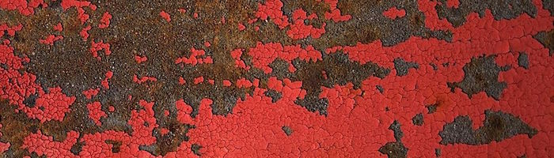

## Шум

Время передохнуть! Мы игрались со случайными значениями, которые выглядят как белый шум в расстроенном телевизоре, голова всё ещё кружится от раздумий о шейдерах, а глаза устали. Давайте выберемся на прогулку!

Мы ощущаем ветер кожей, солнце светит в лицо. Мир - очень яркое и богатое место. Цвета, фактуры, звуки. На прогулке мы не можем не заметить поверхности дорог, камней, деревьев и облаков.





Непредсказуемость этих текстур можно было бы назвать случайной, но они не выглядят как та беспорядночность, с которой мы играли ранее. «Реальный мир» - это настолько богатое и сложное место! Как аппроксимировать это разнообразие с помощью вычислений?

Этот вопрос [Кен Перлин](https://mrl.nyu.edu/~perlin/) пытался разрешить в начале 1980-ых, когда он занимался генерацией реалистичных текстур для фильма «Трон». В итоге, он предложил элегантный оскароносный алгоритм генерации шума.


Код ниже не реализует классический алгоритм шума Перлина, но это хорошее начало в изучении способов генерации шума.

<div class="simpleFunction" data="
float i = floor(x);  // целая часть
float f = fract(x);  // дробная часть
y = rand(i); // функция rand() описана в предыдущей главе
//y = mix(rand(i), rand(i + 1.0), f);
//y = mix(rand(i), rand(i + 1.0), smoothstep(0.,1.,f));
"></div>

В этих строках мы делаем что-то похожее на код из предыдущей главы. Мы разбиваем непрерывное значение с плавающей точкой (```x```) на целую (```i```) и дробную (```f```) части. Для получения целой части мы используем [```floor()```](../glossary/?search=floor), а для дробной - [```fract()```](../glossary/?search=fract). Затем мы применяем ```rand()``` к целой части ```x```, получая уникальное случайное число для каждого нового целого.

Далее идут две закомментированные строки. Первая из них линейно интерполирует каждое случайное значение.

```glsl
y = mix(rand(i), rand(i + 1.0), f);
```

Раскомментируйте строку и посмотрите что получится. Мы используем значение [```fract()```](../glossary/?search=fract) из переменной `f` для смешивания ([```mix()```](../glossary/?search=mix)) двух случайных значений.

Ранее мы уже видели лучшее решение, чем линейная интерполяция, не так ли? Попробуйте раскомментировать следующую строку, в которой используется гладкая интерполяция ([```smoothstep()```](../glossary/?search=smoothstep)) вместо линейной:

```glsl
y = mix(rand(i), rand(i + 1.0), smoothstep(0.,1.,f));
```

Обратите внимание, как переход между пиками стал гладким. В некоторых реализациях шума программисты предпочитают писать свои собственные кубические кривые (как формула ниже) вместо [```smoothstep()```](../glossary/?search=smoothstep).

```glsl
float u = f * f * (3.0 - 2.0 * f ); // самописная кубическая кривая
y = mix(rand(i), rand(i + 1.0), u); // её использование в интерполяции
```

Эта *плавная беспорядочность* существенно меняет расклад. Она помогает графическим инженерам и художникам генерировать изображения и геометрию с ощущением целостности. Алгоритм шума Перлина был многократно реализован на разных языках и для различных размерностей, помогая создавать завораживающие произведения искусства в самых разных видах творческой деятельности.


Теперь ваш ход:

* Напишите свою собственную функцию ```float noise(float x);```

* Используйте свою функцию шума для анимации. Двигайте, вращайте и масштабируйте изображение.

* Создайте анимированую композицию из нескольких фигур, «танцующих» с помощью шума.

* Сконструируйте «органические» формы с помощью шума.

* Возьмите получившееся «существо» и развивайте его дальше. Превратите его в полноценный персонаж, добавив анимации.

## Двумерный шум


Теперь мы знаем как сделать шум в 1D, а значит самое время двигаться в 2D. В двумерном пространстве вместо интерполяции между двумя точками на прямой (```fract(x)``` и ```fract(x)+1.0```), мы будем интерполировать между четырьмя углами квадратного участка плоскости (```fract(st)```, ```fract(st)+vec2(1.,0.)```, ```fract(st)+vec2(0.,1.)``` и ```fract(st)+vec2(1.,1.)```).


Аналогично, если нам нужен трёхмерный шум, мы будем интерполировать между восемью углами куба. Все эти способы работают на интерполяции случайных значений, поэтому они называются **шумом значений**.


Как и одномерный пример, это не линейная, а кубическая интерполяция, которая гладко соединяет несколько любых точек квадратной решётки.


Посмотрите на следующую функцию шума.

<div class="codeAndCanvas" data="2d-noise.frag"></div>

Мы начинаем с масштабирования пространства в 5 раз (строка 45), чтобы увидеть интерполяцию между клетками решётки. Далее в функции шума мы разделяем пространство на клетки. Дробную часть координаты пикселя мы сохраняем для использования в качестве нормализованной координаты внутри клетки, а целую часть - как координату самой клетки. Целочисленная координата используется для вычисления четырёх координат четырёх углов и получения случайного значения для каждого из них (строки 23-26). Наконец, в строке 35 мы интерполируем между четырьмя случайными значениями в углах, используя ранее сохранённые дробные части координат.

Теперь ваш ход. Выполните следующие упражнения:

* Измените множитель в строке 45. Попытайтесь анимировать его.

* При каком увеличении шум снова начинает выглядеть случайным?

* При каком увеличении шум неразличим?

* Сделайте функцию шума зависимой от координат мыши.

* Что если интерпретировать градиент шума как поле расстояний? Сделайте с ним что-нибудь интересное.

* Теперь вы в какой-то степени управляете хаосом и порядком, и можете применить эти знания на практике. Сделайте композицию из прямоугольников, цвета и шума, которая подражает сложности картины [Марка Ротко](https://ru.wikipedia.org/wiki/%D0%A0%D0%BE%D1%82%D0%BA%D0%BE,_%D0%9C%D0%B0%D1%80%D0%BA).


## Использование шума в генеративном дизайне

Изначально алгоритмы шума разрабатывались чтобы придать естественное *что-то* цифровым текстурам. Одно- и двумерные реализаци, которые мы рассмотрели выше, работали на интерполяции шума *значений*, из-за чего мы называем их *шумом значений*. Но существуют и другие способы получения шума...

[  ](../edit.php#11/2d-vnoise.frag)

Как мы выяснили в предыдущих упражнениях, шум значений выглядит «блочно». Чтобы справиться с этим блочным эффектом, [Кен Перлин](https://mrl.nyu.edu/~perlin/) в 1985 году разработал другую реализацию алгоритма под названием *градиентный шум*. Кен додумался как интерполировать случайные *градиенты* вместо значений. Эти градиенты возвращаются двумерной случайной функцией, которая возвращает направления (в виде ```vec2```) вместо скалярных значений. Щёлкните по следующему изображению чтобы увидеть код и результат его работы.

[  ](../edit.php#11/2d-gnoise.frag)

Посмотрите на эти два примера шума, написанные [Иниго Квилесом](http://www.iquilezles.org/), и обратите внимание на разницу между [шумом значений](https://www.shadertoy.com/view/lsf3WH) и [градиентным шумом](https://www.shadertoy.com/view/XdXGW8).

Как и художники, понимающие принцип работы пигментов своих красок, чем больше мы знаем о реализации шумовых алгоритмов - тем лучше мы сможем их использовать. Например, если повернуть двумерное изображение прямых линий на значение двумерного шума, получится следующий эффект закрутки, имитирующий древесину. Кликните на изображение, чтобы увидеть код.

[  ](../edit.php#11/wood.frag)

```glsl
    pos = rotate2d( noise(pos) ) * pos; // поворачиваем пространство
    pattern = lines(pos,.5); // рисуем линии
```

Другой способ получить интересные картинки - это представить шум в виде поля расстояний и применить какие-нибудь трюки из [главы о фигурах](../07/?lan=ru).

[  ](../edit.php#11/splatter.frag)

```glsl
    color += smoothstep(.15,.2,noise(st*10.)); // Чёрные всплески
    color -= smoothstep(.35,.4,noise(st*10.)); // Отверстия во всплесках
```

Ещё один способ использования шума - модуляция форм. Здесь так же потребуются навыки из [главы о фигурах](../07/).

<a href="../edit.php#11/circleWave-noise.frag"><canvas id="custom" class="canvas" data-fragment-url="circleWave-noise.frag"  width="300px" height="300"></canvas></a>

Практические задания:

* Какие ещё генеративные узоры вы можете сделать? Может быть гранит? Мрамор? Магма? Вода? Найдите три текстурных изображения на ваш вкус и реализуйте их алгоритмически с помощью шума.
* Используйте шум для модулирования формы.
* Как насчёт использования шума в движении? Вернитесь к [главе про матрицы](../08/?lan=ru). Используйте пример про сдвиг белого креста и добавьте к движению немного *беспорядка* и *шума*.
* Сгенерируйте картину Джексона Поллока.


## Улучшенный шум

Перлин улучшил свой непростой шум, предложив *симплексный шум*, в котором заменил кубическую эрмитову кривую ( _f(x) = 3x^2-2x^3_ , которая идентична функции [```smoothstep()```](../glossary/?search=smoothstep)) кривой пятой степени ( _f(x) = 6x^5-15x^4+10x^3_ ). При этом оба конца кривой становятся более «плоскими», поэтому границы более плавно сшиваются друг с другом. Другими словами, получается более непрерывный переход между клетками. Посмотрите на результат, раскомментировав вторую формулу в следующем графике (или два уравнения по отдельности [здесь](https://www.desmos.com/calculator/2xvlk5xp8b)).

<div class="simpleFunction" data="
// Кубическая эрмитова кривая. То же что и SmoothStep()
y = x*x*(3.0-2.0*x);
// Кривая пятой степени
//y = x*x*x*(x*(x*6.-15.)+10.);
"></div>

Обратите внимание как меняются концы кривой. Подробнее читайте в [оригинальной статье](http://mrl.nyu.edu/~perlin/paper445.pdf).

## Симплексный шум

Перлин не удовлетворился успехом своего алгоритма. Он хотел более высокой производительности. На Siggraph 2001 он представил «симплексный шум», который вносит следующие улучшения относительно предыдущего алгоритма:

* Меньшая вычислительная сложность и меньше умножений.
* Шум масштабируется в высшие размерности с меньшей потерей производительности.
* Отсутствуют направленные артефакты.
* Шум имеет хорошо определённый непрерывный градиент, который легко вычислить.
* Алгоритм достаточно прост для аппаратной реализации.

Я знаю о чём вы думаете... «Кто этот человек?» Да, он делает фантастические вещи! Но серьёзно, как он улучшил алгоритм? Смотрите: если для двух измерений мы интерполируем 4 точки (углы квадрата), то для трёх ([пример реализации здесь](../edit.php#11/3d-noise.frag)) и четырёх измерений придётся интерполировать 8 и 16 точек. Так? Другими словами, для N измерений нужно гладко интерполировать 2 в степени N точек. Но Кен вспомнил, что хоть квадрат и является удобной формой для заполнения пространства, но всё же простейшая фигура в двумерном пространстве - это равносторонний треугольник. Поэтому он начал с замены квадратной решётки (которую мы использовали ранее) на симплексную решётку, то есть равносторонние треугольники в двумерном случае.


Симплекс в N измерениях - это многогранник с N + 1 углом. Другими словами, в двумерном пространстве придётся вычислять на один угол меньше, в трёхмерном - на 4 угла меньше, а в четырёхмерном - на 11 углов меньше! Это огромное достижение!

В двух измерениях интерполяция проделывается так же, как и в обычном шуме, то есть между значениями в углах участка пространства. Однако в случае с симплексной решёткой нам нужно интерполировать только три угла.


Как построить симплексную решётку? Сделаем ещё один блестящий и элегантный ход! Симплексная решётка получается, если разделить клетки обычной квадратной решётки на два равнобедренных треугольника, а затем наклонить решётку так, чтобы треугольники стали равносторонними.


Далее, следуем описанию из [статьи Стефана Густавсона](http://staffwww.itn.liu.se/~stegu/simplexnoise/simplexnoise.pdf): _«...рассмотрев целые части трансформированных координат (x,y) в данной точке, нетрудно определить к какой клетке, составленной из двух симплексов, принадлежит эта точка. А сравнив абсолютные значения x и y, мы можем определить принадлежность точки к верхнему или нижнему симплексу, после чего останется обойти три корректных угловых точки.»_

В следующем коде раскомментируйте строку 44 чтобы увидеть перекос решётки, а затем раскомментируйте строку 47 чтобы увидеть как строится решётка из симплексов. В строке 22 обратите внимание как мы разделяем скошенный квадрат на два равносторонних треугольника, всего лишь проверяя условия ```x > y``` («нижний» треугольник) или ```y > x``` («верхний» треугольник).

<div class="codeAndCanvas" data="simplex-grid.frag"></div>

Все эти улучшения порождают произведение алгоритмического искусства под названием **Симплексный шум**. Ниже приведена реализация этого алгоритма, написанная на GLSL Йаном МакЭваном и Стефаном Густавсоном (и представленная в [этой работе](http://webstaff.itn.liu.se/~stegu/jgt2012/article.pdf)). Она излишне сложна для образовательных целей, но всё же не поленитесь кликнуть на картинку и изучить исходный код. Он быстр, лаконичен и не настолько запутан, как вы возможно его себе представляли.

[  ](../edit.php#11/2d-snoise-clear.frag)

Ну что-ж... пора заканчивать с техническими деталами, пора задействовать этот ресурс в качестве вашего нового средства выразительности:

* Рассмотрите реализацию каждого из шумов. Вообразите, будто это необработанный материал, как мраморный камень для скульптора. Какое ощущение создаёт каждый из них? Прищурьте глаза чтобы усилить воображение, как будто вы высматриваете фигуры в облаках. Что вы видите? О чём это вам напоминает? Что бы вы изготовили из каждого вида шумов? Соберитесь и воплотите это в коде.

* Сделайте шейдер, создающий иллюзию потока. Например, лавовую лампу, чернильные капли, воду и т.д.

<a href="../edit.php#11/lava-lamp.frag"><canvas id="custom" class="canvas" data-fragment-url="lava-lamp.frag"  width="520px" height="200px"></canvas></a>

* Используя симплексный шум, добавьте текстуры к ранее выполненным работам.

<a href="../edit.php#11/iching-03.frag"><canvas id="custom" class="canvas" data-fragment-url="iching-03.frag"  width="520px" height="520px"></canvas></a>

В этой главе мы научились немного контролировать хаос. Это было непросто! Нужно потрудиться и набраться терпения, чтобы стать мастером по работе с шумом.

В следующих главах мы изучим некоторые известные приёмы чтобы отточить ваши умения и научиться делать из шума более качественную генеративную графику с помощью шейдеров. А пока немного отдохните на свежем воздухе, рассматривая причудливые узоры природы. Тренировка умения наблюдать требует столько же или даже больше сил, чем оттачивание умения создавать. Пойдите на улицу и хорошо отдохните до конца дня!

<p style="text-align:center; font-style: italic;">«Поговорите с деревом, подружитесь с ним.» Боб Росс
</p>
