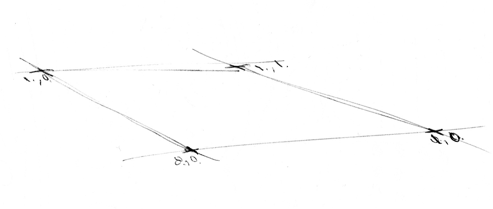

## Gürültü (Noise)

Mola zamanı! TV beyaz gürültüsüne benzeyen rastgele fonksiyonlarla oynuyorduk, shader'lar hakkında düşünmekten kafamız hâlâ dönüyor ve gözlerimiz yoruldu. Yürüyüşe çıkma zamanı!

Cildimizdeki havayı, yüzümüzdeki güneşi hissediyoruz. Dünya çok canlı ve zengin bir yer. Renkler, dokular, sesler. Yürürken yolların, kayaların, ağaçların ve bulutların yüzeyini fark etmekten kaçınamıyoruz.


Bu dokuların öngörülemezliğine "rastgele" denilebilir, ama daha önce oynadığımız rastgeleye benzemiyor. "Gerçek dünya" çok zengin ve karmaşık bir yer! Bu çeşitliliğe hesaplamalı olarak nasıl yaklaşabiliriz?

Bu, [Ken Perlin](https://mrl.nyu.edu/~perlin/)'in 1980'lerin başında "Tron" filmi için daha gerçekçi dokular üretmekle görevlendirildiğinde çözmeye çalıştığı soruydu. Buna yanıt olarak, zarif bir *Oscar ödüllü* gürültü algoritması geliştirdi. (Küçük bir şey.)


Aşağıdaki klasik Perlin gürültü algoritması değildir, ancak gürültü üretmeyi anlamak için iyi bir başlangıç noktasıdır.

<div class="simpleFunction" data="
float i = floor(x);  // tam sayı
float f = fract(x);  // kesir
y = rand(i); //rand() önceki bölümde açıklandı
//y = mix(rand(i), rand(i + 1.0), f);
//y = mix(rand(i), rand(i + 1.0), smoothstep(0.,1.,f));
"></div>

Bu satırlarda önceki bölümde yaptığımıza benzer bir şey yapıyoruz. Sürekli bir kayan sayıyı (```x```) tam sayı (```i```) ve kesirli (```f```) bileşenlerine ayırıyoruz. ```i```'yi elde etmek için [```floor()```](../glossary/?search=floor) ve ```f```'yi elde etmek için [```fract()```](../glossary/?search=fract) kullanıyoruz. Sonra ```x```'in tam sayı kısmına ```rand()``` uyguluyoruz, bu da her tam sayı için benzersiz bir rastgele değer veriyor.

Bundan sonra iki yorum satırı görüyorsunuz. Birincisi her rastgele değeri doğrusal olarak enterpolasyon yapar.

```glsl
y = mix(rand(i), rand(i + 1.0), f);
```

Devam edin ve bunun nasıl göründüğünü görmek için bu satırın yorumunu kaldırın. İki rastgele değeri [```mix()```](../glossary/?search=mix) etmek için `f`'de saklanan [```fract()```](../glossary/?search=fract) değerini kullanıyoruz.

Kitabın bu noktasında, doğrusal enterpolasyondan daha iyisini yapabileceğimizi öğrendik, değil mi?
Şimdi doğrusal yerine [```smoothstep()```](../glossary/?search=smoothstep) enterpolasyonu kullanan aşağıdaki satırın yorumunu kaldırmayı deneyin.

```glsl
y = mix(rand(i), rand(i + 1.0), smoothstep(0.,1.,f));
```

Yorumunu kaldırdıktan sonra, tepeler arasındaki geçişin nasıl düzgünleştiğine dikkat edin. Bazı gürültü uygulamalarında programcıların [```smoothstep()```](../glossary/?search=smoothstep) kullanmak yerine kendi kübik eğrilerini (aşağıdaki formül gibi) kodlamayı tercih ettiğini göreceksiniz.

```glsl
float u = f * f * (3.0 - 2.0 * f ); // özel kübik eğri
y = mix(rand(i), rand(i + 1.0), u); // enterpolasyonda kullanma
```

Bu *düzgün rastgelelik*, grafik mühendisleri veya sanatçılar için ezber bozucudur — organik hissiyatla görüntüler ve geometriler üretme yeteneği sağlar. Perlin'in Gürültü Algoritması, her türlü yaratıcı kullanım için büyüleyici eserler yapmak üzere farklı dillerde ve boyutlarda tekrar tekrar uygulanmıştır.


Şimdi sıra sizde:

* Kendi ```float noise(float x)``` fonksiyonunuzu yapın.

* Bir şekli taşıyarak, döndürerek veya ölçekleyerek canlandırmak için gürültü fonksiyonunuzu kullanın.

* Gürültü kullanarak birkaç şeklin birlikte 'dans ettiği' animasyonlu bir kompozisyon yapın.

* Gürültü fonksiyonunu kullanarak "organik görünümlü" şekiller oluşturun.

* "Yaratığınızı" elde ettikten sonra, ona belirli bir hareket atayarak bir karaktere dönüştürmeye çalışın.

## 2B Gürültü



Artık 1B'de gürültüyü nasıl yapacağımızı bildiğimize göre, 2B'ye geçme zamanı. 2B'de bir çizginin iki noktası arasında (```rand(x)``` ve ```rand(x)+1.0```) enterpolasyon yapmak yerine, bir düzlemin kare alanının dört köşesi arasında enterpolasyon yapacağız (```rand(st)```, ```rand(st)+vec2(1.,0.)```, ```rand(st)+vec2(0.,1.)``` ve ```rand(st)+vec2(1.,1.)```).


Benzer şekilde, 3B gürültü elde etmek istiyorsak bir küpün sekiz köşesi arasında enterpolasyon yapmamız gerekir. Bu teknik tamamen rastgele değerlerin enterpolasyonuyla ilgilidir, bu yüzden **değer gürültüsü** (value noise) olarak adlandırılır.


1B örneğinde olduğu gibi, bu enterpolasyon doğrusal değil, kübiktir; kare ızgaramızın içindeki herhangi bir noktayı düzgünce enterpolasyon yapar.


Aşağıdaki gürültü fonksiyonuna bir bakın.

<div class="codeAndCanvas" data="2d-noise.frag"></div>

Izgaranın kareleri arasındaki enterpolasyonu görmek için uzayı 5'le ölçekleyerek (45. satır) başlıyoruz. Sonra gürültü fonksiyonunun içinde uzayı hücrelere ayırıyoruz. Hücrenin tam sayı konumunu ve hücre içindeki kesirli konumları saklıyoruz. Tam sayı konumunu dört köşenin koordinatlarını hesaplamak ve her biri için rastgele bir değer elde etmek için kullanıyoruz (23-26 arası satırlar). Son olarak, 35. satırda daha önce sakladığımız kesirli konumları kullanarak köşelerin 4 rastgele değeri arasında enterpolasyon yapıyoruz.

Şimdi sıra sizde. Aşağıdaki alıştırmaları deneyin:

* 45. satırın çarpanını değiştirin. Canlandırmayı deneyin.

* Hangi yakınlaştırma seviyesinde gürültü tekrar rastgele görünmeye başlar?

* Hangi yakınlaştırma seviyesinde gürültü algılanamaz hale gelir?

* Bu gürültü fonksiyonunu fare koordinatlarına bağlamayı deneyin.

* Ya gürültünün gradyanını bir mesafe alanı olarak ele alırsak? Onunla ilginç bir şey yapın.

* Artık düzen ve kaos üzerinde biraz kontrol elde ettiğinize göre, bu bilgiyi kullanmanın zamanı. Bir [Mark Rothko](http://en.wikipedia.org/wiki/Mark_Rothko) tablosunun karmaşıklığına benzeyen dikdörtgenler, renkler ve gürültüden oluşan bir kompozisyon yapın.


## Üretken Tasarımlarda Gürültü Kullanma

Gürültü algoritmaları başlangıçta dijital dokulara doğal bir *je ne sais quoi* vermek için tasarlandı. Şimdiye kadar gördüğümüz 1B ve 2B uygulamalar rastgele *değerler* arasında enterpolasyonlardı, bu yüzden **Değer Gürültüsü** olarak adlandırılırlar, ancak gürültü elde etmenin daha fazla yolu var...

[  ](../edit.php#11/2d-vnoise.frag)

Önceki alıştırmalarda keşfettiğiniz gibi, değer gürültüsü "bloklu" görünme eğilimindedir. Bu bloklu efekti azaltmak için 1985'te [Ken Perlin](https://mrl.nyu.edu/~perlin/) **Gradyan Gürültüsü** adlı başka bir algoritma uygulaması geliştirdi. Ken, değerler yerine rastgele *gradyanları* enterpolasyon yapmanın yolunu buldu. Bu gradyanlar, tek değerler (```float```) yerine yönler (bir ```vec2``` ile temsil edilen) döndüren 2B rastgele fonksiyonun sonucuydu. Kodu ve nasıl çalıştığını görmek için aşağıdaki görüntüye tıklayın.

[  ](../edit.php#11/2d-gnoise.frag)

[Inigo Quilez](http://www.iquilezles.org/) tarafından yapılan bu iki örneğe bir dakika ayırıp bakın ve [değer gürültüsü](https://www.shadertoy.com/view/lsf3WH) ile [gradyan gürültüsü](https://www.shadertoy.com/view/XdXGW8) arasındaki farklara dikkat edin.

Boyalarının pigmentlerinin nasıl çalıştığını anlayan bir ressam gibi, gürültü uygulamaları hakkında ne kadar çok bilirsek, onları o kadar iyi kullanabiliriz. Örneğin, düz çizgilerin oluşturulduğu uzayı döndürmek için iki boyutlu bir gürültü uygulaması kullanırsak, ahşaba benzeyen aşağıdaki kıvrımlı efekti üretebiliriz. Yine kodu görmek için görüntüye tıklayabilirsiniz.

[  ](../edit.php#11/wood.frag)

```glsl
    pos = rotate2d( noise(pos) ) * pos; // uzayı döndür
    pattern = lines(pos,.5); // çizgiler çiz
```

Gürültüden ilginç desenler elde etmenin başka bir yolu, onu bir mesafe alanı olarak ele almak ve [Şekiller bölümünde](../07/) açıklanan bazı numaraları uygulamaktır.

[  ](../edit.php#11/splatter.frag)

```glsl
    color += smoothstep(.15,.2,noise(st*10.)); // Siyah sıçrama
    color -= smoothstep(.35,.4,noise(st*10.)); // Sıçramadaki delikler
```

Gürültü fonksiyonunu kullanmanın üçüncü bir yolu, bir şekli modüle etmektir. Bu da [şekiller bölümünde](../07/) öğrendiğimiz bazı teknikleri gerektirir.

<a href="../edit.php#11/circleWave-noise.frag"><canvas id="custom" class="canvas" data-fragment-url="circleWave-noise.frag"  width="300px" height="300"></canvas></a>

Pratik yapmanız için:

* Başka hangi üretken deseni yapabilirsiniz? Ya granit? Mermer? Magma? Su? İlginizi çeken üç doku resmi bulun ve gürültü kullanarak algoritmik olarak uygulayın.
* Bir şekli modüle etmek için gürültü kullanın.
* Ya hareket için gürültü kullanmak? [Matris bölümüne](../08/) geri dönün. "+"'yı hareket ettiren öteleme örneğini kullanın ve ona bazı *rastgele* ve *gürültü* hareketleri uygulayın.
* Üretken bir Jackson Pollock yapın.


## İyileştirilmiş Gürültü

Perlin'in orijinal simpleks olmayan gürültüsüne yaptığı iyileştirme olan **Simpleks Gürültüsü**, kübik Hermite eğrisinin ( _f(x) = 3x^2-2x^3_ , [```smoothstep()```](../glossary/?search=smoothstep) fonksiyonuyla aynıdır) quintic enterpolasyon eğrisiyle ( _f(x) = 6x^5-15x^4+10x^3_ ) değiştirilmesidir. Bu, eğrinin her iki ucunu daha "düz" yapar, böylece her sınır bir sonrakiyle zarif bir şekilde birleşir. Başka bir deyişle, hücreler arasında daha sürekli bir geçiş elde edersiniz. Aşağıdaki grafik örneğinde ikinci formülün yorumunu kaldırarak bunu görebilirsiniz (veya [iki denklemi yan yana burada görün](https://www.desmos.com/calculator/2xvlk5xp8b)).

<div class="simpleFunction" data="
// Kübik Hermite Eğrisi. SmoothStep() ile Aynı
y = x*x*(3.0-2.0*x);
// Quintic enterpolasyon eğrisi
//y = x*x*x*(x*(x*6.-15.)+10.);
"></div>

Eğrinin uçlarının nasıl değiştiğine dikkat edin. Daha fazlasını [Ken'in kendi sözleriyle](http://mrl.nyu.edu/~perlin/paper445.pdf) okuyabilirsiniz.


## Simpleks Gürültüsü

Ken Perlin için algoritmasının başarısı yeterli değildi. Daha iyi performans gösterebileceğini düşündü. Siggraph 2001'de önceki algoritmaya göre aşağıdaki iyileştirmeleri elde ettiği "simpleks gürültüsünü" sundu:

* Daha düşük hesaplama karmaşıklığı ve daha az çarpma içeren bir algoritma.
* Daha düşük hesaplama maliyetiyle daha yüksek boyutlara ölçeklenen bir gürültü.
* Yönsel artefaktları olmayan bir gürültü.
* İyi tanımlanmış ve sürekli gradyanlara sahip, oldukça ucuza hesaplanabilen bir gürültü.
* Donanımda uygulanması kolay bir algoritma.

Ne düşündüğünüzü biliyorum... "Bu adam kim?" Evet, çalışması harika! Ama cidden, algoritmayı nasıl iyileştirdi? İki boyut için 4 noktayı (bir karenin köşelerini) enterpolasyon yaptığını gördük; bu yüzden [üç boyut (burada bir uygulamayı görün)](../edit.php#11/3d-noise.frag) ve dört boyut için 8 ve 16 noktayı enterpolasyon yapmamız gerektiğini doğru tahmin edebiliriz. Başka bir deyişle N boyut için 2'nin N'inci kuvveti (2^N) noktayı düzgünce enterpolasyon yapmanız gerekir. Ancak Ken, uzay dolduran şekil için bariz seçenek kare olsa da, 2B'deki en basit şeklin eşkenar üçgen olduğunu zekice fark etti. Bu yüzden kare ızgarayı (nasıl kullanacağımızı yeni öğrendiğimiz) eşkenar üçgenlerden oluşan bir simpleks ızgara ile değiştirmeye başladı.


N boyut için simpleks şekli, N + 1 köşeli bir şekildir. Başka bir deyişle 2B'de bir köşe daha az, 3B'de 4 köşe daha az ve 4B'de 11 köşe daha az hesaplama! Bu büyük bir iyileştirme!

İki boyutta enterpolasyon, normal gürültüye benzer şekilde, bir bölümün köşelerinin değerlerini enterpolasyon yaparak gerçekleşir. Ancak bu durumda, bir simpleks ızgara kullanarak, sadece 3 köşenin toplamını enterpolasyon yapmamız gerekir.


Simpleks ızgarası nasıl yapılır? Başka parlak ve zarif bir hamlede, simpleks ızgarası, normal 4 köşeli bir ızgaranın hücrelerini iki ikizkenar üçgene bölerek ve sonra her üçgen eşkenar olana kadar eğerek elde edilebilir.


Sonra, [Stefan Gustavson'un bu makalede anlattığı gibi](http://staffwww.itn.liu.se/~stegu/simplexnoise/simplexnoise.pdf): _"...değerlendirmek istediğimiz nokta için dönüştürülmüş koordinatların (x,y) tam sayı kısımlarına bakarak, noktayı içeren iki simpleksten hangisini hızlıca belirleyebiliriz. x ve y'nin büyüklüklerini de karşılaştırarak, noktanın üst veya alt simplekste olup olmadığını belirleyebilir ve doğru üç köşe noktasını gezebiliriz."_

Aşağıdaki kodda ızgaranın nasıl eğildiğini görmek için 44. satırın yorumunu kaldırabilir, ardından bir simpleks ızgaranın nasıl oluşturulabileceğini görmek için 47. satırın yorumunu kaldırabilirsiniz. 22. satırda eğilmiş kareyi sadece ```x > y``` ("alt" üçgen) veya ```y > x``` ("üst" üçgen) tespit ederek iki eşkenar üçgene böldüğümüze dikkat edin.

<div class="codeAndCanvas" data="simplex-grid.frag"></div>

Tüm bu iyileştirmeler **Simpleks Gürültüsü** olarak bilinen algoritmik bir başyapıtla sonuçlanır. Aşağıdaki, Ian McEwan ve Stefan Gustavson tarafından yapılan bu algoritmanın GLSL uygulamasıdır ([bu makalede](http://webstaff.itn.liu.se/~stegu/jgt2012/article.pdf) sunulmuştur) ve eğitim amaçları için aşırı karmaşıktır, ancak tıklayıp beklediğinizden daha az şifreli olduğunu ve kodun kısa ve hızlı olduğunu görmekten mutlu olacaksınız.

[  ](../edit.php#11/2d-snoise-clear.frag)

Yeterince teknik detay... şimdi bu kaynağı kendi ifade biçiminizde kullanma zamanı:

* Her gürültü uygulamasının nasıl göründüğünü düşünün. Onları ham malzeme olarak, bir heykeltıraş için mermer kaya gibi hayal edin. Her birinin sahip olduğu "his" hakkında ne söyleyebilirsiniz? Bir bulutta şekiller bulmak istediğinizdeki gibi gözlerinizi kısın ve hayal gücünüzü tetikleyin. Ne görüyorsunuz? Size neyi hatırlatıyor? Her gürültü uygulamasının neye dönüştürülebileceğini hayal edin? İçgüdülerinizi takip edin ve kodda gerçekleştirmeyi deneyin.

* Akış illüzyonu yansıtan bir shader yapın. Lav lambası, mürekkep damlaları, su vb. gibi.

<a href="../edit.php#11/lava-lamp.frag"><canvas id="custom" class="canvas" data-fragment-url="lava-lamp.frag"  width="520px" height="200px"></canvas></a>

* Daha önce yaptığınız bir çalışmaya doku eklemek için Simpleks Gürültüsü kullanın.

<a href="../edit.php#11/iching-03.frag"><canvas id="custom" class="canvas" data-fragment-url="iching-03.frag"  width="520px" height="520px"></canvas></a>

Bu bölümde kaos üzerinde biraz kontrol sağladık. Kolay bir iş değildi! Gürültü bükme ustası olmak zaman ve çaba gerektirir.

Sonraki bölümlerde becerilerinizi mükemmelleştirmek ve shader'larla kaliteli üretken içerik tasarlamak için gürültünüzden daha fazlasını elde etmek üzere bazı iyi bilinen teknikleri göreceğiz. O zamana kadar, dışarıda doğayı ve karmaşık desenlerini düşünerek biraz zaman geçirmenin keyfini çıkarın. Gözlem yeteneğiniz, yapma becerileriniz kadar (veya muhtemelen daha fazla) özveri gerektirir. Dışarı çıkın ve günün geri kalanının keyfini çıkarın!

<p style="text-align:center; font-style: italic;">"Ağaçla konuş, onunla arkadaş ol." Bob Ross
</p>

#### Araç kutunuz için

* [LYGIA'nın üretken fonksiyonları](https://lygia.xyz/generative), GLSL'de desenler üretmek için yeniden kullanılabilir fonksiyonlar kümesidir. Üretken sanat yaratmak için rastgelelik ve gürültüyü nasıl kullanacağınızı öğrenmek için harika bir kaynaktır. Yeniden kullanılabilirlik, performans ve esneklik için tasarlanmış çok ayrıntılı bir kütüphanedir. Ve herhangi bir projeye ve framework'e kolayca eklenebilir.
