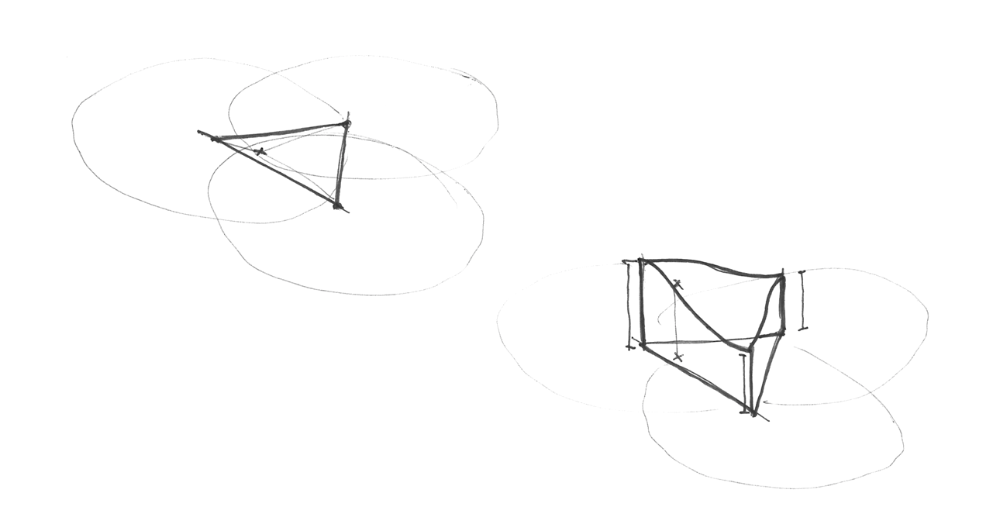

## Шум

Час взяти перерву! Ми гралися з функціями випадкових значень, що нагадують телевізійний білий шум, наші голови все ще кружляють від думок про шейдери та втомились очі. Час піти на прогулянку!

Ми відчуваємо повітря на нашій шкірі, сонце на обличчі. Світ такий яскравий та насичений. Кольори, текстури, звуки. На прогулянці ми не можемо не помітити поверхню доріг, каменів, дерев та хмар.


Непередбачуваність цих текстур можна назвати "випадковою", але вони не схожі на той рандом, з якими ми грали раніше. "Реальний світ" — це дуже багате й складне місце! Як ми можемо апроксимувати цю варіативність за допомогою обчислень?

Це питання [Кен Перлін](https://mrl.nyu.edu/~perlin/) намагався вирішити на початку 1980-х років, коли йому доручили створити більш реалістичні текстури для фільму "Трон". У результаті він придумав елегантний алгоритм для генерації шуму за який потім отримав своєрідний *Оскар*. Нічого особливого)


Нижче наведено не класичний алгоритм шуму Перліна, але це хороша відправна точка для розуміння того, як генерувати шум.

<div class="simpleFunction" data="
float i = floor(x);  // integer
float f = fract(x);  // fraction
y = rand(i); //rand() is described in the previous chapter
// y = mix(rand(i), rand(i + 1.0), f);
// y = mix(rand(i), rand(i + 1.0), smoothstep(0., 1., f));
"></div>

У цих рядках ми робимо щось подібне до того, що робили в попередньому розділі. Ми ділимо безперервне число з рухомою крапкою (`x`) на цілу (`i`) і дробову (`f`) складові. Для отримання цілої частини "**`i`**" ми використовуємо [```floor()```](../glossary/lan=ua&?search=floor), а для дробової частини "**`f`**" — [```fract()```](../glossary/lan=ua&?search=fract). Потім ми застосовуємо ```rand()``` до цілої частини "**`x`**", що дає унікальне випадкове значення для кожного цілого числа.

Також ви бачите два закоментовані рядки. Перший інтерполює кожне випадкове значення лінійним чином.

```glsl
y = mix(rand(i), rand(i + 1.0), f);
```

Розкоментуйте цей рядок, щоб побачити його роботу. Ми використовуємо дробове значення **`f`**, отримане після  [```fract()```](../glossary/lan=ua&?search=fract), щоб за допомогою [```mix()```](../glossary/lan=ua&?search=mix) зміксувати два випадкових значення.

Ми вже знаємо, що можемо використати краще рішення, ніж лінійна інтерполяція, чи не так?
Розкоментуйте наступний рядок, щоб застосувати інтерполяцію [```smoothstep()```](../glossary/lan=ua&?search=smoothstep).

```glsl
y = mix(rand(i), rand(i + 1.0), smoothstep(0., 1. ,f));
```

Зверніть увагу на те, як перехід між вершинами стає плавним. У деяких реалізаціях шуму програмісти віддають перевагу створенню власних кубічних кривих (наприклад, наступна формула) замість використання [```smoothstep()```](../glossary/lan=ua&?search=smoothstep).

```glsl
float u = f * f * (3.0 - 2.0 * f ); // варіант кубічної кривої
y = mix(rand(i), rand(i + 1.0), u); // використання її в інтерполяції
```

Ця *плавна випадковість* змінює правила гри для графічних інженерів і художників. Вона надає можливість генерувати зображення та геометрію, що виглядатимуть органічно. Алгоритм шуму Перліна реалізовано на різних мовах та для різних вимірів, що дозволяє створювати захопливі витвори мистецтва для різноманітних творчих цілей.


Тепер настала ваша черга:

* Створіть власну функцію типу "```float noise(float x)```".

* Використайте функцію шуму для анімації фігури, переміщуючи її, обертаючи або змінюючи масштаб.

* Використовуючи шум, створіть анімаційну композицію з кількох рухомих фігур.

* Сконструюйте за допомогою шуму "органічні" форми.

* Розвиньте отриману "істоту" у персонаж, задавши їй певний рух.

## Двомірний шум


Тепер, коли ми знаємо, як створити одномірний шум (1D - one dimention), настав час перейти до 2D. У 2D, замість інтерполяції між двома точками лінії (```rand(x)``` та ```rand(x) + 1.0```), ми будемо інтерполювати між чотирма кутами квадратної площини (```rand(st)```, ```rand(st) + vec2(1., 0.)```, ```rand(st) + vec2(0., 1.)``` та ```rand(st) + vec2(1., 1.)```).


Так само, якщо ми хочемо отримати тривимірний шум, то потрібно інтерполювати між вісьмома кутами куба. Ця техніка пов'язана з інтерполяцією випадкових значень, тому її називають **value noise (шумом значення)**.


Як і з одномірним прикладом, ця інтерполяція не лінійна, а кубічна, яка плавно інтерполює будь-які точки всередині нашої квадратної сітки.


Погляньте на наступну функцію шуму:

<div class="codeAndCanvas" data="2d-noise.frag"></div>

Ми починаємо з масштабування простору у 5 разів (рядок 45), щоб побачити інтерполяцію між квадратами сітки. Потім у функції шуму ми ділимо простір на комірки. Дробову частину координати ми зберігаємо для використання всередині клітини, а цілу частину — як координату самої клітини. Ми використовуємо цілочисельне значення позиції, щоб обчислити координати чотирьох кутів комірки та отримати випадкове значення для кожного з них (рядки 23-26). Нарешті, у рядку 35 ми інтерполюємо між 4 випадковими значеннями кутів, використовуючи дробові позиції, які ми зберегли раніше.

Тепер ваша черга. Спробуйте наступні вправи:

* Змініть множник у рядку 45. Спробуйте анімувати його.

* На якому рівні масштабування шум знову починає виглядати випадковим?

* На якому рівні масштабування шум непомітний?

* Спробуйте зробити функцію шуму залежною від координат курсору.

* Що, якщо розглядати градієнт шуму як поле відстаней? Зробіть з ним щось цікаве.

* Тепер, коли ви досягли певного контролю над порядком та хаосом, настав час використати ці знання. Створіть композицію з прямокутниками, кольорами й шумом, яка нагадувала б комплексність картини [Марка Ротко](http://en.wikipedia.org/wiki/Mark_Rothko).


## Використання шуму в генеративному дизайні

Алгоритми шуму початково були розроблені, щоб надати цифровим текстурам певної природної якості. Одномірна та двомірна реалізації, які ми бачили до цього часу, були інтерполяцією між випадковими *значеннями*, тому вони називаються **шумом значень**, але існують й інші способи отримати шум...

[](../edit.php#11/2d-vnoise.frag)

Як ви виявили в попередніх вправах, значення шуму має тенденцію виглядати "блоковим". Щоб зменшити цей блоковий ефект, у 1985 році [Кен Перлін](https://mrl.nyu.edu/~perlin/) розробив іншу реалізацію алгоритму під назвою **градієнтний шум**. Кен зрозумів як інтерполювати випадкові *градієнти* замість значень. Ці градієнти були результатом двомірної випадкової функції, яка повертає напрямки (у вигляді ```vec2```) замість окремих значень типу ```float```. Клацніть на наступне зображення, щоб побачити код та як він працює.

[](../edit.php#11/2d-gnoise.frag)

Знайдіть хвилинку, щоб переглянути ці два приклади, за авторства [Inigo Quilez](http://www.iquilezles.org/), та зверніть увагу на відмінності між [шумом значень](https://www.shadertoy.com/view/lsf3WH) та [градієнтним шумом](https://www.shadertoy.com/view/XdXGW8).

Подібно до художника, який розуміється на роботі пігментних фарб, чим більше ми знаємо про імплементацію шуму, тим краще ми можемо їх використовувати. Наприклад, якщо за допомогою значень двомірного шуму обертати простір зображення з прямими лініями, то можна створити наступний ефект закручування, схожий на текстуру деревини. Клацніть на зображення, щоб побачити код:

[  ](../edit.php#11/wood.frag)

```glsl
    pos = rotate2d(noise(pos)) * pos; // обертання простору
    pattern = lines(pos, .5); // малювання лінії
```

Ще один спосіб отримати цікаві візерунки за допомогою шуму – це розглядати його як поле відстаней та застосувати деякі трюки, описані в [розділі про фігури](../07/?lan=ua).

[  ](../edit.php#11/splatter.frag)

```glsl
    color += smoothstep(.15, .2, noise(st * 10.)); // чорні бризки
    color -= smoothstep(.35, .4, noise(st * 10.)); // дірки на бризках
```

Третій спосіб використання функції шуму – це модуляція фігур. Для цього також потрібні певні трюки з [розділу про фігури](../07/?lan=ua).

<a href="../edit.php#11/circleWave-noise.frag"><canvas id="custom" class="canvas" data-fragment-url="circleWave-noise.frag"  width="300px" height="300"></canvas></a>

Для вашої практики:

* Які ще генеративні патерни ви можете створити? Як щодо граніту? Мармуру? Магми? Води? Знайдіть три зображення текстур, які вас цікавлять та алгоритмічно реалізуйте їх, використовуючи шум.
* Використайте шум для модуляції форми.
* Як щодо використання шуму для руху? Поверніться до [розділу про матриці](../08/?lan=ua), використайте приклад з переміщенням хреста та застосуйте до його рухів трохи *випадковості* та *шуму*.
* Сгенеруйте зображення подібне до картини Джексона Поллака.


## Покращений шум

Кен Перлін удосконалив свій оригінальний шум та зробив **симплексний шум**, що полягає в заміні кубічної кривої Ерміта ( _f(x) = 3x^2-2x^3_, яка є ідентичною до функції [```smoothstep()```](../glossary/?lan=ua&search=smoothstep)) на квінтичну інтерполяційну криву (криву п'ятого ступеня) ( _f(x) = 6x^5 - 15x^4 + 10x^3_ ). Це робить обидва кінці кривої більш "пласкими", тому кожна межа з'єднується з наступною плавніше. Іншими словами, ви отримуєте більш безперервний перехід між осередками. Ви можете побачити це, розкоментувавши другу формулу в наступному прикладі графіка (або перегляньте обидва рівняння [тут](https://www.desmos.com/calculator/2xvlk5xp8b)).

<div class="simpleFunction" data="
// Кубічна крива Ерміта. Те саме, що smoothStep()
y = x * x * (3.0 - 2.0 * x);
// Крива п'ятого ступеня
// y = x * x * x * (x * (x * 6. - 15.) + 10.);
"></div>

Зверніть увагу на те, як змінюються кінці кривої. Ви можете прочитати більше про це у [поясненнях самого Кена](http://mrl.nyu.edu/~perlin/paper445.pdf).


## Симплексний шум

Кен Перлін не задовольнився успіхом свого алгоритму. Він гадав, що зможе досягти для нього більшої продуктивності. На Siggraph 2001 він представив "симплексний шум", у якому досяг наступних покращень у порівнянні з попередньою версією:

* Менша обчислювальна складність та менша кількість множень.
* Шум масштабується до вищих розмірностей з меншими обчислювальними витратами.
* Шум без направлених артефактів.
* Шум має чітко визначений безперервний градієнт, який обчислюється досить дешево.
* Алгоритм достатньо легко реалізувати для апаратного забезпечення.

Я знаю про що ви думаєте... "Хто цей чоловік?" Так, його робота фантастична! Але серйозно, як він покращив алгоритм? Розберімось. Для двох вимірів він інтерполював 4 точки (кути квадрата), для трьох [(див. реалізацію)](../edit.php#11/3d-noise.frag) та чотирьох вимірів нам потрібно інтерполювати вже 8 і 16 точок відповідно. Правильно? Іншими словами, для N вимірів вам потрібно плавно інтерполювати 2 у степені N точок (2^N). Але Кен розумно помітив, що хоча очевидним вибором форми, що заповнює простір, є квадрат, найпростішою фігурою у двомірному просторі є рівносторонній трикутник. Тому він почав із заміни квадратної сітки (яку ми щойно навчилися використовувати) на симплексну сітку рівносторонніх трикутників.


Симплексна форма для N-розмірності – це багатокутник з N + 1 кутами. Іншими словами, у двомірному просторі можна буде обчислювати на один кут менше, у тримірному – на 4 кути менше, а у чотиримірному – на 11 кутів менше! Це величезне покращення!

У двох вимірах інтерполяція відбувається подібно до звичайного шуму, шляхом інтерполяції значень кутів ділянки. Однак у випадку з симплексною сіткою, нам потрібно інтерполювати лише 3 кути.



Як створюється симплексна сітка? Іншим блискучим і елегантним ходом є те, що симплексну сітку можна отримати, розділивши комірки правильної сітки з 4 кутами на два рівнобедрених трикутники, а потім трохи скосити їх, доки кожен трикутник не стане рівностороннім.


Далі, як описав [Stefan Gustavson у статті "Simplex noise demystified"](https://web.archive.org/web/20230310204121/https://weber.itn.liu.se/~stegu/simplexnoise/simplexnoise.pdf): _"...розглянувши цілі частини трансформованої координати (x, y) для точки, яку ми хочемо визначити, можна швидко визначити, яка саме клітинка з двох симплексів її вміщує. Порівнявши абсолютні величини x і y, ми можемо визначити, чи точка знаходиться у верхньому чи нижньому симплексі та обійти через три кутові точки."_

У наступному коді ви можете розкоментувати рядок 44, щоб побачити перекіс сітки, а потім розкоментувати рядок 47, щоб побачити побудову симплексної сітки. Зверніть увагу, як у рядку 22 ми ділимо скошений квадрат на два рівносторонні трикутники, просто визначаючи, чи ```x > y``` ("нижній" трикутник) чи ```y > x``` ("верхній" трикутник).

<div class="codeAndCanvas" data="simplex-grid.frag"></div>

Результатом усіх цих удосконалень є алгоритмічний шедевр, відомий як **Симплексний шум**. Нижче наведено GLSL-реалізацію цього алгоритму, розроблену за участі Ian McEwan та Stefan Gustavson (представлена у роботі ["Efficient computational noise in GLSL"](https://web.archive.org/web/20190203222422/http://weber.itn.liu.se/~stegu/jgt2012/article.pdf)), яка занадто складна для простих освітніх цілей, але ви із задоволенням побачите, що вона менш загадкова, ніж можна було очікувати, а код короткий та швидкий.

[  ](../edit.php#11/2d-snoise-clear.frag)

Що ж... досить технічних нюансів, настав ваш час для використання цього ресурсу у якості нового засобу виразності:

* Поміркуйте, як виглядає кожна реалізація шуму. Уявіть їх як необроблену сировину, як мармурову скелю для скульптора. Що ви можете сказати про відчуття до кожної з них? Примружте очі для активізації уяви, наче видивляєтеся якісь фігури в хмарах. Що ви бачите? Про що це нагадує? Що підказує вам ваша уява, що можна зробити з кожною реалізацією шуму? Слідуйте за своїм чуттями та спробуйте втілити ідеї в коді.

* Створіть шейдер, який створює ілюзію потоку. Подібно до лавової лампи, крапель чорнила, води тощо.

<a href="../edit.php#11/lava-lamp.frag"><canvas id="custom" class="canvas" data-fragment-url="lava-lamp.frag"  width="520px" height="200px"></canvas></a>

* Використовуючи симплексний шум, додайте трохи текстурності до виконаних раніше робіт.

<a href="../edit.php#11/iching-03.frag"><canvas id="custom" class="canvas" data-fragment-url="iching-03.frag"  width="520px" height="520px"></canvas></a>

У цьому розділі ми навчилися певного контролю над хаосом. Це була нелегка робота! Для того, щоб стати майстром з використання шуму, потрібні час та зусилля.

У наступних розділах ми оглянемо деякі добре відомі методи для вдосконалення ваших навичок та отримаємо більше користі від шуму для розробки якісної генеративної графіки за допомогою шейдерів. А поки що трохи відпочиньте та насолодіться часом на свіжому повітрі, споглядаючи природу та її складні візерунки. Ваша здатність до спостереження потребує такої ж, або навіть більшої, уваги, ніж ваші творчі навички. Вийдіть на вулицю та насолодіться рештою дня!

<p style="text-align:center; font-style: italic;">"Поговори з деревом, подружися з ним." Bob Ross
</p>
