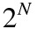

## Noise

Break time! We have been playing with all this random functions that looks like TV white noise, our head is still spinning around thinking on shaders, and our eyes are tired. Time to get out for a walk!

We feel the air in our face, the sun in our nose and chicks. The world is such a vivid and rich place. Colors, textures, sounds. While we walk we can't avoid noticing the surface of the roads, rocks, trees and clouds. We note the stochasticity of textures, there is random on nature. But definitely not the type of random we were making in the previus chapter. The “real world” is such a rich place. How we can approximate to this level of variety computationally?

We are on the same path of thoughts that Ken Perlin's walk through on 1982 when he was commissioned with the job of generating "more realistic" textures for a new disney movie call "Tron". In response to that he came up with an elegant *oscar winner* noise algorithm.

The following is not the clasic Perlin noise algorithm, but is a good starting point to understand how to generate *smooth random* aka *noise*.

In the following graph you will see what we were doing on the previus chapter, obtaining ```rand()``` numbers of the integers of the `x` position (assigning it to `i` variable), while we keep the [```fract()```](.../glossary/?search=fract) part of it (and storing it on the `f` variable).

<div class="simpleFunction" data="
float i = floor(x);  // integer
float f = fract(x);  // fraction
y = rand(i);
//y = mix(rand(i), rand(i + 1.0), f);
//y = mix(rand(i), rand(i + 1.0), smoothstep(0.,1.,f));
"></div>

You will see also, two commented lines. The first one interpolates linearly between the random value of the integer position and it next one.

```glsl
y = mix(rand(i), rand(i + 1.0), f);
``` 

Uncomment it an see how that looks. See how we use the [```fract()```](.../glossary/?search=fract) value store in `f` to [```mix()```](.../glossary/?search=mix) the two random values.

At this point on the book, we learned that we can do better than a linear interpolation. Right? 
The following commented line, will transfor the linear interpolation of `f` with a [```smoothstep()```](.../glossary/?search=smoothstep) interpolation.

```glsl
y = mix(rand(i), rand(i + 1.0), smoothstep(0.,1.,f));
```

Uncomment that line and notice how the transition between the peaks got smooth. On some noise implementations you will find that people that some programers prefere to code their own cubic curves (like the following formula) instead of using the [```smoothstep()```](.../glossary/?search=smoothstep).

```glsl
float u = f * f * (3.0 - 2.0 * f ); // custom cubic curve
y = mix(rand(i), rand(i + 1.0), u); // using it in the interpolation
```

The *smooth random* is a game changer for graphical coders, it provides the hability to generate images and geometries with an organic feeling. Perlin's Noise Algorithm have been reimplemented over and over in different lenguage and dimensions for all kind of uses to create all sort of mesmerizing pieces.


Now is your turn:

* Make your own ```float noise(float x)``` function.
* Use the noise funtion to animate a shape by moving it, rotating it or scaling it.
* Make an animated composition of several shapes 'dancing' together using noise.
* Construct "organic-looking" shapes using the noise function.
* Once you have your "creature", try to develop further this into a character by assigning it a particular movement.

## 2D Noise

Now that we know how to do noise in one dimension, is time to port it to two. For that instead of interpolating between two points (```fract(x)``` and ```fract(x)+1.0```) we are going to interpolate between the four coorners of square (```fract(st)```, ```fract(st)+vec2(1.,0.)```, ```fract(st)+vec2(0.,1.)``` and ```fract(st)+vec2(1.,1.)```). 

Take a look to the following 2D noise function, see how on line 32 we interpolate random values (lines 25-28) acording to the the position of ```st``` the four corners of the squared area.

<div class="codeAndCanvas" data="2d-noise.frag"></div>

To this 2D noise at line 41 we scale the space by 5 and "move" it acording to time. No try:

* Change the multiplier. Try to animate it.

* At what level of zoom the noise start looking like random again?

* At what zoom level the noise is imperceptible.

* Change the u_time by the normalize values of the mouse coordinates.

* What if we treat the gradient of the noise as a distance field? Make something interesing with it.

* Now that you achieve some control over order and chaos, is time to use that knowledge. Make a composition of rectangles, colors and noise that resemble some of the complexity of the texture of the following painting made by [Mark Rothko](http://en.wikipedia.org/wiki/Mark_Rothko).


## Using 2D Noise to rotate the space

As we saw, noise was designed to give a natural *je ne sais quoi* to digital textures, and could be use to make convincing generative textures. Lets refresh some of the previous knowledge and then jump forward learning how to mix all the knowledge we have learn so far. 

In the following code you will find:

* Shaping functions to create: random (line 13), noise (line 32) and a line pattern (line 46).
* A color gradient (line 68).
* A matrix to rotate the line pattern (line 37-40 and 45)
* A 2d random function (line 12-16)
* A 2d noise function (line 20-35) 

<div class="codeAndCanvas" data="wood.frag"></div>

By uncommenting line 60 you will see the line pattern we are talking about.
Revealing line 63 you can see how we can alternate this pattern in a "natural-like" way, to then finally, uncommenting line 66 we can stretch the noise pattern in *y* axis.

Wow! You really should be proud of your self. He have went from nothing to generating our own wood procedural texture!

Now is time for you to play with it:

* What do you thing it will happen if the patter looks like this:

```glsl
pattern = sin(lines(pos, noise(pos*vec2(2.,0.5)),0.5)*3.14);
```

Or like this

```glsl
pattern = fract(lines(pos, noise(pos*vec2(2.,0.5)),0.5)*2.0);
```

* What other generative pattern can you make? What about granite? marble? magma? water?
* What about noise apply to motion? Go back to the Matrix chapter and use the translation example that move a the "+" around to apply some *random* and *noise* movements to it.

Nothing like having some control over the chaos and chances. Right?
Noise is one of those subjects that you can dig and always find new exciting formulas. In fact, noise means different things for different people. Musicians will think in audio noise, communicators into interference, and astrophysics on cosmic microwave background. On the next chapter we will use some related concepts from sign and audio behavior to our noise function to explore more uses of noise.

## Simplex Noise

Ken Perlin though the success of his algorithm wasn't enough. He thought it could performance better. In Siggraph 2001 he presented the "simplex noise" in wich he achive the following improvements over the previus one:

* An algorithm with lower computational complexity and fewer multiplications.
* A noise that scales to higher dimensions with less computational cost.
* A noise without directional artifacts
* A noise with well-defined and continuous gradients that can be computed quite cheaply
* An algorithm that is easy to implemnt in hardware

Yeah, right? How he did that? Well we saw that for one dimension he was smoothly interpolating two points and for two dimensions he was interpolating 4 points (coorners of a square); also we can correctly preasume that for [three (see an implementation here)](../edit.html#11/3d-noise.frag) and four dimensions we need to interpolate 8 and 16 points. Right? In other words for N dimensions you need to smoothly interpolate 2 to the N points (2^N).



## Digital Jackson Pollock

# Voronoi Noise


