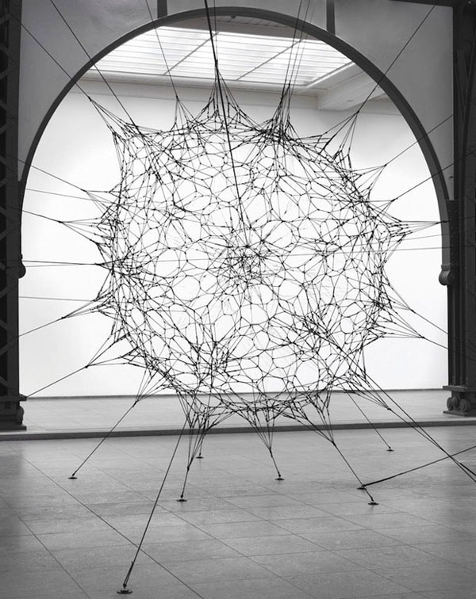

## Bruit Cellulaire
En 1996, seize ans après Le *Bruit de Perlin* et cinq ans avant le *Bruit Simplex*, [Steven Worley a publié un papier: “Une function pour les textures cellulaires”](http://www.rhythmiccanvas.com/research/papers/worley.pdf).
Il y décrit une technique de texture procédurale amplement utilisée de nos jours pas la communauté des développeurs graphiques.

Pour comprendre le principe qui sous-tend l'algorithme, nous devons réfléchir en termes d'itérations.

### Un champ de distances pour quelques points

Imaginons que nous voulions faire un champ de distance à quatre points.
De quoi aurions nous besoin? pour faire court, **pour chaque pixel, trouver la distance au point le plus proche**.
Ce qui signifie qu'il va nous falloir itérer sur tous les points et conserver la distance au point le plus proche.


```glsl
    float m_dist = 1.;  // distance minimun
    for (int i = 0; i < TOTAL_POINTS; i++) {
        float dist = distance(st, points[i]);
        m_dist = min(m_dist, dist);
    }
```

Pour ce faire, nous pouvons utiliser une boucle `for` pour itérer sur un tableau de points et conserver la distance minimum en nous servant de al fonction [```min()```](../glossary/?search=min).
Voci une implémentation sommaire:

<div class="codeAndCanvas" data="cellnoise-00.frag"></div>

Notez que dans l'exemple ci dessus, l'un des points utilise la position de la souris.
Jouez avec pour vous donner une meilleure idée de comment ça marche puis essayez ceci:

* Comment animer les reste des points?
* Après avoir lu le [chapitre sur les formes](../07/?lan=fr), imaginez des façons intéressantes d'utiliser un champ de distances.
* comment ajouter plus de points au champ de distances? que se passe-t'il si on souhaite ajouter/enlever des points dynamiqument?

### Pavage et itérations

vous avez sans doute remarqué que les boucles `for` et l'utilisation de *tableaux* n'est pas recommandée en GLSL.
Les boucles n'accpetent pas d'arguments dynamiques, itérer sur un grand nombre d'entrées ralentit considérablement l'exécution du shader, nous devons donc changer de stratégie.


Une façon d'aborder le problème est de diviser l'espace en *tuiles* (**tiles**) ou *cellules*.
Au fond, tous les pixels n'ont pas besoin de tester l'ensemble des points n'est ce pas?
Ils ont simplement besoin de vérifier les points qui sont proches d'eux.
C'est l'idée principale [de la publication de Steven Worley](http://www.rhythmiccanvas.com/research/papers/worley.pdf).
Nous avons déjà subdivisé l'espace en cellules au chapitres des [motifs](../09/?lan=fr), de [l'aléatoire](../10/?lan=fr) et du [bruit](../11/?lan=fr).
Vous devriez être un peu plus familier avec cette technique.

```glsl
    // échelle (nombre de cellules)
    st *= 3.;

    // variables utilisées pour paver le plan
    vec2 i_st = floor(st);
    vec2 f_st = fract(st);
```

Quel plan? nous allons nous servir des coordonnées des cellules (stockées dans la partie entières `i_st`) pour constuire la position de nos points.
La méthode ```random2f``` recevra un ```vec2``` et nous retournera un ```vec2```.
Donc chaque cellule contiendra un point à une position aléatoire dans la cellule.

```glsl
    vec2 point = random2(i_st);
```

A l'intérieur de chaque cellule, tous les fragments (à l'aide de la partie fractionelle de ```f_st```, `fract( st )` ) vont mesurer la distance à ce point.

```glsl
    vec2 diff = point - f_st;
    float dist = length(diff);
```

Ca ressemblera à:

<a href="../edit.php#12/cellnoise-01.frag"></img></a>

Nous devons également calculer la distance aux points des cellules adjacentes ;
en effet, il se pourrait que le point le plus proche du fragment en cours d'évaluation se trouves dans une cellule voisine.
Pour cela, nous allons itérer sur les cellules voisines, pas toutes les cellules, juste les cellules adjacentes.
Soit de ```-1``` (gauche) à ```1``` (droite) cellules en ```x``` et de ```-1``` (bas) à ```1``` (haut) en ```y```.
Ce qu'on appelle un *kernel de 3x3*, sur lequel on peut itérer grâce à deux boucles `for` imbriquées telle que celle-ci.

```glsl
for (int y= -1; y <= 1; y++) {
    for (int x= -1; x <= 1; x++) {
        // cellules voisines
        vec2 neighbor = vec2(float(x),float(y));
        ...
    }
}
```


Nous pouvons prévoir la position des points des cellules adjacentes en ajoutant les deltas `x` et `y` de la boucle `for` aux indices de la cellule courante.
On peut s'en servir pour calculer la position du point de la cellule en cours de traitement dans la boucle grâce à la méthode `random2()` décrite plus haut.

```glsl
        ...
        // Random position from current + neighbor place in the grid
        vec2 point = random2(i_st + neighbor);
        ...
```

Pour le reste, il suffit de calculer la distance entre ce point et le fragment et de conserver le minimu dans une variable ```m_dist``` (*minimal distance*).

```glsl
        ...
        vec2 diff = neighbor + point - f_st;

        // Distance au point
        float dist = length(diff);

        // conserve la distance la plus courte
        m_dist = min(m_dist, dist);
        ...
```

Le code ci-dessus s'inspire de cet [article d'Inigo Quilez](http://www.iquilezles.org/www/articles/smoothvoronoi/smoothvoronoi.htm) où il dit:

*"... it might be worth noting that there's a nice trick in this code above. Most implementations out there suffer from precision issues, because they generate their random points in "domain" space (like "world" or "object" space), which can be arbitrarily far from the origin. One can solve the issue moving all the code to higher precision data types, or by being a bit clever. My implementation does not generate the points in "domain" space, but in "cell" space: once the integer and fractional parts of the shading point are extracted and therefore the cell in which we are working identified, all we care about is what happens around this cell, meaning we can drop all the integer part of our coordinates away all together, saving many precision bits. In fact, in a regular voronoi implementation the integer parts of the point coordinates simply cancel out when the random per cell feature points are subtracted from the shading point. In the implementation above, we don't even let that cancelation happen, cause we are moving all the computations to "cell" space. This trick also allows one to handle the case where you want to voronoi-shade a whole planet - one could simply replace the input to be double precision, perform the floor() and fract() computations, and go floating point with the rest of the computations without paying the cost of changing the whole implementation to double precision. Of course, same trick applies to Perlin Noise patterns (but i've never seen it implemented nor documented anywhere)."*

En résumé: on subdivise l'espace en cellules, chaque fragment va calculer sa distance au point dans sa cellule ainsi qu'aux 8 cellules adjacentes et conserver la plus courte.
Le champ de distance final est visible dans l'exemple suivant:

<div class="codeAndCanvas" data="cellnoise-02.frag"></div>

Explorez en essayant les choses suivantes:

* Redimensionner l'espace avec différentes valeurs.
* Pouvez vous penser à d'autres manières d'animer les points?
* Comment pouvons ajouter un point supplémentaire comme la position de la souris?
* Quelles autres manières de construire ce champ de distance (à part `m_dist = min(m_dist, dist);`) vous viennent à l'esprit?
* Imaginez quelques motifs à faire avec ce champ de distanes?

Cet algorithme peut également être interprété du point de vue des points au lieu des pixels.
Dans ce cas, on peut le décrire comme: chaque point grossit jusqu'à ce qu'il recouvre le rayon d'un autre point.
Ce qui reflète certaines règles de croissance de la nature, les formes de vie sont formées par la tension entre une force intérieure d'expansion et des forces contraires venues de l'extérieur.
L'algorithm canonique de ce genre de formes a été trouvé par [Georgy Voronoi](https://en.wikipedia.org/wiki/Georgy_Voronoy) et porte maintenant son nom.


### L'algorithme de Voronoi

Construire un diagramme de Voronoi à partir d'un bruit cellulaire est plus simple qu'il n'y paraît.
Il nous faut simplement conserver certaines informations en plus ; nous allons conerver le point le plus proche dans un ```vec2``` appelé ```m_point```.

```glsl
    ...
    if( dist < m_dist ) {
        m_dist = dist;
        m_point = point;
    }
    ...
```

Notez que nous n'utilisons plus la fonction ```min``` pour conserver la distance au point le plus proche mais que nous nous servons d'une condition ```if```.
Pourquoi? Parce que nous avons besoin de modifier la référence au point le plus proche (```m_point```) à chaque fois qu'un point est plus proche que le précédent (lignes 32 à 37).

<div class="codeAndCanvas" data="vorono-00.frag"></div>

Notez également que la couleur de la cellule (branchée sur la position de la souris) change en fonction de sa position.
C'est parce que la couleur est déterminée par la valeur (la position) du point le plus proche.

Pour aller plus loin, nous pouvons à présent ré-utiliser l'algorithme de [Steven Worley](http://www.rhythmiccanvas.com/research/papers/worley.pdf).
Essayez de l'implémenter seul, vous pouvez vous appuyer sur l'exemple suivant en cliquant dessus.

<a href="../edit.php#12/vorono-01.frag"><canvas id="custom" class="canvas" data-fragment-url="vorono-01.frag"  width="520px" height="200px"></canvas></a>

Après quoi, vous pouvez réfléchir à des utilisations créatives de cet algorithme.
voici quelques pistes:





### Améliorer Voronoi

En 2011, [Stefan Gustavson a optimisé l'algorithme de Steven Worley sur le GPU](http://webstaff.itn.liu.se/~stegu/GLSL-cellular/GLSL-cellular-notes.pdf) en n'utilisant que des kernels de 2x2 au lieu de 3x3.
Cela amoindrit la charge de manière significative mais peut créer des artefacts et des discontinuités. Visibles dans l'exemple suivant:

<div class="glslGallery" data="12/2d-cnoise-2x2,12/2d-cnoise-2x2x2,12/2d-cnoise,12/3d-cnoise" data-properties="clickRun:editor,openFrameIcon:false"></div>

Plus tard, en 2012 [Inigo Quilez a écrit un article expliquant comment trouver des frontières précises](http://www.iquilezles.org/www/articles/voronoilines/voronoilines.htm).

<a href="../edit.php#12/2d-voronoi.frag"></img></a>

Inigio ne s'est pas arrété là et en 2014, il a écrit un article sur ce qu'il a appelé le [voro-noise](http://www.iquilezles.org/www/articles/voronoise/voronoise.htm) ; une exploration combinant bruit et cellules de Voronoi.
Je cite:

*"Despite this similarity, the fact is that the way the grid is used in both patterns is different. Noise interpolates/averages random values (as in value noise) or gradients (as in gradient noise), while Voronoi computes the distance to the closest feature point. Now, smooth-bilinear interpolation and minimum evaluation are two very different operations, or... are they? Can they perhaps be combined in a more general metric? If that was so, then both Noise and Voronoi patterns could be seen as particular cases of a more general grid-based pattern generator?"*

<a href="../edit.php#12/2d-voronoise.frag"><canvas id="custom" class="canvas" data-fragment-url="2d-voronoise.frag"  width="520px" height="200px"></canvas></a>

Il est temps de revenir à la nature, d'être inspiré par elle et de trouver votre propre voie au travers de cette technique.


<div class="glslGallery" data="12/metaballs,12/stippling,12/cell,12/tissue,12/cracks,160504143842" data-properties="clickRun:editor,openFrameIcon:false"></div>
