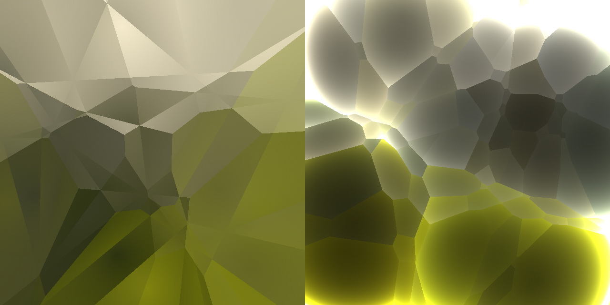

## Cellular Noise

W 1996 roku, szesnaście lat po oryginalnym Noise Perlina i pięć lat przed jego Simplex Noise, [Steven Worley napisał pracę zatytułowaną "A Cellular Texture Basis Function"](http://www.rhythmiccanvas.com/research/papers/worley.pdf). Opisuje w niej technikę teksturowania proceduralnego, która jest obecnie szeroko stosowana przez społeczność grafików.

Aby zrozumieć jej zasady, musimy zacząć myśleć w kategoriach **iteracji**. Zapewne wiesz, co to oznacza: tak, zacznij używać pętli ``for``. Jest tylko jeden haczyk z pętlami ``for`` w GLSL: liczba, którą sprawdzamy musi być stałą (``const``). Tak więc nie ma dynamicznych pętli - liczba iteracji musi być stała.

Przyjrzyjmy się przykładowi.

<!-- In 1996, sixteen years after Perlin's original Noise and five years before his Simplex Noise, [Steven Worley wrote a paper called  “A Cellular Texture Basis Function”](http://www.rhythmiccanvas.com/research/papers/worley.pdf). In it, he describes a procedural texturing technique now extensively used by the graphics community.

To understand the principles behind it we need to start thinking in terms of **iterations**. Probably you know what that means: yes, start using ```for``` loops. There is only one catch with ```for``` loops in GLSL: the number we are checking against must be a constant (```const```). So, no dynamic loops - the number of iterations must be fixed.

Let's take a look at an example. -->

### Points for a distance field

Hałas komórkowy opiera się na polach odległości, czyli odległości do najbliższego ze zbioru punktów charakterystycznych. Załóżmy, że chcemy stworzyć pole odległości składające się z 4 punktów. Co musimy zrobić? Cóż, **dla każdego piksela chcemy obliczyć odległość do najbliższego punktu**. Oznacza to, że musimy iterować po wszystkich punktach, obliczać ich odległości do bieżącego piksela i przechowywać wartość dla tego, który jest najbliższy.

<!-- Cellular Noise is based on distance fields, the distance to the closest one of a set of feature points. Let's say we want to make a distance field of 4 points. What do we need to do? Well, **for each pixel we want to calculate the distance to the closest point**. That means that we need to iterate through all the points, compute their distances to the current pixel and store the value for the one that is closest. -->

```glsl
    float min_dist = 100.; // A variable to store the closest distance to a point

    min_dist = min(min_dist, distance(st, point_a));
    min_dist = min(min_dist, distance(st, point_b));
    min_dist = min(min_dist, distance(st, point_c));
    min_dist = min(min_dist, distance(st, point_d));
```


Nie jest to zbyt eleganckie, ale załatwia sprawę. Teraz zaimplementujmy go ponownie, używając tablicy i pętli ``for``.

<!-- This is not very elegant, but it does the trick. Now let's re-implement it using an array and a ```for``` loop. -->

```glsl
    float m_dist = 100.;  // minimum distance
    for (int i = 0; i < TOTAL_POINTS; i++) {
        float dist = distance(st, points[i]);
        m_dist = min(m_dist, dist);
    }
```

Zauważ, jak używamy pętli ``for`` do iteracji przez tablicę punktów i śledzenia minimalnej odległości za pomocą funkcji [``min()``](../glossary/?search=min). Oto krótka działająca implementacja tego pomysłu:

<!-- Note how we use a ```for``` loop to iterate through an array of points and keep track of the minimum distance using a [```min()```](../glossary/?search=min) function. Here's a brief working implementation of this idea: -->

<div class="codeAndCanvas" data="cellnoise-00.frag"></div>

W powyższym kodzie jeden z punktów jest przypisany do pozycji myszy. Pobaw się nim, abyś mógł intuicyjnie zorientować się, jak zachowuje się ten kod. Następnie spróbuj tego:

- Jak można animować pozostałe punkty?
- Po przeczytaniu [rozdziału o kształtach](../07/), wyobraź sobie ciekawe sposoby wykorzystania tego pola odległości!
- Co, jeśli chcemy dodać więcej punktów do tego pola odległości? Co jeśli chcemy dynamicznie dodawać/odejmować punkty?

<!-- In the above code, one of the points is assigned to the mouse position. Play with it so you can get an intuitive idea of how this code behaves. Then try this:

- How can you animate the rest of the points?
- After reading [the chapter about shapes](../07/), imagine interesting ways to use this distance field!
- What if you want to add more points to this distance field? What if we want to dynamically add/subtract points? -->

### Tiling and iteration

Zapewne zauważyłeś, że pętle ``for`` i *arrays* nie są zbyt dobrymi przyjaciółmi GLSL. Jak już wspomnieliśmy, pętle nie akceptują dynamicznych ograniczeń na ich warunek wyjścia. Ponadto, iteracja przez wiele instancji znacznie zmniejsza wydajność twojego shadera. Oznacza to, że nie możemy użyć tego bezpośredniego podejścia dla dużych ilości punktów. Musimy znaleźć inną strategię, taką, która wykorzystuje architekturę przetwarzania równoległego GPU.

<!-- You probably notice that ```for``` loops and *arrays* are not very good friends with GLSL. Like we said before, loops don't accept dynamic limits on their exit condition. Also, iterating through a lot of instances reduces the performance of your shader significantly. That means we can't use this direct approach for large amounts of points. We need to find another strategy, one that takes advantage of the parallel processing architecture of the GPU. -->


Jednym ze sposobów podejścia do tego problemu jest podzielenie przestrzeni na płytki. Nie każdy piksel musi sprawdzać odległość do każdego punktu, prawda? Biorąc pod uwagę fakt, że każdy piksel działa w swoim własnym wątku, możemy podzielić przestrzeń na komórki, z których każda ma jeden unikalny punkt do oglądania. Ponadto, aby uniknąć aberracji na krawędziach między komórkami musimy sprawdzić odległości do punktów na sąsiednich komórkach. To jest główna idea brillant [Steven Worley's paper](http://www.rhythmiccanvas.com/research/papers/worley.pdf). Na koniec każdy piksel musi sprawdzić tylko dziewięć pozycji: punkt własnej komórki i punkty w 8 komórkach wokół niego. Przestrzeń na komórki dzielimy już w rozdziałach o: [wzorach](../09/), [losowości](../10/) i [szumie](../11/), więc mam nadzieję, że jesteś już zaznajomiony z tą techniką.

<!-- One way to approach this problem is to divide the space into tiles. Not every pixel needs to check the distance to every single point, right? Given the fact that each pixel runs in its own thread, we can subdivide the space into cells, each one with one unique point to watch. Also, to avoid aberrations at the edges between cells we need to check for the distances to the points on the neighboring cells. That's the main brillant idea of [Steven Worley's paper](http://www.rhythmiccanvas.com/research/papers/worley.pdf). At the end, each pixel needs to check only nine positions: their own cell's point and the points in the 8 cells around it. We already subdivide the space into cells in the chapters about: [patterns](../09/), [random](../10/) and [noise](../11/), so hopefully you are familiar with this technique by now. -->

```glsl
    // Scale
    st *= 3.;

    // Tile the space
    vec2 i_st = floor(st);
    vec2 f_st = fract(st);
```

Jaki jest więc plan? Użyjemy współrzędnych kafla (przechowywanych we współrzędnej całkowitej, ``i_st``) do skonstruowania losowej pozycji punktu. Funkcja ``random2f``, której użyjemy, otrzymuje ``vec2`` i daje nam ``vec2`` z losową pozycją. Tak więc, dla każdego kafla będziemy mieli jeden punkt charakterystyczny w losowej pozycji w obrębie kafla.

<!-- So, what's the plan? We will use the tile coordinates (stored in the integer coordinate, ```i_st```) to construct a random position of a point. The ```random2f``` function we will use receives a ```vec2``` and gives us a ```vec2``` with a random position. So, for each tile we will have one feature point in a random position within the tile. -->

```glsl
    vec2 point = random2(i_st);
```

Każdy piksel wewnątrz tego kafla (przechowywany we współrzędnej float, ``f_st``) sprawdzi swoją odległość do tego losowego punktu.

<!-- Each pixel inside that tile (stored in the float coordinate, ```f_st```) will check their distance to that random point. -->

```glsl
    vec2 diff = point - f_st;
    float dist = length(diff);
```

Wynik będzie wyglądał tak:

<!-- The result will look like this: -->

<a href="../edit.php#12/cellnoise-01.frag"></img></a>

Nadal musimy sprawdzać odległości do punktów w okolicznych kaflach, a nie tylko do tego w bieżącym kaflu. W tym celu musimy **iterować** po sąsiednich kaflach. Nie wszystkie kafle, tylko te bezpośrednio otaczające bieżący. Czyli od ``-1`` (lewy) do ``1`` (prawy) kafla w osi ``x`` oraz od ``-1`` (dolny) do ``1`` (górny) w osi ``y``. Region 3x3 składający się z 9 płytek może być iterowany przy użyciu podwójnej pętli ``for``, jak ta:

<!-- We still need to check the distances to the points in the surrounding tiles, not just the one in the current tile. For that we need to **iterate** through the neighbor tiles. Not all tiles, just the ones immediately around the current one. That means from ```-1``` (left) to ```1``` (right) tile in ```x``` axis and ```-1``` (bottom) to ```1``` (top) in ```y``` axis. A 3x3 region of 9 tiles can be iterated through using a double ```for``` loop like this one: -->

```glsl
for (int y= -1; y <= 1; y++) {
    for (int x= -1; x <= 1; x++) {
        // Neighbor place in the grid
        vec2 neighbor = vec2(float(x),float(y));
        ...
    }
}
```


Teraz możemy obliczyć położenie punktów na każdym z sąsiadów w naszej podwójnej pętli ``for``, dodając przesunięcie sąsiedniego kafla do bieżącej współrzędnej kafla.

<!-- Now, we can compute the position of the points on each one of the neighbors in our double ```for``` loop by adding the neighbor tile offset to the current tile coordinate. -->

```glsl
        ...
        // Random position from current + neighbor place in the grid
        vec2 point = random2(i_st + neighbor);
        ...
```

Reszta polega na obliczeniu odległości do tego punktu i zapisaniu najbliższego w zmiennej o nazwie ``m_dist`` (dla minimalnej odległości).

<!-- The rest is all about calculating the distance to that point and storing the closest one in a variable called ```m_dist``` (for minimum distance). -->

```glsl
        ...
        vec2 diff = neighbor + point - f_st;

        // Distance to the point
        float dist = length(diff);

        // Keep the closer distance
        m_dist = min(m_dist, dist);
        ...
```

Powyższy kod jest inspirowany przez [ten artykuł Inigo's Quilez](http://www.iquilezles.org/www/articles/smoothvoronoi/smoothvoronoi.htm), gdzie powiedział:

*"... może warto zauważyć, że w tym kodzie powyżej jest ładna sztuczka. Większość implementacji cierpi z powodu problemów z precyzją, ponieważ generują swoje losowe punkty w przestrzeni "domeny" (jak przestrzeń "świata" lub "obiektu"), która może być dowolnie daleko od pochodzenia. Można rozwiązać ten problem przenosząc cały kod do typów danych o wyższej precyzji, lub będąc nieco sprytnym. Moja implementacja nie generuje punktów w przestrzeni "domeny", ale w przestrzeni "komórki": po wyodrębnieniu części całkowitych i ułamkowych punktu cieniowania, a zatem zidentyfikowaniu komórki, w której pracujemy, wszystko, co nas obchodzi, to to, co dzieje się wokół tej komórki, co oznacza, że możemy porzucić wszystkie całkowite części naszych współrzędnych, oszczędzając wiele bitów precyzji. W rzeczywistości, w zwykłej implementacji voronoi, całkowite części współrzędnych punktów po prostu znoszą się, gdy losowe punkty charakterystyczne na komórkę są odejmowane od punktu cieniowania. W powyższej implementacji nie pozwalamy nawet na to anulowanie, ponieważ przenosimy wszystkie obliczenia do przestrzeni "komórek". Ta sztuczka pozwala także na obsługę przypadku, gdy chcemy voronoi-shade'ować całą planetę - można po prostu zamienić dane wejściowe na podwójną precyzję, wykonać obliczenia floor() i fract(), a z resztą obliczeń przejść na zmiennoprzecinkowe bez ponoszenia kosztów zmiany całej implementacji na podwójną precyzję. Oczywiście, ta sama sztuczka dotyczy wzorców Perlin Noise (ale nigdy nie widziałem tego zaimplementowanego ani udokumentowanego gdziekolwiek). "*

<!-- The above code is inspired by [this article by Inigo's Quilez](http://www.iquilezles.org/www/articles/smoothvoronoi/smoothvoronoi.htm) where he said:

*"... it might be worth noting that there's a nice trick in this code above. Most implementations out there suffer from precision issues, because they generate their random points in "domain" space (like "world" or "object" space), which can be arbitrarily far from the origin. One can solve the issue moving all the code to higher precision data types, or by being a bit clever. My implementation does not generate the points in "domain" space, but in "cell" space: once the integer and fractional parts of the shading point are extracted and therefore the cell in which we are working identified, all we care about is what happens around this cell, meaning we can drop all the integer part of our coordinates away all together, saving many precision bits. In fact, in a regular voronoi implementation the integer parts of the point coordinates simply cancel out when the random per cell feature points are subtracted from the shading point. In the implementation above, we don't even let that cancelation happen, cause we are moving all the computations to "cell" space. This trick also allows one to handle the case where you want to voronoi-shade a whole planet - one could simply replace the input to be double precision, perform the floor() and fract() computations, and go floating point with the rest of the computations without paying the cost of changing the whole implementation to double precision. Of course, same trick applies to Perlin Noise patterns (but i've never seen it implemented nor documented anywhere)."* -->

Rekapitulacja: dzielimy przestrzeń na kafelki; każdy piksel obliczy odległość do punktu w swoim własnym kafelku i otaczających go 8 kafelków; przechowuj najbliższą odległość. Wynikiem jest pole odległości, które wygląda jak w poniższym przykładzie:

<!-- Recapping: we subdivide the space into tiles; each pixel will calculate the distance to the point in their own tile and the surrounding 8 tiles; store the closest distance. The result is a distance field that looks like the following example: -->

<div class="codeAndCanvas" data="cellnoise-02.frag"></div>

Eksploruj to dalej przez:

- Skalowanie przestrzeni o różne wartości.
- Czy możesz wymyślić inne sposoby animacji punktów?
- Co jeśli chcemy obliczyć dodatkowy punkt z pozycji myszy?
- Jakie inne sposoby konstruowania tego pola odległości możesz sobie wyobrazić, poza ``m_dist = min(m_dist, dist);``?
- Jakie ciekawe wzory można stworzyć za pomocą tego pola odległości?

<!-- Explore this further by:

- Scaling the space by different values.
- Can you think of other ways to animate the points?
- What if we want to compute an extra point with the mouse position?
- What other ways of constructing this distance field can you imagine, besides ```m_dist = min(m_dist, dist);```?
- What interesting patterns can you make with this distance field? -->

Algorytm ten można również interpretować z perspektywy punktów, a nie pikseli. W takim przypadku można go opisać jako: każdy punkt rośnie, dopóki nie znajdzie rosnącego obszaru z innego punktu. Odzwierciedla to niektóre z zasad wzrostu w naturze. Żywe formy są kształtowane przez to napięcie pomiędzy wewnętrzną siłą do rozszerzania się i wzrostu, a ograniczeniami przez siły zewnętrzne. Klasyczny algorytm symulujący to zachowanie nosi nazwę [Georgy Voronoi](https://en.wikipedia.org/wiki/Georgy_Voronoy).

<!-- This algorithm can also be interpreted from the perspective of the points and not the pixels. In that case it can be described as: each point grows until it finds the growing area from another point. This mirrors some of the growth rules in nature. Living forms are shaped by this tension between an inner force to expand and grow, and limitations by outside forces. The classic algorithm that simulates this behavior is named after [Georgy Voronoi](https://en.wikipedia.org/wiki/Georgy_Voronoy). -->


### Voronoi Algorithm

Konstruowanie diagramów Voronoi z szumu komórkowego jest mniej trudne niż mogłoby się wydawać. Musimy tylko *zachować* pewną dodatkową informację o dokładnym punkcie, który jest najbliżej piksela. Do tego celu użyjemy ``vec2`` o nazwie ``m_point``. Przechowując kierunek wektora do środka najbliższego punktu, zamiast tylko odległości, będziemy "przechowywać" "unikalny" identyfikator tego punktu.

<!-- Constructing Voronoi diagrams from cellular noise is less hard than what it might seem. We just need to *keep* some extra information about the precise point which is closest to the pixel. For that we are going to use a ```vec2``` called ```m_point```. By storing the vector direction to the center of the closest point, instead of just the distance, we will be "keeping" a "unique" identifier of that point. -->

```glsl
    ...
    if( dist < m_dist ) {
        m_dist = dist;
        m_point = point;
    }
    ...
```

Zauważ, że w poniższym kodzie nie używamy już ``min`` do obliczania najbliższej odległości, ale zwykłej deklaracji ``if``. Dlaczego? Ponieważ tak naprawdę chcemy zrobić coś więcej za każdym razem, gdy pojawi się nowy bliższy punkt, a mianowicie zapisać jego pozycję (linie 32 do 37).

<!-- Note that in the following code that we are no longer using ```min``` to calculate the closest distance, but a regular ```if``` statement. Why? Because we actually want to do something more every time a new closer point appears, namely store its position (lines 32 to 37). -->

<div class="codeAndCanvas" data="vorono-00.frag"></div>

Zauważ, jak kolor komórki ruchomej (związanej z pozycją myszy) zmienia kolor w zależności od jej położenia. To dlatego, że kolor jest przypisywany przy użyciu wartości (pozycji) najbliższego punktu.

Tak jak zrobiliśmy to wcześniej, teraz nadszedł czas, aby to przeskalować, przechodząc na podejście [Steven Worley's paper's approach](http://www.rhythmiccanvas.com/research/papers/worley.pdf). Spróbuj zaimplementować to samodzielnie. Możesz skorzystać z pomocy poniższego przykładu, klikając na niego. Zauważ, że oryginalne podejście Stevena Worleya używa zmiennej liczby punktów cech dla każdego kafla, więcej niż jeden w większości kafli. W jego implementacji programowej w C, jest to używane do przyspieszenia pętli poprzez wykonanie wczesnych wyjść. Pętle GLSL nie pozwalają na zmienną liczbę iteracji, więc prawdopodobnie chcesz trzymać się jednego punktu charakterystycznego na kafel.

<!-- Note how the color of the moving cell (bound to the mouse position) changes color according to its position. That's because the color is assigned using the value (position) of the closest point.

Like we did before, now is the time to scale this up, switching to [Steven Worley's paper's approach](http://www.rhythmiccanvas.com/research/papers/worley.pdf). Try implementing it yourself. You can use the help of the following example by clicking on it. Note that Steven Worley's original approach uses a variable number of feature points for each tile, more than one in most tiles. In his software implementation in C, this is used to speed up the loop by making early exits. GLSL loops don't allow variable number of iterations, so you probably want to stick to one feature point per tile. -->

<a href="../edit.php#12/vorono-01.frag"><canvas id="custom" class="canvas" data-fragment-url="vorono-01.frag"  width="520px" height="200px"></canvas></a>

Gdy już rozgryziesz ten algorytm, pomyśl o ciekawych i kreatywnych jego zastosowaniach.

<!-- Once you figure out this algorithm, think of interesting and creative uses for it. -->




### Improving Voronoi

W 2011 roku [Stefan Gustavson zoptymalizował algorytm Stevena Worleya dla GPU](http://webstaff.itn.liu.se/~stegu/GLSL-cellular/GLSL-cellular-notes.pdf), wykonując iterację tylko przez macierz 2x2 zamiast 3x3. To znacznie zmniejsza ilość pracy, ale może tworzyć artefakty w postaci nieciągłości na krawędziach między płytkami. Przyjrzyj się poniższym przykładom.

<!-- In 2011, [Stefan Gustavson optimized Steven Worley's algorithm to GPU](http://webstaff.itn.liu.se/~stegu/GLSL-cellular/GLSL-cellular-notes.pdf) by only iterating through a 2x2 matrix instead of 3x3. This reduces the amount of work significantly, but it can create artifacts in the form of discontinuities at the edges between the tiles. Take a look to the following examples. -->

<div class="glslGallery" data="12/2d-cnoise-2x2,12/2d-cnoise-2x2x2,12/2d-cnoise,12/3d-cnoise" data-properties="clickRun:editor,openFrameIcon:false"></div>

Później w 2012 roku [Inigo Quilez napisał artykuł o tym, jak zrobić precyzyjne granice Voronoi](http://www.iquilezles.org/www/articles/voronoilines/voronoilines.htm).

<!-- Later in 2012 [Inigo Quilez wrote an article on how to make precise Voronoi borders](http://www.iquilezles.org/www/articles/voronoilines/voronoilines.htm). -->

<a href="../edit.php#12/2d-voronoi.frag"></img></a>

Eksperymenty Inigo z Voronoi nie skończyły się na tym. W 2014 roku napisał ten ładny artykuł o tym, co nazywa [voro-noise](http://www.iquilezles.org/www/articles/voronoise/voronoise.htm), funkcją, która pozwala na stopniowe mieszanie się między zwykłym szumem a voronoi. Jego słowami:

*"Pomimo tego podobieństwa, faktem jest, że sposób użycia siatki w obu wzorach jest inny. Szum interpoluje/uśrednia wartości losowe (jak w szumie wartościowym) lub gradienty (jak w szumie gradientowym), podczas gdy Voronoi oblicza odległość do najbliższego punktu charakterystycznego. Teraz, interpolacja gładko-biliniowa i ocena minimalna to dwie bardzo różne operacje, czy... są? Czy być może można je połączyć w bardziej ogólną metrykę? Gdyby tak było, to zarówno Szum jak i Wzory Voronoi mogłyby być postrzegane jako szczególne przypadki bardziej ogólnego generatora wzorów opartego na siatce? "*.

<!-- Inigo's experiments with Voronoi didn't stop there. In 2014 he wrote this nice article about what he calls [voro-noise](http://www.iquilezles.org/www/articles/voronoise/voronoise.htm), a function that allows a gradual blend between regular noise and voronoi. In his words:

*"Despite this similarity, the fact is that the way the grid is used in both patterns is different. Noise interpolates/averages random values (as in value noise) or gradients (as in gradient noise), while Voronoi computes the distance to the closest feature point. Now, smooth-bilinear interpolation and minimum evaluation are two very different operations, or... are they? Can they perhaps be combined in a more general metric? If that was so, then both Noise and Voronoi patterns could be seen as particular cases of a more general grid-based pattern generator?"* -->

<a href="../edit.php#12/2d-voronoise.frag"><canvas id="custom" class="canvas" data-fragment-url="2d-voronoise.frag"  width="520px" height="200px"></canvas></a>

Teraz nadszedł czas, abyś przyjrzał się bliżej rzeczom, zainspirował się naturą i znalazł swoje własne ujęcie tej techniki!

<!-- Now it's time for you to look closely at things, be inspired by nature and find your own take on this technique! -->


<div class="glslGallery" data="12/metaballs,12/stippling,12/cell,12/tissue,12/cracks,160504143842" data-properties="clickRun:editor,openFrameIcon:false"></div>
