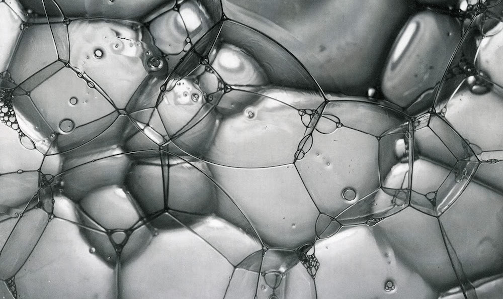
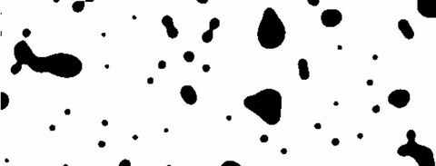

## Celluar Noise

In 1996, sixting years after Perlin's Noise and five years before his Simplex Noise, [Steven Worley wrote a paper call  “A Cellular Texture Basis Function”](http://www.rhythmiccanvas.com/research/papers/worley.pdf). In it he describes a procedural texturing tecnique now extensively use by the graphics community.

Later in 2011, [Stefan Gustavson optimized for GPU](http://webstaff.itn.liu.se/~stegu/GLSL-cellular/GLSL-cellular-notes.pdf) becoming a powerfull tools to produce textures that looks and feel like organic tissue.

To learn more about this technique we need to be confortable working with iterations.

### A distance field for some points

Let's say we want to make a distance field of 4 points. What we need to do? in a nutshell, for each pixel we want to calculate the distance to the closest point. That means that we need to iterate throught all the points and store the value to the most close one.


```glsl
    float m_dist = 1.;  // minimun distance
    for (int i = 0; i < TOTAL_POINTS; i++) {
        float dist = distance(st, points[i]);
        m_dist = min(m_dist, dist);
    }
```

To do that we can use a ```for``` loop to iterate through an array of points and keep track of the minimum distance using a [```min()```](../glossary/?search=min) function. Here a brief implementation of that:

<div class="codeAndCanvas" data="cellnoise-00.frag"></div>

Note in the above code, that one of the points is the mouse position. Play with it so you can get a more intuitive idea of how this code behaves. Then try this:

- How can you animate the rest of the points?
- After reading [the chapter about shapes](../07/), imagine interesting ways to use this distance field?
- What if you want to add more points to this distance field? What if we want to dynamically add/substract points?

### Tiling and iterating

You probably notice that ```for``` loops and *arrays* are not so friendly in GLSL. Loops don't accept dynamic limits on their condition. Also iterating through a lot of instances reduce the performance of your shader significantly. So... We need to find another stratergy.


One way to aproach this problem is to divide the space in tiles. Not every pixel need to check every single points, right? They just need to check the points that are close to them. That's the main idea of [Steven Worley's paper](http://www.rhythmiccanvas.com/research/papers/worley.pdf). We already subdivide the space into cells in the chapters about: [patterns](../09/), [random](../10/) and [noise](../11/). Hopefully by now you are familiarize with this technique.

```glsl
    // Scale 
    st *= 3.;
    
    // Tile the space
    vec2 i_st = floor(st);
    vec2 f_st = fract(st);
```

So what's the plan? We will use the tile coordinates (stored in the integer coordinate, ```i_st```) to construct a random position of a point. The ```random2f``` function we will use recive a ```vec2``` and give us a ```vec2``` with a random position. So for each tile we will have one point in a random position.

```glsl
    vec2 point = random2(i_st);
```

Each pixel inside that tile (stored in the float coordinate, ```f_st```) will check their distance to that random point. 

```glsl
    vec2 diff = point - f_st;
    float dist = length(diff);
```

This will look like this:

<a href="../edit.html#12/cellnoise-01.frag"></img></a> 

We still need to calculate the points around each pixel. Not just the one in the current tile. For that we need to **iterate** through the neighbor tiles. Not all of them. just the one inmediatly arround it. That means from ```-1``` (left) to ```1``` (right) tile in ```x``` axis and ```-1``` (bottom) to ```1``` (top) in ```y``` axis. A 3x3 kernel of 9 tiles that we can iterate using a double ```for``` loop like this one:

```glsl
for (int y= -1; y <= 1; y++) {
    for (int x= -1; x <= 1; x++) {
        // Neighbor place in the grid
        vec2 neighbor = vec2(float(x),float(y));
        ...
    }
}
```


Now, we can predict the position of the points on each one of the neightbors in our double ```for``` loop by adding the neighboor tile offset to the current tile coordinate.

```glsl
        ...
        // Random position from current + neighbor place in the grid
        vec2 point = random2(i_st + neighbor);
        ...
```

The rest is all about calculating the distance to that point and store the closest one in a variable call ```m_dist``` (for minimal distance).

```glsl
        ...
        vec2 diff = neighbor + point - f_st;
        
        // Distance to the point
        float dist = length(diff);

        // Keep the closer distance
        m_dist = min(m_dist, dist);
        ...
```

The above code is inspired by [this Inigo's Quilez article](http://www.iquilezles.org/www/articles/smoothvoronoi/smoothvoronoi.htm) where he said:

*"... it might be worth noting that there's a nice trick in this code above. Most implementations out there suffer from precission issues, because they generate their random points in "domain" space (like "world" or "object" space), which can be arbitrarily far from the origin. One can solve the issue moving all the code to higher precission data types, or by being a bit clever. My implementation does not generate the points in "domain" space, but in "cell" space: once the integer and fractioanl parts of the shading point are extracted and therefore the cell in which we are working identified, all we care about is what happens around this cell, meaning we can drop all the integer part of our coordinates away all together, saving many precision bits. In fact, in a regular voronoi implementation the integer parts of the point coordinates simply cancel out when the random per cell feature points are substracted from the shading point. In the implementation above, we don't even let that cancelation happen, cause we are moving all the computations to "cell" space. This trick also allows one to handle the case where you want to voronoi-shade a whole planet - one could simply replace the input to be double precission, perform the floor() and fract() computations, and go floating point with the rest of the computations without paying the cost of changing the whole implementation to double precission. Of course, same trick applies to Perlin Noise patterns (but i've never seen it implemented nor documented anywhere)."*

Recaping: we subdivide the space in tiles; each pixel will calculate the distance to the point in their own tile and the other 8 tiles; store the closest distance. The resultant is distance field that looks like the following example:

<div class="codeAndCanvas" data="cellnoise-02.frag"></div>

Explore by:

- Scaling the space by different values.
- Can you think in other ways to animate the points?
- What if we want to compute an extra point with the mouse position?
- What other ways of constructing this distance field beside ```m_dist = min(m_dist, dist);```, can you imagine?
- What interesting patterns you can make with this distance field?
- Try to replicate this:



<a href="../edit.html#12/metaballs.frag"></img></a> 

This algorithm can also be interpreted from the perspective of the points and not the pixels. In that case it can be describe as: each point grows until it finds the area of another point. Which mirrors some of the grow rules on nature. Living forms are shaped by this tension between an inner force to expand and grow limited by the forces 
on their medium. The clasic algorithm that simulate this begaviur is named after [Georgy Voronoi](https://en.wikipedia.org/wiki/Georgy_Voronoy).


### Voronoi Algorithm

<div class="codeAndCanvas" data="vorono-00.frag"></div>

This is not scalable

<div class="codeAndCanvas" data="vorono-01.frag"></div>

[Inigo Quilez voronoi borders article](http://www.iquilezles.org/www/articles/voronoilines/voronoilines.htm)

<a href="../edit.html#12/2d-voronoi.frag"></img></a> 
 


[Inigo Quilez article about voronoise](http://www.iquilezles.org/www/articles/voronoise/voronoise.htm)
<a href="../edit.html#12/2d-voronoise.frag"><canvas id="custom" class="canvas" data-fragment-url="2d-voronoise.frag"  width="520px" height="200px"></canvas></a> 


