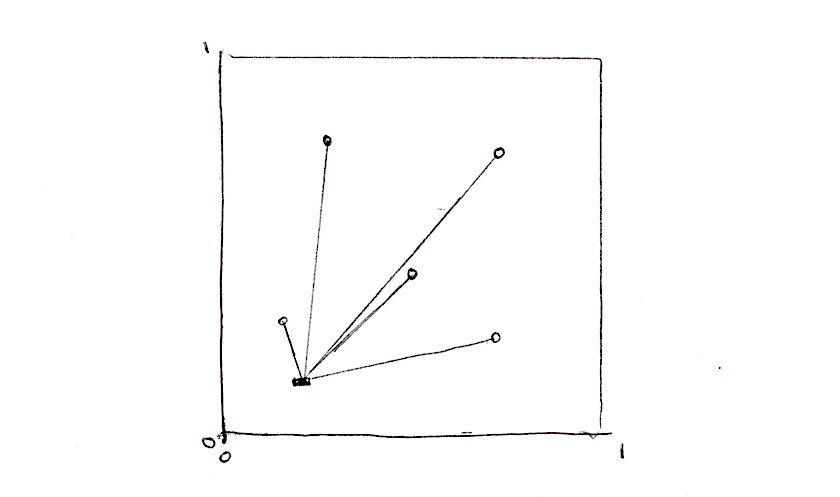
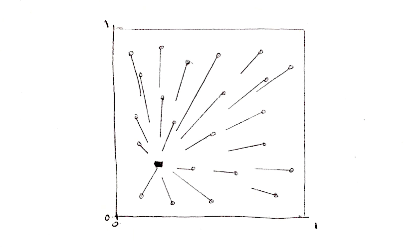
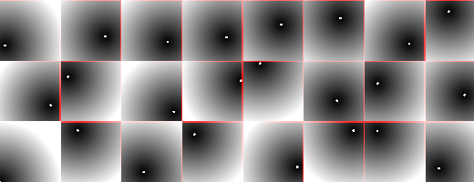
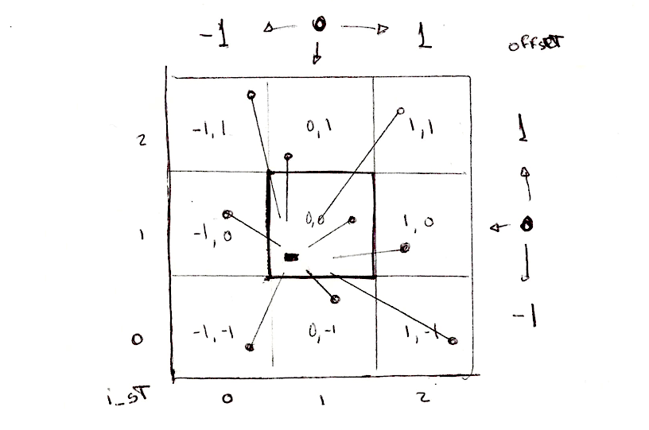
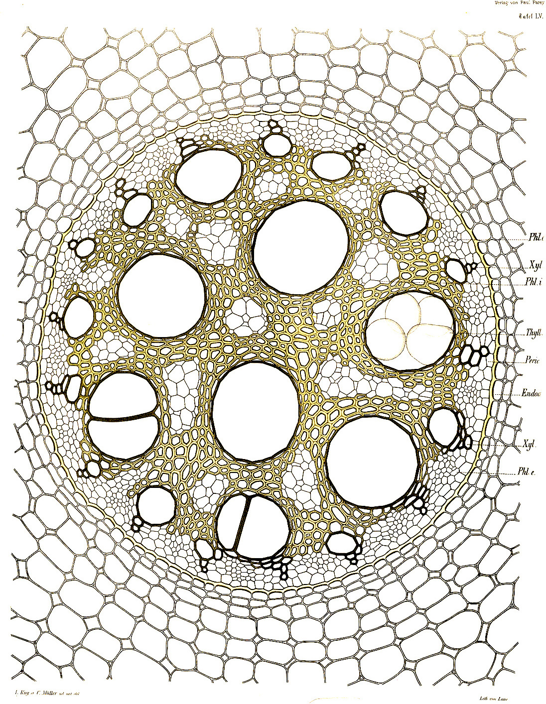
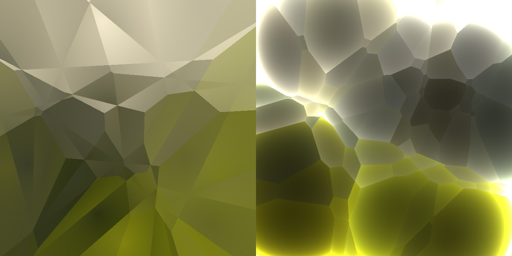
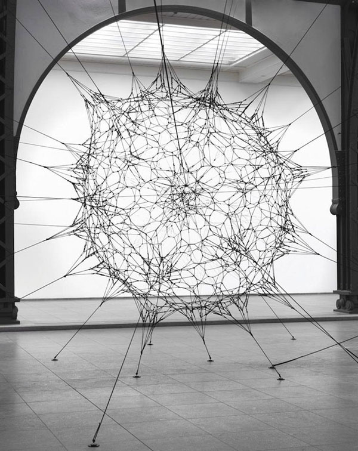
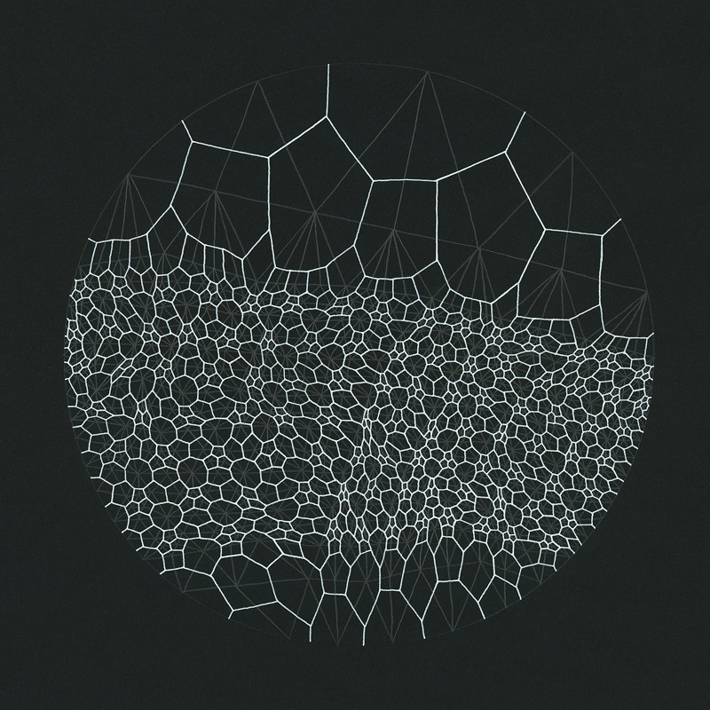
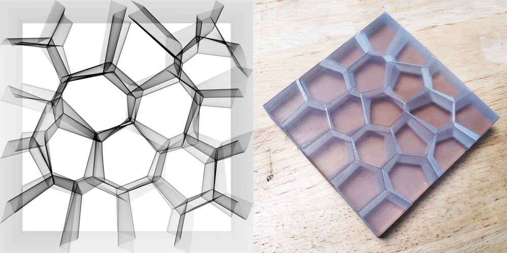
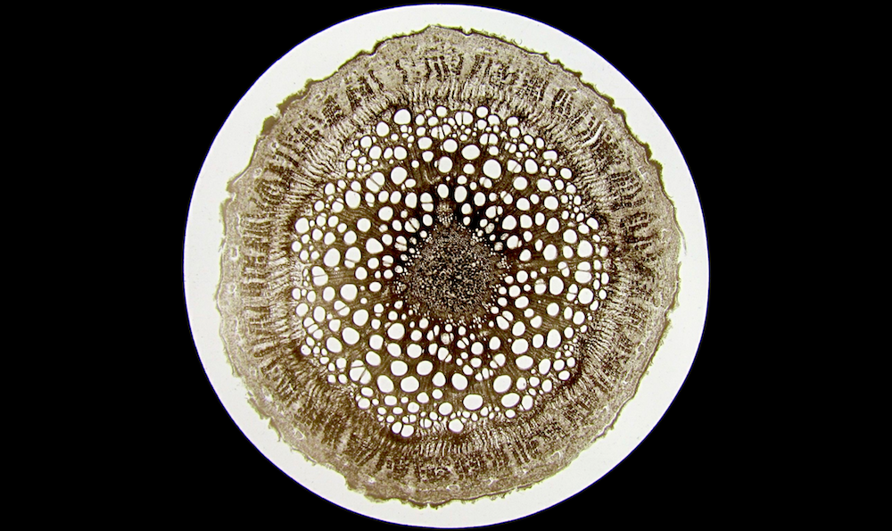

## Cellular Noise

In 1996, sixteen years after Perlin's Noise and five years before his Simplex Noise, [Steven Worley wrote a paper call  “A Cellular Texture Basis Function”](http://www.rhythmiccanvas.com/research/papers/worley.pdf). In it he describes a procedural texturing technique now extensively use by the graphics community.

To understand the principles behind it we need to start thinking in terms **iterations**. Probably you know what that means, yes start usigin ```for``` loops. There is only one catch on ```for``` loops on GLSL, the number we are checking against must be a constant (```const```), so no dynamic loops, once you set the number of iteration to do you are set.

Let's take a look to an example.

### Points for a distance field

Let's say we want to make a distance field of 4 points. What we need to do? Well, **for each pixel we want to calculate the distance to the closest point**. That means that we need to iterate through all the points and store the value to the most close one.

```glsl
    float min_dist = 1.; // A variable to store the closest distance to a point

    min_dist = min(min_dist, distance(st, point_a));
    min_dist = min(min_dist, distance(st, point_b));
    min_dist = min(min_dist, distance(st, point_c));
    min_dist = min(min_dist, distance(st, point_d));
```




This is not really elegant but does the trick. Now let's re implement it using an array and a ```for``` loop.

```glsl
    float m_dist = 1.;  // minimun distance
    for (int i = 0; i < TOTAL_POINTS; i++) {
        float dist = distance(st, points[i]);
        m_dist = min(m_dist, dist);
    }
```

Note how we use a ```for``` loop to iterate through an array of points and keep track of the minimum distance using a [```min()```](../glossary/?search=min) function Here a brief working implementation of this idea:

<div class="codeAndCanvas" data="cellnoise-00.frag"></div>

In the above code, one of the points is assigned with the mouse position. Play with it so you can get an intuitive idea of how this code behaves. Then try this:

- How can you animate the rest of the points?
- After reading [the chapter about shapes](../07/), imagine interesting ways to use this distance field?
- What if you want to add more points to this distance field? What if we want to dynamically add/subtract points?

### Tiling and iterating

You probably notice that ```for``` loops and *arrays* are not so friendly in GLSL. Like we said before loops don't accept dynamic limits on their condition. Also iterating through a lot of instances reduce the performance of your shader significantly. That means we can't use this as is, for big amounts on points. We need to find another strategy, one that takes advantage of the parallel processing archeture of the GPU.



One way to approach this problem is to divide the space in tiles. Not every pixel need to check every single points, right? Given the fact that each pixel runs in his own thread, we can subdivide the space in a cells, each one with an unique point to watch. Also, to avoid aberrations on the edges on the cells we need to check for the distances to the points on the neightbor cells. That's the main brillant idea of [Steven Worley's paper](http://www.rhythmiccanvas.com/research/papers/worley.pdf). At the end each pixel just need to check only nine position, their own point and the 8 of the cells arround. We already subdivide the space into cells in the chapters about: [patterns](../09/), [random](../10/) and [noise](../11/). Hopefully by now you are familiarize with this technique.

```glsl
    // Scale 
    st *= 3.;
    
    // Tile the space
    vec2 i_st = floor(st);
    vec2 f_st = fract(st);
```

So what's the plan? We will use the tile coordinates (stored in the integer coordinate, ```i_st```) to construct a random position of a point. The ```random2f``` function we will use receive a ```vec2``` and give us a ```vec2``` with a random position. So for each tile we will have one point in a random position.

```glsl
    vec2 point = random2(i_st);
```

Each pixel inside that tile (stored in the float coordinate, ```f_st```) will check their distance to that random point. 

```glsl
    vec2 diff = point - f_st;
    float dist = length(diff);
```

This will look like this:

<a href="../edit.php#12/cellnoise-01.frag"></img></a> 

We still need to calculate the points around each pixel. Not just the one in the current tile. For that we need to **iterate** through the neighbor tiles. Not all of them. just the one immediately around it. That means from ```-1``` (left) to ```1``` (right) tile in ```x``` axis and ```-1``` (bottom) to ```1``` (top) in ```y``` axis. A 3x3 kernel of 9 tiles that we can iterate using a double ```for``` loop like this one:

```glsl
for (int y= -1; y <= 1; y++) {
    for (int x= -1; x <= 1; x++) {
        // Neighbor place in the grid
        vec2 neighbor = vec2(float(x),float(y));
        ...
    }
}
```



Now, we can predict the position of the points on each one of the neighbors in our double ```for``` loop by adding the neighbor tile offset to the current tile coordinate.

```glsl
        ...
        // Random position from current + neighbor place in the grid
        vec2 point = random2(i_st + neighbor);
        ...
```

The rest is all about calculating the distance to that point and store the closest one in a variable call ```m_dist``` (for minimal distance).

```glsl
        ...
        vec2 diff = neighbor + point - f_st;
        
        // Distance to the point
        float dist = length(diff);

        // Keep the closer distance
        m_dist = min(m_dist, dist);
        ...
```

The above code is inspired by [this Inigo's Quilez article](http://www.iquilezles.org/www/articles/smoothvoronoi/smoothvoronoi.htm) where he said:

*"... it might be worth noting that there's a nice trick in this code above. Most implementations out there suffer from precision issues, because they generate their random points in "domain" space (like "world" or "object" space), which can be arbitrarily far from the origin. One can solve the issue moving all the code to higher precision data types, or by being a bit clever. My implementation does not generate the points in "domain" space, but in "cell" space: once the integer and fractional parts of the shading point are extracted and therefore the cell in which we are working identified, all we care about is what happens around this cell, meaning we can drop all the integer part of our coordinates away all together, saving many precision bits. In fact, in a regular voronoi implementation the integer parts of the point coordinates simply cancel out when the random per cell feature points are subtracted from the shading point. In the implementation above, we don't even let that cancelation happen, cause we are moving all the computations to "cell" space. This trick also allows one to handle the case where you want to voronoi-shade a whole planet - one could simply replace the input to be double precision, perform the floor() and fract() computations, and go floating point with the rest of the computations without paying the cost of changing the whole implementation to double precision. Of course, same trick applies to Perlin Noise patterns (but i've never seen it implemented nor documented anywhere)."*

Recaping: we subdivide the space in tiles; each pixel will calculate the distance to the point in their own tile and the other 8 tiles; store the closest distance. The resultant is distance field that looks like the following example:

<div class="codeAndCanvas" data="cellnoise-02.frag"></div>

Explore by:

- Scaling the space by different values.
- Can you think in other ways to animate the points?
- What if we want to compute an extra point with the mouse position?
- What other ways of constructing this distance field beside ```m_dist = min(m_dist, dist);```, can you imagine?
- What interesting patterns you can make with this distance field?

This algorithm can also be interpreted from the perspective of the points and not the pixels. In that case it can be describe as: each point grows until it finds the area of another point. Which mirrors some of the grow rules on nature. Living forms are shaped by this tension between an inner force to expand and grow limited by the forces 
on their medium. The classic algorithm that simulate this behavior is named after [Georgy Voronoi](https://en.wikipedia.org/wiki/Georgy_Voronoy).



### Voronoi Algorithm

Constructing voronoi diagrams from cellular noise is less hard that what it seams. We just need to *keep* some extra information about the precise point which is closer to the pixel. For that we are going to use a ```vec2``` call ```m_point```. By storing the position to the center of the closest point will be "keeping" and "unique" identifier of that point.

```glsl
    ...
    if( dist < m_dist ) {
        m_dist = dist;
        m_point = point;
    }
    ...
```

Note in the following code that we are not longer using ```min``` to calculate the closest distance but a regular ```if``` statement. Why? Because we actually want to do something every time a new closer point appears, store it position (lines 32 to 37). 

<div class="codeAndCanvas" data="vorono-00.frag"></div>

Note how the color of the moving cell (hook to the mouse position) change color according it position. That's because the color is assigned using the value (position) of the closes point. 

Like we did before now is time to scale this up, switching to [Steven Worley's paper approach](http://www.rhythmiccanvas.com/research/papers/worley.pdf). Try implementing it your self. You can use the help of the following example by clicking on it. 

<a href="../edit.php#12/vorono-01.frag"><canvas id="custom" class="canvas" data-fragment-url="vorono-01.frag"  width="520px" height="200px"></canvas></a>

Once you figurate out this algorithm think interesting and creative uses for it.









### Improving Voronoi

In 2011, [Stefan Gustavson optimized Steven Worley's algorithm to GPU](http://webstaff.itn.liu.se/~stegu/GLSL-cellular/GLSL-cellular-notes.pdf) by only iterating trough a 2x2 matrix instead of 3x3. This reduce the work significantly but can create artifacts in form of discontinuities. Take a look to the following examples.

<div class="glslGallery" data="12/2d-cnoise-2x2,12/2d-cnoise-2x2x2,12/2d-cnoise,12/3d-cnoise" data-properties="clickRun:editor,openFrameIcon:false"></div>

Later in 2012 [Inigo Quilez wrote an article on how to make precise voronoi borders](http://www.iquilezles.org/www/articles/voronoilines/voronoilines.htm).

<a href="../edit.php#12/2d-voronoi.frag"></img></a>
 
Inigio's experiment on voronoi didn't stop there. In 2014 he wrote this nice article about what he call [voro-noise](http://www.iquilezles.org/www/articles/voronoise/voronoise.htm), and exploration between regular noise and voronoi. In his words:

*"Despite this similarity, the fact is that the way the grid is used in both patterns is different. Noise interpolates/averages random values (as in value noise) or gradients (as in gradient noise), while Voronoi computes the distance to the closest feature point. Now, smooth-bilinear interpolation and minimum evaluation are two very different operations, or... are they? Can they perhaps be combined in a more general metric? If that was so, then both Noise and Voronoi patterns could be seen as particular cases of a more general grid-based pattern generator?"*

<a href="../edit.php#12/2d-voronoise.frag"><canvas id="custom" class="canvas" data-fragment-url="2d-voronoise.frag"  width="520px" height="200px"></canvas></a> 

Now is up to look closely at things, be inspired by nature to find your own voice on this technique.



<div class="glslGallery" data="12/metaballs,12/stippling,12/cell,12/tissue,12/cracks,160504143842" data-properties="clickRun:editor,openFrameIcon:false"></div>
