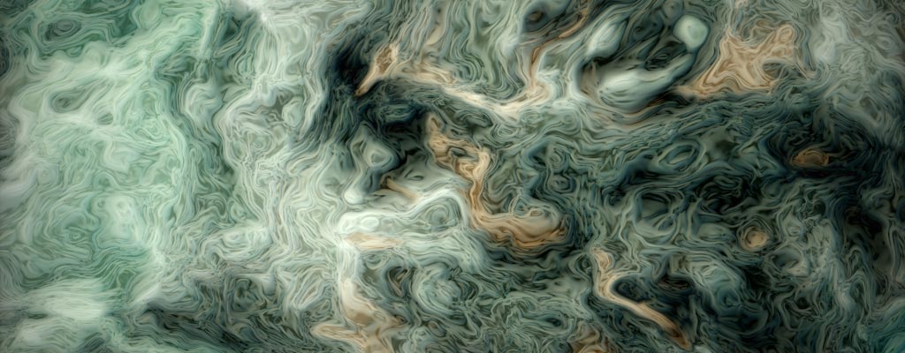

## 分形布朗运动（Fractal Brownian Motion）

噪声对不同的人来说有不同的意义。音乐家把它当成一种令人不安的声响，通信工程师把它当作干扰信号，天体物理学家把它看作宇宙微波背景辐射。这些概念吸引着我们去探索处处可见的随机性的物理原因。但是，让我们从更基础，也更简单的开始：波和波的属性。波就是某些属性随着时间波动变化。声波是气压的波动，电磁波是电场和磁场的波动。波的两个重要特征是振幅（amplitude）和频率（frequency）。一个简单的线性波（一维）的方程如下：

<div class="simpleFunction" data="
float amplitude = 1.;
float frequency = 1.;
y = amplitude * sin(x * frequency);
"></div>

* 试着改变频率和振幅的值，理解他们如何影响波形。
* 使用造型函数，试着随时间改变振幅。
* 使用造型函数，试着随时间改变频率。

通过做后两个练习，你已经知道怎么“调节”一个正弦波。恭喜你，你刚刚创造了一个 AM（调幅）和 FM（调频）波！

波的另一个有趣的特性是可以相加，这一特性的正式说法叫叠加性。调一调下面几行代码，注意我们加上那些不同振幅和频率的正弦波的时候，总的波形是如何变化的。

<div class="simpleFunction" data="
float amplitude = 1.;
float frequency = 1.;
y = sin(x * frequency);
float t = 0.01*(-u_time*130.0);
y += sin(x*frequency*2.1 + t)*4.5;
y += sin(x*frequency*1.72 + t*1.121)*4.0;
y += sin(x*frequency*2.221 + t*0.437)*5.0;
y += sin(x*frequency*3.1122+ t*4.269)*2.5;
y *= amplitude*0.06;
"></div>

* 试试改变加上去的波的振幅和频率。
* 有没有可能两个波正好相互抵消？如果是的话，会是什么样子？
* 有没有一种叠加波的方法，让他们互相放大？

从音乐理论上说，每个音符都和一个特定的频率相关联。这些音符和频率的关系遵从一定的模式，也就是我们所说的音阶，一个八度（octave）对应着频率上的加倍或减半。

现在，让我们把正弦波放在一边，想想 Perlin 噪声！Perlin 噪声的基本形式看起来和正弦波有点相似。它的振幅和频率有着某种变化，但振幅保持着合理的连续性，而且频率被限制在一个距离中心频率很小的范围内。尽管它不像正弦波那样规则，并且把几个不同缩放比例的 Perlin 噪声相加更容易制造出随机形态。把一些正弦波相加也是有可能制造随机形态的，但那需要很多不同的波叠加才能把他们的天生的周期性和规则形隐藏起来。

通过在循环（循环次数为 *octaves*）中叠加噪声，并以一定的倍数（*lacunarity*，间隙度）连续升高频率，同时以一定的比例（*gain*，增益）降低 **噪声** 的振幅，最终的结果会有更好的细节。这项技术叫“分形布朗运动（fractal Brownian Motion）”（*fBM*），或者“分形噪声（fractal noise）”，最简单的实现如下：

<div class="simpleFunction" data="// Properties
const int octaves = 1;
float lacunarity = 2.0;
float gain = 0.5;
//
// Initial values
float amplitude = 0.5;
float frequency = 1.;
//
// Loop of octaves
for (int i = 0; i < octaves; i++) {
&#9;y += amplitude * noise(frequency*x);
&#9;frequency *= lacunarity;
&#9;amplitude *= gain;
}"></div>

* 从 1 到 2，4，8，10 逐渐改变 octaves，看看会发生什么。
* 当 octaves 大于 4 时，尝试改变 lacunarity 的值。
* 当 octaves 大于 4 时，改变 gain 的值，看看会发生什么。

Note how with each additional octave, the curve seems to get more detail. Also note the self-similarity while more octaves are added. If you zoom in on the curve, a smaller part looks about the same as the whole thing, and each section looks more or less the same as any other section. This is an important property of mathematical fractals, and we are simulating that property in our loop. We are not creating a *true* fractal, because we stop the summation after a few iterations, but theoretically speaking, we would get a true mathematical fractal if we allowed the loop to continue forever and add an infinite number of noise components. In computer graphics, we always have a limit to how small details we can resolve, for example when objects become smaller than a pixel, so there is no need to make infinite sums to create the appearance of a fractal. A lot of terms may be needed sometimes, but never an infinite number.

The following code is an example of how fBm could be implemented in two dimensions to create a fractal-looking pattern:

<div class='codeAndCanvas' data='2d-fbm.frag'></div>

* Reduce the number of octaves by changing the value on line 37
* Modify the lacunarity of the fBm on line 47
* Explore by changing the gain on line 48

This technique is commonly used to construct procedural landscapes. The self-similarity of the fBm is perfect for mountains, because the erosion processes that create mountains work in a manner that yields this kind of self-similarity across a large range of scales. If you are interested in this, use you should definitly read [this great article by Inigo Quiles about advance noise](http://www.iquilezles.org/www/articles/morenoise/morenoise.htm).


Using more or less the same technique, it's also possible to obtain other effects like what is known as **turbulence**. It's essentially an fBm, but constructed from the absolute value of a signed noise to create sharp valleys in the function.

```glsl
for (int i = 0; i < OCTAVES; i++) {
    value += amplitude * abs(snoise(st));
    st *= 2.;
    amplitud *= .5;
}
```

<a href="../edit.php#13/turbulence.frag"></img></a>

Another member of this family of algorithms is the **ridge**, where the sharp valleys are turned upside down to create sharp ridges instead:

```glsl
    n = abs(n);     // create creases
    n = offset - n; // invert so creases are at top
    n = n * n;      // sharpen creases
```

<a href="../edit.php#13/ridge.frag"></img></a>

Another variant which can create useful variations is to multiply the noise components together instead of adding them. It's also interesting to scale subsequent noise functions with something that depends on the previous terms in the loop. When we do things like that, we are moving away from the strict definition of a fractal and into the relatively unknown field of "multifractals". Multifractals are not as strictly defined mathematically, but that doesn't make them less useful for graphics. In fact, multifractal simulations are very common in modern commercial software for terrain generation. For further reading, you could read chapter 16 of the book "Texturing and Modeling: a Procedural Approach" (3rd edition), by Kenton Musgrave. Sadly, that book is out of print since a few years back, but you can still find it in libraries and on the second hand market. (There's a PDF version of the 1st edition available for purchase online, but don't buy that - it's a waste of money. It's from 1994, and it doesn't contain any of the terrain modeling stuff from the 3rd edition.)

### 域翘曲（Domain Warping）

[Inigo Quiles wrote this other fascinating article](http://www.iquilezles.org/www/articles/warp/warp.htm) about how it's possible to use fBm to warp a space of a fBm. Mind blowing, Right? It's like the dream inside the dream of Inception.



A less extreme example of this technique is the following code where the wrap is used to produce this clouds-like texture. Note how the self-similarity property is still present in the result.

<div class='codeAndCanvas' data='clouds.frag'></div>

Warping the texture coordinates with noise in this manner can be very useful, a lot of fun, and fiendishly difficult to master. It's a powerful tool, but it takes quite a bit of experience to use it well. A useful tool for this is to displace the coordinates with the derivative (gradient) of the noise. [A famous article by Ken Perlin and Fabrice Neyret called "flow noise"](http://evasion.imag.fr/Publications/2001/PN01/) is based on this idea. Some modern implementations of Perlin noise include a variant that computes both the function and it's analytical gradient. If the "true" gradient is not available for a procedural function, you can always compute finite differences to approximate it, although this is less accurate and involves more work.
